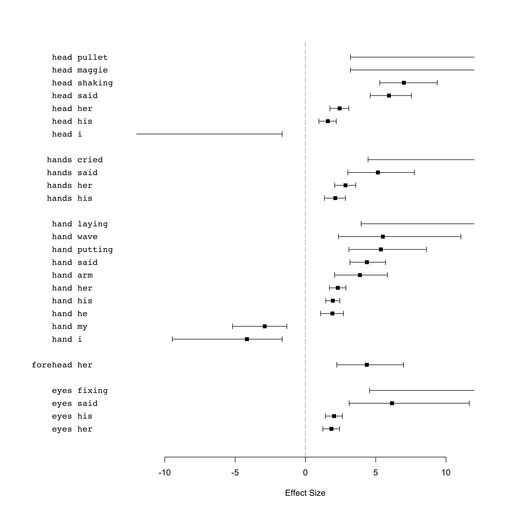
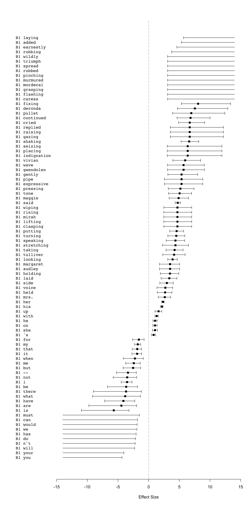
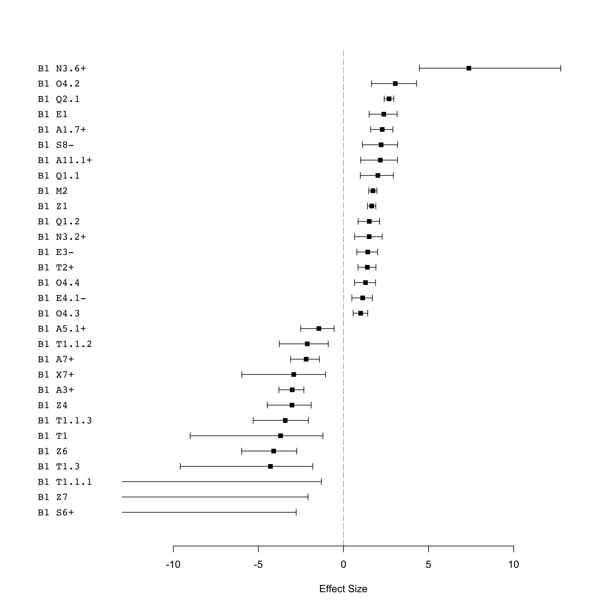

-   [Data](#data)
    -   [Get the corp\_text objects](#get-the-corp_text-objects)
    -   [Create a data.table where each column is a set of types for the
        tokens](#create-a-data.table-where-each-column-is-a-set-of-types-for-the-tokens)
    -   [Corpus size](#corpus-size)
-   [Unmatched tokens](#unmatched-tokens)
-   [Analysis: 1. Comparing manually chosen, specific body part terms +
    “lexical” collocates in 19C quotes vs. long
    suspensions](#analysis-1.-comparing-manually-chosen-specific-body-part-terms-lexical-collocates-in-19c-quotes-vs.-long-suspensions)
    -   [Figure 1: Plot of specific, manually chosen body part terms
        +“lexical” collocates in 19C quotes vs. long
        suspensions](#figure-1-plot-of-specific-manually-chosen-body-part-terms-lexical-collocates-in-19c-quotes-vs.-long-suspensions)
        -   [Concordances: Quotes](#concordances-quotes)
        -   [Concordances: Long
            suspensions](#concordances-long-suspensions)
-   [Analysis: 2. Comparing B1 + all “lexical” collocates in 19C quotes
    vs. long
    suspensions](#analysis-2.-comparing-b1-all-lexical-collocates-in-19c-quotes-vs.-long-suspensions)
    -   [Number of (lexical) types & tokens in B1 &
        examples](#number-of-lexical-types-tokens-in-b1-examples)
        -   [Quotes](#quotes)
        -   [Long suspensions](#long-suspensions)
    -   [Concordances of “lexical”
        collocates](#concordances-of-lexical-collocates)
        -   [Concordances: Long
            suspensions](#concordances-long-suspensions-1)
        -   [Figure 2: Plot of B1 +“lexical” collocates in 19C quotes
            vs. long
            suspensions](#figure-2-plot-of-b1-lexical-collocates-in-19c-quotes-vs.-long-suspensions)
-   [Analysis: 3. Comparing B1 + all semantic types in 19C quotes
    vs. long
    suspensions](#analysis-3.-comparing-b1-all-semantic-types-in-19c-quotes-vs.-long-suspensions)
    -   [Figure 3: Plot of B1 + “semantic tag collocates” in 19C quotes
        vs. long
        suspensions](#figure-3-plot-of-b1-semantic-tag-collocates-in-19c-quotes-vs.-long-suspensions)
    -   [Concordances of semantic tag
        collocates](#concordances-of-semantic-tag-collocates)
        -   [Concordances: Long
            suspensions](#concordances-long-suspensions-2)
-   [How this document was generated](#how-this-document-was-generated)

Data
====

Libraries

``` r
library(CorporaCoCo)
library(data.table)
library(stringi)
```

Get the corp\_text objects
--------------------------

``` r
quotes_files <- list.files("./api-output-sem-tagged/19C/quote_corp_text_objects/", full.names = TRUE)
quotes_objects <- lapply(quotes_files, readRDS)
quotes_text <- corp_text_rbindlist(quotes_objects)

long_sus_files <- list.files("./api-output-sem-tagged/19C/longsus_corp_text_objects/", full.names = TRUE)
long_sus_objects <- lapply(long_sus_files, readRDS)
long_sus_text <- corp_text_rbindlist(long_sus_objects)
```

Create a data.table where each column is a set of types for the tokens
----------------------------------------------------------------------

The loaded `corp_text` objects have the full semantic tags as the types

semantic\_tags  
keep whole of first tag, but not multipart or lowercase bits
e.g. `A1.1.1+`. Remove \[+-\]? to not keep the plus or minus.

lc\_tokens  
lowercased tokens

``` r
quotes_type_store <- data.frame(
    lc_tokens = tolower(quotes_text$tokens$token),
    semantic_tags = stri_extract_first(quotes_text$tokens$type, regex = "^([A-Z]\\d+(?:\\.\\d+)*[+-]?)"),
    stringsAsFactors = FALSE
)
long_sus_type_store <- data.frame(
    lc_tokens = tolower(long_sus_text$tokens$token),
    semantic_tags = stri_extract_first(long_sus_text$tokens$type, regex = "^([A-Z]\\d+(?:\\.\\d+)*[+-]?)"),
    stringsAsFactors = FALSE
)
```

Corpus size
-----------

Quotes

``` r
#Count tokens without the co-occurrence barriers (i.e. ssubset boundaries) _b_ (NA)
sum(quotes_text$tokens$token!="_b_", na.rm = TRUE)
```

    ## [1] 1695408

Long suspensions

``` r
#Count tokens without the co-occurrence barriers (i.e. ssubset boundaries) _b_ (NA)
sum(long_sus_text$tokens$token!="_b_", na.rm = TRUE)
```

    ## [1] 28958

Unmatched tokens
================

The Z99 tag contains “unmatched” tokens. These can be looked up like
this for the quotes (but take up a lot of space):

``` r
#a <- corp_type_lookup(quotes_text)
#a[type == "Z99"]$tokens
```

And like this for the long suspensions

``` r
#b <- corp_type_lookup(long_sus_text)
# b[type == "Z99"]$tokens
```

Analysis: 1. Comparing manually chosen, specific body part terms + “lexical” collocates in 19C quotes vs. long suspensions
==========================================================================================================================

``` r
quotes_text$tokens$type <- with(quotes_type_store, lc_tokens)
quotes_text$tokens$type[is.na(quotes_type_store$semantic_tags)] <- NA  # reintroduce the cooccurence barriers
long_sus_text$tokens$type <- with(long_sus_type_store, lc_tokens)
long_sus_text$tokens$type[is.na(long_sus_type_store$semantic_tags)] <- NA  # reintroduce the cooccurence barriers

head(quotes_text$tokens, 20)
```

    ##     idx         type start end        token
    ##  1:   1         <NA>    13  15          _b_
    ##  2:   2         <NA>    17  19          _b_
    ##  3:   3         <NA>    21  23          _b_
    ##  4:   4         <NA>    25  27          _b_
    ##  5:   5         <NA>    29  31          _b_
    ##  6:   6          god    33  35          God
    ##  7:   7        grant    37  41        grant
    ##  8:   8           he    43  44           he
    ##  9:   9           be    46  47           be
    ## 10:  10          not    49  51          not
    ## 11:  11 disappointed    53  64 disappointed
    ## 12:  12            i    68  68            I
    ## 13:  13         know    70  73         know
    ## 14:  14          not    75  77          not
    ## 15:  15          how    79  81          how
    ## 16:  16           he    83  84           he
    ## 17:  17        would    86  90        would
    ## 18:  18         bear    92  95         bear
    ## 19:  19           it    97  98           it
    ## 20:  20         <NA>   100 102          _b_

``` r
head(long_sus_text$tokens, 20)
```

    ##     idx     type start end    token
    ##  1:   1     <NA>    13  15      _b_
    ##  2:   2     <NA>    17  19      _b_
    ##  3:   3     <NA>    21  23      _b_
    ##  4:   4     <NA>    25  27      _b_
    ##  5:   5     <NA>    29  31      _b_
    ##  6:   6 observed    33  40 observed
    ##  7:   7    smith    42  46    Smith
    ##  8:   8     'and    49  52     'and
    ##  9:   9        a    54  54        a
    ## 10:  10 darksome    56  63 darksome
    ## 11:  11     <NA>    65  67      _b_
    ## 12:  12     <NA>    69  71      _b_
    ## 13:  13     <NA>    73  75      _b_
    ## 14:  14     <NA>    77  79      _b_
    ## 15:  15     <NA>    81  83      _b_
    ## 16:  16  replied    85  91  replied
    ## 17:  17      she    93  95      she
    ## 18:  18     with    98 101     with
    ## 19:  19        a   103 103        a
    ## 20:  20    short   105 109    short

``` r
# the set of nodes and collocates we are interested in
nodes <- c('eye', 'eyes', 'forehead', 'hand', 'hands', 'head', 'shoulder')
nodes
```

    ## [1] "eye"      "eyes"     "forehead" "hand"     "hands"    "head"     "shoulder"

``` r
#co-occurrences
quotes_surface <- corp_surface(quotes_text, span = "5LR", nodes = nodes)
long_sus_surface <- corp_surface(long_sus_text, span = "5LR", nodes = nodes)

# compare quotes vs. long suspensions
results <- corp_coco(quotes_surface, long_sus_surface, nodes = nodes)
```

Figure 1: Plot of specific, manually chosen body part terms +“lexical” collocates in 19C quotes vs. long suspensions
--------------------------------------------------------------------------------------------------------------------

``` r
plot(results)
```



### Concordances: Quotes

``` r
# your
y <- corp_concordance(quotes_surface, nodes = nodes, collocates= c("your"), context = 0)
y
```

    ## [  1]               --- can think of bothering *your*   head   about our POVERTY in case ---               
    ## [  2]             --- the necessity of keeping *your*    eye   upon her, and making *your* ---             
    ## [  3]                   --- 'd despise to take *your*   hand  . Only I must have an ---                    
    ## [  4]               --- that Cradell puts into *your*   head  , I ca n't help it. ---                      
    ## [  5]                  --- _b_ _b_ Mr Cradell, *your*   hand   _b_ _b_ _b_ _b_ _b_ ---                     
    ## [  6]                       --- of land in *your* own   hand  , you must look after it, ---                
    ## [  7]                   --- rate, you can wash *your*   hands , and get rid of the ---                     
    ## [  8]                   --- leave it safely in *your*   hands . In any matter of importance ---            
    ## [  9]                  --- you mean -- holding *your*   head   up like a man. Do ---                       
    ## [ 10]                  --- him again. You hold *your*   head   up, Johnny, and remember that ---           
    ## [ 11]          --- remain here, accepting from *your*   hands  so large a part of ---                      
    ## [ 12]              --- must bear scrutiny, and *your*   eyes  , and *your* voice. He was ---               
    ## [ 13]              --- if necessary -- putting *your* shoulder to the wheel when the ---                   
    ## [ 14]                    --- could see you put *your*   hand   in his as his promised ---                  
    ## [ 15]                --- house; judge with *your* own   eyes   of my daughter and my ---                   
    ## [ 16]                 --- lips quiver. Give me *your*   hand   _b_ _b_ _b_ _b_ _b_ ---                     
    ## [ 17]                      --- ask a favour at *your*   hands  _b_ _b_ _b_ _b_ _b_ ---                     
    ## [ 18]              --- in single combat before *your*   eyes   ! The girl is too young ---                 
    ## [ 19]               --- strong with weapons in *your*   hands , and full of pity. You ---                  
    ## [ 20]              --- to-morrow be burnt over *your*   head  , when we may be staved ---                  
    ## [ 21]                  --- see it in *your* sorrowful   eyes   -- she is coming back ---                   
    ## [ 22]                 --- world, *your* triumph is at   hand   _b_ _b_ _b_ _b_ _b_ ---                     
    ## [ 23]                    --- Slay him with *your* own   hands  _b_ _b_ _b_ _b_ _b_ ---                     
    ## [ 24]           --- carefully the parchment in *your*   hand  ; question, and question loudly -- ---       
    ## [ 25]             --- inherited much misery at *your*   hands , but hoping that you might ---              
    ## [ 26]                --- plainly. Do n't raise *your*   hands ; *your* hands are not a ---                 
    ## [ 27]              --- n't raise *your* hands; *your*   hands  are not a part of ---                       
    ## [ 28]               --- Mrs. Armadale, before our own   eyes  , from a place in *your* ---                 
    ## [ 29]               --- peaches; think of her dimpled   hands  among *your* early violets, and ---         
    ## [ 30]              --- herself. Man alive, how *your*   hand   trembles ! What is there to ---             
    ## [ 31]                  --- you manage to clear *your*   head   of those confounded megrims ? Do ---        
    ## [ 32]                       --- _b_ _b_ _b_ Is *your*   head   more composed _b_ _b_ _b_ ---               
    ## [ 33]                   --- that pool get into *your*   head   ? The open country you saw ---              
    ## [ 34]                   --- of yours of trying *your*   hand   on this lucky young gentleman, ---          
    ## [ 35]                  --- *your* law business in the   hands  of Mr. Darch _b_ _b_ ---                    
    ## [ 36]                  --- *your* law business in the   hands  of Mr. Darch, I beg ---                     
    ## [ 37]                   --- for -- for holding *your*   hand   too long _b_ _b_ _b_ ---                    
    ## [ 38]                     --- _b_ _b_ _b_ keep *your*    eye   on the figure of Time: ---                  
    ## [ 39]                      --- _b_ _b_ _b_ *Your* own   eyes   have seen it _b_ _b_ ---                    
    ## [ 40]                --- the matter with you ? *Your*   hand   is as cold as ice ---                       
    ## [ 41]       --- unpardonable, even in *your* friendly   eyes   _b_ _b_ _b_ _b_ _b_ ---                     
    ## [ 42]                 --- another week is over *your*   head  , my lady, you go _b_ ---                    
    ## [ 43]                          --- _b_ If you had had   eyes   in *your* head, you would ---               
    ## [ 44]                      --- had had eyes in *your*   head  , you would never have gone ---              
    ## [ 45]                      --- have the use of *your*   head   _b_ _b_ _b_ _b_ _b_ ---                     
    ## [ 46]                      --- 'll leave it in *your*   hands , sir, with all the pleasure ---             
    ## [ 47]                  --- hours more are over *your*   head  . Egad, sir _b_ _b_ _b_ ---                  
    ## [ 48]                      --- _b_ _b_ Give me *your*   hand  , Mr. Armadale _b_ _b_ _b_ ---               
    ## [ 49]                --- idea had ever entered *your*   head   _b_ _b_ _b_ _b_ _b_ ---                     
    ## [ 50]                 --- that opinion even in *your*   eyes  . May I ask, after all ---                   
    ## [ 51]                      --- _b_ _b_ Give me *your*   hand  , Allan _b_ _b_ _b_ _b_ ---                  
    ## [ 52]                           --- and I may want my   hand   free to deal with *your* ---                
    ## [ 53]                      --- I hold *your* notes of   hand  , at short dates, for every ---              
    ## [ 54]                  --- of no importance in *your*   eyes  , in the hope that *your* ---                
    ## [ 55]                  --- _b_ " *Your* first note of   hand   (for thirty pounds) falls due ---           
    ## [ 56]                  --- weeks more are over *your*   head   and mine _b_ _b_ _b_ ---                    
    ## [ 57]                     --- you do n't think *your*   head   is to be trusted to ---                     
    ## [ 58]                    --- if it would clear *your*   head  , that 's quite another thing ! ---          
    ## [ 59]                 --- thing ! I must clear *your*   head  , of course, at any sacrifice. ---           
    ## [ 60]                 --- What are you shaking *your*   head   about ? Go on, and I ---                    
    ## [ 61]                       --- _b_ _b_ _b_ Is *your*   head   bad _b_ _b_ _b_ _b_ ---                     
    ## [ 62]         --- entirely and unreservedly in *your*   hands . It 's not in my ---                        
    ## [ 63]                  --- notes ! Do n't hang *your*   head  . It was n't a happy ---                     
    ## [ 64]                    --- in *your* own addled old   head  , daddy _b_ _b_ _b_ _b_ ---                  
    ## [ 65]                   --- you for showing me *your*   hand  . ' _b_ _b_ _b_ _b_ _b_ " ---                
    ## [ 66]            --- addressing you just above *your*   head  , under a form of exposition ---             
    ## [ 67]                  --- doing ? I believe you have   eyes   in the back of *your* ---                   
    ## [ 68]                       --- in the back of *your*   head   _b_ _b_ _b_ _b_ _b_ ---                     
    ## [ 69]                --- has been brought upon *your*   head   by *your* expression as you ---             
    ## [ 70]                 --- remember the look in *your*   eyes  . Please, please, be frank with ---          
    ## [ 71]                  --- deliver it into *your* own   hands  _b_ _b_ _b_ _b_ _b_ ---                     
    ## [ 72]                    --- will see with *your* own   eyes   and judge for yourself _b_ ---              
    ## [ 73]              --- have deserved better at *your*   hands , Holmes _b_ _b_ _b_ _b_ ---                 
    ## [ 74]                 --- third finger of *your* left   hand   over the wrist of *your* ---                
    ## [ 75]                       --- a grey hair in *your*   head   _b_ _b_ _b_ _b_ _b_ ---                     
    ## [ 76]                    --- you have got into *your*   head   during an idle week or ---                  
    ## [ 77]                --- *your* fortune in *your* own   hands  -- a fortune such as ---                    
    ## [ 78]                   --- had a covering for *your*   head   _b_ _b_ _b_ _b_ _b_ ---                     
    ## [ 79]                   --- that candle out of *your*   eyes  , and look only at excellence. ---           
    ## [ 80]                     --- It is right that *your*   eyes   should be open to it. ---                   
    ## [ 81]             --- yellow paper pressing on *your*   eyes   ? And without me _b_ _b_ ---                
    ## [ 82]                    --- have left in *your* dear   eyes   _b_ _b_ _b_ _b_ _b_ ---                     
    ## [ 83]           --- Put *your* point-lace over *your*   head  . I must have you look ---                   
    ## [ 84]         --- something like disowning *your* one    eye  : everybody knows it 's yours, ---           
    ## [ 85]                    --- line of them with *your*   eyes   shut _b_ _b_ _b_ _b_ ---                    
    ## [ 86]                    --- You took him with *your*   eyes   open. The willing wrong you ---             
    ## [ 87]               --- wearing better lace on *your*   head  . You did n't think I ---                    
    ## [ 88]                     --- in the corner of *your*    eye   ever so long, and in ---                    
    ## [ 89]               --- Please give my brother *your*   hand   _b_ _b_ _b_ _b_ _b_ ---                     
    ## [ 90]                      --- it. Not to toss *your*   head   and bite *your* lips about ---              
    ## [ 91]                  --- good enough to cast *your*   eyes   over it. But there is ---                   
    ## [ 92]                 --- put this letter into *your*   hands , which you can look at ---                  
    ## [ 93]                       --- Let me look at *your*   hand   again: the hand with the ---                
    ## [ 94]                   --- at *your* hand again: the   hand   with the ring on. It ---                    
    ## [ 95]                 --- takes me from *your* bodily   eyes   and gives me full presence ---              
    ## [ 96]                  --- ever receive it from alien   hands . *Your* rank and wealth, Harry; ---         
    ## [ 97]                    --- _b_ _b_ Just turn *your*   head   a little more to the ---                    
    ## [ 98]              --- when thought has seared *your* forehead with its lines, and passion ---             
    ## [ 99]              --- mere beauty, could fill *your*   eyes   with tears. I tell you, ---                 
    ## [100]                   --- like. Put ashes on *your*   head   because Cordelia was strangled. Cry ---     
    ## [101]              --- take vengeance into *your* own   hands  _b_ _b_ _b_ _b_ _b_ ---                     
    ## [102]                    --- you men love with *your*   eyes  , if you ever love at ---                    
    ## [103]                     --- _b_ _b_ It makes *your*   eyes   lovelier _b_ _b_ _b_ _b_ ---                
    ## [104]                   --- You need not shake *your*   head  : you know you are. Besides, ---             
    ## [105]                  --- Little girl, I hold *your*   hand  , and you 've kissed me, ---                 
    ## [106]                   --- Ye can, with *your* young   eyes  , read the small print of ---                
    ## [107]                    --- us something of angels '   eyes  . *Your* husband is noble nature, ---        
    ## [108]                     --- You will give me *your*   hand  , will you not ? And let ---                 
    ## [109]                       --- You do not let *your*   eyes   see nor *your* ears hear, ---               
    ## [110]                   --- this stake in *your* left   hand  , ready to place to the ---                  
    ## [111]                     --- open, do you put *your* shoulder down and shove; and you ---                 
    ## [112]               --- brains out before *your* very   eyes  . ' I was appalled and was ---               
    ## [113]                         --- must not die by any   hand  , but least of all *your* ---                
    ## [114]                --- me guard yourself. On *your* forehead I touch this piece of ---                   
    ## [115]                 --- pass away, and leave *your* forehead as pure as the heart ---                    
    ## [116]                     --- _b_ _b_ Lay *your* poor   head   here and rest it. All ---                   
    ## [117]                      --- it may not hold *your*   hands  from his destruction _b_ _b_ ---            
    ## [118]                     --- dear, I see that *your*   eyes   are opened, and that to ---                 
    ## [119]                --- from *your* suffering at his   hands . This is now all more ---                   
    ## [120]                     --- what you have in *your*   head  , I know -- and what ---                     
    ## [121]                --- be committed. -- *Your* soft   eyes   shall chuse their own time ---              
    ## [122]                    --- for the honour of *your*   hand   for the two first dances ---                
    ## [123]                --- it possibly come into *your*   head   _b_ _b_ _b_ _b_ _b_ ---                     
    ## [124] --- Miss Woodhouse, whatever *your* penetrating   eyes   may fancy -- I am ---                       
    ## [125]                --- wish *your* friend in better   hands . His rank in society I ---                  
    ## [126]              --- is impossible; even now *your*    eye   skims over the page to ---                  
    ## [127]             --- arm wreaked on *your* miserable   head   ? Begone, vile insect ! Or rather, ---      
    ## [128]                 --- *your* hatred on my devoted   head  . Have I not suffered enough, ---            
    ## [129]                  --- destroy the work of *your*   hands  _b_ _b_ _b_ _b_ _b_ ---                     
    ## [130]                      --- the work of *your* own   hands . Shall I respect man when ---               
    ## [131]                --- now see compassion in *your*   eyes  ; let me seize the favourable ---            
    ## [132]                 --- I shall deliver into *your*   hands  a female who will accompany ---             
    ## [133]                --- that was presented to *your*   eyes   was the body of *your* ---                  
    ## [134]                      --- look you had in *your*   eyes   two minutes since, you rat ---              
    ## [135]              --- there ? Have you washed *your*   hands  and face this morning _b_ ---               
    ## [136]                --- you and welcome: bend *your*   head   down _b_ _b_ _b_ _b_ ---                    
    ## [137]             --- insist on *your* holding *your*   head   up; I will not have ---                     
    ## [138]                 --- must watch her: keep *your*   eyes   on her movements, weigh well ---            
    ## [139]      --- impulsive, too vehement; the sovereign   hand   that created *your* frame, and ---          
    ## [140]             --- sincere nature in *your* ardent   eyes   and on *your* clear front), ---             
    ## [141]                       --- I dare say *your* own   hands  are almost numbed with cold. ---            
    ## [142]                        --- _b_ _b_ _b_ _b_ That   head   I see now on *your* ---                     
    ## [143]                      --- as you sit with *your*   hands  before you, and *your* eyes ---             
    ## [144]                --- hands before you, and *your*   eyes   generally bent on the carpet (---           
    ## [145]         --- ignorant. However, I mentally shake   hands  with you for *your* answer, ---             
    ## [146]                      --- read as much in *your*    eye   (beware, by-the-bye, what you express ---   
    ## [147]                          --- I saw it in *your*   eyes   when I first beheld you: ---                
    ## [148]                   --- Kneel, and lift up *your*   head   _b_ _b_ _b_ _b_ _b_ ---                     
    ## [149]              --- yourself to stretch out *your*   hand  , and take it up: but ---                    
    ## [150]                    --- _b_ _b_ _b_ " Well said, forehead; *your* declaration shall be respected. --- 
    ## [151]                 --- Jane, you offered me *your* shoulder once before; let me have ---                
    ## [152]                       --- 'll seek it at *your*   hands ; I promise you that _b_ ---                 
    ## [153]                     --- _b_ Just give me *your*   hand   _b_ _b_ _b_ _b_ _b_ ---                     
    ## [154]              --- of inexperience is over *your*   eyes   _b_ _b_ _b_ _b_ _b_ ---                     
    ## [155]                 --- yes ! do n't trouble *your*   head   about her -- put the ---                    
    ## [156]                --- *your* gait and mien, *your*    eye   and face, when you are ---                  
    ## [157]                  --- You 're not turning *your*   head   to look after more moths, ---               
    ## [158]                          --- I a liar in *your*   eyes   _b_ _b_ _b_ _b_ _b_ ---                     
    ## [159]                   --- and the circlet on *your* forehead, -- which it will become: ---               
    ## [160]                    --- as my finger, and *your* forehead resembles what, in some very ---            
    ## [161]                 --- Jane: both *your* cheek and   hand   are burning hot. I ask ---                  
    ## [162]            --- cheek ! and how strangely *your*   eyes   glitter ! Are you well _b_ ---              
    ## [163]             --- yourself pluck out *your* right    eye  ; yourself cut off *your* right ---          
    ## [164]               --- yourself cut off *your* right   hand  : *your* heart shall be the ---              
    ## [165]                 --- weary of gazing into *your*   eyes  , though they had no longer ---              
    ## [166]                  --- Hush, now, and wipe *your*   eyes   _b_ _b_ _b_ _b_ _b_ ---                     
    ## [167]                    --- Why did you shake *your*   head   ? Jane, you must be reasonable, ---         
    ## [168]                    --- I know ! Just put *your*   hand   in mine, Janet -- that ---                  
    ## [169]                 --- moment -- with which *your*   eyes   are now almost overflowing -- ---           
    ## [170]                --- heaving -- with which *your*   hand   is trembling in mine. *Your* ---            
    ## [171]                   --- me smile. You open *your*   eyes   like an eager bird, and ---                 
    ## [172]        --- a pleasurable illumination in *your*    eye   occasionally, a soft excitement in ---      
    ## [173]                     --- a daring, and a glowing    eye   to *your* interlocutor 's face: ---         
    ## [174]                       --- wark, I see by *your*   hands  _b_ _b_ _b_ _b_ _b_ ---                     
    ## [175]                 --- been: do n't trouble *your*   head   further about me; but tell ---              
    ## [176]                         --- I read it in *your*    eye  ; it is not of that ---                      
    ## [177]                       --- down on me with those   eyes   *your* skilful hand has copied ---          
    ## [178]              --- with those eyes *your* skilful   hand   has copied so well -- ---                   
    ## [179]               --- well as penetrating in *your*    eye  ; but allow me to assure ---                 
    ## [180]                   --- _b_ _b_ You unbend *your* forehead at last _b_ _b_ _b_ ---                     
    ## [181]                  --- _b_ _b_ You wander: *your*   head   becomes confused. I have been ---           
    ## [182]                       --- as good as put *your*   hand   to the plough: you are ---                  
    ## [183]                  --- union right even in *your*   eyes   _b_ _b_ _b_ _b_ _b_ ---                     
    ## [184]                  --- you would have laid *your*   hand   on the Christian 's cross ---               
    ## [185]                        --- a pity to see *your*   eyes   -- and the scar of ---                      
    ## [186]                      --- scar of fire on *your* forehead: and the worst of it ---                    
    ## [187]                      --- the hair out of *your*   head  ; and then I think you ---                   
    ## [188]              --- with a Grecian profile. *Your*   eyes   dwell on a Vulcan, -- ---                   
    ## [189]                       --- to leave it in *your*   hands , Utterson; you would judge wisely, ---      
    ## [190]                  --- with this letter in *your*   hand   for consultation, to drive straight ---     
    ## [191]                    --- to admit with *your* own   hand   into the house a man ---                    
    ## [192]                 --- letter not come into *your*   hands  until to-morrow morning. In that ---        
    ## [193]                       --- 'd have to get *your*   head   screwed on t' other way ---                 
    ## [194]                      --- _b_ Let me take *your*   hand  , darling _b_ _b_ _b_ _b_ ---                
    ## [195]                       --- to let you try *your*   hand   in his school ? If you ---                  
    ## [196]                --- un a'most before *your* very   eyes  . You too, Jude, had the ---                 
    ## [197]                      --- _b_ _b_ _b_ _b_ *Your*   hands  are rather rough, Jude, are ---             
    ## [198]                   --- wife ! ... I am in *your*   hands , Jude -- do n't tempt ---                   
    ## [199]                       --- 's *your* wife in the    eye   of Heaven and the Church ---                
    ## [200]                --- pear has dropped into *your*   hand   _b_ _b_ _b_ _b_ _b_ ---                     
    ## [201]                      --- _b_ _b_ Give me *your*   hand  , and I 'll lead you. ---                    
    ## [202]                    --- here you must put *your* shoulder to the wheel, at least ---                  
    ## [203]                       --- _b_ it will do *your*   head   good _b_ _b_ _b_ _b_ ---                    
    ## [204]               --- n't mind crawling upon *your*   hands  and knees, you can see ---                  
    ## [205]                --- four feet high; stoop *your*   head  , walk straight along it till ---            
    ## [206]                --- back and peering over *your* shoulder, when you 're trying to ---                 
    ## [207]           --- haggard, with *your* great hollow   eyes   staring out at the sky ---                  
    ## [208]             --- purple rims round *your* hollow   eyes  , I had almost a difficulty ---              
    ## [209]                --- n't give *your* judgment its   head  , as you give *your* mare ---                
    ## [210]               --- *your* chair, and wash *your*   hands  of us and our pleasures. ---                
    ## [211]               --- ever fall upon *your* honored   head   -- least of all through ---                 
    ## [212]                       --- has taken it into her   head   that *your* presence is extremely ---       
    ## [213]                      --- have taken it into his   head   to keep out of *your* ---                   
    ## [214]                  --- you have taken into *your*   head   ? You lose *your* friend George ---         
    ## [215]                   --- put this idea into *your*   head   _b_ _b_ _b_ _b_ _b_ ---                     
    ## [216]                       --- I leave all in *your*   hands , Robert _b_ _b_ _b_ _b_ ---                 
    ## [217]               --- earnest light of *your* brown   eyes   ? What would you say to ---                 
    ## [218]               --- nothink or anythink in *your*   hands ; and you 've looked me ---                  
    ## [219]                     --- give it into *your* own   hands , and I 'd been told ---                     
    ## [220]                --- put such fancies into *your*   head   ? ' " 'Perhaps other people can ---         
    ## [221]                  --- the strong grasp of *your*   hand  , Bob; the friendly touch of ---             
    ## [222]                   --- Is it wi' crying ? *Your*   eyes   are so swollen and red ---                  
    ## [223]                     --- why do you shake *your*   head   ? Who is to believe me, ---                 
    ## [224]                --- get such notions into *your*   head  ; they 're what they call ---                
    ## [225]                    --- banks. So hold up *your*   head  , -- you 've a chance ---                    
    ## [226]            --- the teagle hoisting above *your*   head   I 'm afraid of; and ---                     
    ## [227]                   --- it, and you pushed *your*   head   through my kite, all for ---                
    ## [228]                     --- _b_ _b_ _b_ Shut *your*   eyes  , Maggie _b_ _b_ _b_ _b_ ---                 
    ## [229]                     --- _b_ _b_ You keep *your*   eyes   shut, now, else you sha' ---                
    ## [230]                 --- choose the best with *your*   eyes   shut, he changes his hands. ---             
    ## [231]                 --- them white ferrets wi' pink   eyes  ; Lors, you might catch *your* ---           
    ## [232]                 --- keep *your* frock on *your* shoulder _b_ _b_ _b_ _b_ _b_ ---                     
    ## [233]                   --- you shake and toss *your*   head   now for, you silly _b_ ---                  
    ## [234]                --- yourself; you 'll cut *your*   head   off _b_ _b_ _b_ _b_ ---                     
    ## [235]                    --- have the blood in *your*   head  , and have to be cupped. ---                 
    ## [236]              --- Besides, it 's whitened *your*   hands  and taken the rough work ---                
    ## [237]                       --- the mill in their own   hands , I suppose, and pay *your* ---              
    ## [238]                   --- it alone, my dear; *your*   hands  'ull get as hard as ---                     
    ## [239]                    --- money 's put into *your*   hands  _b_ _b_ _b_ _b_ _b_ ---                     
    ## [240]                --- it again. Please turn *your*   head   this way _b_ _b_ _b_ ---                    
    ## [241]                 --- solemnly to me, with *your*   hand   on my father 's Bible, ---                  
    ## [242]              --- consistency in you. Put *your*   hand   on this Bible, and say, ---                 
    ## [243]                    --- pay them with *your* own   hand   _b_ _b_ _b_ _b_ _b_ ---                     
    ## [244]                  --- them off with *your* other   hand   _b_ _b_ _b_ _b_ _b_ ---                     
    ## [245]                      --- _b_ _b_ _b_ _b_ *Your*   hand   upon it, Damon _b_ _b_ ---                  
    ## [246]                   --- Perhaps I may kiss *your*   hand   _b_ _b_ _b_ _b_ _b_ ---                     
    ## [247]                     --- Then I may shake *your*   hand   _b_ _b_ _b_ _b_ _b_ ---                     
    ## [248]                    --- Why, yes, you be: *your*   hand   is bleeding. Come under my ---              
    ## [249]                  --- _b_ _b_ _b_ Holding *your*   hand   in mine _b_ _b_ _b_ ---                     
    ## [250]                        --- is all in *your* own   hands  now. My power over *your* ---               
    ## [251]                      --- you when you first set   eyes   on her. And *your* scheme ---               
    ## [252]                --- and there, and there. *Your*   eyes   seem heavy, Eustacia _b_ _b_ ---            
    ## [253]                    --- *your* uncle put into my   hands  to divide between yourself and ---          
    ## [254]                  --- a serious matter on *your*   hands  _b_ _b_ _b_ _b_ _b_ ---                     
    ## [255]                    --- of golden halo to *your*   eyes   -- a man who knew ---                       
    ## [256]                 --- chance then of using *your*   eyes   _b_ _b_ _b_ _b_ _b_ ---                     
    ## [257]                          --- _b_ I am in *your*   hands . If you think she had ---                   
    ## [258]                   --- white and wet, and *your*   head   is hanging-down-like _b_ _b_ _b_ ---        
    ## [259]                  --- you ? You have shut *your*   eyes   already _b_ _b_ _b_ _b_ ---                 
    ## [260]                     --- in the hollow of *your*   hand  , and like a devil you ---                   
    ## [261]                   --- tears and offer me *your*   hand   ? Good God ! can you ? No, ---              
    ## [262]                      --- beg you to stay *your*   hand   in pity ! ... I confess that ---            
    ## [263]                      --- You let me hold *your*   hand   when you were a maiden ---                  
    ## [264]                          --- I see it in *your*   eyes  , *your* mouth, and all over ---             
    ## [265]                  --- got this fancy into *your*   head   ! It was such a pleasure ---                
    ## [266]                       --- harm a hair of *your*   head  . And _b_ _b_ _b_ _b_ ---                    
    ## [267]               --- what fancies come into *your*   head   when you are feverish. I ---                
    ## [268]                      --- in the touch of *your*   hand  , as well as in what ---                     
    ## [269]                 --- all ? It was putting *your*   head   into the lion 's mouth ---                  
    ## [270]                     --- in here. Give me *your*   hand  . What is this ? Oh ! *your* ---             
    ## [271]               --- such good intention in *your*   head  . I should n't advise you ---                
    ## [272]                       --- I 'll faint on *your*   hands  at the servants ' dinner-time, ---          
    ## [273]                  --- Look here ! Lift up *your*   head  . I have something to show ---               
    ## [274]                   --- of the gentleman, and the   head   of a house, like *your* ---                 
    ## [275]                          --- I see it in *your*    eye  . I perfectly see how the ---                
    ## [276]                   --- it first came into *your*   head   _b_ _b_ _b_ _b_ _b_ ---                     
    ## [277]         --- probably, which first opened *your*   eyes   to his character _b_ _b_ ---                
    ## [278]                  --- and Colonel Wallis had his    eye   upon *your* father enough to ---            
    ## [279]                        --- people to be in such   hands  ! *Your* father and mother seem ---         
    ## [280]                    --- to me this night. *Your*   hand   _b_ _b_ _b_ _b_ _b_ ---                     
    ## [281]                         --- day -- it is *your*   eyes   that light up the halls ---                 
    ## [282]                    --- _b_ _b_ _b_ place *your*   hand   upon my brow; let me ---                    
    ## [283]                --- even while you speak, *your*    eye   is resting -- *your* color ---              
    ## [284]                      --- his blood be on *your*   head  . Praetor, delay, and you answer ---         
    ## [285]               --- Come hither ! -- place *your*   hand   on his heart ! -- sure ---                  
    ## [286]                --- good and agreeable in *your*   eyes  . I never heard you speak ---                
    ## [287]               --- *your* admiration of her fine   eyes   _b_ _b_ _b_ _b_ _b_ ---                     
    ## [288]                --- rich, and by refusing *your*   hand  , do all in my power ---                     
    ## [289]                        --- appear to me that my   hand   is unworthy *your* acceptance, or ---       
    ## [290]                     --- you take it into *your*   head   to go on refusing every ---                 
    ## [291]                    --- made the offer of *your*   hand   in any possible way that ---                
    ## [292]     --- perfect. Eight o'clock strikes ! *your*   hands  are thawed, get to work ---                 
    ## [293]                     --- _b_ _b_ And take *your*   hand   off that key ! leave it ---                 
    ## [294]      --- fascinating lips ! What glorious black   eyes   ! *Your* Byron would have worshipped ---    
    ## [295]               --- perhaps seem narrow in *your*   eyes   -- all the life of ---                      
    ## [296]           --- irksome, conferred by *your* kind   hand  ; I do not feel disposed ---                 
    ## [297]                  --- _b_ _b_ Pelet ? How *your*   head   runs on Mons. and Madame ---                
    ## [298]                    --- they go. Just put *your*   head   in at English cottage doors; ---            
    ## [299]                      --- _b_ _b_ give me *your*   hand   _b_ _b_ _b_ _b_ _b_ ---                     
    ## [300]                    --- cards were in *your* own   hands  if you chose to play ---                    
    ## [301]                  --- as *your* inspector at the   head   of *your* establishment _b_ _b_ ---         
    ## [302]                  --- heart must be warm, *your*   head   must be cool _b_ _b_ ---                    
    ## [303]                        --- to put one on *your*   head  , which will give you precedence ---         
    ## [304]                   --- by placing them in *your*   hands  _b_ _b_ _b_ _b_ _b_ ---                     
    ## [305]                  --- Love of me ! Retain *your*   hand   and share *your* life and ---               
    ## [306]              --- of *your* assembling, when the   eyes   of the whole country were ---               
    ## [307]                   --- let it escape from *your*   hands  _b_ _b_ _b_ _b_ _b_ ---                     
    ## [308]                  --- never give *your* heart or   hand   to Egremont; -- and I ---                   
    ## [309]                      --- _b_ You may dry *your*   eyes   my dear. There is nothing ---               
    ## [310]                        --- 's own con on *your*   head   and you get moral force ---                 
    ## [311]                  --- knew you would wash *your*   hands  of this fell deed. It ---                   
    ## [312]                    --- has put that into *your*   head   _b_ _b_ _b_ _b_ _b_ ---                     
    ## [313]                    --- lead. You can try *your*   hand   upon she _b_ _b_ _b_ ---                    
    ## [314]                    --- -- this will make *your*   head   ache finely ! Do n't do ---                 
    ## [315]                  --- heart does, why not *your*   hand   _b_ _b_ _b_ _b_ _b_ ---                     
    ## [316]                  --- in this way forcing *your*   hand   _b_ _b_ _b_ _b_ _b_ ---                     
    ## [317]                  --- me. Now listen. Put *your*   head   there, because I want you ---               
    ## [318]               --- I am constantly before *your*   eyes   I may cause you to ---                      
    ## [319]                 --- of the ridiculous to *your*   eyes   in seeing me like this. ---                 
    ## [320]                  --- lessen my fear, put *your*   hand   upon that stone hand, and ---               
    ## [321]                 --- *your* hand upon that stone   hand  , and swear that you will ---                
    ## [322]                  --- no humbug in taking *your*   hand   _b_ _b_ _b_ _b_ _b_ ---                     
    ## [323]                   --- evil be upon *your* sweet   head   ! *Your* husband little thought how ---     
    ## [324]          --- goods unloading ... Give me *your*   hand   on it now -- dear, ---                      
    ## [325]                 --- the bottle. Hold out *your*   hand  , sir _b_ _b_ _b_ _b_ ---                    
    ## [326]                   --- _b_ Hold out *your* other   hand  , sir _b_ _b_ _b_ _b_ ---                    
    ## [327]                     --- _b_ _b_ Hold out *your*   hand  , you little beast _b_ _b_ ---               
    ## [328]                         --- sor her with my own   eyes   reading *your* Ma 's letters. ---           
    ## [329]                  --- dear Briggs, in all *your*   head  ). Her manners are excellent, now ---        
    ## [330]                    --- YOU that will cry *your*   eyes   out with grief, anyway _b_ ---              
    ## [331]                      --- -- do n't shake *your*   head   and say no -- HE ---                        
    ## [332]           --- *your* Lordship has apparently at   hand  , with the additional advantage (and ---     
    ## [333]                 --- in the expression of *your*   eyes  , that make me believe my ---                
    ## [334]             --- truth. The brightness of *your*    eye   belies the sentence of *your* ---           
    ## [335]                 --- do gaze upon *your* radiant   eyes   _b_ _b_ _b_ _b_ _b_ ---                     
    ## [336]                     --- I can not speak; *your*    eye   scares me. Are you mocking ---              
    ## [337]           --- before ! Oh ! bless *your* bright   eyes   for these eggs, and this ---                
    ## [338]                  --- this paper into *your* own   hands  _b_ _b_ _b_ _b_ _b_ ---                     
    ## [339]                --- be delivered into *your* own   hands . If Mr. von Philipson determine ---         
    ## [340]                      --- _b_ _b_ _b_ but *your*   eyes   are so brilliant that nothing ---           
    ## [341]                          --- _b_ _b_ _b_ do you   head   *your* regiment to-day _b_ _b_ ---          
    ## [342]                     --- of a scrape with *your*   head   on *your* shoulders. The packet ---         
    ## [343]              --- those two lines between *your*   eyes  ; and those thick brows, that, ---           
    ## [344]               --- makes that dream enter *your*   head  . Pray, do n't imagine that ---              
    ## [345]                   --- you must beware of *your*   eyes   _b_ _b_ _b_ _b_ _b_ ---                     
    ## [346]                    --- Lie down and shut *your*   eyes  : you 're wandering. There 's ---            
    ## [347]            --- where I grovelled ! Shake *your*   head   as you will, Nelly, you ---                 
    ## [348]                 --- has the idea entered *your*   head   ? Ellen Dean, go and seek ---               
    ## [349]                       --- n't let me see *your*   eyes   ! I forgive what you have ---               
    ## [350]                 --- you need n't trouble *your*   head   to screen me; Catherine is ---              
    ## [351]               --- words slowly, and keep *your*   hands  out of *your* pockets. Be ---               
    ## [352]                        --- my life is in *your*   hands : and you have said you ---                  
    ## [353]               --- me, Catherine; give me *your*   hand   _b_ _b_ _b_ _b_ _b_ ---                     
    ## [354]                       --- of a temper in *your*   eyes   again _b_ _b_ _b_ _b_ ---                   
    ## [355]                           --- I 'll not take my   eyes   from *your* face till you ---               
    ## [356]               --- cheeks are hollow, and *your*   eyes   blood- shot, like a person ---              
    ## [357]                       --- had a Bible in *your*   hands  during all that period. You ---             
    ## [358]             --- breeze ? Well ! there in *your*   hand   is the paper that offers ---                
    ## [359]               --- *your* pupils. Shall we shake   hands  ? I suppose we must come ---                
    ## [360]                        --- help for it -- shake   hands  with *your* friend, Marian Halcombe, ---    
    ## [361]               --- more, and pointed over *your* shoulder; and there behind you, stood ---            
    ## [362]                    --- with that note in *your*   hand  , *your* mind is at ease ---                 
    ## [363]               --- has cleared himself in *your*   eyes   and in mine. What objection ---             
    ## [364]                   --- shall doubt if *your* own   eyes   and ears are really of ---                  
    ## [365]                     --- left it ready to *your*   hands . You ca n't lie yourself ---                
    ## [366]                    --- got her letter in *your*   hand   at this moment. I have ---                  
    ## [367]                       --- say it to open *your*   eyes   to *your* position, and to ---              
    ## [368]                     --- a great trust in *your*   hands . I wish you to take ---                     
    ## [369]               --- *your* wife. Where are *your*   eyes   ? Can you look at Miss ---                  
    ## [370]                         --- Say it is in *your*   hands  -- what then _b_ _b_ ---                    
    ## [371]                         --- you to write, by my   hands , offering the hospitality of *your* ---     
    ## [372]                  --- Mrs. Vesey with *your* own   hands  _b_ _b_ _b_ _b_ _b_ ---                     
    ## [373]           --- these four bank-notes into *your*   hand   before I claim her _b_ ---                  
    ## [374]             --- difficulties, and to tie *your*   hands  for all purposes of offence, ---            
    ## [375]                     --- put my life into *your*   hands  _b_ _b_ _b_ _b_ _b_ ---                     
    ## [376]                       --- put my life in *your*   hands . If what I say to ---                       
    ## [377]              --- him, distrust him, open *your*   eyes   in wonder at that secret ---                
    ## [378]                      --- it is placed in *your*   hands  _b_ _b_ _b_ _b_ _b_ ---

``` r
# you
y <- corp_concordance(quotes_surface, nodes = nodes, collocates= c("you"), context = 0)
y
```

    ## [  1]                    --- to tell *you* about my   eyes  , I was talking about my ---                 
    ## [  2]                       --- He 'd give his left   hand   if *you* 'd only smile ---                  
    ## [  3]                       --- of land in your own   hand  , *you* must look after it, ---              
    ## [  4]                 --- rate, *you* can wash your   hands , and get rid of the ---                     
    ## [  5]                      --- as may come to their   hands . *You* must now choose which ---            
    ## [  6]                    --- Mr Dale would have his    eye   upon *you*, and there would ---             
    ## [  7]             --- to congratulate *you* on that   head  . So *you* 're going to ---                  
    ## [  8]                  --- tell *you* the truth, my   hands  have been so full here ---                  
    ## [  9]                --- *you* mean -- holding your   head   up like a man. Do ---                       
    ## [ 10]                --- him again. *You* hold your   head   up, Johnny, and remember that ---           
    ## [ 11]                          --- as I ask for the   hand   that *you* will not give ---                
    ## [ 12]                    --- n't let *you* touch my   hand   except to shake hands with ---              
    ## [ 13]                  --- either, *you* may fit my   head   with a foolscap. Not remember, ---          
    ## [ 14]                       --- and *you* be in the   hands  of Providence -- as is ---                  
    ## [ 15]                    --- *you* did -- two black   eyes  , and all his face one ---                   
    ## [ 16]               --- *you* ! John, here; take my   hand  . It is the hand of ---                      
    ## [ 17]                  --- could see *you* put your   hand   in his as his promised ---                  
    ## [ 18]                    --- night, and with my own   hand   given *you* _b_ _b_ _b_ ---                 
    ## [ 19]               --- strong with weapons in your   hands , and full of pity. *You* ---                
    ## [ 20]                --- punishment of death at our   hands . I beseech *you*, Vetranio, let ---         
    ## [ 21]                   --- killing her with my own   hand   ! If *you* would defend her, ---            
    ## [ 22]                  --- at *you* with his little   hands  ! When *you* spoke to him, ---              
    ## [ 23]             --- inherited much misery at your   hands , but hoping that *you* might ---            
    ## [ 24]                         --- I take the pen in   hand  , what it is *you* wish ---                  
    ## [ 25]                --- child, while a stranger 's   hand   writes these words for *you* ---            
    ## [ 26]           --- *You* legal gentlemen are great   hands  at argument. What do *you* ---              
    ## [ 27]                        --- at *you* out of my   eyes   _b_ _b_ _b_ _b_ _b_ ---                     
    ## [ 28]                     --- keep him under my own    eye  . *You* need n't look surprised. ---         
    ## [ 29]                --- *you* manage to clear your   head   of those confounded megrims ? Do ---        
    ## [ 30]                   --- want *you* to clear his   head   of the nonsense he has ---                  
    ## [ 31]                   --- that pool get into your   head   ? The open country *you* saw ---            
    ## [ 32]                 --- *You* were kind enough to   hand   me a glass of brandy-and-water, ---         
    ## [ 33]   --- the man-shadow (myself); the man-shadow   hands  it to *you* (exactly what ---               
    ## [ 34]                --- nutshell ! -- Permit me to   hand   *you* back the manuscript, with ---         
    ## [ 35]                  --- the chances, with such a   head   as *you* have got on ---                    
    ## [ 36]                      --- woman (in the men 's   eyes  ) *you* can still be when ---                
    ## [ 37]                   --- *you* may trust my wary    eye   not to miss the right ---                   
    ## [ 38]                    --- _b_ Wo n't *you* shake   hands  _b_ _b_ _b_ _b_ _b_ ---                     
    ## [ 39]              --- the matter with *you* ? Your   hand   is as cold as ice ---                       
    ## [ 40]                    --- taken a thing into our   head  , *you* 're the most obstinate ---           
    ## [ 41]                 --- another week is over your   head  , my lady, *you* go _b_ ---                  
    ## [ 42]                      --- _b_ If *you* had had   eyes   in your head, *you* would ---               
    ## [ 43]                      --- had had eyes in your   head  , *you* would never have gone ---            
    ## [ 44]                    --- 'll help *you* with my   eyes   open _b_ _b_ _b_ _b_ ---                    
    ## [ 45]                --- stop ! *you* 're making my   head   swim _b_ _b_ _b_ _b_ ---                    
    ## [ 46]                    --- place, she is close at   hand   to twist *you* round her ---                
    ## [ 47]                     --- I 'll let *you* shake   hands . Say it louder, and I ---                   
    ## [ 48]                       --- _b_ *You* are a bad   hand   at explanations _b_ _b_ _b_ ---             
    ## [ 49]                     --- *You* asked me for my   hand   just now _b_ _b_ _b_ ---                    
    ## [ 50]                 --- both unhappy. ' I laid my   head   on his shoulder. 'Do *you* ---              
    ## [ 51]                       --- laid my head on his shoulder. 'Do *you* really love me ? ' ---           
    ## [ 52]                   --- *you* do n't think your   head   is to be trusted to ---                     
    ## [ 53]               --- What are *you* shaking your   head   about ? Go on, and I ---                    
    ## [ 54]              --- a helpless instrument in the   hands  of Fate. *You* are doomed, ---              
    ## [ 55]                  --- enough in some people 's   eyes  , I can tell *you*. Miss ---                 
    ## [ 56]                    --- *you* do n't often set   eyes   on _b_ _b_ _b_ _b_ ---                      
    ## [ 57]                 --- *you* for showing me your   hand  . ' _b_ _b_ _b_ _b_ _b_ " ---                
    ## [ 58]          --- addressing *you* just above your   head  , under a form of exposition ---             
    ## [ 59]         --- congratulate myself. Permit me to   hand   *you* the railway guide, with ---           
    ## [ 60]              --- doing ? I believe *you* have   eyes   in the back of your ---                     
    ## [ 61]                      --- Might I ask *you* to   hand   me my violin, and we ---                    
    ## [ 62]                    --- blood would be upon my   head  . I assure *you* that there ---              
    ## [ 63]                --- has been brought upon your   head   by your expression as *you* ---             
    ## [ 64]                        --- that cry out of my   head  . What do *you* advise that ---              
    ## [ 65]                          --- I was to hold my   hand  . And *you*, Watson, see what ---            
    ## [ 66]                      --- *you* see it now. My   eyes   have been trained to examine ---            
    ## [ 67]                 --- *you*, and waits on *you*   hand   and foot _b_ _b_ _b_ ---                    
    ## [ 68]                       --- had got it into her   head   that *you* would want to ---                
    ## [ 69]                  --- *you* have got into your   head   during an idle week or ---                  
    ## [ 70]                   --- will ask leave to shake   hands  with *you* on the strength ---              
    ## [ 71]             --- Put your point-lace over your   head  . I must have *you* look ---                 
    ## [ 72]                    --- Oh, *you* cast an evil    eye   on my play _b_ _b_ ---                      
    ## [ 73]                    --- to give into nobody 's   hands  but yours, when *you* were ---              
    ## [ 74]                  --- *You* took him with your   eyes   open. The willing wrong *you* ---           
    ## [ 75]                      --- _b_ _b_ Let us shake   hands : *you* are a musician _b_ ---               
    ## [ 76]               --- wearing better lace on your   head  . *You* did n't think I ---                  
    ## [ 77]                 --- put this letter into your   hands , which *you* can look at ---                
    ## [ 78]                   --- *you* had ten pounds at   hand   -- or I could appoint ---                   
    ## [ 79]              --- mere beauty, could fill your   eyes   with tears. I tell *you*, ---               
    ## [ 80]              --- have some curious romance on   hand  . *You* have; but it is ---                  
    ## [ 81]                    --- touch of Sibyl Vane 's   hand   makes me forget *you* and ---               
    ## [ 82]                     --- wish I had never laid   eyes   upon *you* ! *You* have spoiled ---         
    ## [ 83]                  --- *you* men love with your   eyes  , if *you* ever love at ---                  
    ## [ 84]                 --- *You* need not shake your   head  : *you* know *you* are. Besides, ---         
    ## [ 85]                     --- did *you* see with my   eyes   and know with my knowledge, ---             
    ## [ 86]               --- *you* ? How dare *you* cast   eyes   on him when I had ---                       
    ## [ 87]                  --- Little girl, I hold your   hand  , and *you* 've kissed me, ---               
    ## [ 88]                     --- and with his hair and   eyes   the same. " There, *you* know ---           
    ## [ 89]                   --- *You* will give me your   hand  , will *you* not ? And let ---               
    ## [ 90]                     --- *You* do not let your   eyes   see nor your ears hear, ---                 
    ## [ 91]                   --- open, do *you* put your shoulder down and shove; and *you* ---               
    ## [ 92]                       --- _b_ _b_ _b_ _b_ His   head   is what *you* call in ---                   
    ## [ 93]                   --- what *you* have in your   head  , I know -- and what ---                     
    ## [ 94]                  --- any degree to the public    eye  , but perhaps *you* may not ---              
    ## [ 95]                 --- must have had very strong   eyes   to see as *you* do ---                      
    ## [ 96]                     --- *you* told me on that   head  , confirmed an idea which I ---              
    ## [ 97]               --- the instrument 's coming to   hand  . Do *you* imagine Colonel Campbell ---      
    ## [ 98]                --- dearest to *you* always at   hand  , I, probably, never shall again; ---        
    ## [ 99]                  --- had *you* really some at   hand   yourself ? I am sure I ---                  
    ## [100]             --- do himself, *you* know, being   head   man at the Crown, ostler, ---               
    ## [101]                     --- glad to see and shake   hands  with *you* -- and to ---                    
    ## [102]                    --- *you* could see by her   eyes   that she almost adored her ---              
    ## [103]                    --- I curse myself) be the   hands  that formed *you* ! *You* have ---          
    ## [104]                    --- look *you* had in your   eyes   two minutes since, *you* rat ---            
    ## [105]                   --- _b_ _b_ Loose Bessie 's   hand  , child: *you* can not succeed ---           
    ## [106]            --- there ? Have *you* washed your   hands  and face this morning _b_ ---               
    ## [107]            --- do *you* mean ? What sorrowful   eyes   *you* fix on me ! Well, ---                 
    ## [108]              --- *you* and welcome: bend your   head   down _b_ _b_ _b_ _b_ ---                    
    ## [109]                  --- school: Miss Reed is the   head   and shoulders taller than *you* ---         
    ## [110]                    --- _b_ _b_ _b_ Will *you*   hand   Mr. Rochester 's cup _b_ ---                
    ## [111]          --- thoughts, they are elfish. These   eyes   in the Evening Star *you* ---               
    ## [112]                    --- as *you* sit with your   hands  before *you*, and your eyes ---             
    ## [113]              --- hands before *you*, and your   eyes   generally bent on the carpet (---           
    ## [114]                 --- it. Criticise me: does my forehead not please *you* _b_ _b_ ---                
    ## [115]       --- ignorant. However, I mentally shake   hands  with *you* for your answer, ---             
    ## [116]                      --- read as much in your    eye   (beware, by-the-bye, what *you* express --- 
    ## [117]             --- away. Floating on with closed   eyes   and muffled ears, *you* neither ---         
    ## [118]                          --- I saw it in your   eyes   when I first beheld *you*: ---              
    ## [119]          --- the raven ringlets, the oriental    eye  ; -- What ! *you* revert to ---              
    ## [120]               --- Jane, *you* offered me your shoulder once before; let me have ---                
    ## [121]                       --- 'll seek it at your   hands ; I promise *you* that _b_ ---               
    ## [122]                  --- your gait and mien, your    eye   and face, when *you* are ---                
    ## [123]                       --- 's death, I wash my   hands  of *you*: from the day ---                  
    ## [124]                 --- thoroughly ever to lend a   hand   in lifting *you* to prosperity. ---         
    ## [125]                --- little Adele will clap her   hands  and jump to see *you*: ---                  
    ## [126]                     --- -- *you*, who have an    eye   for natural beauties, and a ---             
    ## [127]                --- *You* 're not turning your   head   to look after more moths, ---               
    ## [128]                      --- _b_ I offer *you* my   hand  , my heart, and a share ---                  
    ## [129]                --- supplicated for it with an    eye   like that. While *you* looked ---           
    ## [130]            --- cheek ! and how strangely your   eyes   glitter ! Are *you* well _b_ ---            
    ## [131]          --- widely raised over the bloodshot   eyes  . Shall I tell *you* of ---                  
    ## [132]                  --- Why did *you* shake your   head   ? Jane, *you* must be reasonable, ---       
    ## [133]                 --- me smile. *You* open your   eyes   like an eager bird, and ---                 
    ## [134]                --- I forgive *you* now. Shake   hands  _b_ _b_ _b_ _b_ _b_ ---                     
    ## [135]                 --- _b_ _b_ *You* unbend your forehead at last _b_ _b_ _b_ ---                     
    ## [136]                --- _b_ _b_ *You* wander: your   head   becomes confused. I have been ---           
    ## [137]                       --- as good as put your   hand   to the plough: *you* are ---                
    ## [138]                  --- follow *you* so with his   eyes  , and get *you* so frequently ---            
    ## [139]               --- found courage to refuse his   hand  . *You* do not love him ---                  
    ## [140]                --- *you* would have laid your   hand   on the Christian 's cross ---               
    ## [141]                      --- wait on *you*, to be   eyes   and hands to *you*. Cease ---               
    ## [142]                     --- *you*, to be eyes and   hands  to *you*. Cease to look ---                 
    ## [143]                  --- I examine *you* close at   hand  : *you* talk of my being ---                 
    ## [144]                      --- the hair out of your   head  ; and then I think *you* ---                 
    ## [145]                     --- Hyde. I give *you* my   hand   upon that; and I thank ---                  
    ## [146]                       --- to leave it in your   hands , Utterson; *you* would judge wisely, ---    
    ## [147]           --- is unquestionably the doctor 's   hand  , do *you* know _b_ _b_ ---                  
    ## [148]               --- not have sacrificed my left   hand   to help *you*. Lanyon, my ---               
    ## [149]                       --- and to place in his   hands  the drawer that *you* will ---              
    ## [150]                     --- to let *you* try your   hand   in his school ? If *you* ---                
    ## [151]                --- un a'most before your very   eyes  . *You* too, Jude, had the ---               
    ## [152]                   --- piquancy to *you* in my   eyes   that was intenser even than ---             
    ## [153]          --- personally to remarry *you*, and   hand   the job on to somebody ---                  
    ## [154]                     --- to *you* in Heaven 's    eye  , and to nobody else, till ---               
    ## [155]                      --- _b_ _b_ Give me your   hand  , and I 'll lead *you*. ---                  
    ## [156]                  --- here *you* must put your shoulder to the wheel, at least ---                  
    ## [157]     --- the prettiest, most coquettish little   hand   I ever saw. Do *you* ---                    
    ## [158]               --- n't mind crawling upon your   hands  and knees, *you* can see ---                
    ## [159]                --- back and peering over your shoulder, when *you* 're trying to ---               
    ## [160]             --- Audley, as ever *you* clapped   eyes   on, but burnt up to ---                     
    ## [161]                --- do; *you* are falling over   head   and ears in love with ---                   
    ## [162]                --- n't give your judgment its   head  , as *you* give your mare ---                
    ## [163]                     --- *you* an offer of his   hand  , eh _b_ _b_ _b_ _b_ ---                     
    ## [164]                  --- safely in Lady Audley 's   hands , I 'll give *you* a ---                     
    ## [165]                     --- _b_ Ah, *you* know my   hand  , of course _b_ _b_ _b_ ---                  
    ## [166]                  --- halo *you* see round the   head   of a Madonna in an ---                      
    ## [167]                --- *you* have taken into your   head   ? *You* lose your friend George ---         
    ## [168]                     --- get some water for my   head  ; stay where *you* are, and ---              
    ## [169]              --- It was *you* whose murderous   hand   kindled those flames. It was ---            
    ## [170]               --- earnest light of your brown   eyes   ? What would *you* say to ---               
    ## [171]                     --- gone clean out of his   head   altogether. He was tipsy, *you* ---         
    ## [172]               --- nothink or anythink in your   hands ; and *you* 've looked me ---                
    ## [173]                        --- _b_ _b_ _b_ _b_ My    eye   as like ! *you* do n't ---                  
    ## [174]                    --- who beat him about the   head   till *you* 'd hardly have ---               
    ## [175]                   --- why do *you* shake your   head   ? Who is to believe me, ---                 
    ## [176]                    --- banks. So hold up your   head  , -- *you* 've a chance ---                  
    ## [177]              --- put ourselves blind into His   hands . *You* say our talk has ---                 
    ## [178]                    --- pictures out of my own   head  , *you* know. But I 've ---                  
    ## [179]                --- black, *you* know, and the   eyes   red, like fire, because he ---              
    ## [180]                      --- did n't come into my   head  , *you* know ? Oh, he will ---               
    ## [181]                 --- it, and *you* pushed your   head   through my kite, all for ---                
    ## [182]              --- *you* have, Maggie, -- right   hand   or left _b_ _b_ _b_ ---                     
    ## [183]                   --- _b_ _b_ *You* keep your   eyes   shut, now, else *you* sha' ---              
    ## [184]               --- them white ferrets wi' pink   eyes  ; Lors, *you* might catch your ---           
    ## [185]                  --- knock the rabbits on th'   head   when *you* wanted to eat ---                
    ## [186]                 --- *you* shake and toss your   head   now for, *you* silly _b_ ---                
    ## [187]              --- companion for *you* to shake   hands  with, Tulliver _b_ _b_ _b_ ---              
    ## [188]              --- yourself; *you* 'll cut your   head   off _b_ _b_ _b_ _b_ ---                     
    ## [189]                      --- Why do *you* like my   eyes   _b_ _b_ _b_ _b_ _b_ ---                     
    ## [190]                  --- But, *you* see, the best   hand   in the world 'll not ---                    
    ## [191]                   --- take them. Let me shake   hands  with *you* instead _b_ _b_ ---              
    ## [192]               --- and thank *you* for shaking   hands  wi' me, though *you* would ---              
    ## [193]                       --- had the luck to set   eyes   on *you*. I know where ---                  
    ## [194]            --- consistency in *you*. Put your   hand   on this Bible, and say, ---                 
    ## [195]                        --- say. I will put my   hand   on the Bible if *you* ---                   
    ## [196]                     --- me, lest I should lay   hands  on *you*, and I 'll ---                     
    ## [197]                  --- brown wavy hair and gray   eyes  , like yours. *You* ca n't ---               
    ## [198]                      --- ask *you* to take my   hand   and my fortune and my ---                   
    ## [199]                 --- restrain *you*. I wash my   hands  of *you* forever. *You* do ---              
    ## [200]                --- themselves in the hussy 's   head  . How old be *you*, Christian ---            
    ## [201]                  --- Why, yes, *you* be: your   hand   is bleeding. Come under my ---              
    ## [202]                  --- _b_ *You* wanted to join   hands  with me in the ring, ---                    
    ## [203]                     --- be allowed to have my   hand   as soon as *you* bring ---                  
    ## [204]                    --- and *you* could lend a   hand  . There 's five or six ---                   
    ## [205]                      --- I can not face their   eyes   after this. Do n't *you* ---                
    ## [206]                --- *you* when *you* first set   eyes   on her. And your scheme ---                 
    ## [207]                          --- _b_ I am in your   hands . If *you* think she had ---                 
    ## [208]              --- *you* ? *You* have shut your   eyes   already _b_ _b_ _b_ _b_ ---                 
    ## [209]                     --- in the hollow of your   hand  , and like a devil *you* ---                 
    ## [210]                     --- look at me with those   eyes   as if *you* would bewitch ---               
    ## [211]                   --- tears and offer me your   hand   ? Good God ! can *you* ? No, ---            
    ## [212]                    --- beg *you* to stay your   hand   in pity ! ... I confess that ---            
    ## [213]                    --- *You* let me hold your   hand   when *you* were a maiden ---                
    ## [214]               --- what fancies come into your   head   when *you* are feverish. I ---              
    ## [215]                      --- _b_ Ca n't *you* get   hands  from Ireland ? I would n't ---              
    ## [216]                   --- on bathing Miss Hale 's forehead, shall *you* ? I shall not ---              
    ## [217]                       --- as *you* can in the    eye   of the world. She may ---                   
    ## [218]                     --- from *you* on the one   hand  , and from somebody else on ---              
    ## [219]                       --- had to keep a tight   hand   over *you*, to make *you* ---               
    ## [220]               --- such good intention in your   head  . I should n't advise *you* ---              
    ## [221]                       --- he took it into his   head   that *you* -- how shall ---                 
    ## [222]               --- only something to catch the    eye  . I did hope *you* had ---                   
    ## [223]                        --- a mind as yours at   hand   ! After the hints *you* gave ---            
    ## [224]         --- he admires *you* exceedingly. His   head   is full of some books ---                   
    ## [225]                    --- sees us; he kisses his   hand   to *you*; he takes *you* ---                
    ## [226]                      --- *you* see that in my    eye   _b_ _b_ _b_ _b_ _b_ ---                     
    ## [227]              --- little suspecting that to my    eye   *you* could never alter _b_ ---             
    ## [228]               --- understand *you*. I shut my   eyes  , and would not understand *you*, ---        
    ## [229]               --- *you* ! What limbs ! what a   head   ! he ought to have been ---                 
    ## [230]              --- even while *you* speak, your    eye   is resting -- your color ---                
    ## [231]              --- *you* imagine that they have   eyes   to see, or ears to ---                      
    ## [232]                     --- _b_ _b_ have *you* no   eyes   ? or do *you* think I ---                   
    ## [233]                      --- his blood be on your   head  . Praetor, delay, and *you* answer ---       
    ## [234]                --- good and agreeable in your   eyes  . I never heard *you* speak ---              
    ## [235]              --- some filial scruples on that   head  , as *you* will hear _b_ ---                 
    ## [236]         --- *you* certain information on that   head   than myself, for I have ---                 
    ## [237]                   --- *you* take it into your   head   to go on refusing every ---                 
    ## [238]           --- faces always round *you*, human   eyes   always upon *you*, human voices ---         
    ## [239]                     --- ever *you* are at the   head   of a large establishment, dismiss ---       
    ## [240]                   --- *you*, but Pelet -- the   head   or a flourishing school -- ---              
    ## [241]                     --- *you* the lust of the    eye  ; but they are out of ---                    
    ## [242]                      --- make him lift up his   head  . " Well, Hunsden ? I hear *you* ---         
    ## [243]                   --- and so *you* are behind   hand  . Lord Mowbray 's only son, ---              
    ## [244]                     --- my own. *You* are the   head   of the family and *you* ---                 
    ## [245]                    --- cards were in your own   hands  if *you* chose to play ---                  
    ## [246]                     --- _b_ *You* have a long   head  , Dusty _b_ _b_ _b_ _b_ ---                  
    ## [247]                        --- to put one on your   head  , which will give *you* precedence ---       
    ## [248]             --- shall shoot *you* through the   head   _b_ _b_ _b_ _b_ _b_ ---                     
    ## [249]                    --- _b_ *You* may dry your   eyes   my dear. There is nothing ---               
    ## [250]                        --- 's own con on your   head   and *you* get moral force ---               
    ## [251]                --- knew *you* would wash your   hands  of this fell deed. It ---                   
    ## [252]                      --- as I do now ! ... My   eyes   were dazed by *you* for ---                 
    ## [253]                  --- lead. *You* can try your   hand   upon she _b_ _b_ _b_ ---                    
    ## [254]                  --- me. Now listen. Put your   head   there, because I want *you* ---             
    ## [255]               --- I am constantly before your   eyes   I may cause *you* to ---                    
    ## [256]                 --- your hand upon that stone   hand  , and swear that *you* will ---              
    ## [257]                --- *You* haunt me. Those very   eyes   that *you* turned upon my ---               
    ## [258]                     --- _b_ _b_ Hold out your   hand  , *you* little beast _b_ _b_ ---             
    ## [259]                     --- Do *you* write a good   hand   ? I 'll make *you* useful ---               
    ## [260]                    --- _b_ _b_ _b_ *You* have   head   enough for both of us, ---                  
    ## [261]                  --- And *you* should see the   hand   she writes ! Mrs. Colonel Haggistoun ---    
    ## [262]                --- -- that *you* should shake   hands : would n't it ? Should anything ---         
    ## [263]                   --- Here is Emmy crying her   eyes   out for *you*. Are *you* ---                
    ## [264]                  --- *YOU* that will cry your   eyes   out with grief, anyway _b_ ---              
    ## [265]                 --- offence upon the child 's   head   ? or will *you* forgive the ---             
    ## [266]             --- subject. The Ministry has its    eye   upon *you*, and I know ---                  
    ## [267]                   --- property must go to the   head   of the house, *you* know. ---               
    ## [268]                      --- may tap *you* on the   head   to-morrow, and away go pleasure ---         
    ## [269]                      --- *you* a pauper on my   hands . And Mrs. Crawley is not ---                
    ## [270]                    --- put the affair into my   hands , and *you* shall act as ---                 
    ## [271]                     --- _b_ he never kept his   eyes   off *you*, and I 'm ---                     
    ## [272]           --- veil, which covers from profane   eyes   the luminous spectacles ? ' Are *you* ---   
    ## [273]                   --- *you* think it a pretty   hand   _b_ _b_ _b_ _b_ _b_ ---                     
    ## [274]                    --- *you* need not hold my   hands ; I will not harm *you*. ---                 
    ## [275]                     --- I can not speak; your    eye   scares me. Are *you* mocking ---            
    ## [276]             --- a very elegant, small, female   hand  . *You* remember Lambton did stir ---        
    ## [277]                  --- cheek bones, and with an    eye   (were *you* ever at the ---                 
    ## [278]              --- Vivian; *you* have opened my   eyes   to the situation in which ---               
    ## [279]               --- error: *you* have opened my   eyes  , and blessed be the hour ---                
    ## [280]                      --- I think *you* have a   head   for everything _b_ _b_ _b_ ---              
    ## [281]                     --- so, yours is a better    eye   than mine. Can *you* eat ---                
    ## [282]                 --- little table on the right   hand   of the room as *you* ---                    
    ## [283]                      --- _b_ _b_ _b_ do *you*   head   your regiment to-day _b_ _b_ ---            
    ## [284]      --- not hinder myself: Heathcliff, shake   hands  at least ! What are *you* ---               
    ## [285]                        --- put her out of her   head   ! And *you* ARE Heathcliff ! But ---        
    ## [286]                 --- *you* must beware of your   eyes   _b_ _b_ _b_ _b_ _b_ ---                     
    ## [287]                    --- Lie down and shut your   eyes  : *you* 're wandering. There 's ---          
    ## [288]            --- where I grovelled ! Shake your   head   as *you* will, Nelly, *you* ---             
    ## [289]            --- that hill-top before *you* lay   hands  on me again. I do ---                       
    ## [290]                 --- never would have raised a   hand   against him. *You* may look ---             
    ## [291]                       --- n't let me see your   eyes   ! I forgive what *you* have ---             
    ## [292]               --- *you* need n't trouble your   head   to screen me; Catherine is ---              
    ## [293]          --- Hindley: Hindley has exactly her   eyes  , if *you* had not tried ---                 
    ## [294]                       --- let us take hold of   hands  and run. *You* 're so ---                   
    ## [295]                        --- my life is in your   hands : and *you* have said *you* ---              
    ## [296]         --- present tyrannies with a vigorous   hand  . *You* 're pining for pure ---              
    ## [297]                         --- I 'll not take my   eyes   from your face till *you* ---               
    ## [298]                       --- had a Bible in your   hands  during all that period. *You* ---           
    ## [299]                  --- *you* mind my closing my   eyes   while *you* speak ? Even this ---           
    ## [300]            --- construction ! I will close my   eyes   again, if *you* will allow ---              
    ## [301]                 --- do n't blame *YOU*. Shake   hands  -- I have given *you* ---                   
    ## [302]               --- more, and pointed over your shoulder; and there behind *you*, stood ---          
    ## [303]                      --- with the scar on his   hand  , before *you* say the words ---             
    ## [304]                      --- palm of my great big   hand  , my dear, and listen. *You* ---             
    ## [305]            --- ever seen *you* before ? ' Her   hands  were busy fastening the brooch: ---         
    ## [306]                         --- saw it now in her   eyes  . 'I only thought *you* might ---            
    ## [307]                        --- a hair of Laura 's   head  , if *you* dare to interfere ---             
    ## [308]                     --- left it ready to your   hands . *You* ca n't lie yourself ---              
    ## [309]                     --- a great trust in your   hands . I wish *you* to take ---                   
    ## [310]                 --- your wife. Where are your   eyes   ? Can *you* look at Miss ---                
    ## [311]                         --- of the palm of my   hand   -- *you* know I could ! ---                 
    ## [312] --- Percival ! imitate them, Percival ! Shake   hands  -- I forgive *you* _b_ ---                  
    ## [313]                      --- plans here in my big   head  . *You* shall pay those bills ---            
    ## [314]                    --- *you* again -- I shake   hands  again. Good-night _b_ _b_ _b_ ---           
    ## [315]                    --- I inform *you*, as the   head   of Lady Glyde 's family, ---                
    ## [316]                     --- *you* to write, by my   hands , offering the hospitality of your ---       
    ## [317]                     --- *you* to keep a sharp    eye   on the nurse for the ---                    
    ## [318]                  --- spoke last of *you*. His   eyes   brightened and hardened, and his ---        
    ## [319]                 --- *You* have shaken me from   head   to foot. *You* do n't ---                   
    ## [320]                      --- move -- *you* see my   hands  are empty. Wait a little. ---               
    ## [321]                --- that letter unopened in my   hands , and *you* then allow me ---

### Concordances: Long suspensions

``` r
# returned
y <- corp_concordance(long_sus_surface, nodes = nodes, collocates= c("returned"), context = 0)
y
```

    ## [1]            --- _b_ *returned* Bob, nodding his head aside _b_ _b_ _b_ _b_ --- 
    ## [2] --- *returned* Arbaces, imperiously waving his hand _b_ _b_ _b_ _b_ _b_ ---

``` r
# nodding
y <- corp_concordance(long_sus_surface, nodes = nodes, collocates= c("nodding"), context = 0)
y
```

    ## [1]     --- _b_ he began, *nodding* his head up and down with great ---  
    ## [2]     --- _b_ said Tom, *nodding* his head sideways, as much as to --- 
    ## [3] --- _b_ returned Bob, *nodding* his head aside _b_ _b_ _b_ _b_ ---

``` r
# replied
y <- corp_concordance(long_sus_surface, nodes = nodes, collocates= c("replied"), context = 0)
y
```

    ## [1] --- *replied* she, haughtily tossing her head; then, after a moment 's --- 
    ## [2]         --- *replied*, with tears in her eyes _b_ _b_ _b_ _b_ _b_ ---

Analysis: 2. Comparing B1 + all “lexical” collocates in 19C quotes vs. long suspensions
=======================================================================================

For this part, only the tag B1 is kept, all others are replaced by lower
case tokens. This means we are working with a version of the corpus
where only B1 semantic tags are present, whereas everything else is
shown as its original token form (but in lower case). This allows us to
see co-occurrences such as B1 + “rubbing”. If B1 co-occurred more
frequently with itself in one of the corpora, the co-occurrence pair B1
+ B1 would also show up (as all realizations of the tag B1 are disaplyed
as “B1” rather than their tokens at this stage).

``` r
quotes_text$tokens$type <- with(quotes_type_store, ifelse(grepl("^B1", semantic_tags), semantic_tags, lc_tokens))
quotes_text$tokens$type[is.na(quotes_type_store$semantic_tags)] <- NA  # reintroduce the cooccurence barriers
long_sus_text$tokens$type <- with(long_sus_type_store, ifelse(grepl("^B1", semantic_tags), semantic_tags, lc_tokens))
long_sus_text$tokens$type[is.na(long_sus_type_store$semantic_tags)] <- NA  # reintroduce the cooccurence barriers
```

Number of (lexical) types & tokens in B1 & examples
---------------------------------------------------

### Quotes

``` r
a <- corp_type_lookup(quotes_text)

# Number of tokens tagged as B1 in quotes
nrow(quotes_text$tokens[type=="B1"])
```

    ## [1] 10600

``` r
# Top 20 frequency of (lexical) types tagged as B1
freq_list <- (as.data.frame(sort(table(quotes_text$tokens[type=="B1"]$token), decreasing = TRUE)))
head(freq_list, 20)
```

    ##      Var1 Freq
    ## 1   heart  899
    ## 2    face  572
    ## 3    eyes  559
    ## 4    hand  557
    ## 5    head  513
    ## 6   hands  400
    ## 7    body  339
    ## 8   blood  328
    ## 9   sleep  282
    ## 10  tired  207
    ## 11   hair  199
    ## 12   born  197
    ## 13   lips  163
    ## 14   back  161
    ## 15    eye  152
    ## 16   feet  147
    ## 17   arms  135
    ## 18     to  135
    ## 19    arm  134
    ## 20 tongue  130

``` r
# All "token types" tagged as B1 in quotes
unique(tolower(a[type == "B1"]$tokens))
```

    ## [1] "tongue, hands, benumbed, sweat, legs, heads, joint, fanny, feet, head, whipping, hand, body, ears, blood, eyes, hearts, face, heart, bodies, born, lips, knee, flesh, eye, breathed, foot, vein, bit, lip, tired, teeth, faces, back, ear, go, to, sleep, bed, arms, nerves, hair, going, torso, nose, throat, bosom, birth, beard, asleep, beards, tired, hearing, arm, tire, napping, mouth, hands, wake, sleepy, snoring, snooze, thirsty, leg, breath, waking, sleeping, snore, neck, shiver, bite, thirst, shoulders, bleeds, goes, bone, skin, cell, blow, out, chest, finger, lick, licking, went, hearts, tongues, pug-nose, shoulder, brains, nap, tears, gore, foreheads, thumb, gnawing, gnaw, gnawed, bones, awoke, breast, limbs, frown, frowned, spitted, complexion, tremulous, bodily, noses, fingers, skull, insensible, sleep, breathe, endurance, slumbers, bleeding, knees, woke, awake, slept, wine-skins, blood, lashes, thirsts, cheeks, eye, limb, sleeps, hunchback, palates, back, breathing, waist, entrails, necks, roused, rouse, elbow, nimble, heads, hand, drowsy, rouse, shivering, nervous, systems, brain, falling, wakes, up, joints, held, my, kidneys, muscular, mouths, digestible, tissue, stomach, flabby, forehead, brow, eyebrows, chin, mole, eyelids, gnaws, backs, tooth, jaw, snap, free, crying, rib, breathless, cheek, bleed, soles, lap, baldness, shivered, breast-pocket, on, all, fours, shivering, gasps, sleepiness, lungs, thumbs, system, nocturnal, toes, facial, cardiac, anatomy, physical, tiptoe, spluttered, half, sucked, nerve, fangs, jaws, sniff, dimples, omnia, frowning, brows, veins, gulping, swallow, forefeet, wrist, wakened, gone, fist, breathing-time, collar-bone, organ, ribs, steeple-chases, bone-, mustache, lash, backbone, unsaid, visage, organs, muscles, swallows, bitten, off, skeleton, consciousness, chests, profile, stay, swallowed, frowns, physique, toe, gasping, hair's-breadth, pregnant, sucks, palm, unborn, bled, pulses, breasts, wince, palate, winces, elbows, sleeping-draught, girt, freckled, unconscious, pulse, steeplechase, ringlets, sucking, lips, in, round, fall, cells, face, breathes, sleepless, awakes, suck, snapped, hairs, wake, sleep-walking, throats, beat, manus, moustache, go, lapping, lapping, tear, spleen, eyelashes, tires, pore, arm., rousing, hymen, body., eye-lashes, thirsting, orb, complexions, agile, gall, licked, put, looks, numbed, ankle, hill-top, disembowelling, anatomical, knuckles, marrow, heel, waken, waked, des, bust, snivel, appanage, palmistry, spue, wrists, doze, furrowed, bloodshot, natal, physically, thirsted, secrete, inhale, gasp, torpor, head, brow, slumber, fast, blue-eyed, wakening, build, spine, kip, black-puddings, blooded, liver, foot, feeler, sacra, biles, awakening, throat, sleeping, looking, hair-dye, awaking, pastern, shoulder-blade, liver-colored, barefoot, lymphatic, sniffs, torpidity, yawning, dozed, beating, freckles, sole, spit, flesh, squat, fallen, scowling, swallowing, skins, sneeze, kidney, spitting, yawns, ankles, shivers, asleep, staying, busts, born, moles, bladders, hump-back, biting, gore, pitchfork, codicil, shins, bald, chins, benumbing, turpin, horsewhipping, stomachs, arteries, sniffing, rump, give, half-asleep, wide, rooms, bleed, eye-lids, look, teething, scowl, pungency, moustachios, contractions, freckles, oral, tibia, orbs, face., bosoms, exhales, fringe, snapping, pallium, tush, room, scowls, dark, haired, lapped, quaffs, quaffed, exuviae, breathest, sleepest, awake, sneezed, gnawest, sinews, unborn, gasped, exhalation, haunch, palms, exigent, eyelid, ear-holes, nimbly, coeur, bums, navel, serous, coeur, cuirass, nucleus, inhaled, belly, ocular, one-eyed, thighs, pouting, kips, calving, corporal, fists, sleepy, birth, ticker, mustachios, heart, arms, bites, baldheaded, spits, blear-eyed, nap, to, jugular, slumbering, panted, eyebrow, hiccup, giveth, breast-bone, proboscis, panting, escutcheon, blink, mustachio, nostrils, eyelash, womb, phalanx, skeletons, artery, behind, perspiration, phlegm, tears, slobbering, slobber, exhale, lacerating, heart-disease, lacerate, snaps, tongue"

### Long suspensions

``` r
b <- corp_type_lookup(long_sus_text)

# Number of tokens tagged as B1 in long suspensions
nrow(long_sus_text$tokens[type=="B1"])
```

    ## [1] 631

``` r
# Top 20 frequency of (lexical) types tagged as B1
freq_list <- (as.data.frame(sort(table(long_sus_text$tokens[type=="B1"]$token), decreasing = TRUE)))
head(freq_list, 20)
```

    ##        Var1 Freq
    ## 1      hand   79
    ## 2      face   63
    ## 3      eyes   60
    ## 4      head   59
    ## 5       arm   33
    ## 6     hands   33
    ## 7       eye   19
    ## 8     tears   19
    ## 9       ear   15
    ## 10  fingers   13
    ## 11    mouth   10
    ## 12    cheek    9
    ## 13     hair    9
    ## 14     lips    9
    ## 15     foot    8
    ## 16 forehead    8
    ## 17     arms    7
    ## 18 shoulder    7
    ## 19   breast    6
    ## 20     feet    6

``` r
# All "token types" tagged as B1 in long suspensions
unique(tolower(b[type == "B1"]$tokens))
```

    ## [1] "head, tears, cheeks, heart, feet, arm, backs, eyes, eye, face, ear, tear, arms, hands, finger, hand, cheek, went, to, bed, brain, breath, chest, mouth, blood, foot, skinny, shoulders, unconscious, palm, ears, nose, complexion, waking, lips, tremulous, fist, elbow, bit, pulses, frown, frowned, fingers, wincing, nasal, breast, forehead, knee, legs, brow, consciousness, lip, heel, tired, shoulder, hairs, nostrils, eyebrows, teeth, hearing, skin, bite, hearts, nerve, pant, throat, pout, bloodshot, hair, lap, eyelids, fists, thumb, wrist, gasped, nerves, rousing, knees, shivering, chin, back, neck, panting, fanny, snorts, joint, brows, scowled, beard, shiver, leg, body, three-legged, anatomical, phlegm, waist, knuckles, ringlets, pouting, erection, tongue, vein, thumbs"

``` r
# the set of nodes and collocates we are interested in
nodes <- unique(grep("^B1", c(quotes_text$tokens$type, long_sus_text$tokens$type), value = TRUE))
nodes
```

    ## [1] "B1"

``` r
#co-occurrences
quotes_surface <- corp_surface(quotes_text, span = "5LR", nodes = nodes)
long_sus_surface <- corp_surface(long_sus_text, span = "5LR", nodes = nodes)

# compare
results <- corp_coco(quotes_surface, long_sus_surface, nodes = nodes)
```

Concordances of “lexical” collocates
------------------------------------

### Concordances: Long suspensions

``` r
# returned
y <- corp_concordance(long_sus_surface, nodes = nodes, collocates= c("returned"), context = 0)
y
```

    ## [1]            --- _b_ *returned* Bob, nodding his head aside _b_ _b_ _b_ _b_ --- 
    ## [2] --- *returned* Arbaces, imperiously waving his hand _b_ _b_ _b_ _b_ _b_ ---

``` r
# replied
y <- corp_concordance(long_sus_surface, nodes = nodes, collocates= c("replied"), context = 0)
y
```

    ## [1] --- *replied* she, haughtily tossing her  head ; then, after a moment 's --- 
    ## [2]        --- *replied* the priest, and his  face  grew paler _b_ _b_ _b_ ---   
    ## [3]    --- _b_ _b_ *replied* Elizabeth, with  tears in her eyes _b_ _b_ ---      
    ## [4]          --- _b_ _b_ she *replied*, with  tears in her eyes _b_ _b_ ---      
    ## [5]       --- *replied* the boy, finding his tongue at last _b_ _b_ _b_ ---

``` r
# cried
y <- corp_concordance(long_sus_surface, nodes = nodes, collocates= c("cried"), context = 0)
y
```

    ## [ 1] --- _b_ *cried* Goisvintha, seizing the  hand  of Hermanric, and gazing with ---     
    ## [ 2]          --- _b_ he *cried*, fixing his  eyes  in furious scorn and indignation ---  
    ## [ 3]     --- she *cried*, stretching out her skinny hand towards Rome _b_ _b_ ---         
    ## [ 4]  --- *cried*, stretching out her skinny  hand  towards Rome _b_ _b_ _b_ ---          
    ## [ 5]    --- *cried* old Pedgift, rubbing his  hands cheerfully when the servant had ---   
    ## [ 6]       --- _b_ *cried* Mab, clasping her  hands and stooping toward Mirah 's ---      
    ## [ 7]       --- _b_ *cried* Emma, putting her  hand  before her face, and jumping ---      
    ## [ 8]       --- _b_ *cried* Emma, shaking her  head  _b_ _b_ _b_ _b_ _b_ ---               
    ## [ 9]           --- _b_ *cried* I, putting my  hands before my eyes, for I ---             
    ## [10]   --- he *cried*, striking his clinched  fist  upon the side of the ---              
    ## [11]  --- she *cried*, suddenly clasping her  hands, and looking up at the ---            
    ## [12]        --- *cried* my lady, pushing her  hair  fiercely from her white forehead, --- 
    ## [13]      --- *cried* the girl, wringing her  hands _b_ _b_ _b_ _b_ _b_ ---               
    ## [14]         --- _b_ he *cried*, placing his  hands before his eyes, as to ---            
    ## [15]      --- _b_ he *cried*, stretching his  arms  luxuriously _b_ _b_ _b_ _b_ ---

``` r
# rubbing
y <- corp_concordance(long_sus_surface, nodes = nodes, collocates= c("rubbing"), context = 0)
y
```

    ## [1]     --- jumping up and *rubbing* his   eyes   _b_ _b_ _b_ _b_ _b_ ---             
    ## [2] --- cried old Pedgift, *rubbing* his   hands  cheerfully when the servant had --- 
    ## [3]       --- _b_ he said, *rubbing* his   eyes   with his knuckles _b_ _b_ ---       
    ## [4]      --- *rubbing* his eyes with his knuckles _b_ _b_ _b_ _b_ _b_ ---

``` r
# shaking
y <- corp_concordance(long_sus_surface, nodes = nodes, collocates= c("shaking"), context = 0)
y
```

    ## [ 1]     --- and resolutely *shaking* back her head, continued _b_ _b_ _b_ _b_ ---          
    ## [ 2]         --- Lady de Courcy, *shaking* her head _b_ _b_ _b_ _b_ _b_ ---                 
    ## [ 3]         --- _b_ said Mirah, *shaking* her head with decisive gravity _b_ _b_ ---       
    ## [ 4]     --- _b_ said Kalonymos, *shaking* his head with a compassionate smile _b_ ---      
    ## [ 5]       --- said the duchess, *shaking* her head _b_ _b_ _b_ _b_ _b_ ---                 
    ## [ 6]     --- said Mr. Woodhouse, *shaking* his head and fixing his eyes on ---              
    ## [ 7]          --- _b_ said Jane, *shaking* her head _b_ _b_ _b_ _b_ _b_ ---                 
    ## [ 8]         --- _b_ cried Emma, *shaking* her head _b_ _b_ _b_ _b_ _b_ ---                 
    ## [ 9]                  --- paper he held in his hand, and *shaking* so much he ---           
    ## [10] --- concluded Mr. Tulliver, *shaking* his head _b_ _b_ _b_ _b_ _b_ ---                 
    ## [11]     --- Pullet, sighing and *shaking* her head _b_ _b_ _b_ _b_ _b_ ---                 
    ## [12]       --- said Mr. Poulter, *shaking* his head decidedly _b_ _b_ _b_ _b_ ---           
    ## [13]       --- said aunt Pullet, *shaking* her head with deep sadness _b_ _b_ ---           
    ## [14]      --- said Mr. Tulliver, *shaking* his head slowly _b_ _b_ _b_ _b_ ---              
    ## [15]        --- _b_ said Maggie, *shaking* her head, in her old childish way ---            
    ## [16]        --- _b_ said Maggie, *shaking* her head slowly _b_ _b_ _b_ _b_ ---              
    ## [17]         --- *shaking* him heartily by the hand, bowing to Maggie in passing ---        
    ## [18]  --- Mrs. Pullet continued, *shaking* her head and looking at her sister ---           
    ## [19]       --- said Mrs. Bennet, *shaking* her head _b_ _b_ _b_ _b_ _b_ ---                 
    ## [20]       --- said his lordship *shaking* his head _b_ _b_ _b_ _b_ _b_ ---                 
    ## [21]            --- _b_ he added *shaking* his head _b_ _b_ _b_ _b_ _b_ ---                 
    ## [22]      --- said Sir Vavasour, *shaking* his head _b_ _b_ _b_ _b_ _b_ ---                 
    ## [23]           --- _b_ she said, *shaking* her head mournfully _b_ _b_ _b_ _b_ ---          
    ## [24]        --- _b_ said Morley, *shaking* his head with the same bitter smile ---          
    ## [25]        --- said Lady Marney *shaking* her head _b_ _b_ _b_ _b_ _b_ ---                 
    ## [26]       --- said Lady Bardolf *shaking* his head _b_ _b_ _b_ _b_ _b_ ---                 
    ## [27]            --- _b_ he said, *shaking* his head _b_ _b_ _b_ _b_ _b_ ---                 
    ## [28]                  --- _b_ _b_ _b_ said the head under the neckcloth, *shaking* very ---

``` r
# nodding
y <- corp_concordance(long_sus_surface, nodes = nodes, collocates= c("shaking"), context = 0)
y
```

    ## [ 1]     --- and resolutely *shaking* back her head, continued _b_ _b_ _b_ _b_ ---          
    ## [ 2]         --- Lady de Courcy, *shaking* her head _b_ _b_ _b_ _b_ _b_ ---                 
    ## [ 3]         --- _b_ said Mirah, *shaking* her head with decisive gravity _b_ _b_ ---       
    ## [ 4]     --- _b_ said Kalonymos, *shaking* his head with a compassionate smile _b_ ---      
    ## [ 5]       --- said the duchess, *shaking* her head _b_ _b_ _b_ _b_ _b_ ---                 
    ## [ 6]     --- said Mr. Woodhouse, *shaking* his head and fixing his eyes on ---              
    ## [ 7]          --- _b_ said Jane, *shaking* her head _b_ _b_ _b_ _b_ _b_ ---                 
    ## [ 8]         --- _b_ cried Emma, *shaking* her head _b_ _b_ _b_ _b_ _b_ ---                 
    ## [ 9]                  --- paper he held in his hand, and *shaking* so much he ---           
    ## [10] --- concluded Mr. Tulliver, *shaking* his head _b_ _b_ _b_ _b_ _b_ ---                 
    ## [11]     --- Pullet, sighing and *shaking* her head _b_ _b_ _b_ _b_ _b_ ---                 
    ## [12]       --- said Mr. Poulter, *shaking* his head decidedly _b_ _b_ _b_ _b_ ---           
    ## [13]       --- said aunt Pullet, *shaking* her head with deep sadness _b_ _b_ ---           
    ## [14]      --- said Mr. Tulliver, *shaking* his head slowly _b_ _b_ _b_ _b_ ---              
    ## [15]        --- _b_ said Maggie, *shaking* her head, in her old childish way ---            
    ## [16]        --- _b_ said Maggie, *shaking* her head slowly _b_ _b_ _b_ _b_ ---              
    ## [17]         --- *shaking* him heartily by the hand, bowing to Maggie in passing ---        
    ## [18]  --- Mrs. Pullet continued, *shaking* her head and looking at her sister ---           
    ## [19]       --- said Mrs. Bennet, *shaking* her head _b_ _b_ _b_ _b_ _b_ ---                 
    ## [20]       --- said his lordship *shaking* his head _b_ _b_ _b_ _b_ _b_ ---                 
    ## [21]            --- _b_ he added *shaking* his head _b_ _b_ _b_ _b_ _b_ ---                 
    ## [22]      --- said Sir Vavasour, *shaking* his head _b_ _b_ _b_ _b_ _b_ ---                 
    ## [23]           --- _b_ she said, *shaking* her head mournfully _b_ _b_ _b_ _b_ ---          
    ## [24]        --- _b_ said Morley, *shaking* his head with the same bitter smile ---          
    ## [25]        --- said Lady Marney *shaking* her head _b_ _b_ _b_ _b_ _b_ ---                 
    ## [26]       --- said Lady Bardolf *shaking* his head _b_ _b_ _b_ _b_ _b_ ---                 
    ## [27]            --- _b_ he said, *shaking* his head _b_ _b_ _b_ _b_ _b_ ---                 
    ## [28]                  --- _b_ _b_ _b_ said the head under the neckcloth, *shaking* very ---

``` r
# laying
y <- corp_concordance(long_sus_surface, nodes = nodes, collocates= c("laying"), context = 0)
y
```

    ## [ 1]        --- he said, *laying* a heavy hand on my shoulder _b_ _b_ ---        
    ## [ 2] --- _b_ pleaded Jekyll, *laying* his hand upon the other 's arm ---         
    ## [ 3] --- said Robert Audley, *laying* his hand gently upon the young man ---     
    ## [ 4] --- she said, suddenly, *laying* her hand upon his arm, and looking ---     
    ## [ 5]       --- *laying* her hand upon his  arm, and looking back through the --- 
    ## [ 6]    --- _b_ said Maggie, *laying* her hand on his _b_ _b_ _b_ ---            
    ## [ 7] --- said Stephen, gently, taking her hand again and *laying* it within ---  
    ## [ 8]       --- and *laying* it within his  arm _b_ _b_ _b_ _b_ _b_ ---           
    ## [ 9]  --- _b_ said Margaret, *laying* her hand on the girl 's _b_ ---            
    ## [10]     --- earnestly in the Marquess 's  ear, and *laying* his hand upon ---   
    ## [11]         --- 's ear, and *laying* his hand upon his Lordship 's arm ---

### Figure 2: Plot of B1 +“lexical” collocates in 19C quotes vs. long suspensions

``` r
plot(results)
```



Analysis: 3. Comparing B1 + all semantic types in 19C quotes vs. long suspensions
=================================================================================

``` r
quotes_text$tokens$type <- with(quotes_type_store, semantic_tags)
long_sus_text$tokens$type <- with(long_sus_type_store, semantic_tags)

head(quotes_text$tokens, 20)
```

    ##     idx  type start end        token
    ##  1:   1  <NA>    13  15          _b_
    ##  2:   2  <NA>    17  19          _b_
    ##  3:   3  <NA>    21  23          _b_
    ##  4:   4  <NA>    25  27          _b_
    ##  5:   5  <NA>    29  31          _b_
    ##  6:   6    S9    33  35          God
    ##  7:   7   A9-    37  41        grant
    ##  8:   8    Z8    43  44           he
    ##  9:   9   A3+    46  47           be
    ## 10:  10    Z6    49  51          not
    ## 11:  11 E4.2-    53  64 disappointed
    ## 12:  12    Z8    68  68            I
    ## 13:  13 X2.2+    70  73         know
    ## 14:  14    Z6    75  77          not
    ## 15:  15    Z5    79  81          how
    ## 16:  16    Z8    83  84           he
    ## 17:  17   A7+    86  90        would
    ## 18:  18    M2    92  95         bear
    ## 19:  19    Z8    97  98           it
    ## 20:  20  <NA>   100 102          _b_

``` r
head(long_sus_text$tokens, 20)
```

    ##     idx  type start end    token
    ##  1:   1  <NA>    13  15      _b_
    ##  2:   2  <NA>    17  19      _b_
    ##  3:   3  <NA>    21  23      _b_
    ##  4:   4  <NA>    25  27      _b_
    ##  5:   5  <NA>    29  31      _b_
    ##  6:   6  X3.4    33  40 observed
    ##  7:   7    Z1    42  46    Smith
    ##  8:   8   Z99    49  52     'and
    ##  9:   9    Z5    54  54        a
    ## 10:  10   Z99    56  63 darksome
    ## 11:  11  <NA>    65  67      _b_
    ## 12:  12  <NA>    69  71      _b_
    ## 13:  13  <NA>    73  75      _b_
    ## 14:  14  <NA>    77  79      _b_
    ## 15:  15  <NA>    81  83      _b_
    ## 16:  16  Q2.2    85  91  replied
    ## 17:  17    Z8    93  95      she
    ## 18:  18    Z5    98 101     with
    ## 19:  19    Z5   103 103        a
    ## 20:  20 T1.3-   105 109    short

``` r
# the set of nodes and collocates we are interested in
nodes <- unique(grep("^B1", c(quotes_text$tokens$type, long_sus_text$tokens$type), value = TRUE))
nodes
```

    ## [1] "B1"

``` r
quotes_surface <- corp_surface(quotes_text, span = "5LR", nodes = nodes)
long_sus_surface <- corp_surface(long_sus_text, span = "5LR", nodes = nodes)

# compare
results <- corp_coco(quotes_surface, long_sus_surface, nodes = nodes)
```

Figure 3: Plot of B1 + “semantic tag collocates” in 19C quotes vs. long suspensions
-----------------------------------------------------------------------------------

``` r
plot(results)
```



Concordances of semantic tag collocates
---------------------------------------

The concordances below have been picked relatively spontaneously from
among the high effect size differences and the unique results. We can
easily add other concordances.

### Concordances: Long suspensions

``` r
# "I3.2" - "Work and employment: Professionalism""
y <- corp_concordance(long_sus_surface, nodes = nodes, collocates= c("I3.2"), context = 0)
y
```

    ## Warning in max(nchar(x$N, type = "chars")): no non-missing arguments to max; returning -Inf

    ## [1] --- --- 
    ## [0] --- ---

``` r
# "Q2.1" - "Speech etc: Communicative"
y <- corp_concordance(long_sus_surface, nodes = nodes, collocates= c("Q2.1"), context = 0)
y
```

    ## [  1]          --- _b_ she *said*, while the   tears   coursed one another down her ---        
    ## [  2]              --- _b_ _b_ _b_ *said* my    head   to my heart, or my ---                  
    ## [  3]               --- *said* my head to my   heart  , or my sterner to my ---                
    ## [  4]          --- *said* she, rising on her    feet   before him _b_ _b_ _b_ ---              
    ## [  5]      --- to her, *whispering* into her    ear    _b_ _b_ _b_ _b_ _b_ ---                 
    ## [  6]        --- *spoke* she offered him her   hands   _b_ _b_ _b_ _b_ _b_ ---                 
    ## [  7]       --- _b_ *said* Lily, putting her    hand   inside her mother 's arm ---            
    ## [  8]   --- an interval, *speaking* with his   mouth   full of stewed peacock _b_ ---          
    ## [  9]   --- with raised *voice* and flashing    eyes   _b_ _b_ _b_ _b_ _b_ ---                 
    ## [ 10]     --- *said*, gently pressing on his    arm    as she *spoke* _b_ _b_ ---              
    ## [ 11]         --- _b_ *said* Miss Pole, with tremulous dignity _b_ _b_ _b_ _b_ ---             
    ## [ 12]        --- _b_ *said* he, striking his    fist   down on the table, as ---               
    ## [ 13]           --- _b_ *said* Martha -- her    face   all a-fire, and ready to ---            
    ## [ 14]            --- _b_ _b_ she *said*, the   tears   coming with her words when ---          
    ## [ 15]          --- but Klesmer lifted up his    hand   and *said*, decisively _b_ _b_ ---      
    ## [ 16]       --- *said* Lush, rising with his   hands   in his pockets, and feeling ---         
    ## [ 17]      --- _b_ *said* Mirah, shaking her    head   with decisive gravity _b_ _b_ ---       
    ## [ 18]      --- Deronda; and then turning his    face   toward Gwendolen, he *said* less ---    
    ## [ 19]           --- _b_ _b_ *said* Hans, his    face   creasing drolly _b_ _b_ _b_ ---         
    ## [ 20]          --- *spoke*, and now laid his    hand   on Deronda 's arm with ---              
    ## [ 21]          --- _b_ *said* Pash, his dark    face   lighting up rather impishly _b_ ---     
    ## [ 22]             --- his hand on Deronda 's    arm   , and *said* _b_ _b_ _b_ ---             
    ## [ 23]            --- remarks, went up to his    knee   and *said* _b_ _b_ _b_ ---              
    ## [ 24]    --- _b_ said Gwendolen, putting her    hand   on Mirah 's, and *speaking* ---         
    ## [ 25]        --- a bitter compression of her    lip   , then let her *voice* fall ---          
    ## [ 26]      --- *whisper* close to Deronda 's    ear    _b_ _b_ _b_ _b_ _b_ ---                 
    ## [ 27]  --- _b_ *said* Kalonymos, shaking his    head   with a compassionate smile _b_ ---      
    ## [ 28]      --- _b_ *said* Hans, creasing his    face   into a smile _b_ _b_ ---                
    ## [ 29]          --- *said* Lord Henry, with a   tired   look in his eyes _b_ ---                
    ## [ 30]    --- *said* the duchess, shaking her    head   _b_ _b_ _b_ _b_ _b_ ---                 
    ## [ 31]   --- *said* Lord Henry, elevating his  eyebrows in surprise _b_ _b_ _b_ ---             
    ## [ 32]          --- he *said*, laying a heavy    hand   on my shoulder _b_ _b_ ---              
    ## [ 33]            --- *said*, as he dried his    eyes   _b_ _b_ _b_ _b_ _b_ ---                 
    ## [ 34]               --- _b_ _b_ he shook his    head  , and *said* _b_ _b_ _b_ ---             
    ## [ 35]       --- *said* she, presently -- her   cheeks  in a glow _b_ _b_ ---                   
    ## [ 36]       --- *said* he, fondly taking her    hand  , and interrupting, for a few ---        
    ## [ 37]  --- *said* Mr. Woodhouse, shaking his    head   and fixing his eyes on ---              
    ## [ 38]       --- _b_ *said* Jane, shaking her    head   _b_ _b_ _b_ _b_ _b_ ---                 
    ## [ 39]          --- Even Mr. Weston shook his    head  , and looked solemn, and *said* ---      
    ## [ 40]    --- Mrs. Weston, still averting her    eyes  , and *talking* on with eagerness, ---   
    ## [ 41]            --- _b_ tears came into his    eyes   as he *spoke* _b_ _b_ ---               
    ## [ 42]       --- *said*, and placed his hated   hands   before my eyes, which I ---             
    ## [ 43]     --- *said* he, releasing his under    lip    from a hard bite _b_ ---                
    ## [ 44]    --- *said* Miss Ingram, curling her    lip    sarcastically _b_ _b_ _b_ _b_ ---       
    ## [ 45]     --- deepest tone, *speaking* in my    ear    as his cheek was laid ---               
    ## [ 46]         --- this still *voice* was the    pant   of a lion rising _b_ ---                
    ## [ 47]         --- _b_ she *said*, taking his    arm    _b_ _b_ _b_ _b_ _b_ ---                 
    ## [ 48]       --- _b_ she *said*, the faintest    pout   entering into her tone _b_ ---          
    ## [ 49]     --- _b_ she *said* with suppressed   tears   _b_ _b_ _b_ _b_ _b_ ---                 
    ## [ 50]   --- *said* Robert Audley, laying his    hand   gently upon the young man ---           
    ## [ 51]     --- *said*, holding out her little  fingers , all glittering and twinkling with ---  
    ## [ 52]         --- _b_ he *said*, tapping his  forehead significantly _b_ _b_ _b_ _b_ ---       
    ## [ 53]   --- she *said*, suddenly, laying her    hand   upon his arm, and looking ---           
    ## [ 54]     --- she *said*, without taking her    eyes   from her husband 's face ---            
    ## [ 55]            --- growing very red in the    face  , and *speaking* in an unnecessarily --- 
    ## [ 56]        --- she *said*, between her set   teeth   _b_ _b_ _b_ _b_ _b_ ---                 
    ## [ 57]             --- _b_ _b_ _b_ he *said*,  rousing  himself by an effort _b_ ---            
    ## [ 58]          --- Mrs. Barton, she took her    hand   almost humbly, and *said* _b_ ---       
    ## [ 59]        --- _b_ *said* he, bringing his    eye    lower down _b_ _b_ _b_ ---              
    ## [ 60]               --- _b_ _b_ _b_ *said* a shivering, half-clad man, who crept near ---      
    ## [ 61]       --- her, and *whispering* in her    ear   , as soon as this *point* ---            
    ## [ 62]       --- *said* Mrs. Moss, drying her   tears  ; then turning to Lizzy, she ---         
    ## [ 63]    --- *said* aunt Pullet, raising her   hands   and letting them fall again ---         
    ## [ 64]    --- *said* Mrs. Pullet, holding her    head   on one side, and fixing ---             
    ## [ 65]    --- *said* Mr. Poulter, shaking his    head   decidedly _b_ _b_ _b_ _b_ ---           
    ## [ 66]         --- *said* the poor woman, her   heart   swelling, and the tears coming ---      
    ## [ 67]      --- _b_ *said* Maggie, laying her    hand   on his _b_ _b_ _b_ ---                  
    ## [ 68]   --- *said* Mr. Tulliver, shaking his    head   slowly _b_ _b_ _b_ _b_ ---              
    ## [ 69]     --- *said* the father, keeping his    hand   on the money _b_ _b_ ---                
    ## [ 70]     --- _b_ *said* Maggie, shaking her    head  , in her old childish way ---            
    ## [ 71]     --- _b_ *said* Maggie, shaking her    head   slowly _b_ _b_ _b_ _b_ ---              
    ## [ 72] --- *said* Stephen, gently, taking her    hand   again and laying it within ---          
    ## [ 73]        --- than a *whisper*, while his    arm    stole round her _b_ _b_ ---             
    ## [ 74]       --- _b_ she *said*, crushing her   hands   together under her cloak, in ---        
    ## [ 75]       --- _b_ *said* Bob, grasping the    skin   of Mumps 's neck _b_ ---                
    ## [ 76]    --- _b_ *said* Thomasin, with round    eyes   _b_ _b_ _b_ _b_ _b_ ---                 
    ## [ 77]     --- _b_ *said* Wildeve, fixing his    eyes   upon her _b_ _b_ _b_ ---                
    ## [ 78]               --- he *said* in a hard,  panting  *whisper* _b_ _b_ _b_ _b_ ---           
    ## [ 79]     --- _b_ he *said*, flourishing his    hand   in the air _b_ _b_ ---                  
    ## [ 80]             --- _b_ _b_ _b_ _b_ *said*   Fanny  , lowering her *voice* _b_ _b_ ---       
    ## [ 81]    --- _b_ *said* Margaret, laying her    hand   on the girl 's _b_ ---                  
    ## [ 82]       --- _b_ _b_ *said* Margaret, her   cheek   flushing, and her eye lightening ---    
    ## [ 83]      --- _b_ *said* she, clenching her   hands   together _b_ _b_ _b_ _b_ ---            
    ## [ 84]       --- vehemently) came up into her    eyes  , and choked her *voice* _b_ ---         
    ## [ 85]     --- _b_ *said* Diomed, opening his    eyes   _b_ _b_ _b_ _b_ _b_ ---                 
    ## [ 86]      --- savage *voice*, and his heavy   brows   met darkly over his fierce ---          
    ## [ 87]        --- _b_ he *said*, grinding his   teeth   _b_ _b_ _b_ _b_ _b_ ---                 
    ## [ 88]         --- *said* the Egyptian, as he  scowled  over the cities, the boast ---          
    ## [ 89]           --- _b_ _b_ _b_ *said* Ione,  rousing  herself from the gloom into ---         
    ## [ 90]            --- his *voice* to Nydia 's    ear    _b_ _b_ _b_ _b_ _b_ ---                 
    ## [ 91]        --- _b_ *said* Diomed, with his    face   of solemn anger _b_ _b_ ---             
    ## [ 92]          --- *said* the Egyptian, in a tremulous and inward tone _b_ _b_ ---             
    ## [ 93]        --- _b_ _b_ _b_ *said* Arbaces,   waking  from his reverie _b_ _b_ ---            
    ## [ 94]     --- _b_ *said* Nydia, pressing her   hands   to her forehead _b_ _b_ ---             
    ## [ 95]    --- *said* Mrs. Bennet, shaking her    head   _b_ _b_ _b_ _b_ _b_ ---                 
    ## [ 96]  --- *said* the Religious, turning her    head   and looking round with a ---            
    ## [ 97]    --- *said* his lordship shaking his    head   _b_ _b_ _b_ _b_ _b_ ---                 
    ## [ 98]           --- a woman with black beady    eyes   and a red nose, *speaking* ---          
    ## [ 99]               --- beady eyes and a red    nose  , *speaking* in a sharp *voice* ---      
    ## [100]     --- _b_ *touching* gently *on* his    head   a very serious urchin who ---           
    ## [101]   --- *said* Sir Vavasour, shaking his    head   _b_ _b_ _b_ _b_ _b_ ---                 
    ## [102]        --- _b_ she *said*, shaking her    head   mournfully _b_ _b_ _b_ _b_ ---          
    ## [103]     --- _b_ *said* Morley, shaking his    head   with the same bitter smile ---          
    ## [104]     --- _b_ *said* Sybil, dropping her    arms   and bending her head in ---             
    ## [105]  --- _b_ *said* Sybil, withdrawing her    hand   _b_ _b_ _b_ _b_ _b_ ---                 
    ## [106]     --- *said* Lady Marney shaking her    head   _b_ _b_ _b_ _b_ _b_ ---                 
    ## [107]    --- looking Morley earnestly in the    face   and *speaking* with great gravity ---   
    ## [108]    --- *said* Lady Bardolf shaking his    head   _b_ _b_ _b_ _b_ _b_ ---                 
    ## [109]         --- _b_ he *said*, shaking his    head   _b_ _b_ _b_ _b_ _b_ ---                 
    ## [110]          --- he *said*, holding her at    arm    's length _b_ _b_ _b_ ---               
    ## [111]       --- _b_ she *said*, pressing her   cheek   against his _b_ _b_ _b_ ---             
    ## [112]    --- round-hand), took her friend 's    hand   and *said*, looking up in ---           
    ## [113]          --- *said*, looking up in her    face   wistfully _b_ _b_ _b_ _b_ ---           
    ## [114]             --- _b_ _b_ _b_ *said* the    head   under the neckcloth, shaking very ---   
    ## [115]         --- _b_ he *said*, rubbing his    eyes   with his knuckles _b_ _b_ ---           
    ## [116]   --- _b_ Rebecca *said*, pinching his    ear    and looking over to see ---             
    ## [117]       --- _b_ *said* he with quivering    lips   and turning away _b_ _b_ ---            
    ## [118]            --- he *said*, with a blank    face   _b_ _b_ _b_ _b_ _b_ ---                 
    ## [119]       --- _b_ she *said*, pressing the    hand   which held hers _b_ _b_ ---             
    ## [120]     --- then *whispered* to his right-    hand   neighbour how he had got ---            
    ## [121]         --- _b_ _b_ _b_ *said* Vivian,   tired   at these various and varying ---        
    ## [122]             --- looked up in Vivian 's    face  , and *spoke* volumes _b_ _b_ ---        
    ## [123]   --- *whispering* in Miss Courtown 's    ear    _b_ _b_ _b_ _b_ _b_ ---                 
    ## [124]    --- *said* the sporting beauty with  pouting  lips _b_ _b_ _b_ _b_ ---                
    ## [125]         --- the City shrugged up their shoulders, and *talked* mysteriously of _b_ ---   
    ## [126]          --- _b_ *said* Vivian, with a    face   pallid as death _b_ _b_ ---             
    ## [127]    --- *said* Vivian, with a quivering    lip   , turning to the gentleman who ---       
    ## [128]             --- to the interior of his   mouth  , to enable him to *reiterate* ---       
    ## [129]  --- they were *speaking*, putting his    head   in at the window _b_ ---                
    ## [130]     --- Duke, dropping his mock heroic    vein   and *speaking* in a much ---            
    ## [131]     --- _b_ *said* Hindley, taking her   wrist   _b_ _b_ _b_ _b_ _b_ ---                 
    ## [132]       --- he *said*, still keeping his    hand   over his face _b_ _b_ ---               
    ## [133]        --- _b_ she *said*, pressing my    hand   anxiously _b_ _b_ _b_ _b_ ---           
    ## [134]           --- _b_ he *whispered* in my    ear    _b_ _b_ _b_ _b_ _b_ ---                 
    ## [135]         --- _b_ he *said*, turning his    face   to the wall _b_ _b_ ---

``` r
# "X5.1+" - "Attention"
y <- corp_concordance(long_sus_surface, nodes = nodes, collocates= c("X5.1+"), context = 0)
y
```

    ## [1] --- girl, fixing her dark, eloquent eyes *intently* upon the Goth 's ---    
    ## [2]    --- continued, looking me in the face very *attentively* _b_ _b_ _b_ ---

``` r
# "N3.8" - "Measurement: Speed"
y <- corp_concordance(long_sus_surface, nodes = nodes, collocates= c("N3.8"), context = 0)
y
```

    ## Warning in max(nchar(x$N, type = "chars")): no non-missing arguments to max; returning -Inf

    ## [1] --- --- 
    ## [0] --- ---

``` r
# "O1.2-" - "Substances and materials generally: Liquid -"
y <- corp_concordance(long_sus_surface, nodes = nodes, collocates= c("O1.2-"), context = 0)
y
```

    ## [1]        --- said, as he *dried* his  eyes _b_ _b_ _b_ _b_ _b_ ---         
    ## [2]   --- said Mrs. Moss, *drying* her tears; then turning to Lizzy, she --- 
    ## [3] --- _b_ she answered, *drying* her  eyes _b_ _b_ _b_ _b_ _b_ ---

How this document was generated
===============================

This document is written in
[rmarkdown](https://cran.r-project.org/package=rmarkdown). The intension
is to use [knitr](https://cran.r-project.org/package=knitr) to generate
either `html` or `pdf` versions of the document. The advantage of
`rmarkdown` is that `R` code examples can be embedded in the document –
the code samples being executed and the results generated when the
document is ‘compiled’. Details of the citation syntax can be found in
the [pandoc documentation](http://pandoc.org/MANUAL.html#citations).
Details of equation numbering can be found in the [MathJax
documentation](http://mathjax.readthedocs.io/en/latest/tex.html#automatic-equation-numbering).
Combining code with documentation is a form of [literate
programming](https://www-cs-faculty.stanford.edu/~knuth/lp.html).

In a linux environment the `html` document can be generated on the
command liner like this:

``` bash
Rdev -e "rmarkdown::render('19C_quotes_long_sus.Rmd')"
```
