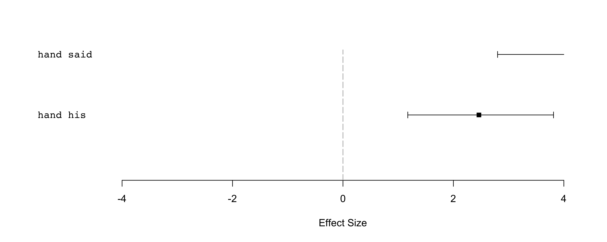
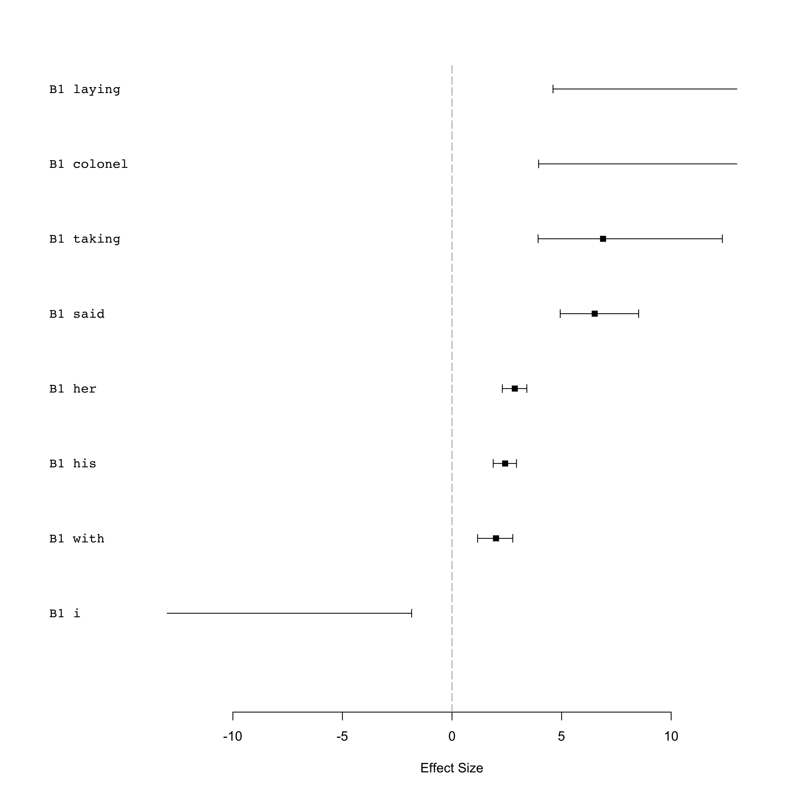
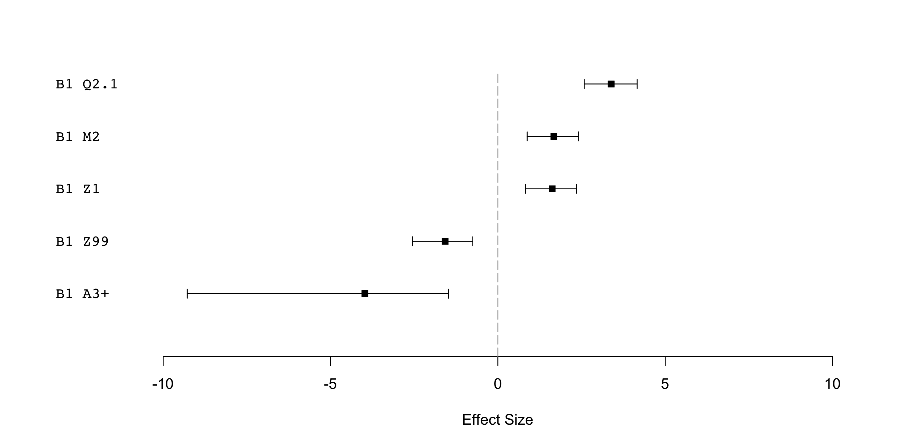

-   [Data](#data)
    -   [Get the corp\_text objects](#get-the-corp_text-objects)
    -   [Create a data.table where each column is a set of types for the
        tokens](#create-a-data.table-where-each-column-is-a-set-of-types-for-the-tokens)
    -   [Corpus size](#corpus-size)
-   [Unmatched tokens](#unmatched-tokens)
-   [Analysis: 1. Comparing manually chosen, specific body part terms +
    “lexical” collocates in AAW quotes vs. long
    suspensions](#analysis-1.-comparing-manually-chosen-specific-body-part-terms-lexical-collocates-in-aaw-quotes-vs.-long-suspensions)
    -   [Figure 1: Plot of specific, manually chosen body part terms
        +“lexical” collocates in AAW quotes vs. long
        suspensions](#figure-1-plot-of-specific-manually-chosen-body-part-terms-lexical-collocates-in-aaw-quotes-vs.-long-suspensions)
        -   [Concordances: Quotes](#concordances-quotes)
        -   [Concordances: Long
            suspensions](#concordances-long-suspensions)
-   [Analysis: 2. Comparing B1 + all “lexical” collocates in AAW quotes
    vs. long
    suspensions](#analysis-2.-comparing-b1-all-lexical-collocates-in-aaw-quotes-vs.-long-suspensions)
    -   [Number of (lexical) types & tokens in B1 &
        examples](#number-of-lexical-types-tokens-in-b1-examples)
        -   [Quotes](#quotes)
        -   [Long suspensions](#long-suspensions)
    -   [Concordances of “lexical”
        collocates](#concordances-of-lexical-collocates)
        -   [Concordances: Long
            suspensions](#concordances-long-suspensions-1)
        -   [Figure 2: Plot of B1 +“lexical” collocates in AAW quotes
            vs. long
            suspensions](#figure-2-plot-of-b1-lexical-collocates-in-aaw-quotes-vs.-long-suspensions)
-   [Analysis: 3. Comparing B1 + all semantic types in AAW quotes
    vs. long
    suspensions](#analysis-3.-comparing-b1-all-semantic-types-in-aaw-quotes-vs.-long-suspensions)
    -   [Figure 3: Plot of B1 + “semantic tag collocates” in AAW quotes
        vs. long
        suspensions](#figure-3-plot-of-b1-semantic-tag-collocates-in-aaw-quotes-vs.-long-suspensions)
    -   [Concordances of semantic tag
        collocates](#concordances-of-semantic-tag-collocates)
        -   [Concordances: Long
            suspensions](#concordances-long-suspensions-2)
-   [How this document was generated](#how-this-document-was-generated)

Data
====

Libraries

``` r
library(CorporaCoCo)
library(data.table)
library(stringi)
```

Get the corp\_text objects
--------------------------

``` r
quotes_files <- list.files("./api-output-sem-tagged/AAW/quote_corp_text_objects/", full.names = TRUE)
quotes_objects <- lapply(quotes_files, readRDS)
quotes_text <- corp_text_rbindlist(quotes_objects)

long_sus_files <- list.files("./api-output-sem-tagged/AAW/longsus_corp_text_objects/", full.names = TRUE)
long_sus_objects <- lapply(long_sus_files, readRDS)
long_sus_text <- corp_text_rbindlist(long_sus_objects)
```

Create a data.table where each column is a set of types for the tokens
----------------------------------------------------------------------

The loaded `corp_text` objects have the full semantic tags as the types

semantic\_tags  
keep whole of first tag, but not multipart or lowercase bits
e.g. `A1.1.1+`. Remove \[+-\]? to not keep the plus or minus.

lc\_tokens  
lowercased tokens

``` r
quotes_type_store <- data.frame(
    lc_tokens = tolower(quotes_text$tokens$token),
    semantic_tags = stri_extract_first(quotes_text$tokens$type, regex = "^([A-Z]\\d+(?:\\.\\d+)*[+-]?)"),
    stringsAsFactors = FALSE
)
long_sus_type_store <- data.frame(
    lc_tokens = tolower(long_sus_text$tokens$token),
    semantic_tags = stri_extract_first(long_sus_text$tokens$type, regex = "^([A-Z]\\d+(?:\\.\\d+)*[+-]?)"),
    stringsAsFactors = FALSE
)
```

Corpus size
-----------

Quotes

``` r
length(quotes_text$tokens$token)
```

    ## [1] 280494

Long suspensions

``` r
length(long_sus_text$tokens$token)
```

    ## [1] 7620

Unmatched tokens
================

The Z99 tag contains “unmatched” tokens. These can be looked up like
this for the quotes (but take up a lot of space):

``` r
#a <- corp_type_lookup(quotes_text)
#a[type == "Z99"]$tokens
```

And like this for the long suspensions

``` r
#b <- corp_type_lookup(long_sus_text)
# b[type == "Z99"]$tokens
```

Analysis: 1. Comparing manually chosen, specific body part terms + “lexical” collocates in AAW quotes vs. long suspensions
==========================================================================================================================

``` r
quotes_text$tokens$type <- with(quotes_type_store, lc_tokens)
quotes_text$tokens$type[is.na(quotes_type_store$semantic_tags)] <- NA  # reintroduce the cooccurence barriers
long_sus_text$tokens$type <- with(long_sus_type_store, lc_tokens)
long_sus_text$tokens$type[is.na(long_sus_type_store$semantic_tags)] <- NA  # reintroduce the cooccurence barriers

head(quotes_text$tokens, 20)
```

    ##     idx     type start end    token
    ##  1:   1     <NA>    13  15      _b_
    ##  2:   2     <NA>    17  19      _b_
    ##  3:   3     <NA>    21  23      _b_
    ##  4:   4     <NA>    25  27      _b_
    ##  5:   5     <NA>    29  31      _b_
    ##  6:   6     john    33  36     JOHN
    ##  7:   7  warwick    38  44  WARWICK
    ##  8:   8 clarence    47  54 CLARENCE
    ##  9:   9    south    57  61    SOUTH
    ## 10:  10 carolina    63  70 CAROLINA
    ## 11:  11     <NA>    75  77      _b_
    ## 12:  12     <NA>    79  81      _b_
    ## 13:  13     <NA>    83  85      _b_
    ## 14:  14     <NA>    87  89      _b_
    ## 15:  15     <NA>    91  93      _b_
    ## 16:  16      one    97  99      One
    ## 17:  17       of   101 102       of
    ## 18:  18      the   104 106      the
    ## 19:  19    south   108 112    South
    ## 20:  20  ca'lina   114 120  Ca'lina

``` r
head(long_sus_text$tokens, 20)
```

    ##     idx          type start end         token
    ##  1:   1          <NA>    13  15           _b_
    ##  2:   2          <NA>    17  19           _b_
    ##  3:   3          <NA>    21  23           _b_
    ##  4:   4          <NA>    25  27           _b_
    ##  5:   5          <NA>    29  31           _b_
    ##  6:   6     continued    33  41     continued
    ##  7:   7           the    43  45           the
    ##  8:   8    undertaker    47  56    undertaker
    ##  9:   9          <NA>    58  60           _b_
    ## 10:  10          <NA>    62  64           _b_
    ## 11:  11          <NA>    66  68           _b_
    ## 12:  12          <NA>    70  72           _b_
    ## 13:  13          <NA>    74  76           _b_
    ## 14:  14      solemnly    78  85      solemnly
    ## 15:  15           his    88  90           his
    ## 16:  16        glance    92  97        glance
    ## 17:  17 unconsciously    99 111 unconsciously
    ## 18:  18       seeking   113 119       seeking
    ## 19:  19             a   121 121             a
    ## 20:  20           row   123 125           row

``` r
# the set of nodes and collocates we are interested in
nodes <- c('eye', 'eyes', 'forehead', 'hand', 'hands', 'head', 'shoulder')
nodes
```

    ## [1] "eye"      "eyes"     "forehead" "hand"     "hands"    "head"     "shoulder"

``` r
#co-occurrences
quotes_surface <- corp_surface(quotes_text, span = "5LR", nodes = nodes)
long_sus_surface <- corp_surface(long_sus_text, span = "5LR", nodes = nodes)

# compare quotes vs. long suspensions
results <- corp_coco(quotes_surface, long_sus_surface, nodes = nodes)
```

Figure 1: Plot of specific, manually chosen body part terms +“lexical” collocates in AAW quotes vs. long suspensions
--------------------------------------------------------------------------------------------------------------------

``` r
plot(results)
```



### Concordances: Quotes

``` r
# your
y <- corp_concordance(quotes_surface, nodes = nodes, collocates= c("your"), context = 0)
y
```

    ## [ 1]              --- _b_ _b_ _b_ kiss *your*  hand in token of his fealty. ---     
    ## [ 2] --- thoughts been troubling *your* small  head _b_ _b_ _b_ _b_ _b_ ---         
    ## [ 3]               --- _b_ gray horse, at the  head of *your* company. You were --- 
    ## [ 4]        --- _b_ an introduction at *your* hands _b_ _b_ _b_ _b_ _b_ ---         
    ## [ 5]               --- out *your* bill, I 'll  hand you a _b_ _b_ _b_ ---           
    ## [ 6]              --- wish to see with *your*  eyes as well _b_ _b_ _b_ ---         
    ## [ 7]            --- _b_ not turn *your* dying  eyes on me for I am ---              
    ## [ 8]  --- hundred thousand people into *your* hands _b_ _b_ _b_ _b_ _b_ ---         
    ## [ 9]             --- destiny is in *your* own hands _b_ _b_ _b_ _b_ _b_ ---         
    ## [10]           --- lie mighty close to *your*  eyes. _b_ _b_ _b_ _b_ _b_ ---        
    ## [11]         --- _b_ nervous. How cold *your* hands are. Do n't you feel ---        
    ## [12]            --- men are holding in *your* hands golden _b_ _b_ _b_ _b_ ---      
    ## [13]        --- privileges, to hold in *your* hands the keys that _b_ _b_ ---       
    ## [14] --- _b_ Associated Press. Through *your* hands passes all the news of ---      
    ## [15]               --- _b_ _b_ _b_ _b_ *your*  eye  teeth _b_ _b_ _b_ _b_ ---       
    ## [16]         --- another 's life. Upon *your*  head be it, Carteret, and _b_ ---    
    ## [17]              --- _b_ _b_ and keep *your* hands out of this affair, if ---      
    ## [18]               --- down as much by *your*  hand as though you had held ---      
    ## [19]               --- His blood be on *your*  head, and a mother 's curse ---      
    ## [20]               --- _b_ _b_ _b_ _b_ *your*  eyes I am a negro, though ---        
    ## [21]             --- for I saw whither *your*  eyes had turned. I loved this ---    
    ## [22]              --- and a thief, but *your*  eyes shall never tell me so. ---     
    ## [23]           --- his breast is open. *Your*  hand has been in his bosom. ---      
    ## [24]      --- our development. Give me *your*  hand again, sir _b_ _b_ _b_ ---      
    ## [25]                   --- is a pistol at the  head of *your* bed _b_ _b_ ---       
    ## [26]             --- blood be upon *your* own  head _b_ _b_ _b_ _b_ _b_ ---         
    ## [27]          --- _b_ that could claim *your*  hand on the ground of merit ---      
    ## [28]          --- of *your* love. From *your*  eyes, from *your* _b_ _b_ _b_ ---    
    ## [29]               --- me as worthy of *your*  hand, it has _b_ _b_ _b_ ---         
    ## [30]          --- must fail of winning *your*  hand and _b_ _b_ _b_ _b_ ---

``` r
# you
y <- corp_concordance(quotes_surface, nodes = nodes, collocates= c("you"), context = 0)
y
```

    ## [ 1]    --- _b_ _b_ scarcely took my   eyes   off *you* all the way; ---          
    ## [ 2]        --- _b_ any man turn his   head   to look at her. *You* ---           
    ## [ 3]      --- _b_ gray horse, at the   head   of your company. *You* were ---     
    ## [ 4]        --- out your bill, I 'll   hand   *you* a _b_ _b_ _b_ ---             
    ## [ 5]           --- _b_ I 'll keep my    eye   on *you*. Nobody 'll trouble ---    
    ## [ 6]       --- may mob *you*; but my   hands  are so tied that I ---              
    ## [ 7] --- _b_ _b_ _b_ " Seven million   eyes   are riveted upon *you*, hoping ---  
    ## [ 8] --- told *you* before *you* got   head   over heels in _b_ _b_ ---           
    ## [ 9]      --- not permit me to clasp   hands  with *you* _b_ _b_ _b_ ---          
    ## [10]  --- _b_ nervous. How cold your   hands  are. Do n't *you* feel ---          
    ## [11]         --- _b_ _b_ spot on his forehead which *you* told me of ---          
    ## [12]      --- _b_ _b_ men into whose   hands  *you* put the ballot were ---       
    ## [13]        --- git dat book froo my   head  , no way *you* fix it. ---           
    ## [14]     --- _b_ _b_ *you* ever laid   eyes   on; an' on her dyin' ---            
    ## [15]            --- 's, dat I got my    eye   on *you*, an' am gwine ---          
    ## [16]   --- it for *you*. Ransom, the   head   waiter, will be floor _b_ ---       
    ## [17]     --- _b_ distress; and I 'll   hand   it back to *you* in ---             
    ## [18]       --- _b_ Will *you* take a   hand   in a game, Gus _b_ ---              
    ## [19]         --- _b_ _b_ _b_ _b_ _b_   hand   of a murderer ! *You* must ---      
    ## [20]        --- drawn it with my own   hand  ; but *you* know my motives, ---     
    ## [21]        --- down as much by your   hand   as though *you* had held ---        
    ## [22]         --- _b_ _b_ _b_ _b_ _b_   head  , are *you* _b_ _b_ _b_ ---          
    ## [23]         --- _b_ _b_ _b_ _b_ now   hand   to *you*, our personal dealings --- 
    ## [24]      --- _b_ _b_ hisself. Go er   head  , teacher, we 'll hear *you* ---     
    ## [25]         --- I speak the truth I   hand   *you* now a few specimen ---

### Concordances: Long suspensions

``` r
# returned
y <- corp_concordance(long_sus_surface, nodes = nodes, collocates= c("returned"), context = 0)
y
```

    ## Warning in max(nchar(x$N, type = "chars")): no non-missing arguments to max; returning -Inf

    ## [1] --- --- 
    ## [0] --- ---

``` r
# nodding
y <- corp_concordance(long_sus_surface, nodes = nodes, collocates= c("nodding"), context = 0)
y
```

    ## Warning in max(nchar(x$N, type = "chars")): no non-missing arguments to max; returning -Inf

    ## [1] --- --- 
    ## [0] --- ---

``` r
# replied
y <- corp_concordance(long_sus_surface, nodes = nodes, collocates= c("replied"), context = 0)
y
```

    ## Warning in max(nchar(x$N, type = "chars")): no non-missing arguments to max; returning -Inf

    ## [1] --- --- 
    ## [0] --- ---

Analysis: 2. Comparing B1 + all “lexical” collocates in AAW quotes vs. long suspensions
=======================================================================================

For this part, only the tag B1 is kept, all others are replaced by lower
case tokens. This means we are working with a version of the corpus
where only B1 semantic tags are present, whereas everything else is
shown as its original token form (but in lower case). This allows us to
see co-occurrences such as B1 + “rubbing”. If B1 co-occurred more
frequently with itself in one of the corpora, the co-occurrence pair B1
+ B1 would also show up (as all realizations of the tag B1 are disaplyed
as “B1” rather than their tokens at this stage).

``` r
quotes_text$tokens$type <- with(quotes_type_store, ifelse(grepl("^B1", semantic_tags), semantic_tags, lc_tokens))
quotes_text$tokens$type[is.na(quotes_type_store$semantic_tags)] <- NA  # reintroduce the cooccurence barriers
long_sus_text$tokens$type <- with(long_sus_type_store, ifelse(grepl("^B1", semantic_tags), semantic_tags, lc_tokens))
long_sus_text$tokens$type[is.na(long_sus_type_store$semantic_tags)] <- NA  # reintroduce the cooccurence barriers
```

Number of (lexical) types & tokens in B1 & examples
---------------------------------------------------

### Quotes

``` r
a <- corp_type_lookup(quotes_text)

# Number of tokens tagged as B1 in quotes
nrow(quotes_text$tokens[type=="B1"])
```

    ## [1] 1365

``` r
# Top 20 frequency of (lexical) types tagged as B1
freq_list <- (as.data.frame(sort(table(quotes_text$tokens[type=="B1"]$token), decreasing = TRUE)))
head(freq_list, 20)
```

    ##        Var1 Freq
    ## 1     heart   98
    ## 2     blood   96
    ## 3     hands   67
    ## 4      face   57
    ## 5      eyes   56
    ## 6      hand   50
    ## 7      head   48
    ## 8      back   38
    ## 9      born   34
    ## 10     pore   34
    ## 11    sleep   34
    ## 12     body   32
    ## 13     arms   30
    ## 14     foot   22
    ## 15     hair   22
    ## 16     feet   20
    ## 17 physical   20
    ## 18    bosom   19
    ## 19   hearts   19
    ## 20      eye   18

``` r
# All "token types" tagged as B1 in quotes
unique(tolower(a[type == "B1"]$tokens))
```

    ## [1] "neck, eyes, face, hair, arms, blood, bite, brains, born, hearts, flesh, bit, physical, limbs, heads, faces, waist, hand, sleep, head, heart, birth, pore, heads, joints, back, fishbone, throat, mouth, tears, eye, legs, tongue, feet, asleep, hands, bladder, slept, palm, lungs, sleeps, tiring, foot, nose, breathes, brain, breath, lips, hearts, wake, up, go, to, bed, bones, awoke, tire, ears, ringlets, chest, backs, tired, bodies, physically, wake, benumbed, beard, dozed, off, woke, knees, bone, body, unborn, lick, put, unconscious, fingers, skin, hearing, blood, face, eyes, teeth, nerve, shoulders, arm, leg, skull, body, veins, bosom, fist, slumber, hearing, gall, palm, gnawing, bleeding, knee, marrow, ear, fangs, teeth, vein, sweaty, mouths, fists, ankles, heel, visage, endurance, skins, give, brow, consciousness, bosoms, stomachs, sniffled, sole, crying, thing, backbone, gasped, tear, pore, lap, toe-nails, chin, spit, jaws, lashes, noses, thumbs, artery, complexion, complexions, slumbered, awake, awakening, swallow, shiver, rousing, cheek, nerves, throats, pitch-fork, sleeping, mole, borned, my, down, gobs, sleepy, soles, belly, forehead, ribs, spitting, bloods, shoulder, breast, fertility, gone, roused, lip, ankle, one-eyed, swallowed, bronchus, sleeping-car, breathing, thirsty, jaw, thirst, marrow-bones, moles, hip, breathe, pulse, went, twinkling, liver, cell, des, toes, gasping, go, naps, tired, tiredness, stayin', mustache, swallows, blooded, pregnant, necks, lash, physique, gored, births, finger, secrete, cells"

### Long suspensions

``` r
b <- corp_type_lookup(long_sus_text)

# Number of tokens tagged as B1 in long suspensions
nrow(long_sus_text$tokens[type=="B1"])
```

    ## [1] 104

``` r
# Top 20 frequency of (lexical) types tagged as B1
freq_list <- (as.data.frame(sort(table(long_sus_text$tokens[type=="B1"]$token), decreasing = TRUE)))
head(freq_list, 20)
```

    ##          Var1 Freq
    ## 1        hand   20
    ## 2        face   13
    ## 3        eyes    7
    ## 4       hands    7
    ## 5         arm    5
    ## 6         eye    5
    ## 7       heart    5
    ## 8        arms    4
    ## 9        head    4
    ## 10     breath    3
    ## 11       lips    3
    ## 12 breathless    2
    ## 13      cheek    2
    ## 14       hair    2
    ## 15      tears    2
    ## 16       back    1
    ## 17       brow    1
    ## 18 complexion    1
    ## 19      elbow    1
    ## 20       feet    1

``` r
# All "token types" tagged as B1 in long suspensions
unique(tolower(b[type == "B1"]$tokens))
```

    ## [1] "hair, hand, arm, knee, eye, head, unwinding, legs, face, gulp, panting, breath, fist, heart, eyes, shoulder, hands, lips, breathless, teeth, shoulders, feet, tremulous, arms, cheek, tears, complexion, brow, wakefulness, back, fingers, hearing, elbow, panted, foot"

``` r
# the set of nodes and collocates we are interested in
nodes <- unique(grep("^B1", c(quotes_text$tokens$type, long_sus_text$tokens$type), value = TRUE))
nodes
```

    ## [1] "B1"

``` r
#co-occurrences
quotes_surface <- corp_surface(quotes_text, span = "5LR", nodes = nodes)
long_sus_surface <- corp_surface(long_sus_text, span = "5LR", nodes = nodes)

# compare
results <- corp_coco(quotes_surface, long_sus_surface, nodes = nodes)
```

Concordances of “lexical” collocates
------------------------------------

### Concordances: Long suspensions

``` r
# returned
y <- corp_concordance(long_sus_surface, nodes = nodes, collocates= c("returned"), context = 0)
y
```

    ## Warning in max(nchar(x$N, type = "chars")): no non-missing arguments to max; returning -Inf

    ## [1] --- --- 
    ## [0] --- ---

``` r
# replied
y <- corp_concordance(long_sus_surface, nodes = nodes, collocates= c("replied"), context = 0)
y
```

    ## Warning in max(nchar(x$N, type = "chars")): no non-missing arguments to max; returning -Inf

    ## [1] --- --- 
    ## [0] --- ---

``` r
# cried
y <- corp_concordance(long_sus_surface, nodes = nodes, collocates= c("cried"), context = 0)
y
```

    ## [1] --- _b_ she *cried* with fluttering heart _b_ _b_ _b_ _b_ _b_ ---           
    ## [2]    --- _b_ she *cried*, turning her  face toward Mrs. Carteret, who _b_ ---

``` r
# rubbing
y <- corp_concordance(long_sus_surface, nodes = nodes, collocates= c("rubbing"), context = 0)
y
```

    ## Warning in max(nchar(x$N, type = "chars")): no non-missing arguments to max; returning -Inf

    ## [1] --- --- 
    ## [0] --- ---

``` r
# shaking
y <- corp_concordance(long_sus_surface, nodes = nodes, collocates= c("shaking"), context = 0)
y
```

    ## [1] --- _b_ rejoined Tryon, *shaking* his head _b_ _b_ _b_ _b_ _b_ --- 
    ## [2]        --- _b_ he said, *shaking* his fist _b_ _b_ _b_ _b_ _b_ ---

``` r
# nodding
y <- corp_concordance(long_sus_surface, nodes = nodes, collocates= c("shaking"), context = 0)
y
```

    ## [1] --- _b_ rejoined Tryon, *shaking* his head _b_ _b_ _b_ _b_ _b_ --- 
    ## [2]        --- _b_ he said, *shaking* his fist _b_ _b_ _b_ _b_ _b_ ---

``` r
# laying
y <- corp_concordance(long_sus_surface, nodes = nodes, collocates= c("laying"), context = 0)
y
```

    ## [1] --- said Miss Treadwell, *laying* her hand affectionately on the _b_ _b_ ---  
    ## [2]    --- said the colonel, *laying* his hand, in _b_ _b_ _b_ _b_ ---            
    ## [3]      --- _b_ said Leroy, *laying* his hand playfully on her lips _b_ ---      
    ## [4]     --- _b_ said Robert, *laying* his hand caressingly upon her head _b_ ---  
    ## [5]       --- the doctor, *laying* a cool hand on the other 's brow ---           
    ## [6]       --- _b_ flight and *laying* her hand upon his arm appealingly, -- ---   
    ## [7]        --- *laying* her hand upon his  arm appealingly, -- when he shrank ---

### Figure 2: Plot of B1 +“lexical” collocates in AAW quotes vs. long suspensions

``` r
plot(results)
```



Analysis: 3. Comparing B1 + all semantic types in AAW quotes vs. long suspensions
=================================================================================

``` r
quotes_text$tokens$type <- with(quotes_type_store, semantic_tags)
long_sus_text$tokens$type <- with(long_sus_type_store, semantic_tags)

head(quotes_text$tokens, 20)
```

    ##     idx type start end    token
    ##  1:   1 <NA>    13  15      _b_
    ##  2:   2 <NA>    17  19      _b_
    ##  3:   3 <NA>    21  23      _b_
    ##  4:   4 <NA>    25  27      _b_
    ##  5:   5 <NA>    29  31      _b_
    ##  6:   6   Z1    33  36     JOHN
    ##  7:   7   Z1    38  44  WARWICK
    ##  8:   8   Z1    47  54 CLARENCE
    ##  9:   9   Z2    57  61    SOUTH
    ## 10:  10   Z2    63  70 CAROLINA
    ## 11:  11 <NA>    75  77      _b_
    ## 12:  12 <NA>    79  81      _b_
    ## 13:  13 <NA>    83  85      _b_
    ## 14:  14 <NA>    87  89      _b_
    ## 15:  15 <NA>    91  93      _b_
    ## 16:  16   N1    97  99      One
    ## 17:  17   Z5   101 102       of
    ## 18:  18   Z5   104 106      the
    ## 19:  19   Z2   108 112    South
    ## 20:  20   Z2   114 120  Ca'lina

``` r
head(long_sus_text$tokens, 20)
```

    ##     idx  type start end         token
    ##  1:   1  <NA>    13  15           _b_
    ##  2:   2  <NA>    17  19           _b_
    ##  3:   3  <NA>    21  23           _b_
    ##  4:   4  <NA>    25  27           _b_
    ##  5:   5  <NA>    29  31           _b_
    ##  6:   6   T2+    33  41     continued
    ##  7:   7    Z5    43  45           the
    ##  8:   8   L1-    47  56    undertaker
    ##  9:   9  <NA>    58  60           _b_
    ## 10:  10  <NA>    62  64           _b_
    ## 11:  11  <NA>    66  68           _b_
    ## 12:  12  <NA>    70  72           _b_
    ## 13:  13  <NA>    74  76           _b_
    ## 14:  14  O4.2    78  85      solemnly
    ## 15:  15    Z8    88  90           his
    ## 16:  16  X3.4    92  97        glance
    ## 17:  17 X5.1-    99 111 unconsciously
    ## 18:  18  X2.4   113 119       seeking
    ## 19:  19    Z5   121 121             a
    ## 20:  20    N4   123 125           row

``` r
# the set of nodes and collocates we are interested in
nodes <- unique(grep("^B1", c(quotes_text$tokens$type, long_sus_text$tokens$type), value = TRUE))
nodes
```

    ## [1] "B1"

``` r
quotes_surface <- corp_surface(quotes_text, span = "5LR", nodes = nodes)
long_sus_surface <- corp_surface(long_sus_text, span = "5LR", nodes = nodes)

# compare
results <- corp_coco(quotes_surface, long_sus_surface, nodes = nodes)
```

Figure 3: Plot of B1 + “semantic tag collocates” in AAW quotes vs. long suspensions
-----------------------------------------------------------------------------------

``` r
plot(results)
```



Concordances of semantic tag collocates
---------------------------------------

The concordances below have been picked relatively spontaneously from
among the high effect size differences and the unique results. We can
easily add other concordances.

### Concordances: Long suspensions

``` r
# "I3.2" - "Work and employment: Professionalism""
y <- corp_concordance(long_sus_surface, nodes = nodes, collocates= c("I3.2"), context = 0)
y
```

    ## Warning in max(nchar(x$N, type = "chars")): no non-missing arguments to max; returning -Inf

    ## [1] --- --- 
    ## [0] --- ---

``` r
# "Q2.1" - "Speech etc: Communicative"
y <- corp_concordance(long_sus_surface, nodes = nodes, collocates= c("Q2.1"), context = 0)
y
```

    ## [ 1]   --- *said*, clasping with his right    hand    the hand _b_ _b_ _b_ ---           
    ## [ 2] --- *said* the colonel, extending his    hand    to the old man, who ---            
    ## [ 3] --- *said* Miss Treadwell, laying her    hand    affectionately on the _b_ _b_ ---  
    ## [ 4]            --- _b_ _b_ _b_ he *said*,   panting  for _b_ _b_ _b_ _b_ ---            
    ## [ 5]         --- _b_ he *said*, taking her    hand    in his as they stood ---           
    ## [ 6]        --- _b_ he *said*, shaking his    fist    _b_ _b_ _b_ _b_ _b_ ---            
    ## [ 7]    --- *said*, giving the visitor his    hand    _b_ _b_ _b_ _b_ _b_ ---            
    ## [ 8]     --- _b_ *said* Fetters, his quiet    eyes    _b_ _b_ _b_ _b_ _b_ ---            
    ## [ 9]    --- *said* the colonel, laying his    hand   , in _b_ _b_ _b_ _b_ ---            
    ## [10]        --- he *said*, taking both her    hands   in his _b_ _b_ _b_ ---             
    ## [11]              --- _b_ *said* he to the breathless audience _b_ _b_ _b_ _b_ ---       
    ## [12]      --- _b_ form and darkly flashing     eye    *told* that slavery had failed --- 
    ## [13]     --- _b_ *said* Tom, with laboring   breath   _b_ _b_ _b_ _b_ _b_ ---            
    ## [14]      --- _b_ *said* Leroy, laying his    hand    playfully on her lips _b_ ---      
    ## [15]     --- *said* Marie, pressing to her    heart   a beautiful child of six ---       
    ## [16]        --- _b_ and her *voice* became  tremulous _b_ _b_ _b_ _b_ _b_ ---            
    ## [17] --- of *unexpressed* affection in his    face    _b_ _b_ _b_ _b_ _b_ ---            
    ## [18]    --- *said* Harry, kissing the pale    cheek   of his mother _b_ _b_ ---          
    ## [19]        --- _b_ *said* Mrs. Leroy, her    face    aglow with fervid feeling _b_ ---  
    ## [20]     --- _b_ *said* Robert, laying his    hand    caressingly upon her head _b_ ---  
    ## [21]       --- _b_ he *said*, offering his    hand    _b_ _b_ _b_ _b_ _b_ ---            
    ## [22]        --- he *said*, holding out his    arms    to her, and all of ---             
    ## [23]           --- _b_ _b_ *said* she, her    eyes    filled with tears _b_ _b_ ---      
    ## [24]    --- _b_ *said* Morlene, taking her    hands   from her face _b_ _b_ ---

``` r
# "X5.1+" - "Attention"
y <- corp_concordance(long_sus_surface, nodes = nodes, collocates= c("X5.1+"), context = 0)
y
```

    ## Warning in max(nchar(x$N, type = "chars")): no non-missing arguments to max; returning -Inf

    ## [1] --- --- 
    ## [0] --- ---

``` r
# "N3.8" - "Measurement: Speed"
y <- corp_concordance(long_sus_surface, nodes = nodes, collocates= c("N3.8"), context = 0)
y
```

    ## Warning in max(nchar(x$N, type = "chars")): no non-missing arguments to max; returning -Inf

    ## [1] --- --- 
    ## [0] --- ---

``` r
# "O1.2-" - "Substances and materials generally: Liquid -"
y <- corp_concordance(long_sus_surface, nodes = nodes, collocates= c("O1.2-"), context = 0)
y
```

    ## Warning in max(nchar(x$N, type = "chars")): no non-missing arguments to max; returning -Inf

    ## [1] --- --- 
    ## [0] --- ---

How this document was generated
===============================

This document is written in
[rmarkdown](https://cran.r-project.org/package=rmarkdown). The intension
is to use [knitr](https://cran.r-project.org/package=knitr) to generate
either `html` or `pdf` versions of the document. The advantage of
`rmarkdown` is that `R` code examples can be embedded in the document –
the code samples being executed and the results generated when the
document is ‘compiled’. Details of the citation syntax can be found in
the [pandoc documentation](http://pandoc.org/MANUAL.html#citations).
Details of equation numbering can be found in the [MathJax
documentation](http://mathjax.readthedocs.io/en/latest/tex.html#automatic-equation-numbering).
Combining code with documentation is a form of [literate
programming](https://www-cs-faculty.stanford.edu/~knuth/lp.html).

In a linux environment the `html` document can be generated on the
command liner like this:

``` bash
Rdev -e "rmarkdown::render('AAW_quotes_long_sus.Rmd')"
```
