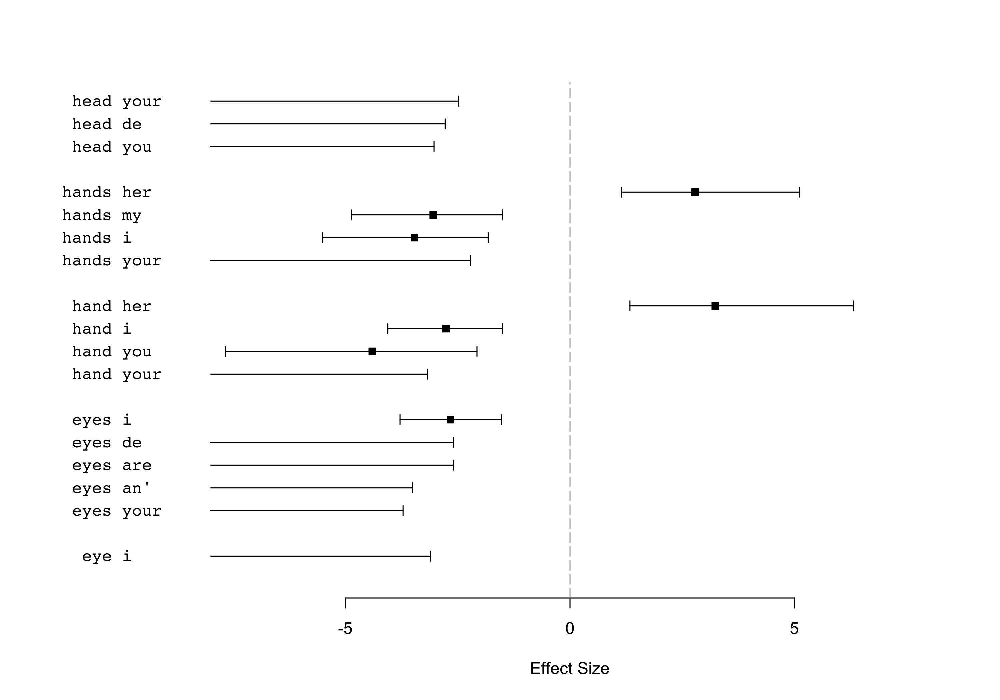
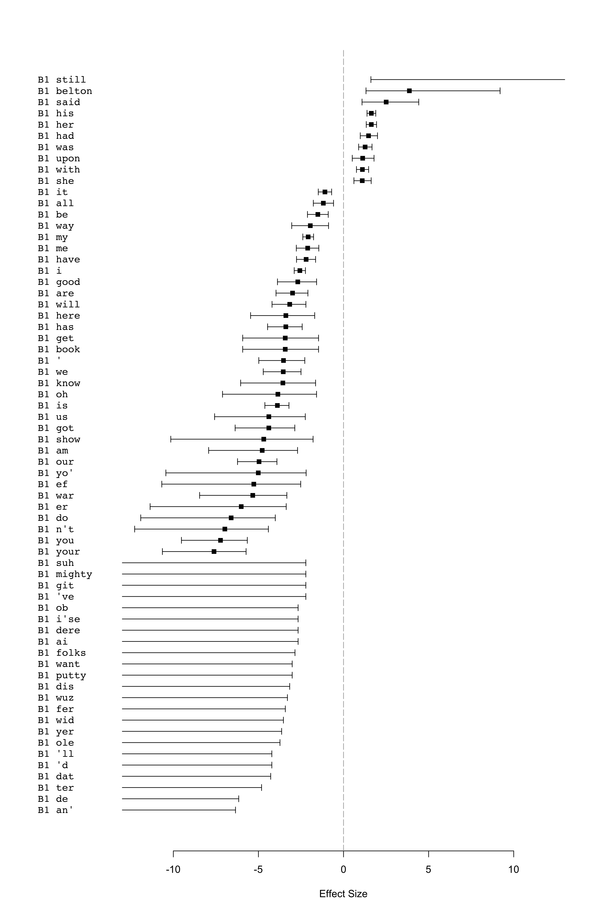
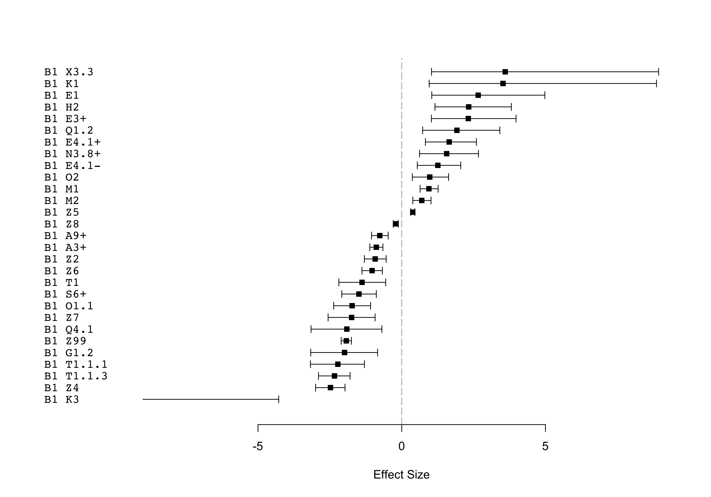

-   [Data](#data)
    -   [Get the corp\_text objects](#get-the-corp_text-objects)
    -   [Create a data.table where each column is a set of types for the
        tokens](#create-a-data.table-where-each-column-is-a-set-of-types-for-the-tokens)
    -   [Corpus size](#corpus-size)
-   [Unmatched tokens](#unmatched-tokens)
-   [Analysis: 1. Comparing manually chosen, specific body part terms +
    “lexical” collocates in AAW quotes
    vs. non-quotes](#analysis-1.-comparing-manually-chosen-specific-body-part-terms-lexical-collocates-in-aaw-quotes-vs.-non-quotes)
    -   [Figure 1: Plot of specific, manually chosen body part terms
        +“lexical” collocates in AAW quotes
        vs. non-quotes](#figure-1-plot-of-specific-manually-chosen-body-part-terms-lexical-collocates-in-aaw-quotes-vs.-non-quotes)
-   [Analysis: 2. Comparing B1 + all “lexical” collocates in AAW quotes
    vs. non-quotes](#analysis-2.-comparing-b1-all-lexical-collocates-in-aaw-quotes-vs.-non-quotes)
    -   [Number of (lexical) types & tokens in B1 &
        examples](#number-of-lexical-types-tokens-in-b1-examples)
        -   [Quotes](#quotes)
        -   [Non-quotes](#non-quotes)
    -   [Concordances of “lexical”
        collocates](#concordances-of-lexical-collocates)
        -   [Concordances: Non-quotes](#concordances-non-quotes)
        -   [Figure 2: Plot of B1 +“lexical” collocates in AAW quotes
            vs. non-quotes](#figure-2-plot-of-b1-lexical-collocates-in-aaw-quotes-vs.-non-quotes)
-   [Analysis: 3. Comparing B1 + all semantic types in AAW quotes
    vs. non-quotes](#analysis-3.-comparing-b1-all-semantic-types-in-aaw-quotes-vs.-non-quotes)
    -   [Figure 3: Plot of B1 + “semantic tag collocates” in AAW quotes
        vs. non-quotes](#figure-3-plot-of-b1-semantic-tag-collocates-in-aaw-quotes-vs.-non-quotes)
    -   [Concordances of semantic tag
        collocates](#concordances-of-semantic-tag-collocates)
        -   [Concordances of semantic tag collocates:
            Quotes](#concordances-of-semantic-tag-collocates-quotes)
        -   [Concordances of “semantic tag collocates”:
            Non-quotes](#concordances-of-semantic-tag-collocates-non-quotes)
-   [How this document was generated](#how-this-document-was-generated)

Data
====

Libraries

``` r
library(CorporaCoCo)
library(data.table)
library(stringi)
```

Get the corp\_text objects
--------------------------

``` r
quotes_files <- list.files("./api-output-sem-tagged/AAW/quote_corp_text_objects/", full.names = TRUE)
quotes_objects <- lapply(quotes_files, readRDS)
quotes_text <- corp_text_rbindlist(quotes_objects)

non_quotes_files <- list.files("./api-output-sem-tagged/AAW/nonquote_corp_text_objects/", full.names = TRUE)
non_quotes_objects <- lapply(non_quotes_files, readRDS)
non_quotes_text <- corp_text_rbindlist(non_quotes_objects)
```

Create a data.table where each column is a set of types for the tokens
----------------------------------------------------------------------

The loaded `corp_text` objects have the full semantic tags as the types

semantic\_tags  
keep whole of first tag, but not multipart or lowercase bits
e.g. `A1.1.1+`. Remove \[+-\]? to not keep the plus or minus.

lc\_tokens  
lowercased tokens

``` r
quotes_type_store <- data.frame(
    lc_tokens = tolower(quotes_text$tokens$token),
    semantic_tags = stri_extract_first(quotes_text$tokens$type, regex = "^([A-Z]\\d+(?:\\.\\d+)*[+-]?)"),
    stringsAsFactors = FALSE
)
non_quotes_type_store <- data.frame(
    lc_tokens = tolower(non_quotes_text$tokens$token),
    semantic_tags = stri_extract_first(non_quotes_text$tokens$type, regex = "^([A-Z]\\d+(?:\\.\\d+)*[+-]?)"),
    stringsAsFactors = FALSE
)
```

Corpus size
-----------

(Currently counts *b*)

Quotes

``` r
length(quotes_text$tokens$token)
```

    ## [1] 280494

Non-quotes

``` r
length(non_quotes_text$tokens$token)
```

    ## [1] 506781

Unmatched tokens
================

The Z99 tag contains “unmatched” tokens. These can be looked up like
this for the quotes (but take up a lot of space):

``` r
#a <- corp_type_lookup(quotes_text)
#a[type == "Z99"]$tokens
```

And like this for the nonquotes

``` r
#b <- corp_type_lookup(non_quotes_text)
# b[type == "Z99"]$tokens
```

Analysis: 1. Comparing manually chosen, specific body part terms + “lexical” collocates in AAW quotes vs. non-quotes
====================================================================================================================

``` r
quotes_text$tokens$type <- with(quotes_type_store, lc_tokens)
quotes_text$tokens$type[is.na(quotes_type_store$semantic_tags)] <- NA  # reintroduce the cooccurence barriers
non_quotes_text$tokens$type <- with(non_quotes_type_store, lc_tokens)
non_quotes_text$tokens$type[is.na(non_quotes_type_store$semantic_tags)] <- NA  # reintroduce the cooccurence barriers

head(quotes_text$tokens, 20)
```

    ##     idx     type start end    token
    ##  1:   1     <NA>    13  15      _b_
    ##  2:   2     <NA>    17  19      _b_
    ##  3:   3     <NA>    21  23      _b_
    ##  4:   4     <NA>    25  27      _b_
    ##  5:   5     <NA>    29  31      _b_
    ##  6:   6     john    33  36     JOHN
    ##  7:   7  warwick    38  44  WARWICK
    ##  8:   8 clarence    47  54 CLARENCE
    ##  9:   9    south    57  61    SOUTH
    ## 10:  10 carolina    63  70 CAROLINA
    ## 11:  11     <NA>    75  77      _b_
    ## 12:  12     <NA>    79  81      _b_
    ## 13:  13     <NA>    83  85      _b_
    ## 14:  14     <NA>    87  89      _b_
    ## 15:  15     <NA>    91  93      _b_
    ## 16:  16      one    97  99      One
    ## 17:  17       of   101 102       of
    ## 18:  18      the   104 106      the
    ## 19:  19    south   108 112    South
    ## 20:  20  ca'lina   114 120  Ca'lina

``` r
head(non_quotes_text$tokens, 20)
```

    ##     idx       type start end      token
    ##  1:   1       <NA>    13  15        _b_
    ##  2:   2       <NA>    17  19        _b_
    ##  3:   3       <NA>    21  23        _b_
    ##  4:   4       <NA>    25  27        _b_
    ##  5:   5       <NA>    29  31        _b_
    ##  6:   6       time    33  36       Time
    ##  7:   7    touches    38  44    touches
    ##  8:   8        all    46  48        all
    ##  9:   9     things    50  55     things
    ## 10:  10       with    57  60       with
    ## 11:  11 destroying    62  71 destroying
    ## 12:  12       hand    73  76       hand
    ## 13:  13        and    79  81        and
    ## 14:  14         if    83  84         if
    ## 15:  15         he    86  87         he
    ## 16:  16       seem    89  92       seem
    ## 17:  17        now    94  96        now
    ## 18:  18        and    98 100        and
    ## 19:  19       <NA>   102 104        _b_
    ## 20:  20       <NA>   106 108        _b_

``` r
# the set of nodes and collocates we are interested in
nodes <- c('eye', 'eyes', 'forehead', 'hand', 'hands', 'head', 'shoulder')
nodes
```

    ## [1] "eye"      "eyes"     "forehead" "hand"     "hands"    "head"     "shoulder"

``` r
#co-occurrences
quotes_surface <- corp_surface(quotes_text, span = "5LR", nodes = nodes)
non_quotes_surface <- corp_surface(non_quotes_text, span = "5LR", nodes = nodes)

# compare quotes vs. non-quotes
results <- corp_coco(quotes_surface, non_quotes_surface, nodes = nodes)
```

Figure 1: Plot of specific, manually chosen body part terms +“lexical” collocates in AAW quotes vs. non-quotes
--------------------------------------------------------------------------------------------------------------

``` r
plot(results)
```



Analysis: 2. Comparing B1 + all “lexical” collocates in AAW quotes vs. non-quotes
=================================================================================

For this part, only the tag B1 is kept, all others are replaced by lower
case tokens. This means we are working with a version of the corpus
where only B1 semantic tags are present, whereas everything else is
shown as its original token form (but in lower case). This allows us to
see co-occurrences such as B1 + “rubbing”. If B1 co-occurred more
frequently with itself in one of the corpora, the co-occurrence pair B1
+ B1 would also show up (as all realizations of the tag B1 are disaplyed
as “B1” rather than their tokens at this stage).

``` r
quotes_text$tokens$type <- with(quotes_type_store, ifelse(grepl("^B1", semantic_tags), semantic_tags, lc_tokens))
quotes_text$tokens$type[is.na(quotes_type_store$semantic_tags)] <- NA  # reintroduce the cooccurence barriers
non_quotes_text$tokens$type <- with(non_quotes_type_store, ifelse(grepl("^B1", semantic_tags), semantic_tags, lc_tokens))
non_quotes_text$tokens$type[is.na(non_quotes_type_store$semantic_tags)] <- NA  # reintroduce the cooccurence barriers
```

Number of (lexical) types & tokens in B1 & examples
---------------------------------------------------

### Quotes

``` r
a <- corp_type_lookup(quotes_text)

# Number of tokens tagged as B1 in quotes
nrow(quotes_text$tokens[type=="B1"])
```

    ## [1] 1365

``` r
# Top 20 frequency of (lexical) types tagged as B1
freq_list <- (as.data.frame(sort(table(quotes_text$tokens[type=="B1"]$token), decreasing = TRUE)))
head(freq_list, 20)
```

    ##        Var1 Freq
    ## 1     heart   98
    ## 2     blood   96
    ## 3     hands   67
    ## 4      face   57
    ## 5      eyes   56
    ## 6      hand   50
    ## 7      head   48
    ## 8      back   38
    ## 9      born   34
    ## 10     pore   34
    ## 11    sleep   34
    ## 12     body   32
    ## 13     arms   30
    ## 14     foot   22
    ## 15     hair   22
    ## 16     feet   20
    ## 17 physical   20
    ## 18    bosom   19
    ## 19   hearts   19
    ## 20      eye   18

``` r
# All "token types" tagged as B1 in quotes
unique(tolower(a[type == "B1"]$tokens))
```

    ## [1] "neck, eyes, face, hair, arms, blood, bite, brains, born, hearts, flesh, bit, physical, limbs, heads, faces, waist, hand, sleep, head, heart, birth, pore, heads, joints, back, fishbone, throat, mouth, tears, eye, legs, tongue, feet, asleep, hands, bladder, slept, palm, lungs, sleeps, tiring, foot, nose, breathes, brain, breath, lips, hearts, wake, up, go, to, bed, bones, awoke, tire, ears, ringlets, chest, backs, tired, bodies, physically, wake, benumbed, beard, dozed, off, woke, knees, bone, body, unborn, lick, put, unconscious, fingers, skin, hearing, blood, face, eyes, teeth, nerve, shoulders, arm, leg, skull, body, veins, bosom, fist, slumber, hearing, gall, palm, gnawing, bleeding, knee, marrow, ear, fangs, teeth, vein, sweaty, mouths, fists, ankles, heel, visage, endurance, skins, give, brow, consciousness, bosoms, stomachs, sniffled, sole, crying, thing, backbone, gasped, tear, pore, lap, toe-nails, chin, spit, jaws, lashes, noses, thumbs, artery, complexion, complexions, slumbered, awake, awakening, swallow, shiver, rousing, cheek, nerves, throats, pitch-fork, sleeping, mole, borned, my, down, gobs, sleepy, soles, belly, forehead, ribs, spitting, bloods, shoulder, breast, fertility, gone, roused, lip, ankle, one-eyed, swallowed, bronchus, sleeping-car, breathing, thirsty, jaw, thirst, marrow-bones, moles, hip, breathe, pulse, went, twinkling, liver, cell, des, toes, gasping, go, naps, tired, tiredness, stayin', mustache, swallows, blooded, pregnant, necks, lash, physique, gored, births, finger, secrete, cells"

### Non-quotes

``` r
b <- corp_type_lookup(non_quotes_text)

# Number of tokens tagged as B1 in non-quotes
nrow(non_quotes_text$tokens[type=="B1"])
```

    ## [1] 4362

``` r
# Top 20 frequency of (lexical) types tagged as B1
freq_list <- (as.data.frame(sort(table(non_quotes_text$tokens[type=="B1"]$token), decreasing = TRUE)))
head(freq_list, 20)
```

    ##             Var1 Freq
    ## 1           eyes  370
    ## 2           face  358
    ## 3           hand  285
    ## 4          heart  272
    ## 5           head  219
    ## 6          hands  179
    ## 7          blood  127
    ## 8            eye  105
    ## 9           feet  105
    ## 10         tears   98
    ## 11          hair   97
    ## 12          lips   86
    ## 13          body   84
    ## 14          arms   80
    ## 15          back   77
    ## 16           arm   74
    ## 17         bosom   44
    ## 18 consciousness   41
    ## 19        hearts   40
    ## 20          foot   39

``` r
# All "token types" tagged as B1 in non-quotes
unique(tolower(b[type == "B1"]$tokens))
```

    ## [1] "hand, hair, heart, face, shoulders, head, unconscious, feet, creeper, profile, inhalation, back, foot, ear, tremulous, leg, haircloth, heads, eye, tears, arms, arm, waist, hands, eyes, nose, breathless, lips, bosom, neck, ears, cheek, birth, blood, veins, slept, sleep, forehead, bone, one-eyed, asleep, teeth, eyeballs, faces, breast, skull, agile, mustache, mouth, born, brain-cells, tired, nerves, antlers, complexion, lip, consciousness, breath, contraction, muscles, skeleton, brow, vein, hearing, brain, wake, knee, fist, elbow, drowsy, somnolence, slumber, awake, doze, roused, wide, breast-pocket, skulls, nostrils, chest, creepers, cheeks, agility, reflex, finger, pulse, tongue, pulses, shiver, went, to, bed, waking, bloodshot, fangs, awoke, cheek-bones, barefoot, jowl, body, hearts, physical, barefooted, wince, knees, shanks, bronzed, flesh, heel, tire, yawn, tear, awakening, finger-tips, endurance, bald, sleepless, palm, lash, eyelids, gnawed, sleeping, shoulder, hair's-breadth, scowl, organ, palate, tongues, eyed, nerve, legs, go, put, swallowed, sallowness, breathed, complexions, spines, limb, fists, panted, piggins, out, fall, chin, beard, muscle, sweat, throat, faces, tiring, dozing, blue-eyed, mustaches, limbs, bit, unwinding, lap, fingers, fallen, breathe, up, thumb, gulp, panting, beards, keen-eyed, rouse, bones, erection, joints, sleepy, backs, gave, tires, sweating, sucking, sinews, liver, awaked, wrists, arm-pits, ankles, thong, lashes, unborn, optic, nerved, ankle, nap, bleeding, off, room, breasting, bodies, waked, emaciated, dozed, elbows, gasped, skin, back, blinked, freckles, foreheads, snicker, swallow, going, lungs, stomachs, yawned, muscular, stomach, falling, sleepiness, freckle, swallowing, frowned, alabama, woke, exigent, cell, belch, throats, biting, spleen, gnawing, insensible, shivering, gore, millions, thirst, womb, scowling, twinkling, sniffling, perspired, shoeless, snoring, crying, skins, brains, spat, bosoms, orally, necks, tears, born, gone, secreted, respiration, breathing, nerving, nervous, system, winced, brows, moustache, quaffing, rousing, slumbers, travel-worn, firm, nerve, hill-tops, marrow, shivered, mole, calamus, cervical, vertebrae, cheekbones, bite, teething, gall, fringe, crow's-feet, jaw, eyebrows, gasping, gasp, sleeping-car, physique, spitting, frowning, expectoration, licked, mouth-organ, blood, frown, build, body-servant, wakefulness, bodily, stolidity, skeletons, jaws, cuticle, thirsting, physically, give, scalps, licking, palms, knuckles, swallows, chins, nimble, wrist, stayed, bust, gulped, waists, snap, breasts, metamorphosis, flabby, hiccoughing, blood-shot, blinking, pregnant, hip, abdomen, secreting, arm, elbowing, benumbing, hands, backbone"

``` r
# the set of nodes and collocates we are interested in
nodes <- unique(grep("^B1", c(quotes_text$tokens$type, non_quotes_text$tokens$type), value = TRUE))
nodes
```

    ## [1] "B1"

``` r
#co-occurrences
quotes_surface <- corp_surface(quotes_text, span = "5LR", nodes = nodes)
non_quotes_surface <- corp_surface(non_quotes_text, span = "5LR", nodes = nodes)

# compare
results <- corp_coco(quotes_surface, non_quotes_surface, nodes = nodes)
```

Concordances of “lexical” collocates
------------------------------------

These are concordances of the B1 tag with specific “lexical” collocates
(e.g. “rubbing”) - chosen from the plot. At this point we are mainly
interested in the collocates of body part terms/the B1 tag in
non-quotes, so have created concordances for this corpus only.

### Concordances: Non-quotes

``` r
# replied
y <- corp_concordance(non_quotes_surface, nodes = nodes, collocates= c("replied"), context = 0)
y
```

    ## [1]      --- _b_ *replied* Plato, fixing his    eyes   respectfully on the _b_ _b_ ---      
    ## [2] --- pathetic expression flitted over his    face  , as he sadly *replied* _b_ ---       
    ## [3]       --- *replied* Iola, drawing a long   breath  _b_ _b_ _b_ _b_ _b_ ---              
    ## [4]       --- _b_ she *replied*, lifting her  eyebrows with an air of puzzled ---           
    ## [5]     --- _b_ *replied* Sandy, shaking his    head   _b_ _b_ _b_ _b_ _b_ ---              
    ## [6]   --- hard word, " *replied* the editor,  frowning slightly. _b_ _b_ _b_ _b_ ---        
    ## [7]                 --- _b_ _b_ _b_ Berry 's    eyes   were bloodshot as he *replied* ---   
    ## [8]               --- _b_ Berry 's eyes were bloodshot as he *replied* _b_ _b_ ---          
    ## [9]               --- _b_ words in a strange   tongue . Dorlan readily *replied* in the ---

``` r
# returned
y <- corp_concordance(non_quotes_surface, nodes = nodes, collocates= c("returned"), context = 0)
y
```

    ## [ 1]    --- *returned* the lawyer, shaking his      head     _b_ _b_ _b_ _b_ _b_ ---             
    ## [ 2] --- acquiescence, and *returned* Kirby 's      hand     _b_ _b_ _b_ _b_ _b_ ---             
    ## [ 3]         --- _b_ _b_ *returned* Fetters. A     scowl     of surprise rose on his ---         
    ## [ 4]           --- him. They *returned* to the      body     of men yet _b_ _b_ ---              
    ## [ 5]          --- Belton had now *returned* to consciousness but kept his eyes closed, ---       
    ## [ 6]                   --- _b_ _b_ _b_ _b_ _b_      head     of the stairway she *returned* ---  
    ## [ 7]             --- and the expression of his      face    , that his reason had *returned* --- 
    ## [ 8]        --- *returned* the pressure of her      hand    , kissed it, and his _b_ ---         
    ## [ 9]     --- _b_ _b_ *returned* the conductor,    frowning   irritably _b_ _b_ _b_ _b_ ---       
    ## [10]  --- *returned* Mr. Delamere, shaking his      head     sadly _b_ _b_ _b_ _b_ ---

``` r
# cried
y <- corp_concordance(non_quotes_surface, nodes = nodes, collocates= c("cried"), context = 0)
y
```

    ## [ 1]      --- _b_ _b_ *cried* herself to   sleep  . Rena 's emotions were more ---   
    ## [ 2]    --- _b_ she *cried*, putting her    hand   over _b_ _b_ _b_ _b_ ---          
    ## [ 3] --- the boy *cried*, with sparkling    eyes   _b_ _b_ _b_ _b_ _b_ ---           
    ## [ 4]       --- _b_ *cried* Rena, as with   tears   in her _b_ _b_ _b_ ---            
    ## [ 5] --- _b_ she *cried* with fluttering   heart   _b_ _b_ _b_ _b_ _b_ ---           
    ## [ 6]  --- young woman *cried* herself to   sleep   before Miss _b_ _b_ _b_ ---       
    ## [ 7]   --- She *cried* bitterly, and lay   awake   very late that _b_ _b_ ---        
    ## [ 8]        --- _b_ _b_ Belton shook his    head   sadly and *cried* _b_ _b_ ---     
    ## [ 9]    --- _b_ she *cried*, turning her    face   toward Mrs. Carteret, who _b_ --- 
    ## [10]    --- _b_ she *cried*, dashing her   tears   aside _b_ _b_ _b_ _b_ ---         
    ## [11]        --- _b_ _b_ _b_ *cried* Joe, tremulous and eager. _b_ _b_ _b_ ---        
    ## [12]    --- he *cried*, clutching at his   breast  _b_ _b_ _b_ _b_ _b_ ---           
    ## [13]   --- she *cried*, looking into his    eyes   with mock earnestness _b_ _b_ ---

``` r
# rejoined
y <- corp_concordance(non_quotes_surface, nodes = nodes, collocates= c("rejoined"), context = 0)
y
```

    ## [1]    --- *rejoined* his comrades at the head _b_ _b_ _b_ _b_ _b_ ---         
    ## [2] --- *rejoined* the doctor, taking his  arm familiarly -- they were _b_ --- 
    ## [3] --- _b_ *rejoined* Tryon, shaking his head _b_ _b_ _b_ _b_ _b_ ---

``` r
# glancing
y <- corp_concordance(non_quotes_surface, nodes = nodes, collocates= c("glancing"), context = 0)
y
```

    ## [1]              --- was a play of sparkling eyes and *glancing* feet. Mary B. --- 
    ## [2]     --- of sparkling eyes and *glancing* feet. Mary B. danced _b_ _b_ ---      
    ## [3] --- _b_ affection, *glancing* with moist eyes from the child in her ---

``` r
# resting
y <- corp_concordance(non_quotes_surface, nodes = nodes, collocates= c("resting"), context = 0)
y
```

    ## [1] --- _b_ the monuments on either  hand -- here, *resting* on a ---               
    ## [2]         --- _b_ _b_ _b_ _b_ her  chin *resting* on her hand, and ---            
    ## [3]   --- her chin *resting* on her  hand, and her eyes reflecting the ---          
    ## [4]  --- _b_ _b_ *resting* upon his  arm , assisted the old gentleman carefully --- 
    ## [5]   --- She found him seated, his  head bent forward *resting* _b_ _b_ ---        
    ## [6]    --- _b_ _b_ *resting* in his hands, rich music, as on a ---

### Figure 2: Plot of B1 +“lexical” collocates in AAW quotes vs. non-quotes

This plot is restricted to effect sizes over 1, i.e. more than twice as
frequent.

``` r
plot(results[abs(effect_size)>1])
```



Analysis: 3. Comparing B1 + all semantic types in AAW quotes vs. non-quotes
===========================================================================

``` r
quotes_text$tokens$type <- with(quotes_type_store, semantic_tags)
non_quotes_text$tokens$type <- with(non_quotes_type_store, semantic_tags)

head(quotes_text$tokens, 20)
```

    ##     idx type start end    token
    ##  1:   1 <NA>    13  15      _b_
    ##  2:   2 <NA>    17  19      _b_
    ##  3:   3 <NA>    21  23      _b_
    ##  4:   4 <NA>    25  27      _b_
    ##  5:   5 <NA>    29  31      _b_
    ##  6:   6   Z1    33  36     JOHN
    ##  7:   7   Z1    38  44  WARWICK
    ##  8:   8   Z1    47  54 CLARENCE
    ##  9:   9   Z2    57  61    SOUTH
    ## 10:  10   Z2    63  70 CAROLINA
    ## 11:  11 <NA>    75  77      _b_
    ## 12:  12 <NA>    79  81      _b_
    ## 13:  13 <NA>    83  85      _b_
    ## 14:  14 <NA>    87  89      _b_
    ## 15:  15 <NA>    91  93      _b_
    ## 16:  16   N1    97  99      One
    ## 17:  17   Z5   101 102       of
    ## 18:  18   Z5   104 106      the
    ## 19:  19   Z2   108 112    South
    ## 20:  20   Z2   114 120  Ca'lina

``` r
head(non_quotes_text$tokens, 20)
```

    ##     idx   type start end      token
    ##  1:   1   <NA>    13  15        _b_
    ##  2:   2   <NA>    17  19        _b_
    ##  3:   3   <NA>    21  23        _b_
    ##  4:   4   <NA>    25  27        _b_
    ##  5:   5   <NA>    29  31        _b_
    ##  6:   6     T1    33  36       Time
    ##  7:   7   X3.3    38  44    touches
    ##  8:   8  N5.1+    46  48        all
    ##  9:   9     O2    50  55     things
    ## 10:  10     Z5    57  60       with
    ## 11:  11 A1.1.2    62  71 destroying
    ## 12:  12     B1    73  76       hand
    ## 13:  13     Z5    79  81        and
    ## 14:  14     Z7    83  84         if
    ## 15:  15     Z8    86  87         he
    ## 16:  16     A8    89  92       seem
    ## 17:  17    N6-    94  96        now
    ## 18:  18    N6-    98 100        and
    ## 19:  19   <NA>   102 104        _b_
    ## 20:  20   <NA>   106 108        _b_

``` r
# the set of nodes and collocates we are interested in
nodes <- unique(grep("^B1", c(quotes_text$tokens$type, non_quotes_text$tokens$type), value = TRUE))
nodes
```

    ## [1] "B1"

``` r
quotes_surface <- corp_surface(quotes_text, span = "5LR", nodes = nodes)
non_quotes_surface <- corp_surface(non_quotes_text, span = "5LR", nodes = nodes)

# compare
results <- corp_coco(quotes_surface, non_quotes_surface, nodes = nodes)
```

Figure 3: Plot of B1 + “semantic tag collocates” in AAW quotes vs. non-quotes
-----------------------------------------------------------------------------

``` r
plot(results)
```



Concordances of semantic tag collocates
---------------------------------------

The concordances below have been picked relatively spontaneously from
among the high effect size differences and the unique results. We can
easily add other concordances.

### Concordances of semantic tag collocates: Quotes

``` r
# T1.1.3 ["Time: General: Future"]
y <- corp_concordance(quotes_surface, nodes = nodes, collocates= c("T1.1.3"), context = 0)
y
```

    ## [ 1]                   --- take the place of wounded   limbs  , and there *will* be broken ---          
    ## [ 2]                          --- is over, let us to   sleep  , and *to-morrow* take up the ---         
    ## [ 3]                          --- _b_ _b_ _b_ all my   heart  , sir, if the ladies *will* ---           
    ## [ 4]                         --- _b_ as fast as your    legs   *will* carry you. As soon ---            
    ## [ 5]                        --- _b_ I *'ll* have his   heart   's blood fer dis, ter ---                
    ## [ 6]                     --- *'ll* have his heart 's   blood   fer dis, ter de _b_ ---                  
    ## [ 7]                        --- _b_ _b_ _b_ _b_ good   sleep   you *'ll* find yourself all ---          
    ## [ 8]                         --- _b_ _b_ where I was    born  . We *shall* leave in a ---               
    ## [ 9]                       --- _b_ _b_ _b_ surely go     to    sleep again. But I *will* ---            
    ## [10]                        --- _b_ _b_ surely go to   sleep   again. But I *will* come ---             
    ## [11]       --- mighty short-sighted, judge. We *'ll*    wake   them up. We *'ll* build ---              
    ## [12]                   --- judge. We *'ll* wake them     up   . We *'ll* build _b_ _b_ ---              
    ## [13]                    --- else we *'ll* take their   hands   away _b_ _b_ _b_ _b_ ---                 
    ## [14]                      --- ten miles of here. His    body   *will* be _b_ _b_ _b_ ---                
    ## [15]                       --- _b_ _b_ women, and my   heart   *shall* be your throne. As ---           
    ## [16]                     --- fines, he *'ll* be tuck    back   dere; an'he say ef dey ---               
    ## [17]                   --- dust of Clarendon from my    feet   forever. *Will* you _b_ _b_ ---          
    ## [18]                        --- _b_ _b_ _b_ and your   heart   and you *will* have none ---             
    ## [19]              --- poor, but not poor-white ! Our   blood   *will* _b_ _b_ _b_ _b_ ---               
    ## [20]                     --- *will* be all the same.   Blood   without money may count for ---          
    ## [21]                      --- _b_ _b_ _b_ _b_ enough   sleep  ; wait a minute, I *'ll* ---              
    ## [22]                --- John Jones, yer black, nappy    head   rascal, I *'ll* crack yer ---            
    ## [23]                   --- rascal, I *'ll* crack yer   skull   if yer _b_ _b_ _b_ ---                   
    ## [24]                      --- you are closest to its   bosom  , it *will* _b_ _b_ _b_ ---               
    ## [25]                        --- _b_ _b_ _b_ _b_ iron    fist   of time *will* knock it ---              
    ## [26]                 --- _b_ *will* try pricking his    palm   _b_ _b_ _b_ _b_ _b_ ---                  
    ## [27]               --- *shall* therefore lay bare my   heart   to you. My father was ---                
    ## [28]                       --- _b_ _b_ _b_ _b_ noble   heart  , in its sober moments *will* ---         
    ## [29]                     --- you attempt to use your   brain   I *will* kill you; _b_ ---               
    ## [30]                      --- in the goodness of his   heart   he *will* allow the negro ---            
    ## [31]                         --- _b_ _b_ _b_ _b_ _b_   bosom  , and the truth *shall* I ---             
    ## [32]                        --- _b_ _b_ _b_ _b_ dere   hands   dey *'ll* *soon* be in ---               
    ## [33]                     --- think he *will* have to  swallow  it. He is _b_ _b_ ---                    
    ## [34]                        --- of the blood in your   veins  , but you *will* have, in ---             
    ## [35]              --- their language. It saddened my   heart   to see such ignorance. *One* ---         
    ## [36]                       --- from ? I *'ll* gib my    head   _b_ _b_ _b_ _b_ _b_ ---                  
    ## [37]                         --- _b_ _b_ _b_ set yer    eyes   on. It *'ll* jis ' ---                   
    ## [38]                     --- the wine at last *will*    bite   _b_ _b_ _b_ _b_ _b_ ---                  
    ## [39]                   --- inside of it which *will*    bite   like _b_ _b_ _b_ _b_ ---                 
    ## [40]            --- almost invariably soothed him to   sleep  . *One* *day* I sang to ---               
    ## [41]                    --- that *will* stick by the    ribs  . How about dinner, mother _b_ ---        
    ## [42]                  --- _b_ _b_ position, that the   blood   in my veins *will* be ---                
    ## [43]                        --- that the blood in my   veins   *will* be any bar to ---                 
    ## [44]                      --- not the color of their   skins  , we *will* have given our ---            
    ## [45]                     --- have their hold upon my   heart  , *will* I recognize any religion ---     
    ## [46]                  --- *will* listen while I take   breath  _b_ _b_ _b_ _b_ _b_ ---                  
    ## [47]                         --- _b_ _b_ _b_ _b_ Our    face   bleach *will* turn the skin ---          
    ## [48]                 --- face bleach *will* turn the    skin   of a black or brown ---                  
    ## [49]                          --- _b_ _b_ you on the    hip   , my lady, and *will* teach ---           
    ## [50]                    --- rushed. I *'ll* feel the   pulse   of my _b_ _b_ _b_ ---                    
    ## [51]            --- officers, and at the preliminary  hearing  *to-morrow* I *'ll* _b_ _b_ ---          
    ## [52]        --- entirely innocent at the preliminary  hearing  *to-morrow* morning _b_ _b_ _b_ ---      
    ## [53]                   --- *wo* n't dare stick their   heads   out of doors on _b_ ---                  
    ## [54]                         --- _b_ _b_ _b_ _b_ _b_    arms  , you *'ll* be dealt with ---             
    ## [55]                          --- _b_ I have a human   heart  , and therefore I *will* not ---          
    ## [56]                         --- _b_ _b_ _b_ _b_ _b_   Tired   ? Pshaw, you *'ll* furgit all ---        
    ## [57]                 --- *'ll* furgit all about your tiredness when Smithkins _b_ _b_ _b_ ---           
    ## [58]                      --- had left him. He *'ll*   sleep   in one of the club ---                   
    ## [59]                --- *will* live, eat, drink, and   sleep   at the expense of others, ---            
    ## [60]                  --- _b_ *shall* never see your    face   again, or I should not ---               
    ## [61]                       --- and a thief, but your    eyes   *shall* never tell me so. ---            
    ## [62] --- _b_ _b_ _b_ insignificant-appearing details  pregnant with suggestion. *Wo* n't you ---        
    ## [63]                      --- _b_ _b_ hisself. Go er    head  , teacher, we *'ll* hear you ---          
    ## [64]                           --- to me an' I *'ll*    lick   um. Gentlemens, on dat plan ---          
    ## [65]                  --- _b_ has promised that full  physical, civil and religious liberty *shall* --- 
    ## [66]                    --- _b_ _b_ long *shall* the   hearts  of the Negroes cherish the ---           
    ## [67]                      --- am a Republican. I was    born   a Republican and *will* _b_ ---          
    ## [68]          --- and the assemblage *postponed* the  hearing . Paul in summing up the ---              
    ## [69]                    --- I really believe that my   heart   *will* burst if I do ---                 
    ## [70]                       --- life, I *will* let my   heart   _b_ _b_ _b_ _b_ _b_ ---

``` r
# Z4 ["Discourse bin"]
y <- corp_concordance(quotes_surface, nodes = nodes, collocates= c("Z4"), context = 0)
y
```

    ## [ 1]              --- _b_ any man turn his   head   to look at her. *You* ---            
    ## [ 2]        --- *if* *you* *like* a pretty   face   _b_ _b_ _b_ _b_ _b_ ---              
    ## [ 3]            --- tried it. It opened my   eyes  , and I would *rather* die ---        
    ## [ 4]                    --- -- jes ' a big  bladder wid a handful *er* shot ---          
    ## [ 5]              --- _b_ _b_ out *er* her   head   most *er* de time _b_ ---            
    ## [ 6]               --- _b_ _b_ _b_ _b_ can   sleep  a week *if* *you* *like*. ---        
    ## [ 7]              --- _b_ _b_ _b_ _b_ good   sleep  you 'll find yourself *all* ---      
    ## [ 8]             --- de little stone at de   foot  , rep'esents de grave *er* ol' ---    
    ## [ 9]                --- 's de eyes, an' de   nose  , an' de shape *er* de ---            
    ## [10]        --- endyoin' de wah, an' *huh*  tongue  's paralyse' so _b_ _b_ ---          
    ## [11]                --- me down hyuh at de   foot   *er* _b_ _b_ _b_ _b_ ---             
    ## [12]        --- _b_ Why, bless your little   heart , Phil, *of* *course* your daddy ---  
    ## [13]            --- _b_ _b_ _b_ _b_ enough   sleep ; *wait* *a* *minute*, I 'll ---      
    ## [14]        --- _b_ _b_ coursed through my   brain . *However*, with an effort I ---     
    ## [15]               --- _b_ _b_ _b_ _b_ _b_ bleeding, dead, gave, *as* *it* *were*, ---   
    ## [16]         --- foresaw my tragic end. My   heart  shed *bloody* _b_ _b_ _b_ ---        
    ## [17]  --- solemn oath, offering their very   blood  for the cause. *I* _b_ ---           
    ## [18]              --- is with my people 's   tears  and stained *as* *it* *is* ---       
    ## [19] --- a self-murderer; exhume Belton 's   body   *if* *you* *like* and _b_ ---        
    ## [20]                 --- _b_ _b_ _b_ fas '  asleep  an' snorin' drefful hard. *Oh*, ---  
    ## [21]              --- *Oh*, I war so soun'  asleep  dat wen _b_ _b_ _b_ ---              
    ## [22]               --- in hebben as hen 's   teeth . *I* *think* wen _b_ _b_ ---         
    ## [23]              --- _b_ *No*; he foun' a   pore   white man who war hard ---           
    ## [24]      --- *however*. One drop of negro   blood  in her veins curses _b_ ---          
    ## [25]           --- the right of being well   born  . *Do* *you* *think* these things --- 
    ## [26]              --- _b_ _b_ _b_ *Oh*, my   pore   baby _b_ _b_ _b_ _b_ ---             
    ## [27]             --- _b_ _b_ _b_ *Oh*, his   head   's level _b_ _b_ _b_ ---             
    ## [28]            --- _b_ _b_ _b_ _b_ *Yes*,   pore  , dear chile ! I specs her ---        
    ## [29]         --- *Oh*, there are tricks of   blood  which always betray them. My ---     
    ## [30]               --- _b_ _b_ _b_ _b_ the   face   of *Jesus* *Christ*. Nor am ---      
    ## [31]             --- hea't ! it 's de ve'y   spit   an' image *er* its _b_ ---           
    ## [32]               --- I don' want dat one    eye   *er* his'n restin' on _b_ ---        
    ## [33]                --- _b_ boy is de ve'y   spit   an' image *er* yo' brother, ---      
    ## [34]         --- _b_ anything else; but my   heart  is *all* *right*, sir, and ---       
    ## [35]               --- _b_ _b_ _b_ _b_ _b_   head   ? *Oh* *dear*, I think I ---         
    ## [36]              --- gim me some *er* his    jaw  , an' I give 'im _b_ ---              
    ## [37]                 --- I is wid a broken    arm  . He got holt *er* a ---              
    ## [38]            --- whether I git my money   back   *er* *no*, fer he is ---             
    ## [39]               --- none too firm on my   legs  . Did *you* *see* anything of ---     
    ## [40]               --- _b_ _b_ _b_ *er* de   cell  , suh _b_ _b_ _b_ _b_ ---             
    ## [41]               --- _b_ _b_ _b_ _b_ _b_   sleep , *er* he 'd never 'a' ---            
    ## [42]            --- white man to black his   face  . *God* alone *knows* how many ---    
    ## [43]              --- drawn it with my own   hand  ; but *you* *know* my motives, ---    
    ## [44]           --- us *anyhow*; an' we 're   tired , -- we read de _b_ ---               
    ## [45]         --- newspapers, -- an' we 're   tired  *er* bein' shot down like ---        
    ## [46]              --- who got one *er* his   bones  smashed wid _b_ _b_ _b_ ---          
    ## [47]              --- _b_ _b_ _b_ the left   foot   on that beat. *Bah*, *bah*, ---      
    ## [48]           --- up your feet, open your  mouths , and move, move, move ! *Oh* ---     
    ## [49]               --- _b_ _b_ _b_ *Oh*, a   hair   of the dog. Some men ---             
    ## [50]               --- *er* cot an' let me   sleep  in de ole barn lof' ---              
    ## [51]          --- _b_ _b_ hisself. Go *er*   head  , teacher, we 'll hear you ---        
    ## [52]          --- *er* show befo' me, fair   fist   an' skull fight. Pick out ---        
    ## [53]                   --- to me an' I 'll   lick   *um*. Gentlemens, on dat plan ---    
    ## [54]  --- *Ah* ! Gentlemens, you kill *er*   pore   gal when her daddy wuz ---           
    ## [55]          --- _b_ *Oh*, dear, you have  brains  _b_ _b_ _b_ _b_ _b_ ---              
    ## [56]            --- time. Fish is good for   brain  food, *they* *say*, and I ---        
    ## [57]          --- *they* *say*, and I need  brains  _b_ _b_ _b_ _b_ _b_ ---              
    ## [58]              --- _b_ _b_ *um*, ef eny   body   wants ter go ergin' *um* ---         
    ## [59]           --- _b_ _b_ glancing at his   skin  . *Too* *bad* ! *I* *suppose* the ---

``` r
# Z7 ["If"]
y <- corp_concordance(quotes_surface, nodes = nodes, collocates= c("Z7"), context = 0)
y
```

    ## [ 1]         --- _b_ *If* she had been  born  white, the young fellows would ---      
    ## [ 2]            --- _b_ _b_ _b_ all my  heart, sir, *if* the ladies will ---          
    ## [ 3]     --- other way, *if* the white  blood is so much _b_ _b_ ---                  
    ## [ 4]        --- _b_ _b_ _b_ good field  hand , *if* looked after right and ---        
    ## [ 5]         --- We need not stain our  hands with innocent blood. *If* _b_ ---       
    ## [ 6] --- stain our hands with innocent  blood. *If* _b_ _b_ _b_ _b_ ---               
    ## [ 7]          --- _b_ _b_ _b_ vote, by  arms  *if* need be, against the ---           
    ## [ 8]       --- rascal, I 'll crack yer  skull *if* yer _b_ _b_ _b_ ---                
    ## [ 9]          --- darkey I ever put my   eye  on. *If* I could get ---                
    ## [10]          --- *If* I could get his  body  to _b_ _b_ _b_ _b_ ---                  
    ## [11]          --- _b_ _b_ flag, but no  tears. *If* in the shadowy beyond, ---        
    ## [12]        --- _b_ _b_ _b_ supply the  brain. *If* you attempt to use ---            
    ## [13]         --- _b_ _b_ out yere, her  face  looking *as* *long* *as* my ---         
    ## [14]   --- looking *as* *long* *as* my   arm , tellin' us all 'bout de ---            
    ## [15]       --- It is doubtful *if* the nerves which have trembled with _b_ ---        
    ## [16]        --- they are around you as  body  servants, and yet *if* one ---          
    ## [17]           --- _b_ _b_ _b_ _b_ _b_  sleep better *if* I have the ---              
    ## [18]       --- Miller, *if* you have a  heart, come _b_ _b_ _b_ _b_ ---               
    ## [19]         --- *If* you have a human  heart, tell your _b_ _b_ _b_ ---              
    ## [20]           --- *if* you ai n't too  tired _b_ _b_ _b_ _b_ _b_ ---                 
    ## [21]           --- _b_ _b_ _b_ _b_ _b_  blood of our illustrious family. *If* ---     
    ## [22]      --- who now sleep their last  sleep and would discountenance, *if* they --- 
    ## [23]    --- unworthy of life. *If* the  arms  of justice are too _b_ ---              
    ## [24]      --- I really believe that my  heart will burst *if* I do ---

``` r
# N3.4 ["Measurement: Volume"]
y <- corp_concordance(quotes_surface, nodes = nodes, collocates= c("N3.4"), context = 0)
y
```

    ## Warning in max(nchar(x$N, type = "chars")): no non-missing arguments to max; returning -Inf

    ## [1] --- --- 
    ## [0] --- ---

``` r
# I1.3+ ["Money: Price"]
y <- corp_concordance(quotes_surface, nodes = nodes, collocates= c("I1.3+"), context = 0)
y
```

    ## Warning in max(nchar(x$N, type = "chars")): no non-missing arguments to max; returning -Inf

    ## [1] --- --- 
    ## [0] --- ---

``` r
# S7.4+ ["Permission" +]
y <- corp_concordance(quotes_surface, nodes = nodes, collocates= c("S7.4+"), context = 0)
y
```

    ## [ 1]                   --- an' *let* John take a    bite   an' a sip _b_ _b_ ---            
    ## [ 2]                    --- is over, *let* us to   sleep  , and to-morrow take up the ---   
    ## [ 3]                   --- wuz *right* on my way    back  . It 'd be robbin' you ---        
    ## [ 4]                  --- _b_ _b_ _b_ good field    hand  , if looked after *right* and --- 
    ## [ 5]            --- would have ridden your horse    back  , and *let* the man _b_ ---       
    ## [ 6]                  --- in the goodness of his   heart   he will *allow* the negro ---    
    ## [ 7]              --- lay supinely down upon our   backs   and *let* oppression _b_ _b_ --- 
    ## [ 8]                 --- *let* the ermine on the shoulders of the _b_ _b_ _b_ ---           
    ## [ 9]                --- not *permit* me to clasp   hands   with you _b_ _b_ _b_ ---         
    ## [10]               --- the *right* of being well    born  . Do you think these things ---   
    ## [11]                   --- *let* him fall on his    head   _b_ _b_ _b_ _b_ _b_ ---          
    ## [12]           --- down here, widout openin' ou'   mouths , an' *let* dese w'ite folks ---  
    ## [13]                   --- *let* me fall on your   bosom   and weep _b_ _b_ _b_ ---         
    ## [14]                     --- er cot an' *let* me   sleep   in de ole barn lof' ---          
    ## [15] --- Dorlan Warthell, the serious, *allowed*  physical _b_ _b_ _b_ _b_ _b_ ---          
    ## [16]         --- not *permitting* men with black   faces   to _b_ _b_ _b_ _b_ ---           
    ## [17]                --- *let* me bury your whole    body   where you tell me to ---         
    ## [18]                   --- life, I will *let* my   heart   _b_ _b_ _b_ _b_ _b_ ---

### Concordances of “semantic tag collocates”: Non-quotes

``` r
# N3.4- ["Measurement: Volume" -]
y <- corp_concordance(non_quotes_surface, nodes = nodes, collocates= c("N3.4-"), context = 0)
y
```

    ## [1]          --- _b_ lord. But with firm hands and *compressed* lips she ministered --- 
    ## [2] --- with firm hands and *compressed*  lips she ministered to his _b_ ---

``` r
# H4- ["Residence" -]
y <- corp_concordance(non_quotes_surface, nodes = nodes, collocates= c("H4-"), context = 0)
y
```

    ## [1] --- _b_ _b_ _b_ _b_ his face; a sort of *vacant* expression ---

``` r
# A1.3- ["Caution" -]
y <- corp_concordance(non_quotes_surface, nodes = nodes, collocates= c("A1.3-"), context = 0)
y
```

    ## [1]         --- _b_ _b_ her slender, gloved   hand   with *impulsive* warmth _b_ _b_ --- 
    ## [2] --- eggs to change *careless* *looking*   faces  into such _b_ _b_ _b_ ---           
    ## [3]              --- there a speck of dried   blood  due to a *carelessly* or ---        
    ## [4]       --- vigorously, from time to time spitting *carelessly* in the aisle, when --- 
    ## [5]         --- cool and collected, ran his    eye   *carelessly* over the bits of ---   
    ## [6]                 --- _b_ _b_ _b_ _b_ _b_   hand   *carelessly* on a bureau _b_ ---

``` r
# I3.2 ["Work and employment: Professionalism"]
y <- corp_concordance(non_quotes_surface, nodes = nodes, collocates= c("I3.2"), context = 0)
y
```

    ## [1]         --- _b_ to bed, bruised in body and damaged in *reputation* _b_ --- 
    ## [2] --- met the *bellboy*, rubbing his head with one hand and _b_ ---           
    ## [3]        --- saying. Then he saw the head *bellman* talking to the clerk ---

``` r
# N3.1 ["Measurement: General"]
y <- corp_concordance(non_quotes_surface, nodes = nodes, collocates= c("N3.1"), context = 0)
y
```

    ## [1] --- *measure* of blows from the hand _b_ _b_ _b_ _b_ _b_ ---

``` r
# X5.1+ ["Attention" +]
y <- corp_concordance(non_quotes_surface, nodes = nodes, collocates= c("X5.1+"), context = 0)
y
```

    ## [1] --- under the constable 's *vigilant*   eye   _b_ _b_ _b_ _b_ _b_ ---             
    ## [2]            --- for my second sense of hearing was *alert* to _b_ _b_ ---          
    ## [3]    --- _b_ _b_ escape *attention* his eyelids were only slightly open. He ---     
    ## [4]  --- meanwhile he kept an *observant*   eye   upon the trend of events ---        
    ## [5]               --- _b_ _b_ _b_ _b_ _b_  asleep, when her *attention* was again --- 
    ## [6]              --- _b_ _b_ _b_ its hind   feet  and looked *intently* at them. ---

``` r
# F3 ["Cigarettes and drugs"]
y <- corp_concordance(non_quotes_surface, nodes = nodes, collocates= c("F3"), context = 0)
y
```

    ## [1] --- lighted *cigarette*, and gripped the arms of his chair _b_ _b_ ---     
    ## [2]          --- from his *cigar*, threw his head back, and slowly blew a ---  
    ## [3]          --- his *cigar*, threw his head back, and slowly blew a great ---

``` r
# S1.2.3- ["Egoism" -]
y <- corp_concordance(non_quotes_surface, nodes = nodes, collocates= c("S1.2.3-"), context = 0)
y
```

    ## [1]   --- this was a passing thought, born of weakness and *self-distrust*, _b_ --- 
    ## [2] --- _b_ *modesty* into the brazen face of shamelessness. It may be ---

``` r
# N3.8- ["Measurement: Speed" -]
y <- corp_concordance(non_quotes_surface, nodes = nodes, collocates= c("N3.8-"), context = 0)
y
```

    ## [ 1] --- and walking *leisurely* past the      back     yard, _b_ _b_ _b_ _b_ ---                
    ## [ 2]         --- _b_ _b_ *slowly* back to consciousness. When fully awake, he thought ---        
    ## [ 3]  --- a quadrille. Tryon, with parted      lips     and *slowly* _b_ _b_ _b_ ---             
    ## [ 4]     --- *slowly* into his rugged old      face     _b_ _b_ _b_ _b_ _b_ ---                  
    ## [ 5]        --- from his cigar, threw his      head     back, and *slowly* blew a ---            
    ## [ 6]        --- his cigar, threw his head      back    , and *slowly* blew a great ---           
    ## [ 7]       --- _b_ _b_ _b_ grief stricken      eyes    , Bernard *slowly* wended his way ---     
    ## [ 8]        --- _b_ _b_ Belton turned his      head     *slowly*, letting his eye sweep ---      
    ## [ 9]   --- his head *slowly*, letting his      eye      sweep the entire circle _b_ ---          
    ## [10]         --- _b_ _b_ _b_ *Slowly* his      hand     released its pressure, a peaceful ---    
    ## [11]   --- beautiful eyes, into which the     tears     had *slowly* gathered _b_ _b_ ---        
    ## [12]              --- _b_ _b_ _b_ _b_ _b_      head     sink *slowly* forward, recovering it --- 
    ## [13]        --- _b_ Leaning on William 's      arm     , the old lady went *slowly* ---          
    ## [14]          --- _b_ _b_ _b_ shaking her      head     *slowly* to emphasize her dissent ---    
    ## [15]             --- _b_ _b_ _b_ Janet 's      eyes     *slowly* filled with tears -- ---        
    ## [16]     --- 's eyes *slowly* filled with     tears     -- bitter tears -- burning ---           
    ## [17]  --- crept *slowly* towards her, his      lips     working and his _b_ _b_ ---              
    ## [18] --- was also apprehensive, shook her      head     *slowly*, signifying that _b_ _b_ ---

``` r
# N3.6 ["Measurement: Area"]
y <- corp_concordance(non_quotes_surface, nodes = nodes, collocates= c("N3.6"), context = 0)
y
```

    ## [1] --- child *stretched* forth his chubby  fist _b_ _b_ _b_ _b_ _b_ ---             
    ## [2]    --- *stretched* for miles on either  hand, _b_ _b_ _b_ _b_ _b_ ---            
    ## [3]      --- _b_ _b_ *stretch*, lifted his  arms just so that the junction ---       
    ## [4]         --- the standard set had their necks *stretched*, _b_ _b_ _b_ _b_ ---    
    ## [5]            --- _b_ _b_ outhouse in the  back yard. She was just *stretching* --- 
    ## [6] --- courage while they *stretched* his  neck, or carried _b_ _b_ _b_ ---         
    ## [7]                --- _b_ _b_ _b_ _b_ _b_ bosom the roots of *acres* of ---

How this document was generated
===============================

This document is written in
[rmarkdown](https://cran.r-project.org/package=rmarkdown). The intension
is to use [knitr](https://cran.r-project.org/package=knitr) to generate
either `html` or `pdf` versions of the document. The advantage of
`rmarkdown` is that `R` code examples can be embedded in the document –
the code samples being executed and the results generated when the
document is ‘compiled’. Details of the citation syntax can be found in
the [pandoc documentation](http://pandoc.org/MANUAL.html#citations).
Details of equation numbering can be found in the [MathJax
documentation](http://mathjax.readthedocs.io/en/latest/tex.html#automatic-equation-numbering).
Combining code with documentation is a form of [literate
programming](https://www-cs-faculty.stanford.edu/~knuth/lp.html).

In a linux environment the `html` document can be generated on the
command liner like this:

``` bash
Rdev -e "rmarkdown::render('AAW_quotes_non-quotes.Rmd')"
```
