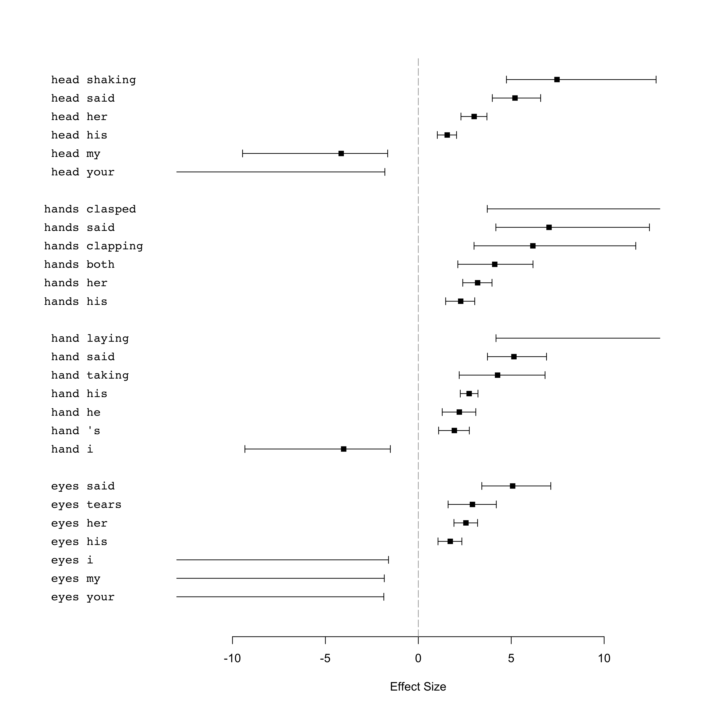
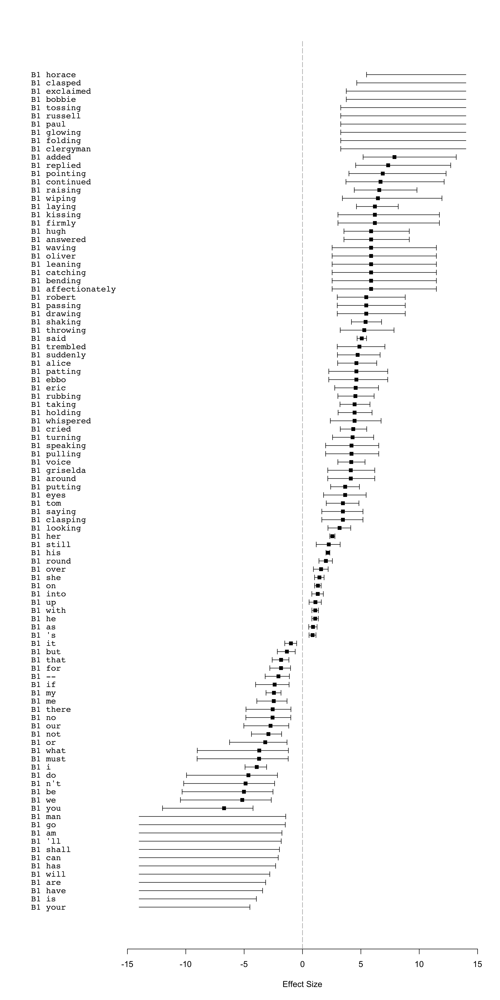
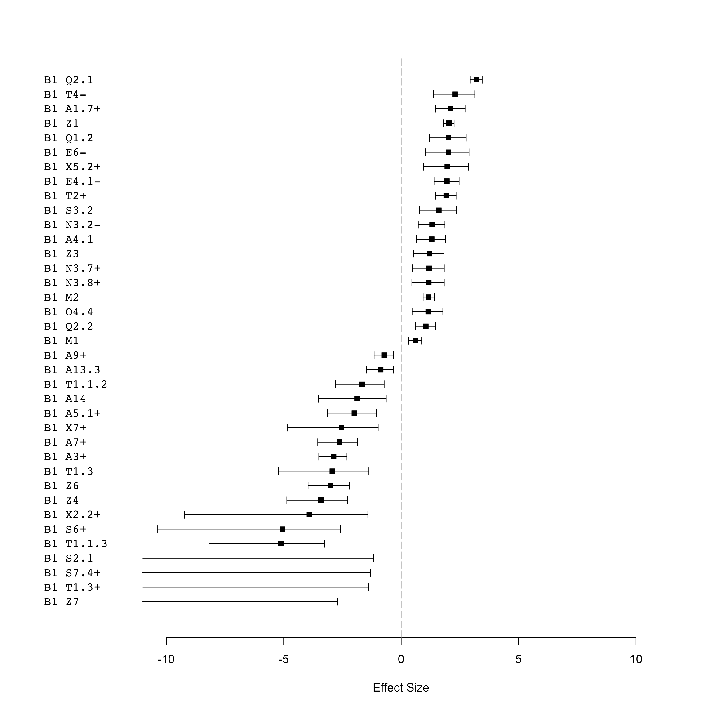

-   [Data](#data)
    -   [Get the corp\_text objects](#get-the-corp_text-objects)
    -   [Create a data.table where each column is a set of types for the
        tokens](#create-a-data.table-where-each-column-is-a-set-of-types-for-the-tokens)
    -   [Corpus size](#corpus-size)
-   [Unmatched tokens](#unmatched-tokens)
-   [Analysis: 1. Comparing manually chosen, specific body part terms +
    “lexical” collocates in ChiLit quotes vs. long
    suspensions](#analysis-1.-comparing-manually-chosen-specific-body-part-terms-lexical-collocates-in-chilit-quotes-vs.-long-suspensions)
    -   [Figure 1: Plot of specific, manually chosen body part terms
        +“lexical” collocates in ChiLit quotes vs. long
        suspensions](#figure-1-plot-of-specific-manually-chosen-body-part-terms-lexical-collocates-in-chilit-quotes-vs.-long-suspensions)
        -   [Concordances: Quotes](#concordances-quotes)
        -   [Concordances: Long
            suspensions](#concordances-long-suspensions)
-   [Analysis: 2. Comparing B1 + all “lexical” collocates in ChiLit
    quotes vs. long
    suspensions](#analysis-2.-comparing-b1-all-lexical-collocates-in-chilit-quotes-vs.-long-suspensions)
    -   [Number of (lexical) types & tokens in B1 &
        examples](#number-of-lexical-types-tokens-in-b1-examples)
        -   [Quotes](#quotes)
        -   [Long suspensions](#long-suspensions)
    -   [Concordances of “lexical”
        collocates](#concordances-of-lexical-collocates)
        -   [Concordances: Long
            suspensions](#concordances-long-suspensions-1)
        -   [Figure 2: Plot of B1 +“lexical” collocates in ChiLit quotes
            vs. long
            suspensions](#figure-2-plot-of-b1-lexical-collocates-in-chilit-quotes-vs.-long-suspensions)
-   [Analysis: 3. Comparing B1 + all semantic types in ChiLit quotes
    vs. long
    suspensions](#analysis-3.-comparing-b1-all-semantic-types-in-chilit-quotes-vs.-long-suspensions)
    -   [Figure 3: Plot of B1 + “semantic tag collocates” in ChiLit
        quotes vs. long
        suspensions](#figure-3-plot-of-b1-semantic-tag-collocates-in-chilit-quotes-vs.-long-suspensions)
    -   [Concordances of semantic tag
        collocates](#concordances-of-semantic-tag-collocates)
        -   [Concordances: Long
            suspensions](#concordances-long-suspensions-2)
-   [How this document was generated](#how-this-document-was-generated)

Data
====

Libraries

``` r
library(CorporaCoCo)
library(data.table)
library(stringi)
```

Get the corp\_text objects
--------------------------

``` r
quotes_files <- list.files("./api-output-sem-tagged/ChiLit/quote_corp_text_objects/", full.names = TRUE)
quotes_objects <- lapply(quotes_files, readRDS)
quotes_text <- corp_text_rbindlist(quotes_objects)

long_sus_files <- list.files("./api-output-sem-tagged/ChiLit/longsus_corp_text_objects/", full.names = TRUE)
long_sus_objects <- lapply(long_sus_files, readRDS)
long_sus_text <- corp_text_rbindlist(long_sus_objects)
```

Create a data.table where each column is a set of types for the tokens
----------------------------------------------------------------------

The loaded `corp_text` objects have the full semantic tags as the types

semantic\_tags  
keep whole of first tag, but not multipart or lowercase bits
e.g. `A1.1.1+`. Remove \[+-\]? to not keep the plus or minus.

lc\_tokens  
lowercased tokens

``` r
quotes_type_store <- data.frame(
    lc_tokens = tolower(quotes_text$tokens$token),
    semantic_tags = stri_extract_first(quotes_text$tokens$type, regex = "^([A-Z]\\d+(?:\\.\\d+)*[+-]?)"),
    stringsAsFactors = FALSE
)
long_sus_type_store <- data.frame(
    lc_tokens = tolower(long_sus_text$tokens$token),
    semantic_tags = stri_extract_first(long_sus_text$tokens$type, regex = "^([A-Z]\\d+(?:\\.\\d+)*[+-]?)"),
    stringsAsFactors = FALSE
)
```

Corpus size
-----------

Quotes

``` r
#Count tokens without the co-occurrence barriers (i.e. ssubset boundaries) _b_ (NA)
sum(quotes_text$tokens$token!="_b_", na.rm = TRUE)
```

    ## [1] 1647747

Long suspensions

``` r
#Count tokens without the co-occurrence barriers (i.e. ssubset boundaries) _b_ (NA)
sum(long_sus_text$tokens$token!="_b_", na.rm = TRUE)
```

    ## [1] 42718

Unmatched tokens
================

The Z99 tag contains “unmatched” tokens. These can be looked up like
this for the quotes (but take up a lot of space):

``` r
#a <- corp_type_lookup(quotes_text)
#a[type == "Z99"]$tokens
```

And like this for the long suspensions

``` r
#b <- corp_type_lookup(long_sus_text)
# b[type == "Z99"]$tokens
```

Analysis: 1. Comparing manually chosen, specific body part terms + “lexical” collocates in ChiLit quotes vs. long suspensions
=============================================================================================================================

``` r
quotes_text$tokens$type <- with(quotes_type_store, lc_tokens)
quotes_text$tokens$type[is.na(quotes_type_store$semantic_tags)] <- NA  # reintroduce the cooccurence barriers
long_sus_text$tokens$type <- with(long_sus_type_store, lc_tokens)
long_sus_text$tokens$type[is.na(long_sus_type_store$semantic_tags)] <- NA  # reintroduce the cooccurence barriers

head(quotes_text$tokens, 20)
```

    ##     idx     type start end    token
    ##  1:   1     <NA>    13  15      _b_
    ##  2:   2     <NA>    17  19      _b_
    ##  3:   3     <NA>    21  23      _b_
    ##  4:   4     <NA>    25  27      _b_
    ##  5:   5     <NA>    29  31      _b_
    ##  6:   6      and    33  35      and
    ##  7:   7     what    37  40     what
    ##  8:   8       is    42  43       is
    ##  9:   9      the    45  47      the
    ## 10:  10      use    49  51      use
    ## 11:  11       of    53  54       of
    ## 12:  12        a    56  56        a
    ## 13:  13     book    58  61     book
    ## 14:  14     <NA>    63  65      _b_
    ## 15:  15     <NA>    67  69      _b_
    ## 16:  16     <NA>    71  73      _b_
    ## 17:  17     <NA>    75  77      _b_
    ## 18:  18     <NA>    79  81      _b_
    ## 19:  19  without    83  89  without
    ## 20:  20 pictures    91  98 pictures

``` r
head(long_sus_text$tokens, 20)
```

    ##     idx    type start end   token
    ##  1:   1    <NA>    13  15     _b_
    ##  2:   2    <NA>    17  19     _b_
    ##  3:   3    <NA>    21  23     _b_
    ##  4:   4    <NA>    25  27     _b_
    ##  5:   5    <NA>    29  31     _b_
    ##  6:   6     for    33  35     for
    ##  7:   7     you    38  40     you
    ##  8:   8     see    42  44     see
    ##  9:   9   alice    47  51   Alice
    ## 10:  10     had    53  55     had
    ## 11:  11  learnt    57  62  learnt
    ## 12:  12 several    64  70 several
    ## 13:  13    <NA>    72  74     _b_
    ## 14:  14    <NA>    76  78     _b_
    ## 15:  15    <NA>    80  82     _b_
    ## 16:  16    <NA>    84  86     _b_
    ## 17:  17    <NA>    88  90     _b_
    ## 18:  18  things    92  97  things
    ## 19:  19      of    99 100      of
    ## 20:  20    this   102 105    this

``` r
# the set of nodes and collocates we are interested in
nodes <- c('eye', 'eyes', 'forehead', 'hand', 'hands', 'head', 'shoulder')
nodes
```

    ## [1] "eye"      "eyes"     "forehead" "hand"     "hands"    "head"     "shoulder"

``` r
#co-occurrences
quotes_surface <- corp_surface(quotes_text, span = "5LR", nodes = nodes)
long_sus_surface <- corp_surface(long_sus_text, span = "5LR", nodes = nodes)

# compare quotes vs. long suspensions
results <- corp_coco(quotes_surface, long_sus_surface, nodes = nodes)
```

Figure 1: Plot of specific, manually chosen body part terms +“lexical” collocates in ChiLit quotes vs. long suspensions
-----------------------------------------------------------------------------------------------------------------------

``` r
plot(results)
```



### Concordances: Quotes

``` r
# your
y <- corp_concordance(quotes_surface, nodes = nodes, collocates= c("your"), context = 0)
y
```

    ## [  1]         --- you incessantly stand on *your*   head   -- _b_ _b_ _b_ _b_ ---                  
    ## [  2]                 --- _b_ _b_ _b_ That *your*    eye   was as steady as ever; ---              
    ## [  3]                --- _b_ either you or *your*   head   must be off, and that ---               
    ## [  4]                      --- or a cap on *your*   head  . You are _b_ _b_ _b_ ---                
    ## [  5]                  --- _b_ _b_ _b_ _b_ *your*   head  , before I see you again, ---            
    ## [  6]                  --- _b_ _b_ _b_ _b_ *your*   hands  and faces afterwards _b_ _b_ ---        
    ## [  7]                 --- _b_ _b_ _b_ Keep *your*   hand   on the charm, Jane _b_ ---              
    ## [  8]                --- image you hold in *your*   hand   speak to you alone, or ---              
    ## [  9]                  --- _b_ _b_ _b_ _b_ *your*   head   ache very much _b_ _b_ ---              
    ## [ 10]                 --- _b_ _b_ with *your* own   hands  _b_ _b_ _b_ _b_ _b_ ---                 
    ## [ 11]                --- Bobs, go and hold *your*   hand   under the _b_ _b_ _b_ ---               
    ## [ 12]     --- almost incessantly. Just try *your*   hands , will you ? Right. So long ---          
    ## [ 13]                 --- _b_ You 've hurt *your*   hand   _b_ _b_ _b_ _b_ _b_ ---                 
    ## [ 14]              --- _b_ _b_ Wash *your* horrid   hands , for goodness ' sake, if ---            
    ## [ 15]               --- Here, take it into *your*   hand   _b_ _b_ _b_ _b_ _b_ ---                 
    ## [ 16]                --- get that thing in *your*   hand   _b_ _b_ _b_ _b_ _b_ ---                 
    ## [ 17]             --- you 've been rubbing *your*   eyes   _b_ _b_ _b_ _b_ _b_ ---                 
    ## [ 18]                   --- _b_ _b_ _b_ in *your*   hand  . Yes -- and has been ---                
    ## [ 19]          --- yourself, if you tossed *your*   head   up high and were obliged ---            
    ## [ 20]                --- _b_ Then just put *your*   hand   here _b_ _b_ _b_ _b_ ---                
    ## [ 21]                   --- like to put in *your*   hands  _b_ _b_ _b_ _b_ _b_ ---                 
    ## [ 22]             --- some cold water over *your*   head  ; and then you will finish ---           
    ## [ 23]                    --- on the top of *your*   head   _b_ _b_ _b_ _b_ _b_ ---                 
    ## [ 24]           --- _b_ presence -- kisses *your*   hand   and addresses you by endearing ---      
    ## [ 25]             --- work he intrusted to *your*   hands , you have given less _b_ ---            
    ## [ 26]                  --- you have got in *your*   head   -- but if _b_ _b_ ---                   
    ## [ 27]           --- *your* proposal to bestow her   hand   upon _b_ _b_ _b_ _b_ ---                
    ## [ 28]                --- have you got into *your*   head   now ? You ca n't mean ---               
    ## [ 29]             --- you would give *your* right   hand   _b_ _b_ _b_ _b_ _b_ ---                 
    ## [ 30]                 --- much of that off *your*   hands  as we can: if the ---                   
    ## [ 31]                     --- _b_ _b_ _b_ keep my    eye   upon *your* vessel during the ---       
    ## [ 32]           --- require stout hearts and able   hands . *Your* son Alfred _b_ _b_ ---          
    ## [ 33]           --- do more execution with *your*   eyes  , Emma _b_ _b_ _b_ _b_ ---               
    ## [ 34]                 --- the law into *your* own   hands  _b_ _b_ _b_ _b_ _b_ ---                 
    ## [ 35]                    --- for us. On the other   hand  , *your* produce will be almost ---      
    ## [ 36]                 --- an ugly wound on *your* shoulder, and will put a stop ---                
    ## [ 37]                --- all the flour off *your*   hands , if you had ever so ---                 
    ## [ 38]                  --- as you can, for *your*   eyes   are younger than mine, and ---          
    ## [ 39]               --- _b_ _b_ _b_ again, *your*   hands  shall be untied, and you ---            
    ## [ 40]                  --- _b_ _b_ some in *your*   head  . Begin, do -- I 'll ---                 
    ## [ 41]           --- along the passages. Do *your*   hands  want washing ? No, you have ---         
    ## [ 42]                 --- _b_ _b_ _b_ Shut *your*   eyes   _b_ _b_ _b_ _b_ _b_ ---                 
    ## [ 43]              --- and mamma. Hold out *your*   hand   so that you can feel ---                
    ## [ 44]                  --- _b_ _b_ _b_ _b_ *your*   head   a little, instead of speaking ---       
    ## [ 45]               --- these fears out of *your*   head  , my poor child. Please God ---          
    ## [ 46]        --- troubling thoughts out of *your*   head   and be happy with *your* ---            
    ## [ 47]            --- bullets. You 'll find *your* shoulder ache, at first; but you ---             
    ## [ 48]                --- _b_ put myself in *your*   hands , wholly. _b_ _b_ _b_ _b_ ---            
    ## [ 49]       --- they are sacrificed before *your*   eyes   ? Is it possible that you ---           
    ## [ 50]                  --- _b_ _b_ _b_ lay *your*   head   against me, dear, and say ---           
    ## [ 51]               --- _b_ _b_ _b_ struck *your*   head   and gave you that cut ---               
    ## [ 52]                 --- _b_ _b_ _b_ Mind *your*    eye   _b_ _b_ _b_ _b_ _b_ ---                 
    ## [ 53]                --- clap a stopper on *your*   eyes   or I 'll give you ---                   
    ## [ 54]                 --- _b_ If you lower *your*   hand   _b_ _b_ _b_ _b_ _b_ ---                 
    ## [ 55]                   --- _b_ _b_ _b_ at *your*   hands  _b_ _b_ _b_ _b_ _b_ ---                 
    ## [ 56]             --- put that notion into *your*   head  . There 's a set o' ---                  
    ## [ 57]                 --- _b_ _b_ _b_ Stay *your*   hands , warriors ! It is not *your* ---        
    ## [ 58]              --- seen few years, but *your*   head   is old. *Your* heart _b_ ---            
    ## [ 59]                 --- _b_ nod or shake *your*   head  . That wo n't be telling ---             
    ## [ 60]                --- What do you shake *your*   head   for _b_ _b_ _b_ _b_ ---                 
    ## [ 61]               --- time you will hold *your*   head   high as a Crofton boy ---               
    ## [ 62]                   --- it gone out of *your*   head   with *your* sound sleep _b_ ---         
    ## [ 63]           --- _b_ _b_ Griselda, shut *your*   eyes  . First of all, I am ---                 
    ## [ 64]         --- action ever wasted ? Can *your*   eyes   see _b_ _b_ _b_ _b_ ---                 
    ## [ 65]                 --- _b_ _b_ _b_ Shut *your*   eyes   for a minute, Griselda _b_ ---          
    ## [ 66]                 --- 'll see, and use *your*   eyes   _b_ _b_ _b_ _b_ _b_ ---                 
    ## [ 67]             --- plant grows. Why, if *your*   eyes   were as they are _b_ ---                
    ## [ 68]          --- welcoming you. Hold out *your*   hands  _b_ _b_ _b_ _b_ _b_ ---                 
    ## [ 69]                --- Stand up and clap *your*   hands  loud three _b_ _b_ _b_ ---              
    ## [ 70]                 --- _b_ _b_ _b_ Shut *your*   eyes  , and clap *your* hands loud, ---        
    ## [ 71]            --- *your* eyes, and clap *your*   hands  loud, very loud _b_ _b_ ---             
    ## [ 72]                --- you with me. Shut *your*   eyes   -- one, two, three -- ---               
    ## [ 73]            --- that well done ? Open *your*   eyes   and look about you _b_ ---              
    ## [ 74]             --- _b_ all right ? Shut *your*   eyes   if you like. I 'm ---                   
    ## [ 75]                 --- _b_ _b_ _b_ Shut *your*   eyes   and put *your* arms round ---           
    ## [ 76]               --- only you must shut *your*   eyes   again, and _b_ _b_ _b_ ---              
    ## [ 77]          --- shorter if you accustom *your*   eyes   to them _b_ _b_ _b_ ---                 
    ## [ 78]               --- _b_ but put *your* clever   head   to rule *your* hands, and ---           
    ## [ 79]              --- clever head to rule *your*   hands , and you will do for ---                
    ## [ 80]             --- have other things in *your*   head  . You would _b_ _b_ _b_ ---              
    ## [ 81]                --- have it strong in *your*   head   then, and you know 't ---               
    ## [ 82]    --- Ethel. Good-night, Norman. Is *your*   head   aching _b_ _b_ _b_ _b_ ---              
    ## [ 83]             --- _b_ Very likely, but *your*   head   is not Ethel 's, and ---                
    ## [ 84]                 --- the law into *your* own   hands , or, what is _b_ _b_ ---                
    ## [ 85]              --- _b_ _b_ There, rest *your*   head   ! Has it not been _b_ ---               
    ## [ 86]                --- I place myself in *your*   hands  _b_ _b_ _b_ _b_ _b_ ---                 
    ## [ 87]             --- _b_ _b_ _b_ muzzling *your*   head  ; you do n't really think ---            
    ## [ 88]                 --- have put it into *your*   head   too. We shall not so ---                
    ## [ 89]             --- put everybody out of *your*   head   _b_ _b_ _b_ _b_ _b_ ---                 
    ## [ 90]                  --- but to sit with *your*   hands  before you entertaining _b_ _b_ ---     
    ## [ 91]               --- my nonsense out of *your*   head  , and be yourself, my sweet ---          
    ## [ 92]                 --- _b_ sent to open *your*   eyes  , and raise *your* thoughts upwards. --- 
    ## [ 93]                    --- _b_ _b_ It is *your*    eye   indeed ! One of the monitors ---        
    ## [ 94]                  --- _b_ _b_ hold up *your*   hands  _b_ _b_ _b_ _b_ _b_ ---                 
    ## [ 95]          --- _b_ Better look-out for *your*   eyes   _b_ _b_ _b_ _b_ _b_ ---                 
    ## [ 96]               --- Welch, I 'll punch *your*   head   when we get outside, see ---            
    ## [ 97]              --- who promise hold up *your*   hands  -- mind, it 's a ---                    
    ## [ 98]              --- *your* Doctor and open his   eyes   for him. Good-bye, you sneaking ---     
    ## [ 99]               --- _b_ _b_ might keep *your*    eye   on the little comedy, Jellicott. ---    
    ## [100]                  --- you can hold up *your*   head   with the best of them; ---              
    ## [101]                     --- _b_ _b_ _b_ _b_ _b_   Hands  off ! at *your* peril, villains ---     
    ## [102]                    --- not a hair of *your*   head   shall they hurt, lady _b_ ---           
    ## [103]                 --- _b_ _b_ _b_ down *your*   head   there, and say you are ---              
    ## [104]             --- _b_ _b_ Reach hither *your*   hand  , boy _b_ _b_ _b_ _b_ ---                
    ## [105]                  --- _b_ _b_ _b_ _b_ *your*   eyes  . But pretend to howl -- ---             
    ## [106]                  --- _b_ _b_ _b_ _b_ crown,   eyes   as blue as *your* sapphires. ---        
    ## [107]                  --- and if you keep *your*   head   the boy _b_ _b_ _b_ ---                 
    ## [108]                 --- did, I shall cut *your*   head   off at once _b_ _b_ ---                 
    ## [109]            --- _b_ children. Give me *your*   hands  _b_ _b_ _b_ _b_ _b_ ---                 
    ## [110]                --- able to take *your* dear   hands  _b_ _b_ _b_ _b_ _b_ ---                 
    ## [111]                  --- _b_ and you had *your*   head   down and *your* hands in ---            
    ## [112]             --- *your* head down and *your*   hands  in *your* pockets, and you ---          
    ## [113]                 --- fight he 'll cut *your*   head   off _b_ _b_ _b_ _b_ ---                 
    ## [114]                  --- give me hold of *your*   hand  , Boy -- thank you, George, ---          
    ## [115]                 --- see a sparkle in *your*    eye   that tells me you will ---              
    ## [116]                   --- I will ride at *your*   head   this very night if you ---              
    ## [117]                 --- him in *your* own rebel   hands . You had best yield -- ---              
    ## [118]                     --- _b_ _b_ _b_ _b_ _b_   head   of his than *your* young ---            
    ## [119]                  --- _b_ _b_ _b_ _b_ *your*   eyes   out _b_ _b_ _b_ _b_ ---                 
    ## [120]                 --- _b_ _b_ Where is *your*   hand   ? Oh, how cold it is. ---               
    ## [121]                  --- _b_ _b_ _b_ _b_ *your*   hand   _b_ _b_ _b_ _b_ _b_ ---                 
    ## [122]                  --- _b_ _b_ _b_ _b_ *your*   hand   _b_ _b_ _b_ _b_ _b_ ---                 
    ## [123]                 --- _b_ _b_ Hold out *your*   hand   _b_ _b_ _b_ _b_ _b_ ---                 
    ## [124]            --- There 's something on *your*   head  , Wright _b_ _b_ _b_ _b_ ---             
    ## [125]                 --- put the thing on *your*   head  , you passionate young fool _b_ ---      
    ## [126]                  --- and put it into *your*   hands , Avonley, as head of the ---            
    ## [127]          --- into *your* hands, Avonley, as   head   of the school, that _b_ ---             
    ## [128]                 --- _b_ _b_ Hold out *your*   hand   _b_ _b_ _b_ _b_ _b_ ---                 
    ## [129]                   --- let him out of *your*   hands . Let no one ask him ---                 
    ## [130]                  --- _b_ _b_ _b_ _b_ *your*   eyes   _b_ _b_ _b_ _b_ _b_ ---                 
    ## [131]                 --- Why do you shake *your*   head  , Hund, and speak no word ? ---          
    ## [132]                --- see him with *your* good   eyes   -- up there _b_ _b_ ---                 
    ## [133]                  --- _b_ But why are *your*   hands  empty _b_ _b_ _b_ _b_ ---               
    ## [134]                  --- _b_ _b_ Give me *your*   hand  , Rolf _b_ _b_ _b_ _b_ ---               
    ## [135]                --- the very hairs of *your*   head   are all numbered. I see ---             
    ## [136]               --- hurt it ! Dig with *your*   hands  _b_ _b_ _b_ _b_ _b_ ---                 
    ## [137]            --- brown hair and *your* little   eyes  . And so do you all ---                  
    ## [138]                --- a civil tongue in *your*   head   _b_ _b_ _b_ _b_ _b_ ---                 
    ## [139]                  --- out -- dig with *your*   hands , now _b_ _b_ _b_ _b_ ---                
    ## [140]                   --- _b_ _b_ out of *your*   head  . Ladies and gentlemen, you know ---     
    ## [141]            --- the precious Lamb off *your*   hands  for the afternoon. Do n't ---           
    ## [142]               --- for they will make *your*   eyes   water _b_ _b_ _b_ _b_ ---               
    ## [143]            --- there -- look Edward, *your*   eyes   are _b_ _b_ _b_ _b_ ---                 
    ## [144]           --- all *your* venison off *your*   hands  without any risk on *your* ---          
    ## [145]               --- _b_ _b_ weapons in *your*   hands ; but now that they have ---             
    ## [146]              --- _b_ be disgraced in *your*   hands ; but do not talk so ---                 
    ## [147]           --- call down blessings on *your*   head  . What can _b_ _b_ _b_ ---               
    ## [148]             --- a poor forester with *your*   hand   in friendship, and even _b_ ---         
    ## [149]               --- _b_ _b_ and *your* sleepy   head   for having escaped with my ---          
    ## [150]                  --- two of you keep *your*    eye   upon that young man _b_ ---             
    ## [151]             --- *your* pen always in *your*   hand   _b_ _b_ _b_ _b_ _b_ ---                 
    ## [152]             --- gruel, and then shut *your*   eyes   and _b_ _b_ _b_ _b_ ---                 
    ## [153]                   --- and do n't let *your*   eyes   wander a _b_ _b_ _b_ ---                
    ## [154]                     --- _b_ _b_ _b_ _b_ _b_   eyes  , on *your* lips. This is ---            
    ## [155]                  --- _b_ _b_ _b_ _b_ *your*   eyes   look wiser, and bigger, and ---         
    ## [156]                     --- _b_ _b_ _b_ _b_ _b_    eye   ? Well, that 's *YOUR* fault, ---       
    ## [157]        --- *YOUR* fault, for keeping *your*   eyes   open -- if you 'd ---                   
    ## [158]                  --- _b_ _b_ _b_ Put *your*   hand   down, and feel the ground ---           
    ## [159]                 --- _b_ _b_ You keep *your*   head   under the leaves, and snore ---         
    ## [160]              --- on the branch above *your*   head   _b_ _b_ _b_ _b_ _b_ ---                 
    ## [161]             --- _b_ breath, and shut *your*   eyes   _b_ _b_ _b_ _b_ _b_ ---                 
    ## [162]                  --- _b_ _b_ back of *your*   head   _b_ _b_ _b_ _b_ _b_ ---                 
    ## [163]              --- _b_ have offed with *your*   head  ; but Alice was n't that ---             
    ## [164]                  --- _b_ _b_ Nor off *your*   head   ! How pleasant it must be ---           
    ## [165]                --- girl, if you open *your*   eyes   so wide, you will never ---             
    ## [166]             --- all, Miss ! Then dry *your*   eyes  , and I can wash the ---                 
    ## [167]                 --- _b_ _b_ bumps on *your*   head  , all that is contained inside. ---      
    ## [168]       --- thing naughty or foolish ! *Your*   head   should be _b_ _b_ _b_ ---               
    ## [169]              --- such a way before ! *Your*   eyes   are perfectly _b_ _b_ _b_ ---           
    ## [170]               --- with *your* hat on *your*   head  , and nothing to do but ---              
    ## [171]            --- anything. You may put *your*   head   in _b_ _b_ _b_ _b_ ---                  
    ## [172]           --- _b_ *your* pocket, and *your*   hands  in *your* sides as long ---             
    ## [173]                    --- _b_ _b_ You have two   eyes   in *your* minds as well ---             
    ## [174]               --- is not necessary ! If the   eyes   of *your* mind are _b_ ---              
    ## [175]        --- _b_ China Mandarin. Shake *your*   head  , Harry, and you will do ---             
    ## [176]                --- no more brains in *your*   head  , _b_ _b_ _b_ _b_ _b_ ---                
    ## [177]                 --- _b_ _b_ that *your* own   head   is on *your* shoulders, or ---          
    ## [178]                   --- _b_ _b_ to use *your*   eyes  . And you, Robert, learn that ---        
    ## [179]               --- 'll lead him. Keep *your*   head   _b_ _b_ _b_ _b_ _b_ ---                 
    ## [180]                 --- man who walks at *your*   head   -- Or sits on *your* ---                
    ## [181]                 --- a good pillow to *your*   head   in sickness. And as for ---             
    ## [182]                --- for no favours at *your*   hands , and _b_ _b_ _b_ _b_ ---                
    ## [183]                 --- _b_ _b_ _b_ Take *your*   hand   from my jacket. This is ---             
    ## [184]                      --- _b_ you 've a good   head   upon *your* _b_ _b_ _b_ ---             
    ## [185]               --- ye could hold back *your*   hand   from the tin-pan, Mr. Riach, ---        
    ## [186]             --- _b_ Scotch tongue in *your*   head  , to be sure; but so ---                 
    ## [187]                    --- ye no ears to *your*   head   _b_ _b_ _b_ _b_ _b_ ---                 
    ## [188]                  --- _b_ _b_ _b_ let *your*   hand   keep *your* head, for the ---           
    ## [189]             --- let *your* hand keep *your*   head  , for the grip is _b_ ---                
    ## [190]                --- word, and gave me *your*   hand   to back it; and ye ---                  
    ## [191]                 --- be proud to give *your*   hand   to _b_ _b_ _b_ _b_ ---                  
    ## [192]                  --- _b_ _b_ _b_ _b_ *your*   hand   upon *your* weapons. Ay, man, ---       
    ## [193]               --- that you could lay *your*   hands  upon no better man to ---               
    ## [194]                     --- But it sticks in my   head   *your* lawyer-man _b_ _b_ _b_ ---       
    ## [195]              --- _b_ Powder and *your* auld   hands  are but as the snail ---                
    ## [196]                --- _b_ Would ye fyle *your*   hands  wi' crime _b_ _b_ _b_ ---               
    ## [197]                  --- _b_ _b_ _b_ _b_ *your*   head  , Miss Leila, ' 'Why do ---              
    ## [198]               --- the sun is hurting *your*   eyes  , and you need not be ---                
    ## [199]           --- though you are shaking *your*   head  ; but I know what _b_ ---                
    ## [200]                     --- it is yes by *your*   eyes  . _b_ _b_ _b_ _b_ _b_ ---                
    ## [201]               --- you need not shake *your*   head  ; il faudra _b_ _b_ _b_ ---              
    ## [202]                   --- _b_ _b_ _b_ in *your*   eyes  . I always know when people ---          
    ## [203]             --- _b_ clear moon above *your*   head  . ' 'Oh, mother, mother ! ' I heard ---  
    ## [204]                    --- for when I opened my   eyes   again, *your* _b_ _b_ _b_ ---           
    ## [205]         --- would never have entered *your*   head  ; I know who _b_ _b_ ---                 
    ## [206]                  --- _b_ _b_ it; put *your*   hands  behind *your* back, and then ---        
    ## [207]                 --- look at it; shut *your*   eyes   and turn *your* back, my ---            
    ## [208]                --- _b_ _b_ work into *your*   hands ; there, about that very collar, ---     
    ## [209]             --- _b_ run strangely in *your*   head   to-day. And why should bags ---         
    ## [210]               --- my young lady; *your* own   eyes   were not brighter than hers ---         
    ## [211]            --- the table before *your* very   eyes  ; I ca n't _b_ _b_ ---                   
    ## [212]                 --- _b_ _b_ _b_ Open *your*   eyes  , _b_ _b_ _b_ _b_ _b_ ---                
    ## [213]            --- that I should examine *your*   eyes   _b_ _b_ _b_ _b_ _b_ ---                 
    ## [214]              --- wipe all tears from *your*   eyes   _b_ _b_ _b_ _b_ _b_ ---                 
    ## [215]                 --- now He will open *your*   eyes  , and _b_ _b_ _b_ _b_ ---                
    ## [216]               --- you must shut *your* dear   eyes   first. Are you _b_ _b_ ---              
    ## [217]          --- than darling ! and with *your*   eyes   so bright, so _b_ _b_ ---               
    ## [218]                  --- _b_ now give me *your*   hand  , and I 'll answer for ---               
    ## [219]                --- _b_ _b_ out *your* right   hand  , and if to the left, ---                
    ## [220]          --- *your* hatchet in *your* right   hand  ; I can use my left. ---                 
    ## [221]                  --- _b_ _b_ _b_ _b_ *Your*   eyes   are younger than mine, William, ---     
    ## [222]                  --- _b_ _b_ _b_ _b_ *your*   head  ; let us thank God for ---               
    ## [223]               --- the lines tight in *your*   hands , or you may be jerked ---               
    ## [224]                  --- was the idea in *your*   head   _b_ _b_ _b_ _b_ _b_ ---                 
    ## [225]               --- and *your* life in *your*   hand  . _b_ _b_ _b_ _b_ _b_ ---                
    ## [226]                  --- _b_ _b_ _b_ _b_ *your*   hand   to me lest I spit ---                   
    ## [227]                  --- _b_ _b_ *your* fool 's   hands  a power over this churchyard, ---       
    ## [228]              --- _b_ wealth comes to *your*   hand   you may be led to ---                   
    ## [229]    --- handkerchief; it will bandage *your*   eyes   just as well. It was ---                
    ## [230]                    --- _b_ Set me on *your* shoulder, Jack, and let me see ---               
    ## [231]           --- the Middens would pick *your*   eyes   out, _b_ _b_ _b_ _b_ ---                
    ## [232]  --- _b_ Water-middens picked *your* gentle   eyes   out _b_ _b_ _b_ _b_ ---                 
    ## [233]                   --- has to say. Battle is   hands  down on *your* side, my ---             
    ## [234]                 --- It is only *your* giddy   eyes   _b_ _b_ _b_ _b_ _b_ ---                 
    ## [235]         --- Mountains, that you keep *your*   eyes   _b_ _b_ _b_ _b_ _b_ ---                 
    ## [236]           --- _b_ _b_ on, Ummanodda; *your*   eyes   burn magic, and trees to ---            
    ## [237]                  --- but put it into *your*   hands  for friendship 's sake. Return ---      
    ## [238] --- knick-knacks, and lap-dogs. Keep *your*   eyes   open, Miss Mary. I 've ---              
    ## [239]                 --- _b_ _b_ 'Hold up *your*   head  , _b_ _b_ _b_ _b_ _b_ ---                
    ## [240]                  --- _b_ _b_ _b_ _b_ *your*   eyes   'll drop out of *your* ---              
    ## [241]                  --- 'll drop out of *your*   head  , if you go on staring ---               
    ## [242]                --- not give way with *your*   head   so when I _b_ _b_ ---                   
    ## [243]             --- put such things into *your*   head   _b_ _b_ _b_ _b_ _b_ ---                 
    ## [244]                 --- should be sad in *your*   eyes  , my child, and I will ---               
    ## [245]                 --- _b_ _b_ _b_ clap *your*   hands ; do n't let Tink _b_ ---                
    ## [246]              --- _b_ _b_ _b_ kissing *your*   hand   _b_ _b_ _b_ _b_ _b_ ---                 
    ## [247]                  --- _b_ _b_ _b_ Put *your*   hand   on _b_ _b_ _b_ _b_ ---                  
    ## [248]                --- _b_ _b_ pluck out *your*    eye  . You would be quite blind ---           
    ## [249]                  --- you let me kiss *your*   hand   _b_ _b_ _b_ _b_ _b_ ---                 
    ## [250]              --- you been doing with *your*   eyes  , child _b_ _b_ _b_ _b_ ---              
    ## [251]         --- _b_ handkerchief to wipe *your*   eyes   with _b_ _b_ _b_ _b_ ---                
    ## [252]           --- _b_ _b_ Specially when *your*   head   's so hard, you know, ---               
    ## [253]                  --- _b_ them all at *your*   hands  _b_ _b_ _b_ _b_ _b_ ---                 
    ## [254]                --- _b_ Give me *your* other   hand   _b_ _b_ _b_ _b_ _b_ ---                 
    ## [255]                  --- _b_ _b_ Give me *your*   hand   _b_ _b_ _b_ _b_ _b_ ---                 
    ## [256]                  --- _b_ _b_ _b_ All *your*   hands  so flinty ! _b_ _b_ _b_ ---             
    ## [257]                   --- or I 'll break *your*   head   _b_ _b_ _b_ _b_ _b_ ---                 
    ## [258]                --- had some fancy in *your*   head   that was not correct _b_ ---            
    ## [259]                   --- _b_ _b_ _b_ on *your*   head  , and making all the place ---           
    ## [260]                  --- _b_ _b_ _b_ _b_ *Your*   hands  are hurt _b_ _b_ _b_ ---                
    ## [261]                  --- _b_ _b_ _b_ _b_ *your*   hands  on, to keep the princess ---            
    ## [262]                 --- _b_ You 'll hurt *your*   hands , Mammy _b_ _b_ _b_ _b_ ---              
    ## [263]                  --- and feed out of *your*   hand  . I wonder _b_ _b_ _b_ ---               
    ## [264]                     --- _b_ _b_ _b_ _b_ his   head   on *your* lap _b_ _b_ ---               
    ## [265]                 --- 's all. You keep *your*   eyes   open and if you feel ---                
    ## [266]                 --- _b_ _b_ _b_ wash *your*   hands  and faces and _b_ _b_ ---               
    ## [267]                 --- come in, hold up *your*   hands , and _b_ _b_ _b_ _b_ ---                
    ## [268]             --- put this notion into *your*   head   _b_ _b_ _b_ _b_ _b_ ---                 
    ## [269]             --- they are both before *your*   eyes  , I _b_ _b_ _b_ _b_ ---                  
    ## [270]                 --- _b_ _b_ read it; *your*   eyes   are best _b_ _b_ _b_ ---                
    ## [271]              --- unless you raise up *your*   hand   to me -- *your* left ---                
    ## [272]                 --- you like some on *your* forehead _b_ _b_ _b_ _b_ _b_ ---                 
    ## [273]             --- lines as those under *your*   eyes  . Look ! _b_ _b_ _b_ _b_ ---             
    ## [274]                  --- have us both on *your*   hands  at once ! But it comes ---              
    ## [275]                   --- _b_ _b_ _b_ Is *your*   head   _b_ _b_ _b_ _b_ _b_ ---                 
    ## [276]               --- like a cushion for *your*   head  , Philip ? Is it better _b_ ---          
    ## [277]             --- better come ? Is not *your*   head   too bad _b_ _b_ _b_ ---                 
    ## [278]                    --- put it out of *your*   head   directly, for it would be ---           
    ## [279]                     --- _b_ _b_ _b_ _b_ _b_   hands , and of *your* going on ---             
    ## [280]                  --- _b_ _b_ _b_ _b_ *Your*   head   is aching _b_ _b_ _b_ ---               
    ## [281]                --- _b_ _b_ _b_ What, *your*   head   ? Eh _b_ _b_ _b_ _b_ ---                
    ## [282]                --- mind; but how bad *your*   head   is _b_ _b_ _b_ _b_ ---                  
    ## [283]         --- deserve this kindness at *your*   hands  _b_ _b_ _b_ _b_ _b_ ---                 
    ## [284]                  --- _b_ _b_ _b_ _b_ *your*   hand   _b_ _b_ _b_ _b_ _b_ ---                 
    ## [285]                     --- _b_ _b_ _b_ _b_ _b_   Hands  off; none of *your* impertinence, ---   
    ## [286]                  --- _b_ I 'll knock *your*   head   off _b_ _b_ _b_ _b_ ---                 
    ## [287]              --- to *your* bridal table the   head   of _b_ _b_ _b_ _b_ ---                  
    ## [288]        --- so flattered, that *your* little   head   might have been turned _b_ ---          
    ## [289]                  --- 's time to open *your*   eyes   ! We 're _b_ _b_ _b_ ---                
    ## [290]                  --- to sleep either and my   head   ached. Tell me *your* _b_ ---           
    ## [291]                 --- _b_ _b_ _b_ Shut *your*   eyes   _b_ _b_ _b_ _b_ _b_ ---                 
    ## [292]                --- India. I will pat *your*   hand   and stroke _b_ _b_ _b_ ---              
    ## [293]                 --- _b_ _b_ _b_ Shut *your*   eyes   _b_ _b_ _b_ _b_ _b_ ---                 
    ## [294]         --- you 'll scarcely believe *your*   eyes   _b_ _b_ _b_ _b_ _b_ ---                 
    ## [295]                  --- hold a stick in *your*   hands , and when _b_ _b_ _b_ ---               
    ## [296]                  --- _b_ if you shut *your*   eyes   tight. We 've all been ---              
    ## [297]               --- reason why. I hope *your*   head   does n't hurt much. Thank ---           
    ## [298]           --- Surrender, and up with *your*   hands  ! " You might _b_ _b_ _b_ ---           
    ## [299]          --- so many patterns before *your*   eyes   to work _b_ _b_ _b_ ---                 
    ## [300]          --- the flashing water. Fix *your*    eye   on _b_ _b_ _b_ _b_ ---                  
    ## [301]                --- He puts into *your* very   hands  _b_ _b_ _b_ _b_ _b_ ---                 
    ## [302]                --- of a shelter over *your*   head  . If you do n't go ---                   
    ## [303]                  --- _b_ _b_ _b_ Are *your*   eyes   keen, _b_ _b_ _b_ _b_ ---               
    ## [304]                   --- Touch one hair of his   head   and *your* king dies _b_ ---            
    ## [305]              --- _b_ from that which *your*   eyes   gazed on by the light ---               
    ## [306]                 --- as *your* minds, and my   eyes   as *your* eyes. She is ---              
    ## [307]                   --- and my eyes as *your*   eyes  . She is the _b_ _b_ ---                 
    ## [308]          --- moon grows black before *your*   eyes  ; soon there will be _b_ ---             
    ## [309]            --- full moon, yet before *your*   eyes   _b_ _b_ _b_ _b_ _b_ ---                 
    ## [310]          --- _b_ _b_ Quatermain, put *your*   hand   here where mine is. Now, ---            
    ## [311]                   --- Ye can read ? You 've   eyes   in *your* head ? Do n't ---             
    ## [312]                  --- You 've eyes in *your*   head   ? Do n't attempt to deny ---            
    ## [313]                --- a furtive look in *your*    eye   -- a furtive, _b_ _b_ ---               
    ## [314]       --- sneakin', poachin' look in *your*    eye  , that 'ud ruin the reputation ---       
    ## [315]       --- _b_ beastly cautious. Keep *your*    eye   on King, and, if he ---                 
    ## [316]                      --- _b_ _b_ _b_ Ye 've   eyes   in *your* head. Do n't ---              
    ## [317]                   --- Ye 've eyes in *your*   head  . Do n't attempt to deny ---             
    ## [318]                  --- able to hold up *your*   head   again, Foxy. The fags 'll ---           
    ## [319]           --- about *your* pure, high young forehead, full of the _b_ _b_ ---                
    ## [320]                 --- 'm taught to use *your*   eyes  . Yeou go 'tend *your* _b_ ---           
    ## [321]                  --- _b_ _b_ _b_ _b_ *your*   head   for three days _b_ _b_ ---              
    ## [322]            --- and cheerful. Give me *your*   hand   -- if we go _b_ ---                     
    ## [323]                --- _b_ _b_ you. Shut *your*   eyes   _b_ _b_ _b_ _b_ _b_ ---                 
    ## [324]                  --- _b_ _b_ _b_ _b_ *your*   eyes   are as green _b_ _b_ ---                
    ## [325]                 --- _b_ _b_ _b_ Shut *your*   eyes   and listen. That is all ---             
    ## [326]            --- he replied. 'Lay down *your*   head   and shut *your* eyes, and ---           
    ## [327]             --- *your* head and shut *your*   eyes  , and _b_ _b_ _b_ _b_ ---                
    ## [328]                    --- _b_ law into you own   hands  when *your* father is a ---             
    ## [329]             --- need n't go shutting *your*   eyes   and holding *your* breath, as ---       
    ## [330]                    --- it to hold in *your*   hand   while we are _b_ _b_ ---                
    ## [331]               --- _b_ _b_ Now, mind, *your*   eyes   on the crack of the ---                 
    ## [332]                 --- _b_ _b_ _b_ keep *your*   eyes   on the _b_ _b_ _b_ ---                  
    ## [333]                     --- I can see by *your*   eyes   that you _b_ _b_ _b_ ---                
    ## [334]                 --- _b_ _b_ _b_ into *your*   head   ? Has anybody told you to ---           
    ## [335]              --- you play golf, keep *your*    eye   on the ball _b_ _b_ ---                 
    ## [336]               --- come along and try *your*   hand   at a kick _b_ _b_ ---                   
    ## [337]                --- more. But, I say, *your*   head   's broken too; *your* collar ---        
    ## [338]                  --- with a shell on *your*   head   _b_ _b_ _b_ _b_ _b_ ---                 
    ## [339]               --- got the last. Keep *your*   head  , old boy _b_ _b_ _b_ ---                
    ## [340]         --- very different things in *your*   head  , I think, _b_ _b_ _b_ ---               
    ## [341]              --- find plenty to keep *your*   hand   _b_ _b_ _b_ _b_ _b_ ---                 
    ## [342]                 --- Will you give me *your*   hand  , _b_ _b_ _b_ _b_ _b_ ---                
    ## [343]          --- business. Hold out *your* left   hand  . _b_ _b_ _b_ _b_ _b_ ---                
    ## [344]                 --- _b_ _b_ you have *your*   hands  on it. Scatter and look ---             
    ## [345]                 --- _b_ _b_ You have *your*   hands  on thousands, you fools, and ---        
    ## [346]            --- _b_ you never clapped *your*   eyes   _b_ _b_ _b_ _b_ _b_ ---                 
    ## [347]                      --- Do you call that a   head   on *your* shoulders, or a ---           
    ## [348]                  --- _b_ _b_ _b_ _b_ *your*   head   ai n't much account, nor ---            
    ## [349]                 --- _b_ _b_ _b_ Keep *your*   head   down _b_ _b_ _b_ _b_ ---                
    ## [350]                 --- _b_ keep to *your* left   hand  , mate Jim ! Under the _b_ ---           
    ## [351]                --- *your* fancy, some of my   hands  being rough and having _b_ ---          
    ## [352]                  --- to *your* being in our   hands  _b_ _b_ _b_ _b_ _b_ ---                 
    ## [353]             --- like print, I swear. *Your*   hand   o' write, George ? Why, _b_ ---         
    ## [354]                 --- _b_ _b_ _b_ with *your*   head   broke -- or you, George ---             
    ## [355]             --- hours agone, and has *your*   eyes   the colour of lemon peel ---            
    ## [356]               --- shave, it was you; *your*   head   _b_ _b_ _b_ _b_ _b_ ---                 
    ## [357]                       --- _b_ _b_ You 've a   head   upon *your* shoulders, John, _b_ ---    
    ## [358]                   --- _b_ _b_ I want *your*   hand   _b_ _b_ _b_ _b_ _b_ ---                 
    ## [359]                    --- I crept on to *your*   hand   when you were carrying the ---          
    ## [360]                  --- _b_ _b_ in *your* able   hands  _b_ _b_ _b_ _b_ _b_ ---                 
    ## [361]                  --- I do n't wonder *your*   head   aches, after all those sweet ---        
    ## [362]                    --- 've got it in *your*   hand   still. Do n't _b_ _b_ ---               
    ## [363]              --- shall have to punch *your*   head   _b_ _b_ _b_ _b_ _b_ ---                 
    ## [364]               --- n't quite right in *your*   head  , _b_ _b_ _b_ _b_ _b_ ---                
    ## [365]                 --- _b_ _b_ _b_ Shut *your*   head  , and come on _b_ _b_ ---                
    ## [366]            --- *your* worthy father 's grey   head  , would you, sir _b_ _b_ ---             
    ## [367]                    --- can see it in *your*   eyes   _b_ _b_ _b_ _b_ _b_ ---                 
    ## [368]                --- mean to play into *your*   hands  for all that. You ca ---                
    ## [369]                 --- got an idea into *your*   head   that I 'm a _b_ ---                     
    ## [370]               --- _b_ _b_ Well then, *your*   head   's clear enough to understand ---       
    ## [371]                     --- saw him with my own   eyes   at one of *your* windows. ---           
    ## [372]                --- may leave that in *your*   hands  _b_ _b_ _b_ _b_ _b_ ---                 
    ## [373]                 --- _b_ _b_ chop off *your*   head   and the Wallypug 's too. ---            
    ## [374]           --- well run about without *your*   head   for all the good it ---                 
    ## [375]                   --- you to walk on *your*   head  , or to eat roast fir-cones ---          
    ## [376]                 --- _b_ _b_ stand on *your*   head  , for instance _b_ _b_ _b_ ---           
    ## [377]                  --- _b_ _b_ _b_ _b_ *your*   hand   steady _b_ _b_ _b_ _b_ ---              
    ## [378]      --- of water-babies last night, *your*   head   is so _b_ _b_ _b_ ---                   
    ## [379]              --- is because you took *your*   eyes   off me _b_ _b_ _b_ ---                  
    ## [380]                 --- _b_ _b_ _b_ keep *your*    eye   on the dog, who goes ---                
    ## [381]                    --- and it will beat the   eyes   out of *your* _b_ _b_ ---               
    ## [382]               --- but I must bandage *your*   eyes   _b_ _b_ _b_ _b_ _b_ ---                 
    ## [383]               --- now I must bandage *your*   eyes   _b_ _b_ _b_ _b_ _b_ ---                 
    ## [384]                    --- If I only had *your*   head  , Ratty _b_ _b_ _b_ _b_ ---              
    ## [385]                  --- _b_ _b_ and dry *your*   eyes   and be a sensible animal. ---           
    ## [386]          --- the scenery and yawning *your*   head   off _b_ _b_ _b_ _b_ ---                 
    ## [387]                   --- _b_ It will be *your*   head   next _b_ _b_ _b_ _b_ ---                
    ## [388]   --- *your* boundaries, keeping a constant    eye   on _b_ _b_ _b_ _b_ ---                  
    ## [389]            --- there talking -- with *your*   head   _b_ _b_ _b_ _b_ _b_ ---                 
    ## [390]                --- _b_ Will you take *your*   head   out of the bed-clothes _b_ ---          
    ## [391]                  --- _b_ _b_ Give me *your*   hand   again, and I will, try ---              
    ## [392]                   --- -- fit to bite *your*   head   off ! Good-bye _b_ _b_ _b_ ---          
    ## [393]                 --- it out of *your* little   head   again for a long _b_ ---                
    ## [394]                   --- _b_ _b_ How 's *your*   head  , dear _b_ _b_ _b_ _b_ ---               
    ## [395]              --- snake, I will break *your*   head   _b_ _b_ _b_ _b_ _b_ ---                 
    ## [396]                   --- what put it in *your*   head  , was it, you monkey _b_ ---             
    ## [397]                     --- it has come into my   head   that perhaps *your* father _b_ ---      
    ## [398]                  --- _b_ _b_ _b_ _b_ *Your*   hand   ai n't ugly, Nanny _b_ ---              
    ## [399]                 --- were to fly into *your*    eye  , it would blind you altogether. ' ---   
    ## [400]                   --- _b_ _b_ _b_ at *your*   hands . You had best, methinks, be ---         
    ## [401]                  --- _b_ _b_ _b_ _b_ *Your*   eyes   are better than mine _b_ ---            
    ## [402]                 --- _b_ _b_ _b_ When *your*   eyes   are closed, Sir Walter, _b_ ---         
    ## [403]            --- and to-morrow at noon *your*   head   shall be struck off in ---              
    ## [404]                --- *your* mother, is in his   hands , and that she has been ---              
    ## [405]           --- each of these offences *your*   head   is forfeited _b_ _b_ _b_ ---            
    ## [406]            --- baron would fall into *your*   hands , and in that case you ---               
    ## [407]                --- than you can wink *your*    eye  , or than I can shoot ---                
    ## [408]                  --- _b_ _b_ _b_ _b_ *your*   hands  in *your* pockets. He is ---            
    ## [409]                --- tree down and cut *your*   head   off; so there _b_ _b_ ---               
    ## [410]             --- to the depilation of *your*   head   and neck. ' _b_ _b_ _b_ ---             
    ## [411] --- many crow's-feet round *your* cyclopean    eye   as myself), it is not ---               
    ## [412]               --- _b_ _b_ heavy, but *your*   eyes   will be bright, and *your* ---

``` r
# you
y <- corp_concordance(quotes_surface, nodes = nodes, collocates= c("you"), context = 0)
y
```

    ## [  1]      --- *you* incessantly stand on your   head   -- _b_ _b_ _b_ _b_ ---                  
    ## [  2]             --- _b_ either *you* or your   head   must be off, and that ---               
    ## [  3]                     --- or a cap on your   head  . *You* are _b_ _b_ _b_ ---              
    ## [  4]                 --- _b_ _b_ _b_ _b_ your   head  , before I see *you* again, ---          
    ## [  5]                    --- He 's not off his   head  , as *you* may say; he ---               
    ## [  6]             --- image *you* hold in your   hand   speak to *you* alone, or ---            
    ## [  7]           --- -- something wrong with my   eyes   -- but *you* chaps _b_ ---              
    ## [  8]             --- of scene. *You* see, his   head   is crusted so thickly _b_ ---           
    ## [  9]    --- almost incessantly. Just try your   hands , will *you* ? Right. So long ---        
    ## [ 10]              --- _b_ *You* 've hurt your   hand   _b_ _b_ _b_ _b_ _b_ ---                 
    ## [ 11]                    --- I do n't want any   hands  in marriage, thank *you* _b_ ---        
    ## [ 12]          --- *you* 've been rubbing your   eyes   _b_ _b_ _b_ _b_ _b_ ---                 
    ## [ 13]            --- *you* will fall into good   hands ; but a horse never knows ---            
    ## [ 14]         --- and such a fine, intelligent    eye   -- what do *you* say ---                
    ## [ 15]       --- yourself, if *you* tossed your   head   up high and were obliged ---            
    ## [ 16]             --- _b_ stall, tosses up his   head   as soon as *you* come ---               
    ## [ 17]               --- _b_ *you* must keep an    eye   to the mare, and put ---                
    ## [ 18]                 --- _b_ _b_ enough on my   hands , Mr. Ventimore, attending to *you* ---  
    ## [ 19]            --- some cold water over your   head  ; and then *you* will finish ---         
    ## [ 20]          --- _b_ presence -- kisses your   hand   and addresses *you* by endearing ---    
    ## [ 21]              --- *you* heave yours at my   head   ! Come, old fellow, *you* are ---       
    ## [ 22]            --- work he intrusted to your   hands , *you* have given less _b_ ---          
    ## [ 23]               --- *you* have got in your   head   -- but if _b_ _b_ ---                   
    ## [ 24]             --- to offer *you* the right   hand   of fellowship as a _b_ ---              
    ## [ 25]             --- have *you* got into your   head   now ? *You* ca n't mean ---             
    ## [ 26]                  --- _b_ _b_ they wo n't   hand   *you* over to the Lord ---              
    ## [ 27]            --- *you* never wanted to set   eyes   on it _b_ _b_ _b_ ---                   
    ## [ 28]          --- *you* would give your right   hand   _b_ _b_ _b_ _b_ _b_ ---                 
    ## [ 29]                  --- lift the gun to his shoulder. Which of *you* is named ---            
    ## [ 30]               --- all the flour off your   hands , if *you* had ever so ---               
    ## [ 31]               --- as *you* can, for your   eyes   are younger than mine, and ---          
    ## [ 32]              --- _b_ _b_ _b_ again, your   hands  shall be untied, and *you* ---          
    ## [ 33]          --- along the passages. Do your   hands  want washing ? No, *you* have ---       
    ## [ 34]             --- and mamma. Hold out your   hand   so that *you* can feel ---              
    ## [ 35]         --- bullets. *You* 'll find your shoulder ache, at first; but *you* ---           
    ## [ 36]            --- _b_ everything we put our   hand   to. I should think *you* ---            
    ## [ 37]              --- of being knocked on the   head   as cheerfully as *you* do. ---          
    ## [ 38]             --- to sleep almost with one    eye   open. And *you* 've got ---             
    ## [ 39]                --- _b_ Why did n't *you*   hand   me the next rifle, Tim ---              
    ## [ 40]               --- But *you* are my right   hand   here. Supposing Mr. Drake _b_ ---       
    ## [ 41]      --- they are sacrificed before your   eyes   ? Is it possible that *you* ---         
    ## [ 42]                   --- die at all, but to   hand   *you* over to mamma, safe ---           
    ## [ 43]                   --- lay her head on my shoulder. That 's right. Now, *you* ---          
    ## [ 44]              --- _b_ _b_ _b_ struck your   head   and gave *you* that cut ---             
    ## [ 45]              --- wonder, it came into my   head   that *you* two would think ---          
    ## [ 46]               --- clap a stopper on your   eyes   or I 'll give *you* ---                 
    ## [ 47]              --- _b_ If *you* lower your   hand   _b_ _b_ _b_ _b_ _b_ ---                 
    ## [ 48]             --- What do *you* shake your   head   for _b_ _b_ _b_ _b_ ---                 
    ## [ 49]                   --- I 'll lend *you* a   hand  ; shall _b_ _b_ _b_ _b_ ---              
    ## [ 50]            --- time *you* will hold your   head   high as a Crofton boy ---               
    ## [ 51]       --- welcoming *you*. Hold out your   hands  _b_ _b_ _b_ _b_ _b_ ---                 
    ## [ 52]                  --- _b_ _b_ _b_ _b_ _b_   hand  . There, do *you* feel me ---            
    ## [ 53]                --- _b_ _b_ like a sweep,   hands  and knees, *you* know, like ---         
    ## [ 54]             --- *you* with me. Shut your   eyes   -- one, two, three -- ---               
    ## [ 55]           --- that well done ? Open your   eyes   and look about *you* _b_ ---            
    ## [ 56]            --- _b_ all right ? Shut your   eyes   if *you* like. I 'm ---                 
    ## [ 57]                  --- neck to see over my shoulder. Are *you* comfortable now ? And, ---   
    ## [ 58]            --- only *you* must shut your   eyes   again, and _b_ _b_ _b_ ---              
    ## [ 59]                --- I leave *you* in good   hands , Griselda. *You* have friends now ---   
    ## [ 60]       --- shorter if *you* accustom your   eyes   to them _b_ _b_ _b_ ---                 
    ## [ 61]               --- glossy hair sit on his forehead, just as *you* liked to ---             
    ## [ 62]             --- clever head to rule your   hands , and *you* will do for ---              
    ## [ 63]            --- that *you* were his right   hand   _b_ _b_ _b_ _b_ _b_ ---                 
    ## [ 64]                   --- _b_ _b_ in her own   hands , and if *you* would be ---              
    ## [ 65]            --- have other things in your   head  . *You* would _b_ _b_ _b_ ---            
    ## [ 66]               --- have it strong in your   head   then, and *you* know 't ---             
    ## [ 67]                --- one like *you* at the   head   of the school in my ---                 
    ## [ 68]            --- _b_ _b_ No, little stupid   head  , but do n't *you* see, ---              
    ## [ 69]                --- have to take *you* in   hand  , _b_ _b_ _b_ _b_ _b_ ---                
    ## [ 70]               --- _b_ How he stared ! My   eyes   ! June, *you* 'll be had ---            
    ## [ 71]                 --- worse, into a lot of   hands  *you* ca n't control for ---            
    ## [ 72]               --- had not *you* close at   hand  , this _b_ _b_ _b_ _b_ ---               
    ## [ 73]            --- *you* think I could shake   hands  with them ? If I did ---                
    ## [ 74]             --- would have been in safer   hands  with *you*. _b_ _b_ _b_ ---             
    ## [ 75]                  --- _b_ _b_ _b_ _b_ our   hands . Do *you* think every one ---           
    ## [ 76]                  --- _b_ _b_ _b_ _b_ own   hands . Besides, *you* know, I do ---          
    ## [ 77]            --- _b_ _b_ _b_ muzzling your   head  ; *you* do n't really think ---          
    ## [ 78]       --- remember how *you* pinched her   hand   the night *you* _b_ _b_ ---             
    ## [ 79]                 --- but to sit with your   hands  before *you* entertaining _b_ _b_ ---   
    ## [ 80]             --- put conceit in that lion   head   of yours, but *you* were ---            
    ## [ 81]             --- _b_ Not know Vulcan ! My    eye   ! where have *you* been brought ---     
    ## [ 82]                  --- _b_ _b_ _b_ _b_ _b_   hands  behind *you*, and stir if ---           
    ## [ 83]             --- of willow *you* ever set   eyes   on. _b_ _b_ _b_ _b_ ---                 
    ## [ 84]              --- to. *You* nearly had my    eye   out with that hook. I ---               
    ## [ 85]             --- *you* come by that black    eye   _b_ _b_ _b_ _b_ _b_ ---                 
    ## [ 86]              --- _b_ _b_ Did *you* shake   hands  afterwards _b_ _b_ _b_ _b_ ---          
    ## [ 87]               --- *you* 've a very black    eye   and a very sore cheek ---               
    ## [ 88]                  --- *you* ai n't a good   hand   at cheatin' all round up ---            
    ## [ 89]                --- and saw *you*. Oh, my    eye   ! wo n't I kick-up a ---                
    ## [ 90]             --- your Doctor and open his   eyes   for him. Good-bye, *you* sneaking ---   
    ## [ 91]              --- Saturday ? I 'd give my   head   to get *you* and Greenfield ---         
    ## [ 92]               --- *you* can hold up your   head   with the best of them; ---              
    ## [ 93]               --- *you*, and there is my   hand   _b_ _b_ _b_ _b_ _b_ ---                 
    ## [ 94]                   --- if they try to lay   hands  on *you*, strike my death-blow ---      
    ## [ 95]                --- _b_ _b_ _b_ down your   head   there, and say *you* are ---            
    ## [ 96]               --- and if *you* keep your   head   the boy _b_ _b_ _b_ ---                 
    ## [ 97]               --- _b_ and *you* had your   head   down and your hands in ---              
    ## [ 98]              --- your head down and your   hands  in your pockets, and *you* ---          
    ## [ 99]                 --- give me hold of your   hand  , Boy -- thank *you*, George, ---        
    ## [100]                  --- _b_ _b_ _b_ _b_ _b_    eye  , and -- Look *you*, Fru ---             
    ## [101]            --- *you* have with heart and   hand  , given the fullest proof of ---         
    ## [102]                --- see a sparkle in your    eye   that tells me *you* will ---            
    ## [103]                  --- I will ride at your   head   this very night if *you* ---            
    ## [104]                --- him slip out of their   hands . *You* _b_ _b_ _b_ _b_ ---              
    ## [105]                --- him in your own rebel   hands . *You* had best yield -- ---            
    ## [106]               --- _b_ _b_ *you* from his   hands , it would not be without ---            
    ## [107]             --- I 'll have those haughty   eyes   put out, if *you* _b_ ---               
    ## [108]               --- mind *you* do not move   hand   or foot, or rustle the ---              
    ## [109]                --- _b_ _b_ *you* 've got   head   remove *you* see, in _b_ ---            
    ## [110]                --- put the thing on your   head  , *you* passionate young fool _b_ ---    
    ## [111]           --- Then *you* two shall shake   hands  _b_ _b_ _b_ _b_ _b_ ---                 
    ## [112]              --- Why do *you* shake your   head  , Hund, and speak no word ? ---          
    ## [113]                  --- _b_ _b_ _b_ _b_ _b_   head   before *you* have gone five ---         
    ## [114]           --- brown hair and your little   eyes  . And so do *you* all ---                
    ## [115]                 --- now -- so *you* just   hand   him over and get home ---               
    ## [116]                --- _b_ _b_ *you* make my   head   go all swimmy, like being ---           
    ## [117]                  --- _b_ _b_ out of your   head  . Ladies and gentlemen, *you* know ---   
    ## [118]               --- two of *you* keep your    eye   upon that young man _b_ ---             
    ## [119]            --- _b_ _b_ _b_ _b_ beautiful   eyes   ! Do *you* know that on ---             
    ## [120]                  --- I shall be close at   hand   if *you* want me, and ---               
    ## [121]             --- Conway, *you* are at the   head   of the school, will *you* ---           
    ## [122]             --- 've seen. *You* cross my   hand  , dears, _b_ _b_ _b_ _b_ ---             
    ## [123]                   --- with a cast in one    eye  . *You* send him up to ---               
    ## [124]                 --- can see with half an    eye   that *you* set store by ---             
    ## [125]         --- YOUR fault, for keeping your   eyes   open -- if *you* 'd ---                 
    ## [126]              --- _b_ _b_ *You* keep your   head   under the leaves, and snore ---         
    ## [127]              --- -- unless *you* 've got   eyes   at the _b_ _b_ _b_ ---                  
    ## [128]            --- or not, *you* 've sharper   eyes   than _b_ _b_ _b_ _b_ ---                
    ## [129]                 --- if *you* had the two   eyes   on the same side of ---                 
    ## [130]             --- if *you* tried with both   hands  _b_ _b_ _b_ _b_ _b_ ---                 
    ## [131]                 --- again he 'd smack my   head  . *YOU* 'LL _b_ _b_ _b_ ---              
    ## [132]                 --- in the wind with his   head  . *You* _b_ _b_ _b_ _b_ ---              
    ## [133]                 --- _b_ _b_ *you* have a   head  , and so has a pin, ---                  
    ## [134]             --- girl, if *you* open your   eyes   so wide, *you* will never ---           
    ## [135]                     --- draw a map of my   head   some day, to show *you* ---             
    ## [136]         --- anything. *You* may put your   head   in _b_ _b_ _b_ _b_ ---                  
    ## [137]               --- _b_ _b_ *You* have two   eyes   in your minds as well ---               
    ## [138]     --- *you* may generally choose which    eye   to keep open. Some _b_ ---              
    ## [139]                --- the way home, with my   eyes   shut, if *you* _b_ _b_ ---              
    ## [140]       --- _b_ China Mandarin. Shake your   head  , Harry, and *you* will do ---           
    ## [141]                 --- as if *you* had four   hands  instead of two, _b_ _b_ ---             
    ## [142]                  --- _b_ _b_ to use your   eyes  . And *you*, Robert, learn that ---      
    ## [143]        --- And *you*, Robert, learn that   eyes   were given to *you* to ---              
    ## [144]          --- _b_ and the light caressing   hand  , all *you* want is to ---               
    ## [145]                   --- _b_ _b_ _b_ _b_ My   head   drifts so -- if *you* ---               
    ## [146]              --- of *you* and *you* must   head   north. Come along ! The water ---       
    ## [147]             --- such savage usage at his   hands  ? Why, *you* _b_ _b_ _b_ ---            
    ## [148]                 --- _b_ *you* 've a good   head   upon your _b_ _b_ _b_ ---               
    ## [149]             --- play *you* cunning. If a   hand   is laid upon me, they ---               
    ## [150]              --- *you* mean *you* had no   hand   in it _b_ _b_ _b_ ---                   
    ## [151]            --- that *you* could lay your   hands  upon no better man to ---               
    ## [152]              --- the sun is hurting your   eyes  , and *you* need not be ---              
    ## [153]        --- though *you* are shaking your   head  ; but I know what _b_ ---                
    ## [154]            --- *you* need not shake your   head  ; il faudra _b_ _b_ _b_ ---              
    ## [155]                  --- my mind 's weak and   head   sair confused. Could *you* no' ---      
    ## [156]            --- of Alfred 's dirty little   hands , for *you* _b_ _b_ _b_ ---              
    ## [157] --- the argus-pheasant with its thousand   eyes  ; oh ! *you* must _b_ _b_ ---            
    ## [158]               --- But when *you* took my   hand   in bed, and asked me ---                
    ## [159]            --- *you* must shut your dear   eyes   first. Are *you* _b_ _b_ ---            
    ## [160]                 --- to be, then drop the   hand   which *you* _b_ _b_ _b_ ---             
    ## [161]              --- the lines tight in your   hands , or *you* may be jerked ---             
    ## [162]                   --- _b_ I have n't set   eyes   on *you* this many _b_ ---              
    ## [163]             --- _b_ wealth comes to your   hand   *you* may be led to ---                 
    ## [164]                --- say the words with my   eyes   open. *You* had no business ---         
    ## [165]                   --- _b_ _b_ _b_ _b_ my shoulder; *you* may follow _b_ _b_ ---           
    ## [166]                 --- up nearly to Jack 's shoulder. In four days *you* will ---            
    ## [167]                 --- far as Andy ever set   eyes   on. Maybe *you* come _b_ ---            
    ## [168]      --- Mountains, that *you* keep your   eyes   _b_ _b_ _b_ _b_ _b_ ---                 
    ## [169]               --- _b_ _b_ " On the other   hand  , those whom *you* love and ---          
    ## [170]               --- Mrs. Moss held out her   hand   good-naturedly. 'So *you* wanted to --- 
    ## [171]                 --- 'll drop out of your   head  , if *you* go on staring ---             
    ## [172]                   --- _b_ _b_ _b_ _b_ my    eye   on *you*. ' _b_ _b_ _b_ ---             
    ## [173]            --- *you* spoke of his bright   eyes   and handsome plumage I thought ---      
    ## [174]           --- which *you* have), but the   hand   of the Lady Molinda, which ---          
    ## [175]               --- _b_ _b_ pluck out your    eye  . *You* would be quite blind ---         
    ## [176]               --- *you* let me kiss your   hand   _b_ _b_ _b_ _b_ _b_ ---                 
    ## [177]           --- *you* been doing with your   eyes  , child _b_ _b_ _b_ _b_ ---              
    ## [178]               --- *you* will give me one   hand  , Lootie will give me _b_ ---            
    ## [179]          --- _b_ _b_ Specially when your   head   's so hard, *you* know, ---             
    ## [180]            --- *you* can, give a helping   hand   to others -- for the ---                
    ## [181]              --- did *you* ever see such   eyes   _b_ _b_ _b_ _b_ _b_ ---                 
    ## [182]              --- _b_ *You* 'll hurt your   hands , Mammy _b_ _b_ _b_ _b_ ---              
    ## [183]                --- bank, Phil, and I 'll   hand   *you* _b_ _b_ _b_ _b_ ---               
    ## [184]                --- *you* the roof off my   head   and the clothes off my ---              
    ## [185]                  --- *you* 'd lent her a   hand   _b_ _b_ _b_ _b_ _b_ ---                 
    ## [186]              --- 's all. *You* keep your   eyes   open and if *you* feel ---              
    ## [187]                --- not, *you* are in the   hands  of friends. _b_ _b_ _b_ ---             
    ## [188]                 --- _b_ *you* take me in   hand   -- let me talk to ---                   
    ## [189]                 --- do n't *you* see the   head   carpenter _b_ _b_ _b_ _b_ ---           
    ## [190]               --- he have taken into his   head   to suspect *you* of _b_ ---             
    ## [191]           --- unless *you* raise up your   hand   to me -- your left ---                  
    ## [192]              --- *you* like some on your forehead _b_ _b_ _b_ _b_ _b_ ---                 
    ## [193]                 --- us, *you* will be at   hand   when Mr. Edmonstone is ready ---        
    ## [194]           --- suppose *you* took all the   head   work for _b_ _b_ _b_ ---                
    ## [195]            --- *you* seen him clench his   hand   and _b_ _b_ _b_ _b_ ---                 
    ## [196]        --- *You*, Harley, have opened my   eyes   to my faults; _b_ _b_ ---               
    ## [197]          --- _b_ *you* perish before our   eyes  , without being able to render ---       
    ## [198]                  --- _b_ _b_ _b_ _b_ and   hand   *you* over to -- to ---                 
    ## [199]      --- *you* 'll scarcely believe your   eyes   _b_ _b_ _b_ _b_ _b_ ---                 
    ## [200]                 --- _b_ _b_ _b_ What big   eyes   *you* 've got, Colin _b_ ---            
    ## [201]                  --- _b_ _b_ _b_ _b_ _b_   hands . Then when *you* come out ---           
    ## [202]               --- _b_ if *you* shut your   eyes   tight. We 've all been ---              
    ## [203]          --- Surrender, and up with your   hands  ! " *You* might _b_ _b_ _b_ ---         
    ## [204]              --- *you* durst not, if his   hands  were free _b_ _b_ _b_ ---               
    ## [205]           --- _b_ *you* children here at   hand   are so perverse and troublesome, ---    
    ## [206]               --- of a shelter over your   head  . If *you* do n't go ---                 
    ## [207]                 --- *You* put it into my   head  , Ailwin. But come -- let ---            
    ## [208]            --- me, 'are *you* there ? My   eyes   grow dark. ' _b_ _b_ _b_ ---            
    ## [209]      --- thing befall *you*. Already the shoulder has been torn from the ---              
    ## [210]                  --- _b_ _b_ _b_ _b_ the   hand   and guide *you* with a ---              
    ## [211]                 --- night, 'I 've got my    eye   on *you*, Mister _b_ _b_ ---            
    ## [212]              --- Ye can read ? *You* 've   eyes   in your head ? Do n't ---               
    ## [213]               --- *You* 've eyes in your   head   ? Do n't attempt to deny ---            
    ## [214]                --- the way, who do *you*   hand   over the Games _b_ _b_ ---              
    ## [215]                --- I 've a very straight    eye  . Perhaps that misled *you* _b_ ---      
    ## [216]                     --- _b_ I was off my   head  , *you* know, and they said ---          
    ## [217]                  --- and he 'll have the   Head   on toast. If *you* say ---              
    ## [218]             --- *You* were just going to   hand   over to someone, _b_ _b_ ---            
    ## [219]           --- along, Beetle, and ask the   Head   for leave. Say *you* want ---           
    ## [220]             --- _b_ _b_ *you*. Shut your   eyes   _b_ _b_ _b_ _b_ _b_ ---                 
    ## [221]            --- mind *you* getting off my   head  , Dudu _b_ _b_ _b_ _b_ ---               
    ## [222]               --- _b_ law into *you* own   hands  when your father is a ---               
    ## [223]                    --- I can see by your   eyes   that *you* _b_ _b_ _b_ ---              
    ## [224]              --- _b_ *You* could bind my   eyes   with a napkin, and _b_ ---              
    ## [225]                --- _b_ _b_ _b_ into your   head   ? Has anybody told *you* to ---         
    ## [226]           --- *you* play golf, keep your    eye   on the ball _b_ _b_ ---                 
    ## [227]             --- n't *you* come and shake   hands  _b_ _b_ _b_ _b_ _b_ ---                 
    ## [228]                 --- _b_ Now then, lend a   hand  , *you* youngsters, and get the ---      
    ## [229]                 --- _b_ _b_ Here, lend a   hand  , one of *you*, and help ---             
    ## [230]                --- _b_ _b_ _b_ _b_ nasty    eye  , Scud. *You* 'd better go ---           
    ## [231]                  --- _b_ _b_ _b_ _b_ but   hands  off, *you* know. I 'll ---              
    ## [232]             --- _b_ _b_ *You* must shake   hands  to-morrow _b_ _b_ _b_ _b_ ---           
    ## [233]                  --- count I 'll have an    eye   upon *you* day and _b_ ---              
    ## [234]              --- Will *you* give me your   hand  , _b_ _b_ _b_ _b_ _b_ ---                
    ## [235]              --- _b_ _b_ *you* have your   hands  on it. Scatter and look ---             
    ## [236]              --- _b_ _b_ *You* have your   hands  on thousands, *you* fools, and ---      
    ## [237]         --- _b_ *you* never clapped your   eyes   _b_ _b_ _b_ _b_ _b_ ---                 
    ## [238]                 --- Do *you* call that a   head   on your shoulders, or a ---             
    ## [239]                   --- _b_ it from my own   hands , mind *you*. Now, treasure is ---       
    ## [240]               --- the choosing of my own   hands , if *you* go to that ---                
    ## [241]                   --- that when I set my   eyes   on *you*, and I 'll ---                 
    ## [242]            --- _b_ We 're all forecastle   hands , *you* mean _b_ _b_ _b_ ---             
    ## [243]                  --- _b_ _b_ _b_ _b_ _b_   Hands  off, if *you* like, John ---            
    ## [244]                  --- my watch here in my   hand  ; I give *you* thirty seconds ---        
    ## [245]                  --- _b_ _b_ _b_ _b_ Mr.   Hands ; and *you* 'll please regard ---        
    ## [246]               --- can kill the body, Mr.   Hands , but not the spirit; *you* ---          
    ## [247]            --- 'll bring *you* port, Mr.   Hands . But I 'll have _b_ ---                 
    ## [248]                  --- _b_ _b_ _b_ _b_ _b_   eyes   on *you*, but this here ---             
    ## [249]         --- and *you*, Dick Johnson, and   Hands , who is now at _b_ ---                  
    ## [250]             --- *you* 'll kindly keep an    eye   upon the rest. This _b_ ---             
    ## [251]                  --- I wo n't eat *you*.   Hand   it over, lubber. I _b_ ---              
    ## [252]            --- Why, it was Anderson, and   Hands , and *you*, George _b_ _b_ ---          
    ## [253]                --- _b_ _b_ _b_ with your   head   broke -- or *you*, George ---           
    ## [254]            --- shave, it was *you*; your   head   _b_ _b_ _b_ _b_ _b_ ---                 
    ## [255]                  --- _b_ _b_ *You* 've a   head   upon your shoulders, John, _b_ ---      
    ## [256]           --- *you* better than my right   hand   and my left _b_ _b_ ---                 
    ## [257]                   --- I crept on to your   hand   when *you* were carrying the ---        
    ## [258]            --- _b_ *you* 'd better shake   hands , and then go up and ---                 
    ## [259]                  --- _b_ _b_ _b_ wash my   hands  of *you*. When I do ---                 
    ## [260]               --- he never came to shake   hands  ! Are n't *you* going to ---            
    ## [261]                  --- do; I shall keep my    eye   on *you*, and directly _b_ ---          
    ## [262]                --- a public lesson at my   hands , which *you* will never forget) ---     
    ## [263]           --- your worthy father 's grey   head  , would *you*, sir _b_ _b_ ---           
    ## [264]              --- _b_ _b_ with no sparing   hand   the punishment *you* have so ---        
    ## [265]               --- mean to play into your   hands  for all that. *You* ca ---              
    ## [266]               --- _b_ _b_ _b_ too. Shake   hands , young gentleman, *you* owe us ---      
    ## [267]                 --- tell *you* I have my    eye   on some fine openings for ---           
    ## [268]                --- *you* to walk on your   head  , or to eat roast fir-cones ---          
    ## [269]           --- is because *you* took your   eyes   off me _b_ _b_ _b_ ---                  
    ## [270]            --- had the honour of setting   eyes   upon *you* till I came ---              
    ## [271]                --- name is written in my   eyes  , if *you* have eyes to ---              
    ## [272]               --- my eyes, if *you* have   eyes   to see it there _b_ ---                 
    ## [273]             --- think, and *you* hurt my   head  . As I _b_ _b_ _b_ ---                   
    ## [274]            --- MY last word. *You* shall   hand   me over six shillings and ---           
    ## [275]                 --- for *you* are in the   hands  of the famous, the skilful, ---         
    ## [276]                --- *you* are I never set   eyes   on in my whole _b_ ---                  
    ## [277]           --- the moment *you* first set   eyes   on one. But if *you* ---                
    ## [278]             --- _b_ Will *you* take your   head   out of the bed-clothes _b_ ---          
    ## [279]                --- well bred to turn his   head  , *you* know _b_ _b_ _b_ ---             
    ## [280]                  --- _b_ _b_ _b_ _b_ _b_   head  , *you* know. A tile loose ---           
    ## [281]               --- Yes; but *you* were at   hand  , *you* know, so they could ---          
    ## [282]                  --- what put it in your   head  , was it, *you* monkey _b_ ---           
    ## [283]                --- were to fly into your    eye  , it would blind *you* altogether. ' --- 
    ## [284]              --- Always hold on with one   hand   while *you* rub with the ---            
    ## [285]                 --- me the minute he set   eyes   on *you* again. There ! _b_ ---         
    ## [286]                 --- round at me with one    eye   ! I declare to *you*, _b_ ---           
    ## [287]         --- enterprise has Sir Walter on   hand   now, think *you* _b_ _b_ ---            
    ## [288]             --- foot *you* can evade the    eye   of the watchers; but one ---            
    ## [289]                  --- _b_ _b_ _b_ at your   hands . *You* had best, methinks, be ---       
    ## [290]                 --- _b_ _b_ matter in my   hands . I warrant *you* that if ---            
    ## [291]             --- _b_ _b_ *you* must shake   hands , and swear _b_ _b_ _b_ ---              
    ## [292]            --- *you* had fallen into the   hands  of some of the _b_ ---                  
    ## [293]              --- _b_ *you* fell into the   hands  of that evil page, or ---               
    ## [294]                  --- _b_ _b_ _b_ _b_ _b_   hands . *You* must not expect it ---           
    ## [295]            --- _b_ resign *you* into the   hands  of such a one were ---                  
    ## [296]                   --- _b_ the hour is at   hand  . I call upon *you* to ---               
    ## [297]           --- baron would fall into your   hands , and in that case *you* ---             
    ## [298]        --- _b_ *you* have such wonderful   eyes  , _b_ _b_ _b_ _b_ _b_ ---                
    ## [299]          --- _b_ have the most beautiful   eyes   of all of *you* _b_ ---                 
    ## [300]                 --- _b_ _b_ jump into my   hand  , and I will carry *you* ---             
    ## [301]             --- than *you* can wink your    eye  , or than I can shoot ---                
    ## [302]              --- Because if *you* cut my   head   off I could not tell ---                
    ## [303]     --- long since, extinguished my left    eye  . *You* will also see that ---

### Concordances: Long suspensions

``` r
# returned
y <- corp_concordance(long_sus_surface, nodes = nodes, collocates= c("returned"), context = 0)
y
```

    ## [1] --- *returned* the captain, scratching his head _b_ _b_ _b_ _b_ _b_ ---

``` r
# nodding
y <- corp_concordance(long_sus_surface, nodes = nodes, collocates= c("nodding"), context = 0)
y
```

    ## [1] --- _b_ she answered, *nodding* her head sagely _b_ _b_ _b_ _b_ ---     
    ## [2]   --- said Hugh John, *nodding* his head vehemently _b_ _b_ _b_ _b_ ---

``` r
# replied
y <- corp_concordance(long_sus_surface, nodes = nodes, collocates= c("replied"), context = 0)
y
```

    ## [1]    --- *replied* Hugh, casting down his  eyes _b_ _b_ _b_ _b_ _b_ ---        
    ## [2]    --- sacred charge to such unhallowed hands, *replied* _b_ _b_ _b_ _b_ --- 
    ## [3]    --- _b_ *replied* he, with streaming  eyes _b_ _b_ _b_ _b_ _b_ ---        
    ## [4] --- *replied* the little Frenchman, his  eyes still fixed upon _b_ _b_ ---

Analysis: 2. Comparing B1 + all “lexical” collocates in ChiLit quotes vs. long suspensions
==========================================================================================

For this part, only the tag B1 is kept, all others are replaced by lower
case tokens. This means we are working with a version of the corpus
where only B1 semantic tags are present, whereas everything else is
shown as its original token form (but in lower case). This allows us to
see co-occurrences such as B1 + “rubbing”. If B1 co-occurred more
frequently with itself in one of the corpora, the co-occurrence pair B1
+ B1 would also show up (as all realizations of the tag B1 are disaplyed
as “B1” rather than their tokens at this stage).

``` r
quotes_text$tokens$type <- with(quotes_type_store, ifelse(grepl("^B1", semantic_tags), semantic_tags, lc_tokens))
quotes_text$tokens$type[is.na(quotes_type_store$semantic_tags)] <- NA  # reintroduce the cooccurence barriers
long_sus_text$tokens$type <- with(long_sus_type_store, ifelse(grepl("^B1", semantic_tags), semantic_tags, lc_tokens))
long_sus_text$tokens$type[is.na(long_sus_type_store$semantic_tags)] <- NA  # reintroduce the cooccurence barriers
```

Number of (lexical) types & tokens in B1 & examples
---------------------------------------------------

### Quotes

``` r
a <- corp_type_lookup(quotes_text)

# Number of tokens tagged as B1 in quotes
nrow(quotes_text$tokens[type=="B1"])
```

    ## [1] 12200

``` r
# Top 20 frequency of (lexical) types tagged as B1
freq_list <- (as.data.frame(sort(table(quotes_text$tokens[type=="B1"]$token), decreasing = TRUE)))
head(freq_list, 20)
```

    ##      Var1 Freq
    ## 1    head  734
    ## 2    eyes  584
    ## 3   heart  567
    ## 4    hand  482
    ## 5   hands  459
    ## 6   sleep  434
    ## 7    face  430
    ## 8   tired  290
    ## 9    feet  280
    ## 10   back  254
    ## 11   hair  233
    ## 12     to  226
    ## 13  blood  225
    ## 14   body  216
    ## 15 asleep  186
    ## 16   foot  185
    ## 17    eye  184
    ## 18   born  172
    ## 19   arms  170
    ## 20     go  157

``` r
# All "token types" tagged as B1 in quotes
unique(tolower(a[type == "B1"]$tokens))
```

    ## [1] "heads, ears, head, shoulders, feet, hair, ringlets, jaws, tired, tears, licking, face, hand, breath, tongue, throat, arm, heads, brain, limbs, bones, muscular, jaw, eye, nose, hands, sleep, neck, eyes, sneezes, asleep, breathe, wake, up, elbow, faces, hand, waist, bite, bone, mouths, soles, eyelids, toes, hearts, twinkling, heart, overslept, legs, hairs, sleeping, sleeps, leg, awake, woke, wakes, arms, teeth, born, fringe, bitten, cheek, marrow, bites, sleepy, nap, slept, go, to, bed, bit, biting, sneeze, lick, foot, sleep, nerves, back, sniffing, palms, palm-tree, beard, wake, go, rouse, went, brains, bite, noses, dozed, fingers, blood, organ, waking, crying, thirsty, hearts, lips, suck, skin, flesh, lungs, body, fallen, bleed, mouth, clots, breathing, forehead, licked, foreheads, flesh, muscle, joints, muscles, knee, hearing, lap, knees, ribs, whipping, bodies, snorted, champing, nostrils, shoulder, physically, sole, going, scarab, breast, on, all, fours, on, build, one-eyed, roused, ear, forefoot, bodily, blood, cheeks, tongues, snorting, panting, double-tongued, breast-pocket, palm, brow, tire, bone, finger, fast, skins, stomach, wakened, yawn, wrist, awoke, awakes, fore-feet, putting, my, down, fore-foot, birth, behind, ankle, veins, thongs, thong, foot-sore, skull, bleeding, ankles, insensible, spine, frowned, frown, backs, creepers, snap, tires, breathed, fall, tiring, looking, liver, snore, napping, blow, out, doze, off, corporal, tooth, swallowed, cell, limb, throats, thirst, wide, shivers, swallow, shin, nape, gizzard, skeleton, snout, thumbs, goes, waken, waked, erection, hold, his, tremulous, cells, fist, fists, blinking, chin, rousing, beat, tired, sniff, gone, tired, pulse, consciousness, look, held, their, shivering, nervous, system, stay, slumber, nerves, asleep, trimming, complexion, wrists, to, endurance, unconscious, hip, bronzed, chest, yawning, moustache, sleepless, three-legged, wakens, torpor, nerve, anatomy, pout, unready, sleepiness, sleepy, pulses, wakening, quaff, physical, put, shins, knuckles, nap, sole, backbone, hip, howler, half, skulls, sucking, blown, neck-and-neck, elbows, perspiration, howlers, scowl, snoring, gnaw, heel, round, born, bloods, scutcheon, fang, fang, necks, lash, reveille, numb, thigh, phalanx, turpin, hands, collar-bone, gasp, gasped, put, crying, appendage, bosom, falls, stomach-ache, agile, spit, snooze, sneezed, thirsting, leotard, haunch, gnawing, tear, unwind, fanny, finger-tips, nocturnal, stomach-aches, oculi, weed, slobbering, frowning, brows, neck, thumb, freckles, gasping, head, shanks, invisibleness, scalps, scalp, breathing-time, quaffed, secreted, antlers, dung, calving, calve, calved, bled, entrails, tanned, breathes, sweat, bleeds, palate, lie, in, necks, perspire, snores, toe, tic, tum, drowsiness, orbs, unwound, thirst, things, mouth, head, tears, hands, spitting, bald, chests, sleeps, thumb, blood-shot, lashes, black-puddings, slumbers, shivered, bodily, appendages, work, wisdom, eyes, tissue, back, swallows, skeletons, coprolites, chiffoniers, skeleton, lung, feet, skinned, bellies, hind-end, belly, body, lug, tip-toe, sleeped, wee, lies, droppings, stomachs, breathless, sinews, bowels, secrete, slumbered, sniffed, tush, livers, scowling, lip, snout, mustache, magnifying-glass, steeple-chase, beats, spittle, fingers, tics, eyelid, swallow, beating, drowsy, spits, sniffling, snort, hair, blink, breaths, noses, swallowing, thumb-nail, pore, thirstier, lobes, falling, profile, tiptoe, tears, snouts, snored, laps, looked, waists, nasal, snoring, chins, slumbering, awake, moles, in, fishbone, fishbones, mole, remora, agility, palm-trees, sleeping, lay't, toes, soles, mustachios, hair's-breadth, breathe, breastbone, gore, unsay, gut, willies, nimble, swallows, winced, eyebrows, trimmed, sinew, eyelashes, visage, pulse, slept, gall, nimbly, sucked, antlered, orb, poo, poo, appanage, wince, hunchback, wakenin', breathin', blood-vessel, straight-legged, knock-kneed, sucking-pig, gulps, nipple, breasts, eye, teeth, one-eyed, unborn, scalp, prickles, bust, bowels, blows, licks, sweated, teething, cock-fighting, knuckled, cheek, membranes, lickings, corporal, blear-eyed, hiccough, dewlap, borned, blue-eyed, kidneys, pores, numbed, wakin', ticker, hilltop, knuckle, collation, free, lips, bited, body, backs, tummy, holding, your, back, inhaling, pore, hips, collar-bones, lupus, skinny, hand-hold, blinks, numbing, bones, shiver, palm, marlin-spike, cat's-eye, pins, and, needles, ear, faces, liver, moue, breasts, fanged, codicil, headless, headless, complexions, give, rouses, rouse, mole, things, eyelash, buttock, rump, ankle, pasterns, nerved, cuirass, escutcheon, dozing, gnawed, benumbed, spines, spitted, rib, crow's-feet, yawned"

### Long suspensions

``` r
b <- corp_type_lookup(long_sus_text)

# Number of tokens tagged as B1 in long suspensions
nrow(long_sus_text$tokens[type=="B1"])
```

    ## [1] 1015

``` r
# Top 20 frequency of (lexical) types tagged as B1
freq_list <- (as.data.frame(sort(table(long_sus_text$tokens[type=="B1"]$token), decreasing = TRUE)))
head(freq_list, 20)
```

    ##          Var1 Freq
    ## 1        hand  106
    ## 2        head   87
    ## 3        face   82
    ## 4        eyes   81
    ## 5       hands   38
    ## 6       tears   36
    ## 7         arm   32
    ## 8    shoulder   30
    ## 9        arms   24
    ## 10        ear   20
    ## 11       neck   18
    ## 12     breath   17
    ## 13        eye   17
    ## 14       lips   16
    ## 15       back   15
    ## 16       feet   15
    ## 17       knee   14
    ## 18     finger   12
    ## 19       hair   12
    ## 20 breathless   10

``` r
# All "token types" tagged as B1 in long suspensions
unique(tolower(b[type == "B1"]$tokens))
```

    ## [1] "finger, bleeds, eyes, tears, frowning, feet, panting, sleep, yawning, sleepy, head, knee, chin, shoulder, yawned, breath, arms, hands, eye, hand, fingers, tremulous, heart, quavering, face, ear, back, sniffing, lips, faces, breathing, swallowed, snorted, foot, nostril, neck, dimples, cheeks, hair, teeth, unconscious, jaw, unwound, eyebrows, snort, shoulders, ears, throat, arm, consciousness, hearing, body, forehead, bite, brow, fist, blood, lip, awaking, slumber, elbow, tear, cheek, legs, breathless, asleep, woke, up, mouth, shiver, gone, to, bed, wrists, leg, lap, gasping, roused, gulp, panted, breast, crying, gasped, scowling, visage, rouse, bladders, rousing, yawns, beard, emaciated, finger-tips, tongue, fanny, winced, bitten, sleeping, toes, awake, bosom, wrist, half, proboscis, thumb, put, her, down, heads, sucked, thirsty, mouths, tired, wakes, palm, elbows, uncoiling, awoke, mustache, waist, slept, swallowing, knees, blinking, snouts, pucker, thumb, heel, nerves, shivered, frown, nap, bit, bled, moustachios, brows, bone, skinny, hearts, skull, orb, gasps, head, chest, bites, sucks, waken, limbs, gulping, snapping, bones, skeleton, ribs, licked, thumbs, fists, snorts, gasp, wee, swallow, mole, snout"

``` r
# the set of nodes and collocates we are interested in
nodes <- unique(grep("^B1", c(quotes_text$tokens$type, long_sus_text$tokens$type), value = TRUE))
nodes
```

    ## [1] "B1"

``` r
#co-occurrences
quotes_surface <- corp_surface(quotes_text, span = "5LR", nodes = nodes)
long_sus_surface <- corp_surface(long_sus_text, span = "5LR", nodes = nodes)

# compare
results <- corp_coco(quotes_surface, long_sus_surface, nodes = nodes)
```

Concordances of “lexical” collocates
------------------------------------

### Concordances: Long suspensions

``` r
# returned
y <- corp_concordance(long_sus_surface, nodes = nodes, collocates= c("returned"), context = 0)
y
```

    ## [1] --- *returned* the captain, scratching his head _b_ _b_ _b_ _b_ _b_ ---     
    ## [2]     --- _b_ *returned* Joseph, throwing an  arm round his horse 's neck ---

``` r
# replied
y <- corp_concordance(long_sus_surface, nodes = nodes, collocates= c("replied"), context = 0)
y
```

    ## [ 1]            --- _b_ *replied* Jack, in a tremulous voice _b_ _b_ _b_ _b_ ---      
    ## [ 2]    --- *replied* Hugh, casting down his    eyes   _b_ _b_ _b_ _b_ _b_ ---        
    ## [ 3]    --- sacred charge to such unhallowed   hands  , *replied* _b_ _b_ _b_ _b_ --- 
    ## [ 4]    --- _b_ *replied* he, with streaming    eyes   _b_ _b_ _b_ _b_ _b_ ---        
    ## [ 5]     --- _b_ *replied* Pablo, coming out    half   asleep _b_ _b_ _b_ _b_ ---     
    ## [ 6]    --- *replied* Pablo, coming out half   asleep  _b_ _b_ _b_ _b_ _b_ ---        
    ## [ 7]       --- _b_ _b_ *replied* Laura, with   tears   in her eyes _b_ _b_ ---        
    ## [ 8]     --- _b_ *replied* Ready, wiping his    face   _b_ _b_ _b_ _b_ _b_ ---        
    ## [ 9]   --- Hook *replied* slowly through his   teeth   _b_ _b_ _b_ _b_ _b_ ---        
    ## [10]       --- she *replied*, looking in his    face   _b_ _b_ _b_ _b_ _b_ ---        
    ## [11] --- *replied* the little Frenchman, his    eyes   still fixed upon _b_ _b_ ---

``` r
# cried
y <- corp_concordance(long_sus_surface, nodes = nodes, collocates= c("cried"), context = 0)
y
```

    ## [ 1]            --- _b_ _b_ *cried* Tony, his   eyes  growing bright _b_ _b_ _b_ ---   
    ## [ 2]  --- *cried* Sylvia, clasping her pretty  hands  _b_ _b_ _b_ _b_ _b_ ---          
    ## [ 3] --- *cried* Horace, hardly believing his   ears  _b_ _b_ _b_ _b_ _b_ ---          
    ## [ 4]             --- _b_ *cried* I, laying my   hand  on his shoulder _b_ _b_ ---      
    ## [ 5]     --- _b_ *cried* Peterkin, waving his   hand  _b_ _b_ _b_ _b_ _b_ ---          
    ## [ 6]        --- *cried* Hugh, starting to his   feet  _b_ _b_ _b_ _b_ _b_ ---          
    ## [ 7]       --- _b_ _b_ *cried* Christina, her   eyes  brightening _b_ _b_ _b_ _b_ ---  
    ## [ 8]        --- *cried*, seizing both Eric 's  hands  _b_ _b_ _b_ _b_ _b_ ---          
    ## [ 9]           --- _b_ _b_ _b_ *cried* Laura, panting for breath, while she looked --- 
    ## [10]       --- _b_ *cried* Laura, panting for  breath, while she looked both _b_ ---   
    ## [11] --- princess *cried*, stretching out her   arms  to him _b_ _b_ _b_ ---           
    ## [12]         --- *cried* Bobbie, with a white   face  _b_ _b_ _b_ _b_ _b_ ---          
    ## [13]        --- *cried* Martha with wide open   eyes  _b_ _b_ _b_ _b_ _b_ ---          
    ## [14]             --- _b_ _b_ he stretched his   arms  to Hans, and *cried* feebly ---  
    ## [15]      --- _b_ *cried* Janet, clasping her  hands  in _b_ _b_ _b_ _b_ ---           
    ## [16]  --- *cried* Melisande, falling into his   arms  _b_ _b_ _b_ _b_ _b_ ---          
    ## [17]      --- they all *cried*, pulling their  thumbs _b_ _b_ _b_ _b_ _b_ ---          
    ## [18]                --- _b_ _b_ and waved her   hand  to Tom, and *cried* _b_ ---

``` r
# rubbing
y <- corp_concordance(long_sus_surface, nodes = nodes, collocates= c("rubbing"), context = 0)
y
```

    ## [ 1]              --- _b_ the Dormouse went on, yawning and *rubbing* _b_ _b_ _b_ ---      
    ## [ 2]            --- _b_ _b_ King, *rubbing* his  hands  _b_ _b_ _b_ _b_ _b_ ---            
    ## [ 3]        --- the Professor, *rubbing* up his   hair  irritably _b_ _b_ _b_ _b_ ---      
    ## [ 4]          --- Two Tails, *rubbing* one hind   leg   against the other, exactly _b_ --- 
    ## [ 5]        --- said Dr Christie, *rubbing* his   eyes  _b_ _b_ _b_ _b_ _b_ ---            
    ## [ 6]      --- the Station Master, *rubbing* his   chin  thoughtfully _b_ _b_ _b_ _b_ ---   
    ## [ 7] --- said Perks, regretfully, *rubbing* his   ear   with a black _b_ _b_ ---           
    ## [ 8]              --- _b_ _b_ _b_ *rubbing* his   chin  and looking round _b_ _b_ ---      
    ## [ 9]         --- _b_ said Jeanne, *rubbing* her   eyes  _b_ _b_ _b_ _b_ _b_ ---            
    ## [10]         --- said to himself, *rubbing* his   eyes  _b_ _b_ _b_ _b_ _b_ ---            
    ## [11]      --- _b_ said Thomasina, *rubbing* her   eyes  with the _b_ _b_ _b_ ---

``` r
# shaking
y <- corp_concordance(long_sus_surface, nodes = nodes, collocates= c("shaking"), context = 0)
y
```

    ## [ 1]       --- _b_ he answered, *shaking* his  head  _b_ _b_ _b_ _b_ _b_ ---            
    ## [ 2]           --- _b_ said he, *shaking* his  head  _b_ _b_ _b_ _b_ _b_ ---            
    ## [ 3]      --- _b_ said another, *shaking* his  head  in a very wise way ---             
    ## [ 4]        --- _b_ said Grant, *shaking* his  head  _b_ _b_ _b_ _b_ _b_ ---            
    ## [ 5]     --- the old gentleman, *shaking* his  head , but at _b_ _b_ _b_ ---            
    ## [ 6]       --- Campbell, *shaking* him by the  hand  _b_ _b_ _b_ _b_ _b_ **8;7;text --- 
    ## [ 7]        --- said I, *shaking* my clenched  fist  in his face _b_ _b_ ---            
    ## [ 8]      --- said the teacher, *shaking* his  head  _b_ _b_ _b_ _b_ _b_ ---            
    ## [ 9]           --- *shaking* us warmly by the  hands again _b_ _b_ _b_ _b_ ---          
    ## [10]     --- _b_ said Griselda, *shaking* her  head  _b_ _b_ _b_ _b_ _b_ ---            
    ## [11]   --- Miss Tabitha, softly *shaking* her  head , which somehow _b_ _b_ _b_ ---     
    ## [12]       --- Anderson, *shaking* him by the   ear  _b_ _b_ _b_ _b_ _b_ ---            
    ## [13]  --- _b_ answered Jessica, *shaking* her  head  deprecatingly _b_ _b_ _b_ _b_ ---  
    ## [14] --- _b_ continued Jessica, *shaking* her  head  hopelessly _b_ _b_ _b_ _b_ ---     
    ## [15]           --- _b_ he said, *shaking* his  head  _b_ _b_ _b_ _b_ _b_ ---            
    ## [16]      --- _b_ said Fleming, *shaking* his  head  _b_ _b_ _b_ _b_ _b_ ---            
    ## [17]               --- _b_ _b_ Elzevir by the  hand , *shaking* it hard and saying ---  
    ## [18]          --- who was still *shaking* her  head , and murmuring _b_ _b_ _b_ ---     
    ## [19]            --- _b_ _b_ _b_ *shaking* his  head  at the _b_ _b_ _b_ ---             
    ## [20]       --- said his father, *shaking* his finger at him in a _b_ ---                
    ## [21]          --- _b_ said Tom, *shaking* his  fist  at Arthur, half vexed _b_ ---      
    ## [22] --- muttering to himself, with *shaking*  lips  _b_ _b_ _b_ _b_ _b_ ---            
    ## [23]       --- _b_ he shouted, *shaking* both  fists _b_ _b_ _b_ _b_ _b_ ---

``` r
# nodding
y <- corp_concordance(long_sus_surface, nodes = nodes, collocates= c("shaking"), context = 0)
y
```

    ## [ 1]       --- _b_ he answered, *shaking* his  head  _b_ _b_ _b_ _b_ _b_ ---            
    ## [ 2]           --- _b_ said he, *shaking* his  head  _b_ _b_ _b_ _b_ _b_ ---            
    ## [ 3]      --- _b_ said another, *shaking* his  head  in a very wise way ---             
    ## [ 4]        --- _b_ said Grant, *shaking* his  head  _b_ _b_ _b_ _b_ _b_ ---            
    ## [ 5]     --- the old gentleman, *shaking* his  head , but at _b_ _b_ _b_ ---            
    ## [ 6]       --- Campbell, *shaking* him by the  hand  _b_ _b_ _b_ _b_ _b_ **8;7;text --- 
    ## [ 7]        --- said I, *shaking* my clenched  fist  in his face _b_ _b_ ---            
    ## [ 8]      --- said the teacher, *shaking* his  head  _b_ _b_ _b_ _b_ _b_ ---            
    ## [ 9]           --- *shaking* us warmly by the  hands again _b_ _b_ _b_ _b_ ---          
    ## [10]     --- _b_ said Griselda, *shaking* her  head  _b_ _b_ _b_ _b_ _b_ ---            
    ## [11]   --- Miss Tabitha, softly *shaking* her  head , which somehow _b_ _b_ _b_ ---     
    ## [12]       --- Anderson, *shaking* him by the   ear  _b_ _b_ _b_ _b_ _b_ ---            
    ## [13]  --- _b_ answered Jessica, *shaking* her  head  deprecatingly _b_ _b_ _b_ _b_ ---  
    ## [14] --- _b_ continued Jessica, *shaking* her  head  hopelessly _b_ _b_ _b_ _b_ ---     
    ## [15]           --- _b_ he said, *shaking* his  head  _b_ _b_ _b_ _b_ _b_ ---            
    ## [16]      --- _b_ said Fleming, *shaking* his  head  _b_ _b_ _b_ _b_ _b_ ---            
    ## [17]               --- _b_ _b_ Elzevir by the  hand , *shaking* it hard and saying ---  
    ## [18]          --- who was still *shaking* her  head , and murmuring _b_ _b_ _b_ ---     
    ## [19]            --- _b_ _b_ _b_ *shaking* his  head  at the _b_ _b_ _b_ ---             
    ## [20]       --- said his father, *shaking* his finger at him in a _b_ ---                
    ## [21]          --- _b_ said Tom, *shaking* his  fist  at Arthur, half vexed _b_ ---      
    ## [22] --- muttering to himself, with *shaking*  lips  _b_ _b_ _b_ _b_ _b_ ---            
    ## [23]       --- _b_ he shouted, *shaking* both  fists _b_ _b_ _b_ _b_ _b_ ---

``` r
# laying
y <- corp_concordance(long_sus_surface, nodes = nodes, collocates= c("laying"), context = 0)
y
```

    ## [ 1]    --- _b_ said master, *laying* his   hand   on his shoulder _b_ _b_ ---       
    ## [ 2]         --- *laying* his hand on his shoulder _b_ _b_ _b_ _b_ _b_ ---           
    ## [ 3]         --- _b_ cried I, *laying* my   hand   on his shoulder _b_ _b_ ---       
    ## [ 4]          --- *laying* my hand on his shoulder _b_ _b_ _b_ _b_ _b_ ---           
    ## [ 5]       --- _b_ he added, *laying* his  finger  on the chart _b_ _b_ ---          
    ## [ 6]  --- with anxiety; then *laying* his   hand   on his shoulder _b_ _b_ ---       
    ## [ 7]         --- *laying* his hand on his shoulder _b_ _b_ _b_ _b_ _b_ ---           
    ## [ 8]        --- _b_ said he, *laying* his   hand   on her shoulder _b_ _b_ ---       
    ## [ 9]         --- *laying* his hand on her shoulder _b_ _b_ _b_ _b_ _b_ ---           
    ## [10]    --- _b_ said Oliver, *laying* his   hand   on the unhappy boy 's ---         
    ## [11]       --- _b_ he added, *laying* his   hand   for the last time on ---          
    ## [12]   --- _b_ said Wildney, *laying* his   hand   upon his friend 's _b_ ---        
    ## [13]        --- his dirk and *laying* his   hand   upon _b_ _b_ _b_ _b_ ---          
    ## [14]  --- he whispered, *laying* his bony   cheek  on the _b_ _b_ _b_ ---            
    ## [15]         --- _b_ _b_ _b_ *laying* her   hand   upon my shoulder, 'wot ye ---     
    ## [16]        --- *laying* her hand upon my shoulder, 'wot ye that, though wounded --- 
    ## [17]     --- _b_ said Mother, putting her    arm   round Bobbie and *laying* her --- 
    ## [18] --- said Arthur firmly, *laying* his   hand   on his breast _b_ _b_ ---         
    ## [19]         --- *laying* his hand on his  breast  _b_ _b_ _b_ _b_ _b_ ---           
    ## [20]    --- _b_ said Ignosi, *laying* his   hand   _b_ _b_ _b_ _b_ _b_ ---

### Figure 2: Plot of B1 +“lexical” collocates in ChiLit quotes vs. long suspensions

``` r
plot(results)
```



Analysis: 3. Comparing B1 + all semantic types in ChiLit quotes vs. long suspensions
====================================================================================

``` r
quotes_text$tokens$type <- with(quotes_type_store, semantic_tags)
long_sus_text$tokens$type <- with(long_sus_type_store, semantic_tags)

head(quotes_text$tokens, 20)
```

    ##     idx   type start end    token
    ##  1:   1   <NA>    13  15      _b_
    ##  2:   2   <NA>    17  19      _b_
    ##  3:   3   <NA>    21  23      _b_
    ##  4:   4   <NA>    25  27      _b_
    ##  5:   5   <NA>    29  31      _b_
    ##  6:   6     Z5    33  35      and
    ##  7:   7     Z8    37  40     what
    ##  8:   8    A3+    42  43       is
    ##  9:   9     Z5    45  47      the
    ## 10:  10 A1.5.1    49  51      use
    ## 11:  11     Z5    53  54       of
    ## 12:  12     Z5    56  56        a
    ## 13:  13   Q4.1    58  61     book
    ## 14:  14   <NA>    63  65      _b_
    ## 15:  15   <NA>    67  69      _b_
    ## 16:  16   <NA>    71  73      _b_
    ## 17:  17   <NA>    75  77      _b_
    ## 18:  18   <NA>    79  81      _b_
    ## 19:  19     Z5    83  89  without
    ## 20:  20     C1    91  98 pictures

``` r
head(long_sus_text$tokens, 20)
```

    ##     idx  type start end   token
    ##  1:   1  <NA>    13  15     _b_
    ##  2:   2  <NA>    17  19     _b_
    ##  3:   3  <NA>    21  23     _b_
    ##  4:   4  <NA>    25  27     _b_
    ##  5:   5  <NA>    29  31     _b_
    ##  6:   6    Z5    33  35     for
    ##  7:   7    Z4    38  40     you
    ##  8:   8    Z4    42  44     see
    ##  9:   9    Z1    47  51   Alice
    ## 10:  10    Z5    53  55     had
    ## 11:  11 X2.3+    57  62  learnt
    ## 12:  12    N5    64  70 several
    ## 13:  13  <NA>    72  74     _b_
    ## 14:  14  <NA>    76  78     _b_
    ## 15:  15  <NA>    80  82     _b_
    ## 16:  16  <NA>    84  86     _b_
    ## 17:  17  <NA>    88  90     _b_
    ## 18:  18    O2    92  97  things
    ## 19:  19    Z5    99 100      of
    ## 20:  20    M6   102 105    this

``` r
# the set of nodes and collocates we are interested in
nodes <- unique(grep("^B1", c(quotes_text$tokens$type, long_sus_text$tokens$type), value = TRUE))
nodes
```

    ## [1] "B1"

``` r
quotes_surface <- corp_surface(quotes_text, span = "5LR", nodes = nodes)
long_sus_surface <- corp_surface(long_sus_text, span = "5LR", nodes = nodes)

# compare
results <- corp_coco(quotes_surface, long_sus_surface, nodes = nodes)
```

Figure 3: Plot of B1 + “semantic tag collocates” in ChiLit quotes vs. long suspensions
--------------------------------------------------------------------------------------

``` r
plot(results)
```



Concordances of semantic tag collocates
---------------------------------------

The concordances below have been picked relatively spontaneously from
among the high effect size differences and the unique results. We can
easily add other concordances.

### Concordances: Long suspensions

``` r
# "I3.2" - "Work and employment: Professionalism""
y <- corp_concordance(long_sus_surface, nodes = nodes, collocates= c("I3.2"), context = 0)
y
```

    ## Warning in max(nchar(x$N, type = "chars")): no non-missing arguments to max; returning -Inf

    ## [1] --- --- 
    ## [0] --- ---

``` r
# "Q2.1" - "Speech etc: Communicative"
y <- corp_concordance(long_sus_surface, nodes = nodes, collocates= c("Q2.1"), context = 0)
y
```

    ## [  1]             --- *said* poor Alice, and her      eyes     _b_ _b_ _b_ _b_ _b_ ---                    
    ## [  2]              --- _b_ _b_ *said* the Mouse,    frowning  , but very politely _b_ _b_ ---             
    ## [  3]               --- _b_ _b_ *talking* in his     sleep     _b_ _b_ _b_ _b_ _b_ ---                    
    ## [  4]          --- *said* the Queen, tossing her      head     impatiently; and, turning to _b_ ---       
    ## [  5]                    --- _b_ _b_ down on one      knee     as he *spoke* _b_ _b_ ---                  
    ## [  6]       --- *said*, counting upon her little    fingers    _b_ _b_ _b_ _b_ _b_ ---                    
    ## [  7]               --- _b_ _b_ *said* Tony, his     heart     beating fast _b_ _b_ _b_ ---               
    ## [  8]                   --- _b_ asked Tony, in a   quavering   *voice* which he could _b_ ---             
    ## [  9]             --- _b_ _b_ *said* Oliver, his      eye      _b_ _b_ _b_ _b_ _b_ ---                    
    ## [ 10]              --- _b_ *said* the lady, with     tears     in her eyes _b_ _b_ ---                    
    ## [ 11]            --- _b_ *said* Jane, losing her      head     altogether _b_ _b_ _b_ _b_ ---             
    ## [ 12]           --- *said* Cyril, drawing a long     breath    _b_ _b_ _b_ _b_ _b_ ---                    
    ## [ 13]                 --- _b_ _b_ _b_ it *said*,    sniffing   a little contemptuously, yet at ---        
    ## [ 14]         --- _b_ *said* Anthea, leaning her      ear      against his head _b_ _b_ ---               
    ## [ 15]        --- *said* Anthea suddenly, and all      eyes     were _b_ _b_ _b_ _b_ ---                   
    ## [ 16]             --- _b_ _b_ _b_ *said* Robert,   breathing   hard, and drawing the last ---             
    ## [ 17]          --- *said* he, tossing his little      head     _b_ _b_ _b_ _b_ _b_ ---                    
    ## [ 18]             --- _b_ *said* he, shaking his      head     _b_ _b_ _b_ _b_ _b_ ---                    
    ## [ 19]         --- _b_ *said* Ginger, curling her    nostril    _b_ _b_ _b_ _b_ _b_ ---                    
    ## [ 20]          --- _b_ *said* master, laying his      hand     on his shoulder _b_ _b_ ---                
    ## [ 21]             --- _b_ *said* he, passing his      hand     over my neck _b_ _b_ ---                   
    ## [ 22]        --- _b_ *said* another, shaking his      head     in a very wise way ---                     
    ## [ 23]          --- _b_ *said* Grant, shaking his      head     _b_ _b_ _b_ _b_ _b_ ---                    
    ## [ 24]         --- _b_ *said* Horace, between his     teeth     _b_ _b_ _b_ _b_ _b_ ---                    
    ## [ 25]       --- *said* Horace, pressing into his      hand     the _b_ _b_ _b_ _b_ ---                    
    ## [ 26]                   --- _b_ he *said*, as he    unwound    his _b_ _b_ _b_ _b_ ---                    
    ## [ 27]        --- *said* Mrs. Rapkin, running her      hand     nervously along the back _b_ ---           
    ## [ 28]         --- _b_ *said* Horace, raising his    eyebrows   _b_ _b_ _b_ _b_ _b_ ---                    
    ## [ 29]         --- _b_ *said* Horace, between his     teeth     _b_ _b_ _b_ _b_ _b_ ---                    
    ## [ 30]     --- _b_ *said* Fakrash, unskinning his      eyes     for a second _b_ _b_ ---                   
    ## [ 31]        --- *said*, clutching Horace by the      arm      _b_ _b_ _b_ _b_ _b_ ---                    
    ## [ 32]           --- *said* Horace, with a sudden consciousness of his _b_ _b_ _b_ ---                     
    ## [ 33]          --- _b_ *said* pressing Horace 's      hand     almost as warmly as he ---                 
    ## [ 34]       --- *said* Mrs. Campbell, taking the      hand     of _b_ _b_ _b_ _b_ ---                     
    ## [ 35]         --- _b_ _b_ *said* Percival, whose      eyes     were fixed on the water ---                
    ## [ 36]        --- _b_ *said* Mrs. Campbell, whose      arms     still _b_ _b_ _b_ _b_ ---                  
    ## [ 37]        --- I *said* suddenly, catching his      arm      _b_ _b_ _b_ _b_ _b_ ---                    
    ## [ 38]                --- _b_ I *said* through my     tears     _b_ _b_ _b_ _b_ _b_ ---                    
    ## [ 39]                  --- _b_ I *said* among my     tears     _b_ _b_ _b_ _b_ _b_ ---                    
    ## [ 40]           --- *said*, kissing her upon the    forehead   _b_ _b_ _b_ _b_ _b_ ---                    
    ## [ 41]               --- *said*, as he viewed the      body     _b_ _b_ _b_ _b_ _b_ ---                    
    ## [ 42]       --- _b_ *said* Peterkin, turning his      head     a little on one side ---                   
    ## [ 43]             --- _b_ *said* he, opening his      eyes     and looking _b_ _b_ _b_ ---                
    ## [ 44]          --- *said* I, shaking my clenched      fist     in his face _b_ _b_ ---                    
    ## [ 45]              --- *voice*, while I felt the     blood     _b_ _b_ _b_ _b_ _b_ ---                    
    ## [ 46]               --- _b_ _b_ *said* Bill, his      lip      curling with contempt _b_ _b_ ---          
    ## [ 47]        --- *said* the teacher, shaking his      head     _b_ _b_ _b_ _b_ _b_ ---                    
    ## [ 48]                 --- _b_ replied Jack, in a   tremulous   *voice* _b_ _b_ _b_ _b_ ---                
    ## [ 49]                 --- *said* Mr Tooke to the   breathless  Hugh _b_ _b_ _b_ _b_ ---                   
    ## [ 50]         --- *said* Griselda, with a little     shiver    _b_ _b_ _b_ _b_ _b_ ---                    
    ## [ 51]       --- _b_ *said* Griselda, shaking her      head     _b_ _b_ _b_ _b_ _b_ ---                    
    ## [ 52]                --- to Flora, who shook her      head    , and *said* confidentially _b_ _b_ ---     
    ## [ 53]          --- _b_ *said* Ethel, bending her      brow    , with the fullness of her ---              
    ## [ 54]                   --- _b_ he *said* in his      ear      -- in a *voice* which ---                  
    ## [ 55]                    --- and as he threw his      arms     round her neck, she *whispered* ---        
    ## [ 56]               --- threw his arms round her      neck    , she *whispered* _b_ _b_ _b_ ---           
    ## [ 57]        --- *said* impatiently, and the hot     tears     breaking out _b_ _b_ _b_ ---               
    ## [ 58]        --- *said* Norman, whom these words     roused    to a _b_ _b_ _b_ ---                       
    ## [ 59]                    --- _b_ _b_ _b_ _b_ his      arm     , *saying* decidedly _b_ _b_ _b_ ---        
    ## [ 60]           --- _b_ *said* Tom, twisting his    fingers   , and gazing first at Ethel, ---            
    ## [ 61]                  --- a low *voice*, as the     tears     came into her eyes _b_ ---                 
    ## [ 62]                --- _b_ Cherry wiped away a      tear    , and *said* _b_ _b_ _b_ ---                
    ## [ 63]           --- his *voice*, and kindled his      eye      _b_ _b_ _b_ _b_ _b_ ---                    
    ## [ 64]              --- _b_ *said* he, laying his      hand     on her shoulder _b_ _b_ ---                
    ## [ 65]        --- without *speaking*, he kept his      eyes     _b_ _b_ _b_ _b_ _b_ ---                    
    ## [ 66]             --- _b_ _b_ *said* Ethel, half     crying   ; then, as if unable to ---                 
    ## [ 67]              --- _b_ _b_ *said* Loman, his      face     becoming crimson _b_ _b_ _b_ ---           
    ## [ 68]             --- _b_ *said* Stephen, with a      gulp     _b_ _b_ _b_ _b_ _b_ ---                    
    ## [ 69]               --- he could *say*, as their      eyes     met _b_ _b_ _b_ _b_ ---                    
    ## [ 70]                 --- *said* the boy, with a      gulp     _b_ _b_ _b_ _b_ _b_ ---                    
    ## [ 71]          --- _b_ *said* Oliver, laying his      hand     on the unhappy boy 's ---                  
    ## [ 72]         --- *said* Gottfried, as the sweet      face     was _b_ _b_ _b_ _b_ ---                    
    ## [ 73]                 --- He gathered her in his      arms    ; he was quite past *speaking*; ---         
    ## [ 74]              --- they only heard his heavy   breathing  , and one more *whisper* from ---           
    ## [ 75]          --- _b_ _b_ *said* Christina, her      eyes     swimming in tears _b_ _b_ ---              
    ## [ 76]             --- _b_ _b_ *whispered* in her      ear      _b_ _b_ _b_ _b_ _b_ ---                    
    ## [ 77]      --- _b_ *said* Christina, raising her      eyes     _b_ _b_ _b_ _b_ _b_ ---                    
    ## [ 78]         --- _b_ *said* Ebbo, with flashing      eyes    , and low but resentful _b_ ---             
    ## [ 79]              --- and, looking at the fresh     blood     that immediately dyed it, *said* ---       
    ## [ 80]           --- been spread; then kissed his      brow    , *saying* _b_ _b_ _b_ _b_ ---              
    ## [ 81]        --- _b_ *said* Friedel, raising her      face     to him _b_ _b_ _b_ ---                     
    ## [ 82]        --- *said*, clasping his brother 's      hand     _b_ _b_ _b_ _b_ _b_ ---                    
    ## [ 83]  --- *said* Theurdank, kindly grasping his      hand     _b_ _b_ _b_ _b_ _b_ ---                    
    ## [ 84]            --- *said* Eberhard with a long     breath   , after having listened with a ---          
    ## [ 85]          --- _b_ *said* Heinz, putting his      hand     on his _b_ _b_ _b_ ---                     
    ## [ 86]           --- _b_ _b_ *said* Sir Eberhard,    rousing    himself _b_ _b_ _b_ _b_ ---                
    ## [ 87]         --- _b_ _b_ *speaking* between his     teeth     _b_ _b_ _b_ _b_ _b_ ---                    
    ## [ 88]              --- he *said* in the Northern     tongue   , though _b_ _b_ _b_ _b_ ---                
    ## [ 89]                 --- _b_ _b_ _b_ _b_ *said*     Fanny    , raising her matter-of-fact quiet face --- 
    ## [ 90]          --- he *said*, pulling Pietrie 's      ear      (as he sometimes does, you ---             
    ## [ 91]             --- _b_ *said* he, raising his     hands     quietly to Eric 's _b_ ---                 
    ## [ 92]             --- *said* Eric, taking a long     breath    as they got out again ---                  
    ## [ 93]         --- _b_ *said* Montagu, taking the      hand     which was repelling him _b_ ---            
    ## [ 94]                --- _b_ _b_ *said*, and the     tears     were in his eyes _b_ ---                   
    ## [ 95]         --- _b_ *said* Wildney, laying his      hand     upon his friend 's _b_ ---                 
    ## [ 96]            --- _b_ *said* Erica, while her     tears     flowed _b_ _b_ _b_ _b_ ---                 
    ## [ 97]                --- it *said* when its left      eye      saw Robert _b_ _b_ _b_ ---                 
    ## [ 98]                --- _b_ _b_ _b_ she *said*,   breathless  from being thumped _b_ _b_ ---             
    ## [ 99]                   --- but when she saw the      foot     she *said* _b_ _b_ _b_ ---                 
    ## [100]     --- _b_ *said* Patience, extending her      hand     to Edward _b_ _b_ _b_ ---                  
    ## [101]           --- _b_ _b_ *said* Patience, the     tears     _b_ _b_ _b_ _b_ _b_ ---                    
    ## [102]        --- _b_ *said* Humphrey, wiping his    forehead   _b_ _b_ _b_ _b_ _b_ ---                    
    ## [103]          --- _b_ *said* Edith, patting his      head     _b_ _b_ _b_ _b_ _b_ ---                    
    ## [104]                --- *said* the boy, who was     awake     when Edward went to him ---                
    ## [105]      --- *said*, looking up with imploring      eyes     _b_ _b_ _b_ _b_ _b_ ---                    
    ## [106]          --- she *said*, raising her round      face     to Annie 's _b_ _b_ ---                    
    ## [107]            --- _b_ _b_ *said* Annie, whose      face     was quite as _b_ _b_ ---                   
    ## [108]            --- _b_ _b_ *said* Alice, still    panting    a little _b_ _b_ _b_ ---                   
    ## [109]            --- little *voice* close to her      ear      _b_ _b_ _b_ _b_ _b_ ---                    
    ## [110]    --- *said* -- half-laughing through her     tears    , it all _b_ _b_ _b_ ---                    
    ## [111]                  --- _b_ of plaster on her     finger    as she *spoke* _b_ _b_ ---                 
    ## [112]               --- _b_ _b_ waving his right      arm      as he *spoke* _b_ _b_ ---                  
    ## [113]                --- he went on, holding his      head     down, and his *voice* getting ---          
    ## [114]             --- *said* she, holding up her      head    , and trying to look very ---               
    ## [115]           --- _b_ *said* Frank, taking her      hand     affectionately, and trying to _b_ ---      
    ## [116]    --- *said* Frank languidly, raising his      eyes     _b_ _b_ _b_ _b_ _b_ ---                    
    ## [117]    --- *said* Jemima Puddle-duck, with her      head     and her bonnet on one ---                  
    ## [118]               --- _b_ _b_ *said* Jane, the     tears     standing in her eyes _b_ ---               
    ## [119]            --- quiet *voice* to his inmost     heart     _b_ _b_ _b_ _b_ _b_ ---                    
    ## [120]                 --- _b_ he *said*, when he     awoke     _b_ _b_ _b_ _b_ _b_ ---                    
    ## [121]             --- _b_ he *said*, shaking his      head     _b_ _b_ _b_ _b_ _b_ ---                    
    ## [122]             --- _b_ *said* he, wetting his      lips     _b_ _b_ _b_ _b_ _b_ ---                    
    ## [123]                --- *said* I, still with my      face     in the bracken _b_ _b_ ---                 
    ## [124]         --- *said* Juno, pointing with her     finger    _b_ _b_ _b_ _b_ _b_ ---                    
    ## [125]        --- *said* Dr Christie, rubbing his      eyes     _b_ _b_ _b_ _b_ _b_ ---                    
    ## [126]             --- _b_ *whispered* Meg in his      ear      _b_ _b_ _b_ _b_ _b_ ---                    
    ## [127]        --- _b_ *said* Fleming, shaking his      head     _b_ _b_ _b_ _b_ _b_ ---                    
    ## [128]                 --- _b_ _b_ Elzevir by the      hand    , shaking it hard and *saying* ---          
    ## [129]                  --- _b_ _b_ _b_ I *said*,   swallowing  the bitter disappointment which rose ---   
    ## [130]             --- he *said*, rising from his     knees     _b_ _b_ _b_ _b_ _b_ **8;7;text ---         
    ## [131]           --- Jack, and *whispered* in his      ear      _b_ _b_ _b_ _b_ _b_ ---                    
    ## [132]        --- he *whispered*, laying his bony     cheek     on the _b_ _b_ _b_ ---                     
    ## [133]        --- *said* Gunga, throwing back his      head     _b_ _b_ _b_ _b_ _b_ ---                    
    ## [134]           --- *said* Nod, peeping with his      eye      _b_ _b_ _b_ _b_ _b_ ---                    
    ## [135]          --- _b_ *said*, turning sourly to     Thumb     _b_ _b_ _b_ _b_ _b_ ---                    
    ## [136]                 --- _b_ _b_ _b_ _b_ *said*     Thumb    , looking softly over the valley ---        
    ## [137]           --- _b_ *said* Nod, catching his     breath    _b_ _b_ _b_ _b_ _b_ ---                    
    ## [138]         --- *said*, throwing back her tiny      chin    , so that her _b_ _b_ ---                   
    ## [139]       --- _b_ *said* Rosalind, putting her      head     on his shoulder, and *speaking* ---        
    ## [140]                --- putting her head on his    shoulder  , and *speaking* _b_ _b_ _b_ ---            
    ## [141]             --- _b_ she *said*, giving her      head     a little toss _b_ _b_ ---                  
    ## [142]            --- *voice*, touching me on the      arm      and pointing to some far-away ---          
    ## [143]       --- the clergyman, his deep *voice*,   tremulous   with _b_ _b_ _b_ _b_ ---                   
    ## [144]                    --- he *said* -- for my     nerves    were so much on the ---                    
    ## [145]                  --- _b_ *story*, I put my      head     to the window opening, and ---             
    ## [146]                     --- _b_ _b_ _b_ _b_ he     gasped    out in a *voice* that ---                  
    ## [147]         --- *said* Roberta, drawing a long     breath    _b_ _b_ _b_ _b_ _b_ ---                    
    ## [148]             --- _b_ *said* Peter, with his     hands     in his pockets _b_ _b_ ---                 
    ## [149]            --- _b_ _b_ _b_ *said* Phyllis,    sniffing   it loudly _b_ _b_ _b_ ---                  
    ## [150]             --- *said* he, and turned, his     hands     still clasped in the hands ---             
    ## [151]              --- _b_ _b_ *said* Peter, his     hands     in his _b_ _b_ _b_ ---                     
    ## [152]           --- *said* Perks, still with his      back     to them _b_ _b_ _b_ ---                    
    ## [153]         --- _b_ *said* Mother, putting her      arm      round Bobbie and laying her ---            
    ## [154]       --- *said* Mother, still leaning her      head     against her _b_ _b_ _b_ ---                
    ## [155] --- *said* Perks, regretfully, rubbing his      ear      with a black _b_ _b_ ---                   
    ## [156]          --- *said* Mother, with a worried     frown     _b_ _b_ _b_ _b_ _b_ ---                    
    ## [157]       --- _b_ *said* Phyllis, with flaming     cheeks    _b_ _b_ _b_ _b_ _b_ ---                    
    ## [158]     --- _b_ *said* Charles, tormenting her      hand     still _b_ _b_ _b_ _b_ ---                  
    ## [159]       --- _b_ *said* Charles, throwing his      head     back _b_ _b_ _b_ _b_ ---                   
    ## [160]      --- *said* Charles, throwing his head      back     _b_ _b_ _b_ _b_ _b_ ---                    
    ## [161]         --- short, frankly holding out her      hand    , and *saying* _b_ _b_ _b_ ---              
    ## [162]              --- *said* he, giving her his      arm      _b_ _b_ _b_ _b_ _b_ ---                    
    ## [163]                --- _b_ _b_ *said* Amy, her     cheeks    lighting up _b_ _b_ _b_ ---                
    ## [164]                    --- _b_ _b_ _b_ _b_ her      lips     formed the words, without *uttering* ---   
    ## [165]             --- _b_ *said* Amy folding her     hands    , and standing _b_ _b_ _b_ ---              
    ## [166]               --- and the tears filled her      eyes    , and she *spoke* with almost ---           
    ## [167]         --- *said* Philip; then, while Guy      bit      his lip till it bled, ---                  
    ## [168]         --- *said* Mrs. Lavers, wiping her      eyes     _b_ _b_ _b_ _b_ _b_ ---                    
    ## [169]          --- his *voice* trembled, and the     tears     were in her _b_ _b_ ---                    
    ## [170]            --- _b_ *said* she, putting her      arm      round her _b_ _b_ _b_ ---                  
    ## [171]         --- *said* Philip, holding out his      hand    ; but Mr. Edmonstone _b_ _b_ ---            
    ## [172]             --- _b_ _b_ *said* Laura, with     tears     in her eyes _b_ _b_ ---                    
    ## [173]                   --- and gave it into her     hands    , *saying* nothing except _b_ _b_ ---       
    ## [174]                    --- _b_ _b_ _b_ _b_ _b_  unconscious  to whom he *spoke* _b_ ---                 
    ## [175]              --- _b_ *said* Phoebe, as her     tears     fell on her black sleeve ---               
    ## [176]       --- *said* Arthur firmly, laying his      hand     on his breast _b_ _b_ ---                  
    ## [177]                 --- _b_ _b_ he *said*, the     tears     rolling over his manly _b_ ---             
    ## [178]              --- _b_ _b_ *said* my father,    frowning   a little _b_ _b_ _b_ ---                   
    ## [179]          --- _b_ *said* Ignosi, laying his      hand     _b_ _b_ _b_ _b_ _b_ ---                    
    ## [180]             --- _b_ he *said*, between his     gasps     _b_ _b_ _b_ _b_ _b_ ---                    
    ## [181]                 --- was *saying* in a high      head     *voice* to Beetle, whom he ---             
    ## [182]         --- _b_ _b_ *said* Stalky, drawing     breath    outside the door (amid groans ---          
    ## [183]         --- _b_ *said* Jeanne, rubbing her      eyes     _b_ _b_ _b_ _b_ _b_ ---                    
    ## [184]        --- _b_ *said* Jeanne, flinging her      arms     round the old nurse 's ---                 
    ## [185]         --- *said* to himself, rubbing his      eyes     _b_ _b_ _b_ _b_ _b_ ---                    
    ## [186]        --- complete change of *voice*, her      eyes     dancing merrily as if they ---             
    ## [187]         --- *said* his father, shaking his     finger    at him in a _b_ ---                        
    ## [188]            --- he *said*, swinging his wet      legs     _b_ _b_ _b_ _b_ _b_ ---                    
    ## [189]          --- *said* Hugh John, nodding his      head     vehemently _b_ _b_ _b_ _b_ ---             
    ## [190]   --- *ejaculated* Hugh John, doubling his      fist     _b_ _b_ _b_ _b_ _b_ ---                    
    ## [191]          --- *said* Tom, mopping away, and    gulping    down his disappointment _b_ _b_ ---        
    ## [192]                 --- _b_ *said* he at last,    rousing    himself to snuff the candle ---            
    ## [193]             --- *said* Tom, putting up his      hand     _b_ _b_ _b_ _b_ _b_ ---                    
    ## [194]              --- _b_ *said* East, with his     mouth     full _b_ _b_ _b_ _b_ ---                   
    ## [195]            --- _b_ *said* Tom, shaking his      fist     at Arthur, half vexed _b_ ---              
    ## [196]                    --- _b_ _b_ _b_ _b_ _b_      face    , but *spoke* as hoarse as ---              
    ## [197]      --- _b_ *said* Thomasina, rubbing her      eyes     with the _b_ _b_ _b_ ---                   
    ## [198]     --- *said* the Doctor, now effectually     roused    _b_ _b_ _b_ _b_ _b_ ---                    
    ## [199]          --- _b_ *said* Paul, pointing the     finger    of denunciation at _b_ _b_ ---             
    ## [200]       --- they *said*, when they recovered     breath    _b_ _b_ _b_ _b_ _b_ ---                    
    ## [201]              --- _b_ he *said*, taking her      hand     _b_ _b_ _b_ _b_ _b_ ---                    
    ## [202]                  --- _b_ she *said* in his      ear     , in the smallest and highest ---           
    ## [203]              --- _b_ *said* Diamond with a      gasp     _b_ _b_ _b_ _b_ _b_ ---                    
    ## [204]                   --- _b_ _b_ _b_ *said* a      wee     , wee bird, _b_ _b_ _b_ ---                 
    ## [205]                  --- _b_ _b_ _b_ _b_ Which      woke     at the *voice* of his ---                  
    ## [206]              --- he *said*, as they halted   breathless  from their run _b_ _b_ ---                 
    ## [207]                 --- _b_ _b_ _b_ *said* the    swallow    over his head _b_ _b_ ---                  
    ## [208]            --- *said* the swallow over his      head     _b_ _b_ _b_ _b_ _b_ ---                    
    ## [209]       --- *said* the squirrel, tossing his      head     and swishing his tail _b_ ---              
    ## [210]               --- he *said*, coming to the     mouth     of his hole _b_ _b_ ---                    
    ## [211]               --- *said* the weasel with a      gasp     _b_ _b_ _b_ _b_ _b_ ---

``` r
# "X5.1+" - "Attention"
y <- corp_concordance(long_sus_surface, nodes = nodes, collocates= c("X5.1+"), context = 0)
y
```

    ## Warning in max(nchar(x$N, type = "chars")): no non-missing arguments to max; returning -Inf

    ## [1] --- --- 
    ## [0] --- ---

``` r
# "N3.8" - "Measurement: Speed"
y <- corp_concordance(long_sus_surface, nodes = nodes, collocates= c("N3.8"), context = 0)
y
```

    ## Warning in max(nchar(x$N, type = "chars")): no non-missing arguments to max; returning -Inf

    ## [1] --- --- 
    ## [0] --- ---

``` r
# "O1.2-" - "Substances and materials generally: Liquid -"
y <- corp_concordance(long_sus_surface, nodes = nodes, collocates= c("O1.2-"), context = 0)
y
```

    ## [1]         --- her thoughts until it was sucked *dry* and cast _b_ _b_ --- 
    ## [2] --- _b_ answered Meg, with *tearless*  eyes , for _b_ _b_ _b_ _b_ ---

How this document was generated
===============================

This document is written in
[rmarkdown](https://cran.r-project.org/package=rmarkdown). The intension
is to use [knitr](https://cran.r-project.org/package=knitr) to generate
either `html` or `pdf` versions of the document. The advantage of
`rmarkdown` is that `R` code examples can be embedded in the document –
the code samples being executed and the results generated when the
document is ‘compiled’. Details of the citation syntax can be found in
the [pandoc documentation](http://pandoc.org/MANUAL.html#citations).
Details of equation numbering can be found in the [MathJax
documentation](http://mathjax.readthedocs.io/en/latest/tex.html#automatic-equation-numbering).
Combining code with documentation is a form of [literate
programming](https://www-cs-faculty.stanford.edu/~knuth/lp.html).

In a linux environment the `html` document can be generated on the
command liner like this:

``` bash
Rdev -e "rmarkdown::render('ChiLit_quotes_long_sus.Rmd')"
```
