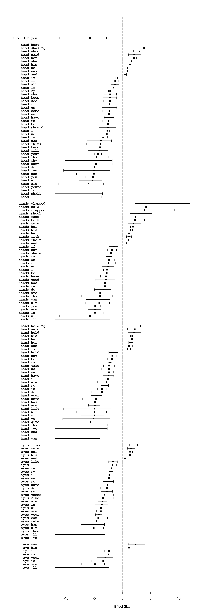
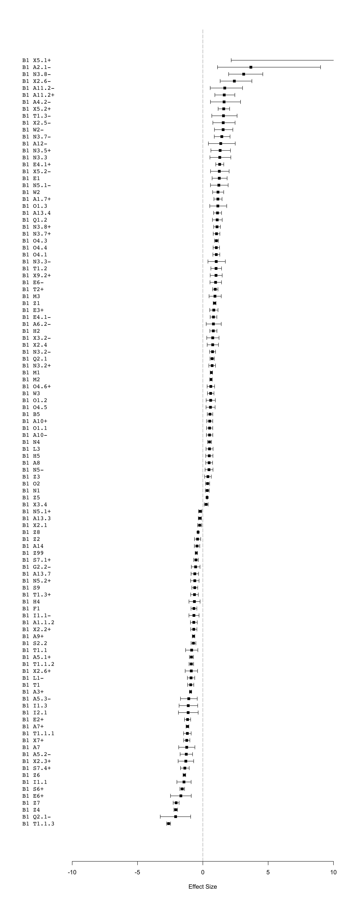

-   [Data](#data)
    -   [Get the corp\_text objects](#get-the-corp_text-objects)
    -   [Create a data.table where each column is a set of types for the
        tokens](#create-a-data.table-where-each-column-is-a-set-of-types-for-the-tokens)
    -   [Corpus size](#corpus-size)
-   [Unmatched tokens](#unmatched-tokens)
-   [Analysis: 1. Comparing manually chosen, specific body part terms +
    “lexical” collocates in ChiLit quotes
    vs. non-quotes](#analysis-1.-comparing-manually-chosen-specific-body-part-terms-lexical-collocates-in-chilit-quotes-vs.-non-quotes)
    -   [Figure 1: Plot of specific, manually chosen body part terms
        +“lexical” collocates in ChiLit quotes
        vs. non-quotes](#figure-1-plot-of-specific-manually-chosen-body-part-terms-lexical-collocates-in-chilit-quotes-vs.-non-quotes)
-   [Analysis: 2. Comparing B1 + all “lexical” collocates in ChiLit
    quotes
    vs. non-quotes](#analysis-2.-comparing-b1-all-lexical-collocates-in-chilit-quotes-vs.-non-quotes)
    -   [Number of (lexical) types & tokens in B1 &
        examples](#number-of-lexical-types-tokens-in-b1-examples)
        -   [Quotes](#quotes)
        -   [Non-quotes](#non-quotes)
    -   [Concordances of “lexical”
        collocates](#concordances-of-lexical-collocates)
        -   [Concordances: Non-quotes](#concordances-non-quotes)
        -   [Figure 2: Plot of B1 +“lexical” collocates in ChiLit quotes
            vs. non-quotes](#figure-2-plot-of-b1-lexical-collocates-in-chilit-quotes-vs.-non-quotes)
-   [Analysis: 3. Comparing B1 + all semantic types in ChiLit quotes
    vs. non-quotes](#analysis-3.-comparing-b1-all-semantic-types-in-chilit-quotes-vs.-non-quotes)
    -   [Figure 3: Plot of B1 + “semantic tag collocates” in ChiLit
        quotes
        vs. non-quotes](#figure-3-plot-of-b1-semantic-tag-collocates-in-chilit-quotes-vs.-non-quotes)
    -   [Concordances of semantic tag
        collocates](#concordances-of-semantic-tag-collocates)
        -   [Concordances of semantic tag collocates:
            Quotes](#concordances-of-semantic-tag-collocates-quotes)
        -   [Concordances of “semantic tag collocates”:
            Non-quotes](#concordances-of-semantic-tag-collocates-non-quotes)
-   [How this document was generated](#how-this-document-was-generated)

Data
====

Libraries

``` r
library(CorporaCoCo)
library(data.table)
library(stringi)
```

Get the corp\_text objects
--------------------------

``` r
quotes_files <- list.files("./api-output-sem-tagged/ChiLit/quote_corp_text_objects/", full.names = TRUE)
quotes_objects <- lapply(quotes_files, readRDS)
quotes_text <- corp_text_rbindlist(quotes_objects)

non_quotes_files <- list.files("./api-output-sem-tagged/ChiLit/nonquote_corp_text_objects/", full.names = TRUE)
non_quotes_objects <- lapply(non_quotes_files, readRDS)
non_quotes_text <- corp_text_rbindlist(non_quotes_objects)
```

Create a data.table where each column is a set of types for the tokens
----------------------------------------------------------------------

The loaded `corp_text` objects have the full semantic tags as the types

semantic\_tags  
keep whole of first tag, but not multipart or lowercase bits
e.g. `A1.1.1+`. Remove \[+-\]? to not keep the plus or minus.

lc\_tokens  
lowercased tokens

``` r
quotes_type_store <- data.frame(
    lc_tokens = tolower(quotes_text$tokens$token),
    semantic_tags = stri_extract_first(quotes_text$tokens$type, regex = "^([A-Z]\\d+(?:\\.\\d+)*[+-]?)"),
    stringsAsFactors = FALSE
)
non_quotes_type_store <- data.frame(
    lc_tokens = tolower(non_quotes_text$tokens$token),
    semantic_tags = stri_extract_first(non_quotes_text$tokens$type, regex = "^([A-Z]\\d+(?:\\.\\d+)*[+-]?)"),
    stringsAsFactors = FALSE
)
```

Corpus size
-----------

(Currently counts *b*)

Quotes

``` r
#Count tokens without the co-occurrence barriers (i.e. ssubset boundaries) _b_ (NA)
sum(quotes_text$tokens$token!="_b_", na.rm = TRUE)
```

    ## [1] 1647747

Non-quotes

``` r
#Count tokens without the co-occurrence barriers (i.e. ssubset boundaries) _b_ (NA)
sum(non_quotes_text$tokens$token!="_b_", na.rm = TRUE)
```

    ## [1] 2873848

Unmatched tokens
================

The Z99 tag contains “unmatched” tokens. These can be looked up like
this for the quotes (but take up a lot of space):

``` r
#a <- corp_type_lookup(quotes_text)
#a[type == "Z99"]$tokens
```

And like this for the nonquotes

``` r
#b <- corp_type_lookup(non_quotes_text)
# b[type == "Z99"]$tokens
```

Analysis: 1. Comparing manually chosen, specific body part terms + “lexical” collocates in ChiLit quotes vs. non-quotes
=======================================================================================================================

``` r
quotes_text$tokens$type <- with(quotes_type_store, lc_tokens)
quotes_text$tokens$type[is.na(quotes_type_store$semantic_tags)] <- NA  # reintroduce the cooccurence barriers
non_quotes_text$tokens$type <- with(non_quotes_type_store, lc_tokens)
non_quotes_text$tokens$type[is.na(non_quotes_type_store$semantic_tags)] <- NA  # reintroduce the cooccurence barriers

head(quotes_text$tokens, 20)
```

    ##     idx     type start end    token
    ##  1:   1     <NA>    13  15      _b_
    ##  2:   2     <NA>    17  19      _b_
    ##  3:   3     <NA>    21  23      _b_
    ##  4:   4     <NA>    25  27      _b_
    ##  5:   5     <NA>    29  31      _b_
    ##  6:   6      and    33  35      and
    ##  7:   7     what    37  40     what
    ##  8:   8       is    42  43       is
    ##  9:   9      the    45  47      the
    ## 10:  10      use    49  51      use
    ## 11:  11       of    53  54       of
    ## 12:  12        a    56  56        a
    ## 13:  13     book    58  61     book
    ## 14:  14     <NA>    63  65      _b_
    ## 15:  15     <NA>    67  69      _b_
    ## 16:  16     <NA>    71  73      _b_
    ## 17:  17     <NA>    75  77      _b_
    ## 18:  18     <NA>    79  81      _b_
    ## 19:  19  without    83  89  without
    ## 20:  20 pictures    91  98 pictures

``` r
head(non_quotes_text$tokens, 20)
```

    ##     idx      type start end     token
    ##  1:   1      <NA>    13  15       _b_
    ##  2:   2      <NA>    17  19       _b_
    ##  3:   3      <NA>    21  23       _b_
    ##  4:   4      <NA>    25  27       _b_
    ##  5:   5      <NA>    29  31       _b_
    ##  6:   6     alice    33  37     Alice
    ##  7:   7       was    39  41       was
    ##  8:   8 beginning    43  51 beginning
    ##  9:   9        to    53  54        to
    ## 10:  10       get    56  58       get
    ## 11:  11      very    60  63      very
    ## 12:  12     tired    65  69     tired
    ## 13:  13        of    71  72        of
    ## 14:  14   sitting    74  80   sitting
    ## 15:  15        by    82  83        by
    ## 16:  16       her    85  87       her
    ## 17:  17    sister    89  94    sister
    ## 18:  18        on    96  97        on
    ## 19:  19       the    99 101       the
    ## 20:  20      <NA>   103 105       _b_

``` r
# the set of nodes and collocates we are interested in
nodes <- c('eye', 'eyes', 'forehead', 'hand', 'hands', 'head', 'shoulder')
nodes
```

    ## [1] "eye"      "eyes"     "forehead" "hand"     "hands"    "head"     "shoulder"

``` r
#co-occurrences
quotes_surface <- corp_surface(quotes_text, span = "5LR", nodes = nodes)
non_quotes_surface <- corp_surface(non_quotes_text, span = "5LR", nodes = nodes)

# compare quotes vs. non-quotes
results <- corp_coco(quotes_surface, non_quotes_surface, nodes = nodes)
```

Figure 1: Plot of specific, manually chosen body part terms +“lexical” collocates in ChiLit quotes vs. non-quotes
-----------------------------------------------------------------------------------------------------------------

``` r
plot(results)
```



Analysis: 2. Comparing B1 + all “lexical” collocates in ChiLit quotes vs. non-quotes
====================================================================================

For this part, only the tag B1 is kept, all others are replaced by lower
case tokens. This means we are working with a version of the corpus
where only B1 semantic tags are present, whereas everything else is
shown as its original token form (but in lower case). This allows us to
see co-occurrences such as B1 + “rubbing”. If B1 co-occurred more
frequently with itself in one of the corpora, the co-occurrence pair B1
+ B1 would also show up (as all realizations of the tag B1 are disaplyed
as “B1” rather than their tokens at this stage).

``` r
quotes_text$tokens$type <- with(quotes_type_store, ifelse(grepl("^B1", semantic_tags), semantic_tags, lc_tokens))
quotes_text$tokens$type[is.na(quotes_type_store$semantic_tags)] <- NA  # reintroduce the cooccurence barriers
non_quotes_text$tokens$type <- with(non_quotes_type_store, ifelse(grepl("^B1", semantic_tags), semantic_tags, lc_tokens))
non_quotes_text$tokens$type[is.na(non_quotes_type_store$semantic_tags)] <- NA  # reintroduce the cooccurence barriers
```

Number of (lexical) types & tokens in B1 & examples
---------------------------------------------------

### Quotes

``` r
a <- corp_type_lookup(quotes_text)

# Number of tokens tagged as B1 in quotes
nrow(quotes_text$tokens[type=="B1"])
```

    ## [1] 12200

``` r
# Top 20 frequency of (lexical) types tagged as B1
freq_list <- (as.data.frame(sort(table(quotes_text$tokens[type=="B1"]$token), decreasing = TRUE)))
head(freq_list, 20)
```

    ##      Var1 Freq
    ## 1    head  734
    ## 2    eyes  584
    ## 3   heart  567
    ## 4    hand  482
    ## 5   hands  459
    ## 6   sleep  434
    ## 7    face  430
    ## 8   tired  290
    ## 9    feet  280
    ## 10   back  254
    ## 11   hair  233
    ## 12     to  226
    ## 13  blood  225
    ## 14   body  216
    ## 15 asleep  186
    ## 16   foot  185
    ## 17    eye  184
    ## 18   born  172
    ## 19   arms  170
    ## 20     go  157

``` r
# All "token types" tagged as B1 in quotes
unique(tolower(a[type == "B1"]$tokens))
```

    ## [1] "heads, ears, head, shoulders, feet, hair, ringlets, jaws, tired, tears, licking, face, hand, breath, tongue, throat, arm, heads, brain, limbs, bones, muscular, jaw, eye, nose, hands, sleep, neck, eyes, sneezes, asleep, breathe, wake, up, elbow, faces, hand, waist, bite, bone, mouths, soles, eyelids, toes, hearts, twinkling, heart, overslept, legs, hairs, sleeping, sleeps, leg, awake, woke, wakes, arms, teeth, born, fringe, bitten, cheek, marrow, bites, sleepy, nap, slept, go, to, bed, bit, biting, sneeze, lick, foot, sleep, nerves, back, sniffing, palms, palm-tree, beard, wake, go, rouse, went, brains, bite, noses, dozed, fingers, blood, organ, waking, crying, thirsty, hearts, lips, suck, skin, flesh, lungs, body, fallen, bleed, mouth, clots, breathing, forehead, licked, foreheads, flesh, muscle, joints, muscles, knee, hearing, lap, knees, ribs, whipping, bodies, snorted, champing, nostrils, shoulder, physically, sole, going, scarab, breast, on, all, fours, on, build, one-eyed, roused, ear, forefoot, bodily, blood, cheeks, tongues, snorting, panting, double-tongued, breast-pocket, palm, brow, tire, bone, finger, fast, skins, stomach, wakened, yawn, wrist, awoke, awakes, fore-feet, putting, my, down, fore-foot, birth, behind, ankle, veins, thongs, thong, foot-sore, skull, bleeding, ankles, insensible, spine, frowned, frown, backs, creepers, snap, tires, breathed, fall, tiring, looking, liver, snore, napping, blow, out, doze, off, corporal, tooth, swallowed, cell, limb, throats, thirst, wide, shivers, swallow, shin, nape, gizzard, skeleton, snout, thumbs, goes, waken, waked, erection, hold, his, tremulous, cells, fist, fists, blinking, chin, rousing, beat, tired, sniff, gone, tired, pulse, consciousness, look, held, their, shivering, nervous, system, stay, slumber, nerves, asleep, trimming, complexion, wrists, to, endurance, unconscious, hip, bronzed, chest, yawning, moustache, sleepless, three-legged, wakens, torpor, nerve, anatomy, pout, unready, sleepiness, sleepy, pulses, wakening, quaff, physical, put, shins, knuckles, nap, sole, backbone, hip, howler, half, skulls, sucking, blown, neck-and-neck, elbows, perspiration, howlers, scowl, snoring, gnaw, heel, round, born, bloods, scutcheon, fang, fang, necks, lash, reveille, numb, thigh, phalanx, turpin, hands, collar-bone, gasp, gasped, put, crying, appendage, bosom, falls, stomach-ache, agile, spit, snooze, sneezed, thirsting, leotard, haunch, gnawing, tear, unwind, fanny, finger-tips, nocturnal, stomach-aches, oculi, weed, slobbering, frowning, brows, neck, thumb, freckles, gasping, head, shanks, invisibleness, scalps, scalp, breathing-time, quaffed, secreted, antlers, dung, calving, calve, calved, bled, entrails, tanned, breathes, sweat, bleeds, palate, lie, in, necks, perspire, snores, toe, tic, tum, drowsiness, orbs, unwound, thirst, things, mouth, head, tears, hands, spitting, bald, chests, sleeps, thumb, blood-shot, lashes, black-puddings, slumbers, shivered, bodily, appendages, work, wisdom, eyes, tissue, back, swallows, skeletons, coprolites, chiffoniers, skeleton, lung, feet, skinned, bellies, hind-end, belly, body, lug, tip-toe, sleeped, wee, lies, droppings, stomachs, breathless, sinews, bowels, secrete, slumbered, sniffed, tush, livers, scowling, lip, snout, mustache, magnifying-glass, steeple-chase, beats, spittle, fingers, tics, eyelid, swallow, beating, drowsy, spits, sniffling, snort, hair, blink, breaths, noses, swallowing, thumb-nail, pore, thirstier, lobes, falling, profile, tiptoe, tears, snouts, snored, laps, looked, waists, nasal, snoring, chins, slumbering, awake, moles, in, fishbone, fishbones, mole, remora, agility, palm-trees, sleeping, lay't, toes, soles, mustachios, hair's-breadth, breathe, breastbone, gore, unsay, gut, willies, nimble, swallows, winced, eyebrows, trimmed, sinew, eyelashes, visage, pulse, slept, gall, nimbly, sucked, antlered, orb, poo, poo, appanage, wince, hunchback, wakenin', breathin', blood-vessel, straight-legged, knock-kneed, sucking-pig, gulps, nipple, breasts, eye, teeth, one-eyed, unborn, scalp, prickles, bust, bowels, blows, licks, sweated, teething, cock-fighting, knuckled, cheek, membranes, lickings, corporal, blear-eyed, hiccough, dewlap, borned, blue-eyed, kidneys, pores, numbed, wakin', ticker, hilltop, knuckle, collation, free, lips, bited, body, backs, tummy, holding, your, back, inhaling, pore, hips, collar-bones, lupus, skinny, hand-hold, blinks, numbing, bones, shiver, palm, marlin-spike, cat's-eye, pins, and, needles, ear, faces, liver, moue, breasts, fanged, codicil, headless, headless, complexions, give, rouses, rouse, mole, things, eyelash, buttock, rump, ankle, pasterns, nerved, cuirass, escutcheon, dozing, gnawed, benumbed, spines, spitted, rib, crow's-feet, yawned"

### Non-quotes

``` r
b <- corp_type_lookup(non_quotes_text)

# Number of tokens tagged as B1 in non-quotes
nrow(non_quotes_text$tokens[type=="B1"])
```

    ## [1] 40274

``` r
# Top 20 frequency of (lexical) types tagged as B1
freq_list <- (as.data.frame(sort(table(non_quotes_text$tokens[type=="B1"]$token), decreasing = TRUE)))
head(freq_list, 20)
```

    ##        Var1 Freq
    ## 1      eyes 2741
    ## 2      face 2606
    ## 3      head 2598
    ## 4      hand 2427
    ## 5      feet 1405
    ## 6     hands 1377
    ## 7     heart 1252
    ## 8      arms  987
    ## 9      hair  762
    ## 10     back  728
    ## 11      arm  726
    ## 12     foot  677
    ## 13    tears  631
    ## 14    sleep  613
    ## 15    mouth  593
    ## 16     body  570
    ## 17      eye  548
    ## 18   asleep  475
    ## 19 shoulder  450
    ## 20     neck  447

``` r
# All "token types" tagged as B1 in non-quotes
unique(tolower(b[type == "B1"]$tokens))
```

    ## [1] "tired, sleepy, eyes, feet, dozing, off, three-legged, head, neck, finger, bleeds, face, blown, out, legs, tears, ears, eye, hand, foot, lap, hands, foot, chin, shiver, frowning, panting, forehead, lips, elbow, arm, swallowed, back, tongue, mouth, tiptoe, arms, swallowing, hearing, yawned, swallow, shoulders, knuckles, hair, heads, sneezing, nose, sneezed, sneeze, ear, snorting, snout, teeth, fast, asleep, elbows, sleep, shoulder, hearts, yawning, doze, woke, up, faces, hearts, hearts, backs, knee, body, heart, cheeks, mouths, breath, tremulous, panted, bit, barefooted, spareness, puckered, tear, licked, fingers, barefoot, ankles, cheek, awake, breast, roused, drowsy, sleeping, waking, awaking, eyelids, skin, knees, sniffing, throat, brain, limbs, consciousness, slept, drowsiness, fall, slumber, awoke, palm, going, to, sniffed, endurance, soles, heel, leg, numbness, half, contraction, nap, breathing, breathless, licking, quavering, benumbed, falling, wide, go, bed, chest, shoeless, crying, blood, chiffonier, fringe, bite, went, snuggling, down, blow, noses, chins, frowned, blinked, tanned, skins, waist, lip, flesh, palms, thirsting, foreheads, breathed, skinny, chest-of-drawers, beards, hairs, gasping, rouse, muscles, blinking, bones, snorted, marrows, armlets, thumb, held, their, gasped, breaths, scowled, eyelid, wake, complexions, lashes, necks, waists, palm-trees, snorts, bites, shivering, born, frowns, sucking, scowling, beard, snort, nostrils, nostril, things, jaw, breathe, pant, lungs, bled, sweat, muscle, wrist, joint, steeplechase, insensible, gone, whipping, knuckling, ribs, hips, fist, thirsty, gulp, stomachs, nerve, bodies, knuckled, joints, belly, limb, numb, put, my, lapping, complexion, course, eyebrows, wincing, dimples, unconscious, gasp, guttural, chests, brows, profiles, creepers, scarab, slumbering, thumbs, nerves, unwound, in, palate, one-eyed, skeleton, shivered, hind-quarters, invisibility, biting, fists, tissue, sucked, giving, birth, bone, agility, erection, bitten, ankle, muscular, scalp-lock, bleed, stomach, thongs, tiring, on, all, fours, staying, tiptoes, toes, ringlets, tongues, pulse, face, build, flabby, forefoot, brow, his, perspiration, unrefreshed, intestine, cell, room, sleepless, guardroom, nucleus, spine, bone, thirst, panting, throats, appendages, foot, infantryman, fangs, firm, hill-tops, bosom, overslept, visage, slumbers, spitting, bodily, jaws, eye-brows, spluttering, cells, pitchfork, snoring, haunch, skeletons, yawn, veins, tip-toe, breasts, fertility, sperm, shins, suck, brains, skull, agile, frown, thigh, bronzed, moustache, spit, eyeballs, eye-lids, eye-ball, tire, breasting, eye-balls, palm-tree, tendon, insteps, physical, blood, girt, skulls, bosoms, nerved, wrists, bald, splutter, spluttered, pore, nimble, free, wakened, her, looked, digits, wee, body, gasps, beat, waked, coeur, feelers, gulping, eyed, sleepiness, looking, profile, breathings, eyelashes, fanny, busts, appendage, gulps, thinness, swallows, wakening, nimbly, waken, heart, sallowness, pucker, hand, rousing, bodies, unsay, freckled, unsaying, shoulder-blades, puckers, lankiness, eyebrow, lay, blue-eyed, tears, wince, unrolling, respiration, torpor, hands, physically, reflex, phalanx, knuckle, gnawing, jowl, blood-vessel, organ, ear-drums, bleeding, perspired, sucks, scowl, gulped, perspiring, unconscious, round, dactyls, spondees, numbed, eyes, cusp, beard, wakes, hair-cloth, fore-feet, winced, slumbered, guard-room, stolidity, thong, corslets, corslet, collar-bone, dozed, scaler, collation, pouting, unborn, lash, bladders, bleedings, fallen, yawns, escutcheon, stayed, lick, tooth, blink, lapped, twinkling, snored, snore, asleep, head, mole, moles, hair-shirt, emaciated, finger-tips, exigent, pursed, quaffed, waking, sleeping, thirsted, tan, champing, spines, leotard, wakefulness, nocturnal, vertebra, snuggle, antlers, two-handed, keen-eyed, mis, shivers, mustachios, snores, tibia, vein, blowing, well-built, secreting, knee-cap, inhaled, snapping, tired, laps, orb, goes, thirstier, holding, its, pins, and, needles, tiredness, laps, snuggled, cuirass, foot-rule, mustache, creeper, breathless, scalp, scalps, sniff, bowels, hand-saw, calved, bellies, headless, class, puckering, orbs, nervous, system, dna, dna, proboscis, foot-soldiers, eyes, awakenings, disembowelled, sniffing, kidney, drowsing, sleep, cuticle, hiccough, molar, spinal, shanks, teres, bladder, pitchforks, liver, cadaverous, tires, gnaw, hair, physical, gnawed, marrow, pores, prickles, fringes, warm-blooded, cachalots, backbones, backbone, guano, thighs, breathes, hold, your, coprolites, anatomy, gristle, dumpiness, goose-skin, pulses, tush, hilltop, feet, tongue, gore, uncoiling, goring, wake, wee, asleep, catnaps, neck, lunged, fore-foot, snortings, toe, thirstiest, bare-foot, back, beating, hill-top, snapped, under-lip, shiverings, hip, pouted, thumb, thumb, sleeps, snout, arms, nerving, sweating, breast-bone, thumbnail, sole, dimple, half-asleep, balder, sweaty, fingertips, fish-bones, exhalations, shoulder-blade, cheek-bone, hair's-breadth, travel-worn, snouts, spidery, thigh-bone, big, bloodshot, spitted, spat, spittle, spits, forefeet, skinniness, clots, haired, squat, buttocks, sweated, licks, nimblest, unwinding, snoring, rib, mouths, bellied, lunging, baldness, hair., remora, swallow, swallows, marrow-bones, breast, mealies, napping, artery, secreted, womb, antennae, physique, moustaches, skinned, awakening, hamstringing, hamstrings, lung, appendix, sleepier, sniffling, crying, eyelash, thing, ocular, exhales, ligaments, fertilization, respiring, tired, freckles, moustachios, head, eye, hunchback, secrete, our, harmonium, breath, chest, finger-nail, dibble, wetted, himself, rouses, fertilising, nipple, breasts, mealie, rumps, droppings, belched, organs, leg-bones, breathing-space, gave, phalanxes, vertebrae, anatomical, behind, on, hiccups, jaw, hiccoughed, trouser-leg, nape, mustaches, cock-fighting, instep, furrowing, eye-brow, shin, drowsed, turnspit, unwind, croaky, boned, turpin, fusiliers, wetting, themselves, cheekbone, shoulder., biceps, kidneys, mitts, ear, siesta, underlip, putting, scowls, well-endowed, elbow, steeple-chase, breathing-time, thirst, lickings, bile, hilltops, forearm, bones, armpit, gaskin, lipping, ringlet, swig, thumb-nail, legs, births, cat's-eye, haircloth, hair, metamorphosis, crucial, passages, awakenings, lie, awoke, knees, sniffled, moles, bleedings, ventricles, stomach-aches, gastrocnemius, anatomists, bloods, heads, drowsy, pimples, somnolence, mole, furrowed, guardrooms, corselet, sleep-walking, awaker, woke, cuirasses, coeur, visages, gnawn, pout, creepers, napped, sinews, denuded"

``` r
# the set of nodes and collocates we are interested in
nodes <- unique(grep("^B1", c(quotes_text$tokens$type, non_quotes_text$tokens$type), value = TRUE))
nodes
```

    ## [1] "B1"

``` r
#co-occurrences
quotes_surface <- corp_surface(quotes_text, span = "5LR", nodes = nodes)
non_quotes_surface <- corp_surface(non_quotes_text, span = "5LR", nodes = nodes)

# compare
results <- corp_coco(quotes_surface, non_quotes_surface, nodes = nodes)
```

Concordances of “lexical” collocates
------------------------------------

These are concordances of the B1 tag with specific “lexical” collocates
(e.g. “rubbing”) - chosen from the plot. At this point we are mainly
interested in the collocates of body part terms/the B1 tag in
non-quotes, so have created concordances for this corpus only.

### Concordances: Non-quotes

``` r
# replied
y <- corp_concordance(non_quotes_surface, nodes = nodes, collocates= c("replied"), context = 0)
y
```

    ## [ 1]              --- he *replied* by shaking his    head    in _b_ _b_ _b_ _b_ ---                    
    ## [ 2]                --- _b_ _b_ _b_ _b_ *replied*    Bone    _b_ _b_ _b_ _b_ _b_ ---                   
    ## [ 3]             --- _b_ *replied* John, with his    mouth   full _b_ _b_ _b_ _b_ ---                  
    ## [ 4]               --- last *replied* in the same   tongue   _b_ _b_ _b_ _b_ _b_ ---                   
    ## [ 5]             --- _b_ I *replied*, stroking my    chin    _b_ _b_ _b_ _b_ _b_ ---                   
    ## [ 6]        --- _b_ _b_ *replied* Peterkin, whose    face    was pale as death _b_ ---                 
    ## [ 7]                 --- _b_ *replied* Jack, in a  tremulous voice _b_ _b_ _b_ _b_ ---                 
    ## [ 8]         --- *replied* Hugh, casting down his    eyes    _b_ _b_ _b_ _b_ _b_ ---                   
    ## [ 9]               --- _b_ _b_ Griselda shook her    head    as she *replied* _b_ _b_ ---              
    ## [10]                      --- _b_ _b_ _b_ _b_ His    face    flushed as he *replied* slowly ---        
    ## [11]           --- pause, till Simon, plucking up    heart  , *replied* _b_ _b_ _b_ _b_ ---            
    ## [12]         --- sacred charge to such unhallowed    hands  , *replied* _b_ _b_ _b_ _b_ ---            
    ## [13]            --- _b_ *replied* Osmond, and the    head    of another Frank _b_ _b_ ---              
    ## [14]         --- *replied* he, still clasping her    hand    _b_ _b_ _b_ _b_ _b_ ---                   
    ## [15]       --- _b_ *replied* Edward, grinding his    teeth   _b_ _b_ _b_ _b_ _b_ ---                   
    ## [16]         --- _b_ *replied* he, with streaming    eyes    _b_ _b_ _b_ _b_ _b_ ---                   
    ## [17]          --- _b_ *replied* Pablo, coming out    half    asleep _b_ _b_ _b_ _b_ ---                
    ## [18]         --- *replied* Pablo, coming out half   asleep   _b_ _b_ _b_ _b_ _b_ ---                   
    ## [19]                --- called and called, but no   sleepy   voice *replied*. Susan, indeed, knew ---  
    ## [20]            --- _b_ _b_ *replied* Laura, with    tears   in her eyes _b_ _b_ ---                   
    ## [21]      --- _b_ *replied* Jessica, smacking her    lips    _b_ _b_ _b_ _b_ _b_ ---                   
    ## [22]                    --- _b_ The man shook his    head    as he *replied*, though also ---          
    ## [23]       --- _b_ *replied* Ready, extending his    hand    _b_ _b_ _b_ _b_ _b_ ---                   
    ## [24]          --- _b_ *replied* Ready, wiping his    face    _b_ _b_ _b_ _b_ _b_ ---                   
    ## [25]        --- _b_ *replied* William, wiping his    face    with his handkerchief _b_ _b_ ---         
    ## [26]          --- _b_ *replied* William, with his     eye    to the glass. At _b_ ---                  
    ## [27]        --- Hook *replied* slowly through his    teeth   _b_ _b_ _b_ _b_ _b_ ---                   
    ## [28]            --- she *replied*, looking in his    face    _b_ _b_ _b_ _b_ _b_ ---                   
    ## [29]      --- *replied* the little Frenchman, his    eyes    still fixed upon _b_ _b_ ---              
    ## [30]                  --- his mail shirt next his    skin   . He *replied* that he _b_ ---             
    ## [31]                  --- *replied* by a flood of    tears  , ungovernable from the exhaustion _b_ --- 
    ## [32]        --- additional twist to his corkscrew moustaches, and *replied* with perfect _b_ ---       
    ## [33] --- *replied* Janet Sheepshanks, shaking her    head    _b_ _b_ _b_ _b_ _b_ ---                   
    ## [34]                      --- _b_ _b_ _b_ _b_ _b_    feet    two inches, and *replied* with ---

``` r
# returned
y <- corp_concordance(non_quotes_surface, nodes = nodes, collocates= c("returned"), context = 0)
y
```

    ## [ 1]           --- *returned* to his chair, his    head    shaking a good deal before ---               
    ## [ 2]             --- *returned* from my work my    neck    and chest were strained and ---              
    ## [ 3]                    --- on the floor with a  guttural  grunt and *returned* _b_ _b_ ---             
    ## [ 4]     --- *returned*, bringing with them the    skins   of _b_ _b_ _b_ _b_ ---                       
    ## [ 5]                    --- _b_ _b_ Then, as my   waking   senses quite *returned*, I started. ---      
    ## [ 6]      --- he *returned* home with blackened    eyes    and bruised face; for _b_ ---                
    ## [ 7]                 --- The next day, the main    body    of the British force *returned* ---          
    ## [ 8]        --- time he *returned* everybody 's    eyes    _b_ _b_ _b_ _b_ _b_ ---                      
    ## [ 9]                    --- _b_ _b_ _b_ _b_ _b_     eye    that had not *returned* to ---               
    ## [10]       --- sent, and repose *returned*, but   hearts   beat _b_ _b_ _b_ _b_ ---                     
    ## [11]               --- she ventured to take her    hand   , and Margaret *returned* the caress, ---     
    ## [12]   --- forward, when Osmond *returned*, his    face    showing, at a glance, that ---               
    ## [13]       --- *returned* from St. Catherine 's    Head   . It was _b_ _b_ _b_ ---                      
    ## [14]            --- _b_ _b_ _b_ *returned*; his    eyes    were lifted to the gloaming ---              
    ## [15]                  --- sell the bull and the    skin   , and *returned* home well _b_ ---            
    ## [16]                     --- _b_ _b_ _b_ on her    cheek  ; then she *returned* to her ---              
    ## [17]              --- punching him in the short    ribs   . So that Harold *returned* to ---            
    ## [18]      --- whence we *returned* toilfully on    foot   , _b_ _b_ _b_ _b_ _b_ ---                     
    ## [19]                 --- a small kitchen at the    back    and *returned* quickly with some ---         
    ## [20]            --- *returned* upon him; he sat  frowning  and biting his _b_ _b_ ---                   
    ## [21]    --- *returned*, Leila observed that her    eyes    were full _b_ _b_ _b_ ---                    
    ## [22]              --- and *returned* wet to the    skin   . The storm continued _b_ _b_ ---             
    ## [23]           --- in a few minutes *returned*, breathless, stating that the women _b_ ---              
    ## [24]            --- thin hand between his. When    Thumb   and Thimble *returned* with their ---        
    ## [25]  --- double rows, the mousey Earth-mulgars    slept  . He *returned* to _b_ _b_ ---                
    ## [26]           --- was agreed between them. And    Thumb   and Nod *returned* _b_ _b_ ---               
    ## [27]                    --- _b_ _b_ _b_ _b_ _b_    hand   , so she slowly *returned* her ---            
    ## [28]           --- so she slowly *returned* her    face    to where it had been ---                     
    ## [29]                     --- _b_ _b_ one of her    feet   . But she instantly *returned* it ---         
    ## [30]               --- _b_ _b_ laved my fevered    head    and hands, I *returned*, and ---             
    ## [31]              --- laved my fevered head and    hands  , I *returned*, and the Zulu ---              
    ## [32]       --- mystified her. She *returned* on   tip-toe  _b_ _b_ _b_ _b_ _b_ ---                      
    ## [33]        --- _b_ *returned* Amy, resting her  forehead  on _b_ _b_ _b_ _b_ ---                       
    ## [34]             --- _b_ pink *returned* to her    cheek  , and the length of walk ---                  
    ## [35]     --- *returned* Lord Robert, laying his    hand    _b_ _b_ _b_ _b_ _b_ ---                      
    ## [36]              --- window and waved her lily    hand    as they approached. They *returned* ---      
    ## [37]              --- *returned*. It went to my    heart   to leave such things as ---                  
    ## [38]                    --- _b_ _b_ _b_ _b_ The    Head    *returned* next day without explanation, --- 
    ## [39]  --- slow-moving Hogan, as they *returned*    arms    _b_ _b_ _b_ _b_ _b_ ---                      
    ## [40]            --- another hour, and again his   thirst   *returned*; _b_ _b_ _b_ _b_ ---              
    ## [41] --- *returned* the captain, scratching his    head    _b_ _b_ _b_ _b_ _b_ ---                      
    ## [42]              --- _b_ _b_ crossing, and the    hand    *returned* only to grasp its ---             
    ## [43]     --- _b_ *returned* Joseph, throwing an     arm    round his horse 's neck ---                  
    ## [44]       --- _b_ _b_ Cuthbert *returned* home    tired  , but delighted with his day ---              
    ## [45]                --- _b_ _b_ length upon his    back   . The crow *returned* once more ---

``` r
# cried
y <- corp_concordance(non_quotes_surface, nodes = nodes, collocates= c("cried"), context = 0)
y
```

    ## [  1]              --- _b_ _b_ *cried* Tony, his    eyes    glistening _b_ _b_ _b_ _b_ ---         
    ## [  2]              --- _b_ _b_ *cried* Tony, his    eyes    growing bright _b_ _b_ _b_ ---         
    ## [  3]              --- _b_ *cried* the lady, the    tears   now running down her face ---          
    ## [  4]             --- _b_ _b_ *cried* Cyril, now   roused   at last from _b_ _b_ ---               
    ## [  5]            --- *cried* Robert, and put his    foot    on a centipede _b_ _b_ ---             
    ## [  6]    --- *cried* Sylvia, clasping her pretty    hands   _b_ _b_ _b_ _b_ _b_ ---                
    ## [  7]   --- *cried* Horace, hardly believing his    ears    _b_ _b_ _b_ _b_ _b_ ---                
    ## [  8]        --- hostile force, threw down their    arms    and *cried* _b_ _b_ _b_ ---            
    ## [  9]      --- _b_ *cried* Peterkin, shaking his    fist    at the bird. Then he ---               
    ## [ 10]          --- _b_ _b_ *cried* Peterkin, his    eyes    flashing with excitement _b_ _b_ ---   
    ## [ 11]               --- _b_ *cried* I, laying my    hand    on his shoulder _b_ _b_ ---            
    ## [ 12]       --- _b_ *cried* Peterkin, waving his    hand    _b_ _b_ _b_ _b_ _b_ ---                
    ## [ 13]      --- _b_ *cried* Peterkin, shading his    eyes    with his hand _b_ _b_ ---              
    ## [ 14]           --- *cried* Hugh, holding up his    head    _b_ _b_ _b_ _b_ _b_ ---                
    ## [ 15]                --- 's head, and pulled his    hair   , till Hugh *cried* _b_ _b_ ---         
    ## [ 16]           --- that Hugh *cried* himself to    sleep  . His uncle _b_ _b_ _b_ ---             
    ## [ 17]          --- *cried* Hugh, starting to his    feet    _b_ _b_ _b_ _b_ _b_ ---                
    ## [ 18]            --- _b_ _b_ *cried* Agnes, with    tears   in her eyes, and the ---               
    ## [ 19]          --- _b_ _b_ *cried* Griselda, her    eyes    sparkling _b_ _b_ _b_ _b_ ---          
    ## [ 20]                  --- _b_ *cried* she, in a breathless voice of transport _b_ _b_ ---         
    ## [ 21]        --- _b_ *cried* Ethel, clasping her    hands   _b_ _b_ _b_ _b_ _b_ ---                
    ## [ 22]                --- _b_ Harry laid down his    head    and *cried*; Margaret could not ---    
    ## [ 23]                   --- _b_ _b_ _b_ her soft    heart   giving way, she *cried* quite ---      
    ## [ 24]       --- *cried* Margaret, wiping off her    tears  . Ethel stood a moment _b_ ---          
    ## [ 25]       --- _b_ *cried* Wraysford, with pale    face    and in _b_ _b_ _b_ ---                 
    ## [ 26] --- faintly *cried* Christina with sobbing   breath   _b_ _b_ _b_ _b_ _b_ ---                
    ## [ 27]         --- _b_ _b_ *cried* Christina, her    eyes    brightening _b_ _b_ _b_ _b_ ---        
    ## [ 28]  --- *cried* Wildschloss, grasping Ebbo 's     arm    _b_ _b_ _b_ _b_ _b_ ---                
    ## [ 29]                     --- by the side of the  sleeping  dragon, and *cried*. _b_ _b_ ---       
    ## [ 30]      --- *cried* Richard, drawing back his    hand    in a sort of agony, ---                
    ## [ 31]             --- _b_ _b_ *cried* himself to    sleep  . Richard lay awake, sorrowful, and --- 
    ## [ 32]                --- _b_ _b_ _b_ Raising his    head   , he *cried* wildly _b_ _b_ ---         
    ## [ 33]          --- *cried*, seizing both Eric 's    hands   _b_ _b_ _b_ _b_ _b_ ---                
    ## [ 34]                  --- and folded him to his    heart  , they *cried* in silence, until ---    
    ## [ 35]             --- other boy *cried*, or even   winced  ; a few sharp cuts was ---              
    ## [ 36]                    --- _b_ _b_ _b_ _b_ the    head    with it, and then *cried* ---          
    ## [ 37]                     --- _b_ _b_ who in his    sleep   had *cried* out _b_ _b_ ---            
    ## [ 38]                 --- Willis 's voice -- her    heart   *cried* out for them, at ---           
    ## [ 39]       --- *cried* Medea, throwing wide her    arms    with abandonment _b_ _b_ _b_ ---       
    ## [ 40]             --- _b_ _b_ _b_ *cried* Laura,   panting  for breath, while she looked ---       
    ## [ 41]         --- _b_ *cried* Laura, panting for   breath  , while she looked both _b_ ---         
    ## [ 42]              --- _b_ he *cried*, while the    tears   rolled down his _b_ _b_ ---            
    ## [ 43]                   --- _b_ and he bowed his    head    upon his hands, and *cried*, ---       
    ## [ 44]                --- bowed his head upon his    hands  , and *cried*, in the depths ---        
    ## [ 45]                  --- _b_ _b_ _b_ mother 's    arms   , she *cried* _b_ _b_ _b_ ---           
    ## [ 46]              --- and *cried* as though his    heart   would break; and he _b_ ---            
    ## [ 47]              --- down and *cried* till the    tears   rolled off his whiskers _b_ ---        
    ## [ 48]              --- *cried* out in the Gaelic   tongue  , and laughed. But the boat ---         
    ## [ 49]          --- the old gentleman clapped his    hand    to his brow, and *cried* ---           
    ## [ 50]                --- clapped his hand to his    brow   , and *cried* out _b_ _b_ ---           
    ## [ 51]             --- with patches of white; his   breath   *cried* and whistled as it ---         
    ## [ 52]              --- _b_ _b_ *cried* Alan, the    blood   starting to his face _b_ ---           
    ## [ 53]                 --- arms round her papa 's    neck   , she *cried* _b_ _b_ _b_ ---           
    ## [ 54]           --- she *cried*, as throwing her    arms    round his neck, she _b_ ---            
    ## [ 55]          --- _b_ *cried* Juno, rubbing her     leg   . _b_ _b_ _b_ _b_ _b_ ---               
    ## [ 56]      --- *cried* Mr Seagrave, covering his    face    with his _b_ _b_ _b_ ---               
    ## [ 57]           --- of thunder, and the children    awoke   and *cried* with fright, till ---      
    ## [ 58]       --- _b_ prevented them obtaining any    sleep  . The children *cried* and trembled --- 
    ## [ 59]          --- *cried* Tommy, sobbing as the    blood   ran out of _b_ _b_ ---                 
    ## [ 60]                    --- face in the baby 's    neck   , she *cried*, whether for _b_ ---      
    ## [ 61]                    --- _b_ _b_ _b_ _b_ _b_    hands  , and *cried* _b_ _b_ _b_ ---           
    ## [ 62]                    --- _b_ Then he took to  scowling , and *cried* in an angry ---           
    ## [ 63]                    --- _b_ _b_ _b_ _b_ _b_    eyes   , and *cried* together _b_ _b_ ---      
    ## [ 64]                 --- she only hung down her    head    and *cried* _b_ _b_ _b_ ---            
    ## [ 65]                    --- _b_ _b_ _b_ _b_ _b_   crying  , and the fair slave *cried* ---        
    ## [ 66]                    --- _b_ _b_ _b_ _b_ _b_    snout   and *cried* in a loud ---              
    ## [ 67]    --- *cried* Thimble in triumph, leaning breathless on his _b_ _b_ _b_ ---                 
    ## [ 68]                    --- _b_ _b_ _b_ _b_ _b_    Thumb   *cried* _b_ _b_ _b_ _b_ ---            
    ## [ 69]                  --- and *cried* as if his    heart   _b_ _b_ _b_ _b_ _b_ ---                
    ## [ 70]                    --- put her hand to her    heart   and *cried* _b_ _b_ _b_ ---            
    ## [ 71]            --- she *cried*, though Tink 's    face    was still distorted with passion ---   
    ## [ 72]                 --- _b_ Almost in the same   breath   they *cried* _b_ _b_ _b_ ---           
    ## [ 73]           --- knees, and holding out their    arms    *cried* _b_ _b_ _b_ _b_ ---            
    ## [ 74]                 --- _b_ _b_ *cried* in his    sleep   for a long time, and ---               
    ## [ 75]                    --- _b_ _b_ _b_ king 's    neck   , she *cried* _b_ _b_ _b_ ---           
    ## [ 76]                --- _b_ _b_ _b_ *cried* the   Swallow , but nobody minded, and when ---       
    ## [ 77]          --- he *cried*, and his beautiful    eyes    filled _b_ _b_ _b_ _b_ ---             
    ## [ 78]   --- princess *cried*, stretching out her    arms    to him _b_ _b_ _b_ ---                 
    ## [ 79]             --- she halted, and laying her    hand    on it, she *cried* out ---             
    ## [ 80]                   --- _b_ _b_ _b_ _b_ long   breaths . Then suddenly he *cried* _b_ ---      
    ## [ 81]           --- *cried* Bobbie, with a white    face    _b_ _b_ _b_ _b_ _b_ ---                
    ## [ 82]                --- chain was put round her    neck   , she *cried* out _b_ _b_ ---           
    ## [ 83]       --- *cried* Charles, drumming on the    back    of his sofa _b_ _b_ ---                
    ## [ 84]                 --- _b_ _b_ Laura laid her    head    on her shoulder, and *cried*. ---      
    ## [ 85]                   --- laid her head on her  shoulder , and *cried*. It was a ---             
    ## [ 86]  --- nothing. Mary alternately *cried* and    slept   through the hours. She _b_ ---         
    ## [ 87]          --- *cried* Martha with wide open    eyes    _b_ _b_ _b_ _b_ _b_ ---                
    ## [ 88]             --- _b_ *cried* Colin, and his    eyes    began to _b_ _b_ _b_ ---               
    ## [ 89]                --- _b_ he *cried*, and his    eyes    were as big as the ---                 
    ## [ 90]             --- then our robber rubbed his    hands   and laughed, and *cried* _b_ ---       
    ## [ 91]                    --- _b_ _b_ _b_ _b_ _b_    arms    and *cried* _b_ _b_ _b_ ---            
    ## [ 92]                   --- _b_ _b_ _b_ down his    head    on his arms, and *cried* ---           
    ## [ 93]                   --- down his head on his    arms   , and *cried* bitterly _b_ _b_ ---      
    ## [ 94]             --- The girl Foulata wrung her    hands   in anguish, and *cried* out ---        
    ## [ 95]     --- others threw themselves upon their    knees   and *cried* aloud. As for ---          
    ## [ 96]           --- *cried* Stalky, white to the    lips   , _b_ _b_ _b_ _b_ _b_ ---               
    ## [ 97]               --- _b_ _b_ he stretched his    arms    to Hans, and *cried* feebly ---        
    ## [ 98]           --- _b_ _b_ figure stretched its    arms    to him, and *cried* for ---            
    ## [ 99]          --- *cried* Hugh, starting to his    feet   . _b_ _b_ _b_ _b_ _b_ ---               
    ## [100]               --- _b_ John never *cried* a    tear   , which was the bitterest drop ---      
    ## [101]          --- the first time *cried* bitter    tears  , _b_ _b_ _b_ _b_ _b_ ---               
    ## [102]        --- _b_ *cried* Janet, clasping her    hands   in _b_ _b_ _b_ _b_ ---                 
    ## [103]            --- _b_ *cried* Prissy over her  shoulder , with a sweet and _b_ ---              
    ## [104]             --- _b_ _b_ *cried* old Betty,   waking   up hastily from her _b_ ---            
    ## [105]          --- _b_ *cried* old Betty, waking     up     hastily from her _b_ _b_ ---           
    ## [106]         --- _b_ Livesey fairly slapped his    thigh  , and the squire *cried* _b_ ---        
    ## [107]             --- *cried* out aloud when our    eyes    met, but while mine _b_ ---            
    ## [108]        --- *cried* the accused, wiping the    sweat   from his _b_ _b_ _b_ ---               
    ## [109]          --- _b_ _b_ *cried* Silver, broad    awake   _b_ _b_ _b_ _b_ _b_ ---                
    ## [110]            --- she *cried*, and flung both    arms    round the cradle. The Prince ---       
    ## [111]         --- The poor Princess *cried* with  tiredness; _b_ _b_ _b_ _b_ _b_ ---               
    ## [112]             --- and she *cried* herself to    sleep   o' _b_ _b_ _b_ _b_ ---                 
    ## [113]    --- *cried* Melisande, falling into his    arms    _b_ _b_ _b_ _b_ _b_ ---                
    ## [114]             --- _b_ _b_ *cried* himself to    sleep   again almost immediately. _b_ _b_ ---  
    ## [115]                    --- _b_ _b_ _b_ _b_ his    neck   , and *cried* piteously on his ---      
    ## [116]           --- and *cried* piteously on his  shoulder  _b_ _b_ _b_ _b_ _b_ ---                
    ## [117]         --- _b_ _b_ *cried* Mr. Bultitude,   panting  and _b_ _b_ _b_ _b_ ---                
    ## [118]              --- _b_ _b_ _b_ *cried* Paul,   roused   from his apathy; and he ---            
    ## [119]         --- *cried* the other, shaking her    head    _b_ _b_ _b_ _b_ _b_ ---                
    ## [120]              --- the sea, and *cried* salt    tears   from sheer _b_ _b_ _b_ ---             
    ## [121]        --- they all *cried*, pulling their   thumbs   _b_ _b_ _b_ _b_ _b_ ---                
    ## [122]                  --- _b_ _b_ and waved her    hand    to Tom, and *cried* _b_ ---            
    ## [123]       --- *cried* Toad, trembling in every    limb    _b_ _b_ _b_ _b_ _b_ ---                
    ## [124]              --- _b_ *cried* the Mole, his    face    beaming _b_ _b_ _b_ _b_ ---            
    ## [125]                 --- fell down and hurt his     arm   . He *cried* a little _b_ ---           
    ## [126]                  --- _b_ _b_ _b_ round his    neck    and *cried* -- but not ---             
    ## [127]            --- _b_ But she *cried* herself   asleep  . _b_ _b_ _b_ _b_ _b_ ---               
    ## [128]                    --- _b_ _b_ _b_ _b_ _b_    arms    and *cried* in a joyous ---            
    ## [129]          --- *cried* the hare, putting her  fore-feet down hard, and stamping _b_ ---

``` r
# rejoined
y <- corp_concordance(non_quotes_surface, nodes = nodes, collocates= c("rejoined"), context = 0)
y
```

    ## [1] --- and speedily *rejoined* the main  body. An hour later they were ---      
    ## [2]     --- Ethel took the imputation to heart, Meta *rejoined* _b_ _b_ _b_ ---  
    ## [3] --- _b_ *rejoined* Hall, showing the  arms of _b_ _b_ _b_ _b_ ---            
    ## [4]            --- that he turned on his  heel and *rejoined* the other two. ---

``` r
# glancing
y <- corp_concordance(non_quotes_surface, nodes = nodes, collocates= c("glancing"), context = 0)
y
```

    ## [ 1]   --- *glancing*, and casting down her    eyes  , she raised them with a ---                
    ## [ 2]                --- _b_ _b_ _b_ _b_ _b_   heads   looked like small dots *glancing* ---      
    ## [ 3]   --- _b_ meditatively, and sadly, her    eyes   suddenly lighted up. *Glancing* to ---     
    ## [ 4]               --- sitting on a log; he  sniffed  the air, and kept *glancing* ---           
    ## [ 5]         --- _b_ _b_ _b_ *glancing* his    eye    a moment at the sharks, ---                
    ## [ 6]                --- _b_ _b_ _b_ _b_ _b_    eyes   *glancing* under his puckered forehead --- 
    ## [ 7] --- eyes *glancing* under his puckered  forehead from brother to brother, in ---            
    ## [ 8]   --- turned away, *glancing* over his  shoulder to where, leaning amid the ---             
    ## [ 9]                --- _b_ _b_ side of his    face   as it passed. On *glancing* ---            
    ## [10]  --- *glancing* on, unknowing that the    eyes   that had loved it so ---                   
    ## [11]                --- _b_ _b_ _b_ _b_ his    chin  . He could not help *glancing* ---          
    ## [12]                --- _b_ _b_ _b_ _b_ _b_ moustache and *glancing* approvingly down at ---     
    ## [13] --- observer *glancing* at his curling    hair   and bright open face, as ---

``` r
# resting
y <- corp_concordance(non_quotes_surface, nodes = nodes, collocates= c("resting"), context = 0)
y
```

    ## [ 1]     --- _b_ _b_ cushion, *resting* their  elbows  on it, and talking over ---                 
    ## [ 2]            --- long time, with her small   head   *resting* thoughtfully upon her hand, ---   
    ## [ 3] --- head *resting* thoughtfully upon her   hand  , as she _b_ _b_ _b_ ---                     
    ## [ 4]          --- _b_ nothing except the dear   face   of Dolly, *resting* on one ---              
    ## [ 5]            --- _b_ _b_ _b_ *resting* his   hand   upon Raleigh 's shoulder _b_ ---            
    ## [ 6]       --- in deep thought, *resting* his   chin   upon his _b_ _b_ _b_ ---                    
    ## [ 7]                 --- of the man, with its   head   *resting* on his bosom _b_ ---              
    ## [ 8]            --- its head *resting* on his   bosom  _b_ _b_ _b_ _b_ _b_ ---                     
    ## [ 9]             --- _b_ _b_ *resting* on his   bosom , the other had sought to ---                
    ## [10]                  --- _b_ _b_ _b_ _b_ _b_   cheek  *resting* on the snout of ---               
    ## [11]           --- _b_ cheek *resting* on the   snout  of a little pig, which ---                  
    ## [12]                  --- _b_ _b_ _b_ _b_ _b_   slept  with his head *resting* on ---              
    ## [13]               --- _b_ _b_ slept with his   head   *resting* on a wooden pillow, ---           
    ## [14]                --- *resting* on a man 's shoulder. But on a nearer _b_ ---                    
    ## [15]              --- _b_ *resting* it on his shoulder, stood up in an attitude ---                
    ## [16]             --- Avatea, who sat with her   face   *resting* in her hands upon ---             
    ## [17]            --- her face *resting* in her   hands  upon her _b_ _b_ _b_ ---                    
    ## [18]              --- knee, and a very aching   head   *resting* on his hand, glad ---             
    ## [19]         --- aching head *resting* on his   hand  , glad of drink, _b_ _b_ ---                 
    ## [20]              --- saw it *resting* in the  breast  of his waistcoat. _b_ _b_ ---               
    ## [21]      --- _b_ around, *resting*, mind and   body  , from the tossing tumultuous passionate --- 
    ## [22]     --- Flora turned away, *resting* her   head   _b_ _b_ _b_ _b_ _b_ ---                     
    ## [23]      --- Margaret 's sofa, *resting* her   head   on her _b_ _b_ _b_ ---                      
    ## [24]           --- who had been *resting* his   brow   against the _b_ _b_ _b_ ---                 
    ## [25]           --- *resting* the other on his shoulder, and _b_ _b_ _b_ _b_ ---                    
    ## [26]              --- _b_ _b_ _b_ _b_ wounded    arm   *resting* on the table, while ---           
    ## [27]               --- a stool with his young   head   *resting* on her knees, _b_ ---             
    ## [28]                 --- _b_ _b_ _b_ Upton 's    arm   *resting* kindly on Eric 's ---             
    ## [29]          --- *resting* kindly on Eric 's shoulder as they watched with _b_ ---                
    ## [30]               --- _b_ _b_ _b_ Montagu 's   head   was *resting* on his hand ---               
    ## [31]            --- head was *resting* on his   hand   as he bent over the ---                     
    ## [32]                  --- _b_ _b_ _b_ _b_ _b_   head   *resting* on a book, too ---                
    ## [33]  --- _b_ interrupted Eric, *resting* his   hand   against _b_ _b_ _b_ _b_ ---                 
    ## [34]          --- _b_ _b_ cross-legged at his   feet  , while Montagu, *resting* on one ---        
    ## [35]                  --- _b_ _b_ _b_ _b_ his   hand   had been *resting* all this ---             
    ## [36]                  --- _b_ _b_ _b_ _b_ his    arm   *resting* upon the chimney-piece, and ---   
    ## [37]             --- _b_ quite still upon her    lap  , with its little head *resting* ---         
    ## [38]             --- her lap, with its little   head   *resting* upon her _b_ _b_ ---              
    ## [39]       --- *resting* on their long narrow   hands , their faces to the wall, ---               
    ## [40]                --- _b_ _b_ _b_ _b_ other   hand   *resting* in the snow, his ---              
    ## [41]           --- *resting* in the snow, his  breath  caught back, and his head ---               
    ## [42]          --- darkness. Sir Henry had his   head   *resting* _b_ _b_ _b_ _b_ ---               
    ## [43]               --- _b_ _b_ space of fifty   feet   only, one end *resting* on ---              
    ## [44]                  --- _b_ _b_ _b_ _b_ her   hand   *resting* on his forehead, is ---           
    ## [45]            --- her hand *resting* on his forehead, is a draped female form ---                
    ## [46]           --- _b_ _b_ and, *resting* her   chin   on her hand, looked at ---                  
    ## [47]            --- *resting* her chin on her   hand  , looked at him with a ---                   
    ## [48]              --- by inch till half their   feet   were *resting* on the marble ---            
    ## [49]              --- wait that I almost fell  asleep  *resting* against the cold _b_ ---          
    ## [50]          --- _b_ _b_ *resting* first one    leg   and then another, while the ---             
    ## [51]         --- by the window, *resting* her forehead _b_ _b_ _b_ _b_ _b_ ---                     
    ## [52]      --- _b_ returned Amy, *resting* her forehead on _b_ _b_ _b_ _b_ ---                      
    ## [53]    --- finishing a letter, *resting* his   head   on one hand, and looking ---                
    ## [54]            --- *resting* his head on one   hand  , and looking wan, _b_ _b_ ---               
    ## [55]              --- he, *resting* it on his   hand   _b_ _b_ _b_ _b_ _b_ ---                     
    ## [56]            --- _b_ _b_ _b_ *resting* his   elbow  on the mantel-shelf and his ---             
    ## [57]              --- _b_ _b_ together of the   hands , *resting* on the sleeping infant ---       
    ## [58]          --- the hands, *resting* on the sleeping infant 's white mantle. _b_ ---             
    ## [59]             --- _b_ rabbit asleep on his    arm   and a hand *resting* on ---                 
    ## [60]                     --- on his arm and a   hand   *resting* on the lamb 's ---                
    ## [61]             --- *resting* on the lamb 's   back  . Soot _b_ _b_ _b_ _b_ ---                   
    ## [62]                  --- _b_ _b_ _b_ _b_ his   chin   *resting* on his hand, and ---              
    ## [63]            --- his chin *resting* on his   hand  , and thinking deeply. I noticed ---         
    ## [64]          --- concluding that he had gone    to    sleep. His back was *resting* ---           
    ## [65]                  --- that he had gone to   sleep . His back was *resting* _b_ ---             
    ## [66]               --- had gone to sleep. His   back   was *resting* _b_ _b_ _b_ ---               
    ## [67]              --- ground by his side, her   back   *resting* against the wall _b_ ---          
    ## [68]               --- _b_ _b_ shorn from the   body   *resting* on its knees, was ---             
    ## [69]             --- up in bed, *resting* his   head   on his elbow, which was ---                 
    ## [70]            --- *resting* his head on his   elbow , which was leaning _b_ _b_ ---              
    ## [71]            --- _b_ _b_ white lady, whose   knee   his head was *resting* on. ---              
    ## [72]           --- white lady, whose knee his   head   was *resting* on. Jeanne too ---            
    ## [73]               --- he is *resting* on one   knee  , with _b_ _b_ _b_ _b_ ---                   
    ## [74]         --- _b_ *resting* himself on his   elbow  _b_ _b_ _b_ _b_ _b_ ---                     
    ## [75]          --- is leaning forward with his  elbows  *resting* on his knees, and ---             
    ## [76]           --- them, standing up with one   elbow  *resting* upon a reading-stand, _b_ ---     
    ## [77]               --- _b_ _b_ hall, with his   head   *resting* on a cushion. His ---             
    ## [78]   --- _b_ melancholy and thoughtful. His   brow   *resting* on his paw, he ---

### Figure 2: Plot of B1 +“lexical” collocates in ChiLit quotes vs. non-quotes

This plot is restricted to effect sizes over 1, i.e. more than twice as
frequent.

``` r
plot(results[abs(effect_size)>1])
```


Analysis: 3. Comparing B1 + all semantic types in ChiLit quotes vs. non-quotes
==============================================================================

``` r
quotes_text$tokens$type <- with(quotes_type_store, semantic_tags)
non_quotes_text$tokens$type <- with(non_quotes_type_store, semantic_tags)

head(quotes_text$tokens, 20)
```

    ##     idx   type start end    token
    ##  1:   1   <NA>    13  15      _b_
    ##  2:   2   <NA>    17  19      _b_
    ##  3:   3   <NA>    21  23      _b_
    ##  4:   4   <NA>    25  27      _b_
    ##  5:   5   <NA>    29  31      _b_
    ##  6:   6     Z5    33  35      and
    ##  7:   7     Z8    37  40     what
    ##  8:   8    A3+    42  43       is
    ##  9:   9     Z5    45  47      the
    ## 10:  10 A1.5.1    49  51      use
    ## 11:  11     Z5    53  54       of
    ## 12:  12     Z5    56  56        a
    ## 13:  13   Q4.1    58  61     book
    ## 14:  14   <NA>    63  65      _b_
    ## 15:  15   <NA>    67  69      _b_
    ## 16:  16   <NA>    71  73      _b_
    ## 17:  17   <NA>    75  77      _b_
    ## 18:  18   <NA>    79  81      _b_
    ## 19:  19     Z5    83  89  without
    ## 20:  20     C1    91  98 pictures

``` r
head(non_quotes_text$tokens, 20)
```

    ##     idx  type start end     token
    ##  1:   1  <NA>    13  15       _b_
    ##  2:   2  <NA>    17  19       _b_
    ##  3:   3  <NA>    21  23       _b_
    ##  4:   4  <NA>    25  27       _b_
    ##  5:   5  <NA>    29  31       _b_
    ##  6:   6    Z1    33  37     Alice
    ##  7:   7    Z5    39  41       was
    ##  8:   8   T2+    43  51 beginning
    ##  9:   9    Z5    53  54        to
    ## 10:  10 A2.1+    56  58       get
    ## 11:  11 A13.3    60  63      very
    ## 12:  12    B1    65  69     tired
    ## 13:  13    Z5    71  72        of
    ## 14:  14    M8    74  80   sitting
    ## 15:  15    Z5    82  83        by
    ## 16:  16    Z8    85  87       her
    ## 17:  17    S4    89  94    sister
    ## 18:  18    Z5    96  97        on
    ## 19:  19    Z5    99 101       the
    ## 20:  20  <NA>   103 105       _b_

``` r
# the set of nodes and collocates we are interested in
nodes <- unique(grep("^B1", c(quotes_text$tokens$type, non_quotes_text$tokens$type), value = TRUE))
nodes
```

    ## [1] "B1"

``` r
quotes_surface <- corp_surface(quotes_text, span = "5LR", nodes = nodes)
non_quotes_surface <- corp_surface(non_quotes_text, span = "5LR", nodes = nodes)

# compare
results <- corp_coco(quotes_surface, non_quotes_surface, nodes = nodes)
```

Figure 3: Plot of B1 + “semantic tag collocates” in ChiLit quotes vs. non-quotes
--------------------------------------------------------------------------------

``` r
plot(results)
```



Concordances of semantic tag collocates
---------------------------------------

The concordances below have been picked relatively spontaneously from
among the high effect size differences and the unique results. We can
easily add other concordances.

### Concordances of semantic tag collocates: Quotes

``` r
# T1.1.3 ["Time: General: Future"]
y <- corp_concordance(quotes_surface, nodes = nodes, collocates= c("T1.1.3"), context = 0)
y
```

    ## [  1]              --- oh, such long curly brown       hair       ! And it *'ll* fetch things ---           
    ## [  2]                    --- _b_ or you *'ll* be      asleep      again _b_ _b_ _b_ _b_ ---                 
    ## [  3]                   --- in the dark, and his       eyes       growing dim. I *'ll* make ---             
    ## [  4]         --- night, the little woman *will*       sleep      in my bed, *wo* n't ---                   
    ## [  5]                   --- _b_ and even to hoar       hairs      I *will* carry you: I ---                 
    ## [  6]                    --- _b_ _b_ _b_ _b_ _b_        up       , and she *'ll* be quite ---               
    ## [  7]                    --- _b_ _b_ _b_ _b_ _b_      sleepy     , I think I *'ll* go ---                   
    ## [  8]              --- got another name that can       lick       ours, our charm *will* _b_ ---            
    ## [  9]            --- they *will* not attack yet.       Sleep      _b_ _b_ _b_ _b_ _b_ ---                   
    ## [ 10]                  --- *wo* n't come back. I        bit       him, and he thinks I ---                  
    ## [ 11]            --- gone wrong ? You 've *soon*       tired      _b_ _b_ _b_ _b_ _b_ ---                   
    ## [ 12]             --- _b_ _b_ Tell-tale tit, its      tongue      *shall* be split, _b_ _b_ ---             
    ## [ 13]            --- _b_ Surely I *will*, little       heart      _b_ _b_ _b_ _b_ _b_ ---                   
    ## [ 14]                 --- must get away. I *'ll*       wake       _b_ _b_ _b_ _b_ _b_ ---                   
    ## [ 15]                    --- _b_ _b_ _b_ I *'ll*       rouse      her _b_ _b_ _b_ _b_ ---                   
    ## [ 16]      --- almost incessantly. Just try your       hands     , *will* you ? Right. So long ---          
    ## [ 17]                    --- If I talk I *shall*       wake       up; and _b_ _b_ _b_ ---                   
    ## [ 18]                  --- I talk I *shall* wake        up       ; and _b_ _b_ _b_ _b_ ---                  
    ## [ 19]            --- sensible kid, and wash your       face      , I *'ll* tell you about ---               
    ## [ 20]                --- *shall* have to wash my       face       _b_ _b_ _b_ _b_ _b_ ---                   
    ## [ 21]                 --- we *shall* all get our      hearts      ' desire _b_ _b_ _b_ ---                  
    ## [ 22]                  --- never seen me kick or       bite      . I hope you *will* grow ---               
    ## [ 23]              --- you *will* fall into good       hands     ; but a horse never knows ---              
    ## [ 24]             --- very much. *One* *day* she        bit       James in the arm _b_ ---                  
    ## [ 25]                 --- when you have got your      breath     , James, we *'ll* get _b_ ---              
    ## [ 26]               --- horse, my friend -- your       neck       *will* be quite safe -- ---               
    ## [ 27]                   --- _b_ _b_ _b_ open her       eyes       *soon* _b_ _b_ _b_ _b_ ---                
    ## [ 28]                    --- home as well as the       body      , and that *will* be no ---                
    ## [ 29]                   --- I *will* look at his       feet      ; these loose _b_ _b_ _b_ ---              
    ## [ 30]              --- his hand; then patting my       neck      , he said, 'We *shall* _b_ ---             
    ## [ 31]             --- they *'ll* be eating their       heads      off all this time; I ---                  
    ## [ 32]                --- beggar like me, who was       born       unlucky. Well, whining *wo* n't ---       
    ## [ 33]              --- some cold water over your       head      ; and then you *will* finish ---           
    ## [ 34]         --- -- to cross Westminster Bridge        on        all fours ? What *will* the ---           
    ## [ 35]         --- to cross Westminster Bridge on        all       fours ? What *will* the _b_ ---           
    ## [ 36]        --- cross Westminster Bridge on all       fours      ? What *will* the _b_ _b_ ---             
    ## [ 37]                --- seal once more into his       hands     . I *will* go at once ---                  
    ## [ 38]             --- into deep waters, where no        eye       *will* look upon it more ---              
    ## [ 39]                    --- fellow I have in my        eye       who *'ll* beat 'em all, ---               
    ## [ 40]       --- events, you *will* require stout      hearts      and able hands. Your son ---              
    ## [ 41]     --- mind, Captain Sinclair, we *shall*       sleep      very well, I dare say ---                 
    ## [ 42]               --- n't mind it; some *will*       sleep      in the bateaux, some at ---               
    ## [ 43]              --- some *will* watch and not       sleep      at all _b_ _b_ _b_ ---                    
    ## [ 44]                   --- _b_ _b_ other to old       Bone      . He *'ll* make a crack ---                
    ## [ 45]                     --- _b_ _b_ has a good        eye      ; I *'ll* come for him ---                 
    ## [ 46]           --- You *will* then have Malachi       Bone       as an _b_ _b_ _b_ ---                     
    ## [ 47]               --- Or you *'ll* get chapped      fingers     in the winter-time, and chilblains ---    
    ## [ 48]                   --- me, I must say. Well       Bone      , I *will* not _b_ _b_ ---                 
    ## [ 49]             --- _b_ _b_ hurt wolves; their       skins      *wo* n't fetch a half-dollar, ---         
    ## [ 50]                     --- _b_ _b_ _b_ _b_ is       tired     ; he *'ll* be off to ---                   
    ## [ 51]             --- _b_ You *will*, of course,       sleep      here to-night _b_ _b_ _b_ ---             
    ## [ 52]               --- no occasion for wolves '       skins      just now. I *shall*, however, ---         
    ## [ 53]            --- not be surprised if Malachi       Bone       were to come here *to-morrow* ---         
    ## [ 54]               --- he *'ll* bring home more       skins      than that this winter _b_ ---             
    ## [ 55]               --- *will* find out when she      awakes      again to which she belongs; ---           
    ## [ 56]                --- _b_ Yes, ma'am; and old       Bone       *will* come with him, I ---               
    ## [ 57]                    --- _b_ _b_ _b_ _b_ _b_        bed      . I *will* sit up a ---                    
    ## [ 58]                --- *will* say, I never was       tired      with watching them; I 've ---             
    ## [ 59]     --- retribution *will* fall upon their       heads     , or rather _b_ _b_ _b_ ---                
    ## [ 60]             --- _b_ _b_ *will* all English      hearts      be found to be in ---                     
    ## [ 61]                  --- an ugly wound on your     shoulder    , and *will* put a stop ---                
    ## [ 62]                    --- boy is still on his       legs      , it *will* _b_ _b_ _b_ ---                
    ## [ 63]                 --- _b_ _b_ _b_ *will* not       wake       till the day of resurrection ---          
    ## [ 64] --- afterward. 'Hope *deferred* maketh the       heart      sick, ' as my father _b_ ---              
    ## [ 65]                     --- top of it with his      tongue     . He *wo* n't be satisfied ---             
    ## [ 66]                  --- we *will* cut off the       legs       for hams, and when they ---               
    ## [ 67]                    --- sir, if we give him       arms       and ammunition, we *shall* put ---        
    ## [ 68]                    --- _b_ _b_ _b_ _b_ _b_       back      , we *wo* n't scold John ---               
    ## [ 69]                   --- them not to send any       body       else, it *will* do _b_ ---                
    ## [ 70]            --- sir, she *will* be terribly     foot-sore   , I have no doubt _b_ ---                  
    ## [ 71]                --- _b_ _b_ _b_ again, your       hands      *shall* be untied, and you ---            
    ## [ 72]         --- we *will* commence our journey       back      . We _b_ _b_ _b_ _b_ ---                   
    ## [ 73]     --- saith, 'Hope *deferred* maketh the       heart      sick _b_ _b_ _b_ _b_ ---                  
    ## [ 74]             --- Only that that pretty snub       nose       of yours is *going* *to* ---              
    ## [ 75]              --- _b_ _b_ *will* perhaps be       awake      by the time I return ---                  
    ## [ 76]                      --- _b_ _b_ _b_ go to       sleep      if you like. I *'ll* ---                  
    ## [ 77]                   --- if you like. I *'ll*       wake       you when we meet the ---                  
    ## [ 78]              --- So you have *soon* become       tired      of the streets of London, ---             
    ## [ 79]               --- _b_ you *will* be fairly      asleep      before I am. If at ---                    
    ## [ 80]                 --- _b_ _b_ _b_ beyond the       mouth      of the bay. I *will* ---                  
    ## [ 81]              --- _b_ *next* *day* the main       body       of the French attacked us, ---            
    ## [ 82]                --- *will* have to be under       arms       all night, as _b_ _b_ ---                 
    ## [ 83]                --- ye *'ll* never have the       heart      to lave a poor boy, ---                   
    ## [ 84]                    --- _b_ _b_ _b_ _b_ _b_       hand      , and the magazine *will* be ---           
    ## [ 85]         --- horses. We *shall* skirt their       foot      , for a _b_ _b_ _b_ ---                    
    ## [ 86]                   --- of you hounds move a      finger     , I *'ll* brain _b_ _b_ ---                
    ## [ 87]             --- _b_ _b_ *will* darken your       skins     . _b_ _b_ _b_ _b_ _b_ " ---                
    ## [ 88]           --- again. Then stretch out your        arm      , and we *shall* know you ---              
    ## [ 89]              --- dead. It *will* cheer her       heart     , and *will* be a kind ---                 
    ## [ 90]                --- from the camp, I *will*       blow       out your brains; _b_ _b_ ---              
    ## [ 91]                --- the camp, I *will* blow        out       your brains; _b_ _b_ _b_ ---              
    ## [ 92]                 --- I *will* blow out your      brains     ; _b_ _b_ _b_ _b_ _b_ ---                  
    ## [ 93]               --- there, lass, take a good        nap       now, for we *sha* n't ---                 
    ## [ 94]                    --- _b_ _b_ _b_ Let him      swallow     it *next* *time* _b_ _b_ ---              
    ## [ 95]                --- Why, the brute *wo* n't      swallow     _b_ _b_ _b_ _b_ _b_ ---                   
    ## [ 96]                  --- me *one* *day* on the       shin       _b_ _b_ _b_ _b_ _b_ ---                   
    ## [ 97]                      --- _b_ _b_ has got a       heart      at all, I *'ll* engage ---                
    ## [ 98]                       --- it has n't got a       heart     , I *'ll* send it through ---              
    ## [ 99]              --- I *shall* repose my weary       limbs      _b_ _b_ _b_ _b_ _b_ ---                   
    ## [100]                 --- clap a stopper on your       eyes       or I *'ll* give you ---                   
    ## [101]                     --- _b_ _b_ _b_ _b_ to       lick       the blackguards when it *'ll* ---         
    ## [102]                --- we *shall* want all our       hands     . Let Ralph stay _b_ _b_ ---               
    ## [103]                        --- to let me get a        nap      , I *'ll* engage to let ---                
    ## [104]          --- idea *will* never enter their       heads     . But, _b_ _b_ _b_ _b_ ---                 
    ## [105]                  --- _b_ nod or shake your       head      . That *wo* n't be telling ---             
    ## [106]              --- go for strength when your       heart      fails you. You *will* _b_ ---             
    ## [107]                   --- see that I really do       wake      , *wo* n't you _b_ _b_ ---                 
    ## [108]                     --- I *'ll* lend you a       hand      ; *shall* _b_ _b_ _b_ _b_ ---              
    ## [109]                --- *will* let you and your       hair       alone when they see what ---              
    ## [110]              --- time you *will* hold your       head       high as a Crofton boy ---                 
    ## [111]                --- *going* *to* cut off my        leg       _b_ _b_ _b_ _b_ _b_ ---                   
    ## [112]                   --- _b_ _b_ _b_ Not your        leg      , I hope, Hugh. You *will* ---             
    ## [113]                --- Mr Tooke says I *shall*        go        to sleep _b_ _b_ _b_ ---                  
    ## [114]                --- Tooke says I *shall* go        to        sleep _b_ _b_ _b_ _b_ ---                 
    ## [115]                   --- says I *shall* go to       sleep      _b_ _b_ _b_ _b_ _b_ ---                   
    ## [116]               --- so ? Then we *will* both        go        to sleep, and have our ---                
    ## [117]                 --- Then we *will* both go        to        sleep, and have our _b_ ---               
    ## [118]                   --- we *will* both go to       sleep     , and have our _b_ _b_ ---                 
    ## [119]              --- have had that, you *will*        go        to sleep: _b_ _b_ _b_ ---                 
    ## [120]                --- had that, you *will* go        to        sleep: _b_ _b_ _b_ _b_ ---                
    ## [121]                 --- that, you *will* go to       sleep     : _b_ _b_ _b_ _b_ _b_ ---                  
    ## [122]                    --- _b_ _b_ _b_ _b_ _b_       hand      . And they *soon* felt a ---               
    ## [123]               --- Now, my dear, you *will*       sleep      again _b_ _b_ _b_ _b_ ---                 
    ## [124]                --- *will* look like a real       foot      ; but _b_ _b_ _b_ _b_ ---                  
    ## [125]          --- school opens again, all their       eyes       *will* be on me, to ---                   
    ## [126]                     --- you are in bed and      asleep     , little missie, you *wo* n't ---          
    ## [127]           --- *soon* after your father was       born      , a _b_ _b_ _b_ _b_ ---                    
    ## [128]             --- something. You *'ll* be so       tired      and hungry _b_ _b_ _b_ ---                
    ## [129]                     --- -- I went so early        to        bed. I think I *'ll* ---                  
    ## [130]                     --- I went so early to        bed      . I think I *'ll* just ---                 
    ## [131]                   --- *soon* may I open my       eyes      , please, cuckoo _b_ _b_ _b_ ---           
    ## [132]                --- *'ll* see, and use your       eyes       _b_ _b_ _b_ _b_ _b_ ---                   
    ## [133]                   --- _b_ It *'ll* do your      tongue      no harm to have a ---                     
    ## [134]               --- speak loud, or you *'ll*       waken      _b_ _b_ _b_ _b_ _b_ ---                   
    ## [135]                    --- _b_ _b_ I know some       body       who would *soon* find _b_ ---             
    ## [136]                   --- my room all day. How       tired      I *shall* be, and what ---                
    ## [137]              --- and humblest in their own       eyes      , *shall* be the highest _b_ ---           
    ## [138]              --- _b_ _b_ _b_ Her *prophet*        eye       pursues her child; _b_ _b_ ---            
    ## [139]                   --- _b_ usual, and it is       tired     . *Will* you call nurse to ---             
    ## [140]       --- little headache, which I *shall*       sleep      off. It has _b_ _b_ ---                   
    ## [141]        --- headache, which I *shall* sleep        off      . It has _b_ _b_ _b_ ---                   
    ## [142]               --- clever head to rule your       hands     , and you *will* do for ---                
    ## [143]                 --- *'ll* jump out of your       skin       some of these days, _b_ ---               
    ## [144]             --- stick; I *'ll* break every       bone       of you, that I *will* ---                 
    ## [145]                   --- lays hold of my poor      fingers    , and, when they *wo* n't ---              
    ## [146]                   --- _b_ _b_ _b_ _b_ your        arm       -- for talking of *going* ---             
    ## [147]                   --- it *will* put you to       sleep      _b_ _b_ _b_ _b_ _b_ ---                   
    ## [148]                 --- you *shall* be cold or       tired     , do n't scruple to say ---                
    ## [149]                    --- _b_ _b_ _b_ warm my       feet       *soon* ! There, there 's a ---            
    ## [150]                 --- -- I *shall* hurt your        arm      , papa; thank you _b_ _b_ ---              
    ## [151]                 --- _b_ You *will* be very       tired      of hearing those spelled over ---         
    ## [152]                  --- he *will* keep at the       head       of the school _b_ _b_ ---                 
    ## [153]              --- *will* break my father 's       heart     , and you _b_ _b_ _b_ ---                  
    ## [154]                 --- _b_ How he stared ! My       eyes       ! June, you *'ll* be had ---              
    ## [155]                   --- I *shall*, for if my       hair       does not look nice, papa ---              
    ## [156]                   --- I have my best right       hand      , and Margaret *will* _b_ _b_ ---          
    ## [157]                  --- My dear Ethel, do n't       frown      so horribly, or it *will* ---             
    ## [158]                  --- pray. Take hold of my       hand      , and Margaret *will* beg too, ---         
    ## [159]                     --- and keep up a good       heart     . I *shall* *soon* be all ---              
    ## [160]                    --- able to look in her       face       again ! I *shall* never see ---           
    ## [161]                    --- _b_ _b_ _b_ _b_ her       hands      behind her, and was *going* ---           
    ## [162]              --- friend 's poems ? But our       lungs      are prepared ! *Will* you give ---        
    ## [163]                --- _b_ _b_ hope she *will*       sleep      all night, and have more ---              
    ## [164]                  --- have put it into your       head       too. We *shall* not so ---                
    ## [165]             --- *will* always be nearer my       heart      than any place, save this. ---            
    ## [166]               --- mamma; and she *will* be       fast       asleep; I never knew a ---                
    ## [167]                 --- and she *will* be fast      asleep     ; I never knew a _b_ ---                   
    ## [168]          --- _b_ _b_ understand, and, when      roused     , she is fretful, and *will* ---           
    ## [169]                   --- _b_ A look about the       eyes       ! I *shall* go up and ---                 
    ## [170]                --- she *will* sit with her       eyes       on the ground, and Dr. ---                
    ## [171]           --- in far Timbuctoo, leopard 's       blood      *shall* daily quaff; _b_ _b_ ---          
    ## [172]         --- leopard 's blood *shall* daily       quaff     ; _b_ _b_ _b_ _b_ _b_ ---                  
    ## [173]                 --- you see her, that dear       face       of hers *will* make you ---               
    ## [174]              --- _b_ _b_ grant us 'patient      hearts     . ' We *will* not grudge her ---           
    ## [175]                   --- _b_ _b_ _b_ _b_ best       foot       foremost *to-morrow* in the Doctor ---    
    ## [176]                  --- *'ll* kick you on the       legs       if you do n't give ---                    
    ## [177]               --- getting for me. Be quick       back      , *will* you ? and _b_ _b_ ---             
    ## [178]             --- *will* restore to Wren his     backbone     by giving him back his ---                
    ## [179]             --- impudence I *'ll* box your       ears       _b_ _b_ _b_ _b_ _b_ ---                   
    ## [180]              --- Welch, I *'ll* punch your       head       when we get outside, see ---              
    ## [181]                    --- _b_ _b_ _b_ _b_ _b_      breathe     pure air. No longer *shall* ---           
    ## [182]                    --- and saw you. Oh, my        eye       ! *wo* n't I kick-up a ---                
    ## [183]                --- Sure to be to-night. My        eye       ! *wo* n't Greenfield senior look ---     
    ## [184]                 --- use. I think I *shall*        go        to bed _b_ _b_ _b_ ---                    
    ## [185]                   --- I think I *shall* go        to        bed _b_ _b_ _b_ _b_ ---                   
    ## [186]                  --- think I *shall* go to        bed       _b_ _b_ _b_ _b_ _b_ ---                   
    ## [187]                --- _b_ _b_ punch all their       heads     , and I *will* too _b_ ---                 
    ## [188]                    --- _b_ _b_ _b_ us ! My        eye      , that *'ll* be prime ! *Wo* ---           
    ## [189]          --- Padger ? The brutes ! I *'ll*       bite       their horrid cold feet if ---             
    ## [190]           --- *'ll* bite their horrid cold       feet       if they stick _b_ _b_ ---                 
    ## [191]                    --- _b_ _b_ *to* stir a      finger      or bother myself a snap ---               
    ## [192]             --- *shall* have ado enough on       foot       with thee before _b_ _b_ ---              
    ## [193]                 --- so thou canst hold thy      tongue     . Otherwise I *will* _b_ _b_ ---           
    ## [194]                    --- _b_ _b_ _b_ _b_ _b_       hands     . Now, then, the fire *will* ---           
    ## [195]                 --- but he *will* brook no       hand       _b_ _b_ _b_ _b_ _b_ ---                   
    ## [196]                   --- I *will* not give my       heart      _b_ _b_ _b_ _b_ _b_ ---                   
    ## [197]            --- verily, uncle, my mother 's        eye       *will* lead me _b_ _b_ ---                
    ## [198]                --- _b_ where a stranger 's       hand       *shall* never drive me. Did ---           
    ## [199]                     --- _b_ _b_ _b_ _b_ us       snore      too soundly. I am *going* ---             
    ## [200]                 --- _b_ _b_ _b_ Strife and       blood      *will* it cost _b_ _b_ ---                
    ## [201]                  --- We *will* give them a     reveille    . Forward with your brands _b_ ---         
    ## [202]              --- ford, and there *will* we       sleep      _b_ _b_ _b_ _b_ _b_ ---                   
    ## [203]           --- sacred, and fenced from rude       feet      , and we *shall* see his ---               
    ## [204]               --- *to* sup ? I *shall* not       sleep      till I have seen him ---                  
    ## [205]            --- freely risked himself in my       hands     , I *will* as _b_ _b_ ---                  
    ## [206]                    --- _b_ _b_ _b_ such an        arm      , then *will* their platoons in ---        
    ## [207]                    --- I *shall* be at the       foot       of the _b_ _b_ _b_ ---                    
    ## [208]                    --- _b_ _b_ _b_ _b_ _b_      Turpin     . *Wilt* have him _b_ _b_ ---              
    ## [209]                      --- _b_ _b_ But not a       hair       of your head *shall* they ---             
    ## [210]                     --- not a hair of your       head       *shall* they hurt, lady _b_ ---           
    ## [211]                  --- _b_ _b_ _b_ fellow 's       limbs      *shall* be thrown to them ---             
    ## [212]                 --- _b_ _b_ _b_ _b_ closed      eyelids    , and *were* *about* *to* take ---         
    ## [213]                  --- in an honest and good       heart     , and assuredly God *will* guide ---       
    ## [214]                    --- _b_ _b_ _b_ _b_ _b_       face      , please. I am not *going* ---             
    ## [215]               --- with our fires he *will*       wake       up and _b_ _b_ _b_ ---                    
    ## [216]               --- our fires he *will* wake        up        and _b_ _b_ _b_ _b_ ---                   
    ## [217]                 --- _b_ _b_ _b_ _b_ *will*       wake      , and when he wakes he ---                 
    ## [218]               --- *will* wake, and when he       wakes      he *will* be hungry, and ---              
    ## [219]             --- _b_ Your child *will* have       hair       as golden as your _b_ ---                 
    ## [220]                     --- _b_ _b_ _b_ on its       lips      , and its skin *will* be ---               
    ## [221]                   --- on its lips, and its       skin       *will* be clear and pale ---              
    ## [222]                   --- *wo* n't hurt us, or      breathe     fire at us or anything ---                
    ## [223]                     --- _b_ I *'ll* put my      finger      in for a stopper _b_ ---                  
    ## [224]                --- fight he *'ll* cut your       head       off _b_ _b_ _b_ _b_ ---                   
    ## [225]                 --- _b_ _b_ And he *shall*        go        to bed _b_ _b_ _b_ ---                    
    ## [226]                  --- _b_ And he *shall* go        to        bed _b_ _b_ _b_ _b_ ---                   
    ## [227]                   --- And he *shall* go to        bed       _b_ _b_ _b_ _b_ _b_ ---                   
    ## [228]                   --- know the feel of her       hair      . *Will* _b_ _b_ _b_ _b_ ---               
    ## [229]            --- how it passed, Rainulf ! My      tongue      *will* _b_ _b_ _b_ _b_ ---                
    ## [230]                  --- see a sparkle in your        eye       that tells me you *will* ---              
    ## [231]                  --- I *will* ride at your       head       this very night if you ---                
    ## [232]                    --- that, as soon as my        arm       *shall* _b_ _b_ _b_ _b_ ---               
    ## [233]             --- _b_ comrade and brother in       arms      , he *will* find a ready ---               
    ## [234]               --- *shall* never be able to       sleep     , closed up from the free ---              
    ## [235]               --- way: I *shall* be always      waking     , and fancying I am in ---                 
    ## [236]             --- I *'ll* have those haughty       eyes       put out, if you _b_ ---                   
    ## [237]                   --- no noise -- I *will*       hold       my breath _b_ _b_ _b_ ---                 
    ## [238]                 --- noise -- I *will* hold        my        breath _b_ _b_ _b_ _b_ ---                
    ## [239]                    --- -- I *will* hold my      breath      _b_ _b_ _b_ _b_ _b_ ---                   
    ## [240]       --- Think, Eric, how gladdened their      hearts      *will* be to _b_ _b_ ---                  
    ## [241]                  --- and I *shall* shut my       ears       _b_ _b_ _b_ _b_ _b_ ---                   
    ## [242]             --- *'ll* make clang enough to       wake       dead; and while _b_ _b_ ---               
    ## [243]                --- _b_ _b_ *shall* see his       face      ; and his name *shall* be ---              
    ## [244]               --- name *shall* be in their     foreheads    _b_ _b_ _b_ _b_ _b_ ---                   
    ## [245]               --- And they *shall* see his       face       _b_ _b_ _b_ _b_ _b_ ---                   
    ## [246]                     --- _b_ I am tired, so       tired     . I hope we *shall* _b_ ---                
    ## [247]          --- home affection' alive in your       heart     . I *shall* _b_ _b_ _b_ ---                
    ## [248]                    --- _b_ _b_ _b_ _b_ and       awake      me again, and I *'ll* ---                 
    ## [249]          --- till three. Then Graham *'ll*       awake      us all, and we *'ll* ---                  
    ## [250]                    --- _b_ _b_ _b_ _b_ _b_       awake      me at twelve, *will* you ---              
    ## [251]                     --- I do n't feel very      sleepy     . *Shall* I sit with you ---               
    ## [252]                     --- _b_ _b_ _b_ _b_ he      sleeps      like a grampus. *Wo* n't ---              
    ## [253]              --- *shall* have to mend your        leg       for you _b_ _b_ _b_ ---                   
    ## [254]                     --- _b_ _b_ Till I see       blood     , I *shall* hope the best ---              
    ## [255]                  --- _b_ You *will* see no       blood     . Nipen does not draw _b_ ---              
    ## [256]             --- speak ! Say only where his       body       is, and I *will* _b_ ---                  
    ## [257]             --- the demon *will* smack his       lips       over it. Come _b_ _b_ ---                 
    ## [258]                   --- I *shall* hold up my       head       again _b_ _b_ _b_ _b_ ---                 
    ## [259]                    --- _b_ _b_ Then go and       sleep     , dear. I *will* fetch your ---            
    ## [260]                     --- You may as well go        to        bed comfortably; for you *will* ---       
    ## [261]                      --- may as well go to        bed       comfortably; for you *will* certainly --- 
    ## [262]                 --- _b_ for seven nights '       sleep     . You *will* thank me when ---             
    ## [263]                     --- and I *'ll* let it       sleep      round my neck at night ---                
    ## [264]               --- _b_ _b_ with your golden       hair      ; you *'ll* die young, I ---               
    ## [265]                      --- I *wo* n't hurt a       hair       of _b_ _b_ _b_ _b_ ---                    
    ## [266]                   --- *'ll* get me home on      shanks      ' mare _b_ _b_ _b_ ---                    
    ## [267]                    --- _b_ _b_ hero. If we       lick       into bed sharp she *wo* ---               
    ## [268]                    --- _b_ let 's wake him        up        and see what he *'ll* ---                 
    ## [269]                       --- of me or I *'ll*       bite       ! -- I really _b_ _b_ ---                 
    ## [270]                --- that I *shall* strain a      muscle      or something. And then to ---             
    ## [271]                   --- _b_ have a good long       sleep     , and I hope we *shall* ---                
    ## [272]                    --- fit to eat; but the       skins      *will* do fine to line ---                
    ## [273]               --- _b_ _b_ And thou *shalt*       quaff      it again _b_ _b_ _b_ ---                  
    ## [274]                    --- _b_ _b_ _b_ _b_ _b_      tongue      to be torn out *sooner* ---               
    ## [275]              --- for they *will* make your       eyes       water _b_ _b_ _b_ _b_ ---                 
    ## [276]                 --- is roused, come out to      breast      the wind. You *will* _b_ ---              
    ## [277]                    --- _b_ _b_ _b_ _b_ _b_      calving     very *soon* indeed, and as ---            
    ## [278]              --- _b_ _b_ inches behind his     shoulder    , and that *will* make all ---             
    ## [279]                     --- _b_ _b_ are all as       tired      as I am, you *will* ---                   
    ## [280]                    --- as I am, you *will*       sleep      soundly _b_ _b_ _b_ _b_ ---               
    ## [281]                  --- you *will* be able to       sleep     . Let us change the _b_ ---                
    ## [282]                    --- _b_ _b_ With all my       heart     , Edward; I think it *will* ---            
    ## [283]                     --- _b_ _b_ out of his       body      . I think he *will* *soon* ---             
    ## [284]                --- _b_ _b_ _b_ his injured       face      , and it *will* not be ---                 
    ## [285]                --- and we *will* see whose       legs       are tired _b_ _b_ _b_ ---                 
    ## [286]              --- *will* see whose legs are       tired      _b_ _b_ _b_ _b_ _b_ ---                   
    ## [287]           --- Yes, Humphrey, but my little      fingers     *wo* n't smell very nice ---              
    ## [288]                   --- we *shall* not be so       tired     . I want to get home, ---                  
    ## [289]                   --- _b_ _b_ _b_ I *will*        go        to bed, as I *shall* ---                  
    ## [290]                    --- _b_ _b_ I *will* go        to        bed, as I *shall* be ---                  
    ## [291]                     --- _b_ I *will* go to        bed      , as I *shall* be off ---                  
    ## [292] --- daydreams, I certainly *shall* neither       sleep      nor dream _b_ _b_ _b_ ---                 
    ## [293]                   --- I *will* go back and       wake       him up, for _b_ _b_ ---                   
    ## [294]            --- *will* make inquiry when he      awakes     . Besides, there is money, by ---          
    ## [295]           --- *will* explain all before we        go        to bed _b_ _b_ _b_ ---                    
    ## [296]           --- _b_ Yes, Humphrey, we *will*        go        to bed, but we *will* ---                 
    ## [297]            --- Yes, Humphrey, we *will* go        to        bed, but we *will* not ---                
    ## [298]              --- Humphrey, we *will* go to        bed      , but we *will* not undress, ---           
    ## [299]              --- *will* be pleasing to our       ears       by _b_ _b_ _b_ _b_ ---                    
    ## [300]                --- fear that I *shall* not       wake       _b_ _b_ _b_ _b_ _b_ ---                   
    ## [301]               --- _b_ _b_ You would *soon*       tire       of it, Chaloner; you were ---             
    ## [302]            --- _b_ Worcester; but I *will*       rouse      them _b_ _b_ _b_ _b_ ---                  
    ## [303]                    --- _b_ _b_ _b_ _b_ _b_       hand       in friendship he *shall* not ---          
    ## [304]                --- *will* know you when he       wakes      again, and _b_ _b_ _b_ ---                
    ## [305]                     --- it he *will* be in       arms       very _b_ _b_ _b_ _b_ ---                  
    ## [306]                --- see anything of you. My       heart      *will* be always with you, ---            
    ## [307]                 --- *will* be just at your       feet      , _b_ _b_ _b_ _b_ _b_ ---                  
    ## [308]                    --- _b_ _b_ _b_ _b_ _b_       hands     . The gong *will* sound instantly. ---     
    ## [309]              --- sorry about. I *'ll* stop      snoring     when I turn on my ---                     
    ## [310]                     --- side -- I *wo* n't       snore      any more _b_ _b_ _b_ ---                  
    ## [311]                --- string *will* tug at my        toe      , and, of course, _b_ _b_ ---              
    ## [312]                    --- _b_ _b_ _b_ I *'ll*       rouse      up. If you were more ---                  
    ## [313]         --- *going* *to* trouble myself to       wake       _b_ _b_ _b_ _b_ _b_ ---                   
    ## [314]                 --- Conway, you are at the       head       of the school, *will* you ---             
    ## [315]                    --- _b_ _b_ _b_ _b_ _b_       heart     . I *will* promise before God ---          
    ## [316]                    --- _b_ _b_ _b_ _b_ _b_     shoulder     ! She *will* fall -- yes, ---             
    ## [317]                  --- we get home, I *will*        put       her _b_ _b_ _b_ _b_ ---                   
    ## [318]                --- Susy proves too hard to       wake      , I *shall* _b_ _b_ _b_ ---                
    ## [319]                 --- thing, and I 'm fairly       tired     ; so I *'ll* just sit ---                  
    ## [320]                 --- you *wo* n't have much       heart      to go _b_ _b_ _b_ ---                     
    ## [321]           --- phrases which drop from your       lips       *shall* be taken up, and ---              
    ## [322]          --- have confessed about this our      hearts      *will* be at rest _b_ ---                 
    ## [323]                     --- thanks -- now I am       wide       awake. I *shall* probably _b_ ---         
    ## [324]                       --- -- now I am wide       awake     . I *shall* probably _b_ _b_ ---           
    ## [325]                     --- _b_ _b_ is in your       heart     , and I *will* leave you. ---              
    ## [326]                  --- _b_ _b_ _b_ hold your      tongues    , I *'ll* pick you _b_ ---                 
    ## [327]                   --- again he 'd smack my       head      . YOU *'LL* _b_ _b_ _b_ ---                
    ## [328]             --- when you were *going* *to*       wake       _b_ _b_ _b_ _b_ _b_ ---                   
    ## [329]                  --- am sure, some day his       head       *will* burst with _b_ _b_ ---             
    ## [330]               --- cups ? I *'ll* break his       head       for him, _b_ _b_ _b_ ---                  
    ## [331]                  --- _b_ _b_ _b_ _b_ sound       sleep      you *will* have to-night, with ---        
    ## [332]                 --- *shall* not be able to       sleep      all night _b_ _b_ _b_ ---                 
    ## [333]                --- with the rope about his       neck      ; but he *shall* _b_ _b_ ---               
    ## [334]                    --- _b_ _b_ _b_ _b_ _b_       foot       upon *soon* except the topmast ---        
    ## [335]                 --- _b_ _b_ _b_ You *will*       tire       of sitting so long idle ! ---             
    ## [336]                 --- girl, if you open your       eyes       so wide, you *will* never ---             
    ## [337]             --- the Americans if they were       born       at Petersburgh. You *will* be ---         
    ## [338]               --- _b_ nobody *will* need a      tongue      _b_ _b_ _b_ _b_ _b_ ---                   
    ## [339]             --- leaf, to *hold* *over* its       head      , as a parasol ! I wish ---                
    ## [340]                       --- If I do break my       head      , it *will* save Mrs. Crabtree ---         
    ## [341]               --- *will* not leave a whole       bone       in your body, nor a ---                   
    ## [342]         --- _b_ China Mandarin. Shake your       head      , Harry, and you *will* do ---             
    ## [343]                --- with a basket under her        arm      , *going* *to* market _b_ _b_ ---          
    ## [344]                     --- _b_ _b_ _b_ _b_ my       sole       reward be enjoyed *hereafter*, when ---   
    ## [345]                 --- _b_ I *shall* gild the       legs       and bills of some ducks ---               
    ## [346]             --- _b_ _b_ Lord Rockville was       born       ten years *sooner*, and besides, ---      
    ## [347]              --- *sooner* worn out, and my       body       laid at rest _b_ _b_ ---                  
    ## [348]              --- Others can afford time to      slumber    , but I so *soon* *shall* ---              
    ## [349]                --- but I so *soon* *shall*       sleep      _b_ _b_ _b_ _b_ _b_ ---                   
    ## [350]          --- *the* *long* *run* than human      muscles     and _b_ _b_ _b_ _b_ ---                   
    ## [351]              --- *will* go through so many       feet       of Bagshot sand; and so ---               
    ## [352]                     --- I can double up my       legs      , I suppose. We *'ll* have ---             
    ## [353]         --- rides on principle, Major. His       legs       are bolsters, and *will* be ---           
    ## [354]                   --- he has n't given his       brain      rest enough. But he *'ll* ---             
    ## [355]                   --- you *'ll* not see my       back       _b_ _b_ _b_ _b_ _b_ ---                   
    ## [356]                    --- _b_ the pride of my       heart     . I *shall* never more speak ---           
    ## [357]                     --- is mine, and to my       teeth      he *will* _b_ _b_ _b_ ---                 
    ## [358]                 --- comes to die, bare one       tooth      against ye. I *will* _b_ ---              
    ## [359]                    --- _b_ _b_ _b_ _b_ thy       teeth     , and *wilt* not face anything ---         
    ## [360]               --- *shall* wait till he has       slept      ! Now, where does he lie ---              
    ## [361]                --- a hundred rupees on his       head      . Well, well, we *will* _b_ ---            
    ## [362]          --- Quick, Chuchundra, or I *'ll*       bite       you _b_ _b_ _b_ _b_ ---                   
    ## [363]                   --- I *shall* sit on thy       neck      , O _b_ _b_ _b_ _b_ ---                    
    ## [364]                  --- _b_ _b_ thorns in his       feet      . Or else Petersen Sahib *will* ---        
    ## [365]                     --- _b_ _b_ _b_ a cool       head      . They *will* dance, and it ---            
    ## [366]                --- _b_ trail, with a clear        eye       ! He *shall* take no harm ---             
    ## [367]                --- _b_ lines while we were      asleep     . D' you think they *'ll* ---              
    ## [368]                     --- Do n't snuff at my      ankles     , or I *'ll* kick at ---                   
    ## [369]              --- take her away ? She *'ll*       bite       me *in* *a* *minute* _b_ ---              
    ## [370]               --- _b_ You *'ll* break your       necks      *in* *a* *minute* _b_ _b_ ---             
    ## [371]                    --- _b_ _b_ _b_ _b_ _b_       blood      *shall* bring it down. See ---            
    ## [372]                 --- and you *shall* have a       bite       if I go _b_ _b_ ---                       
    ## [373]                     --- pin him by the two       arms      ; or if that *'ll* not ---                 
    ## [374]              --- _b_ _b_ *shall* have your      fingers     in it _b_ _b_ _b_ ---                     
    ## [375]                 --- it, there *'ll* be nae       sleep      for either _b_ _b_ _b_ ---                
    ## [376]                --- thinks he, in his black       heart     , 'I *'ll* *soon* get _b_ ---              
    ## [377]                --- nor *will* be, till his       blood      's on the _b_ _b_ ---                     
    ## [378]                --- _b_ _b_ his children 's       hands     , he *will* gang hame singing ---          
    ## [379]                --- and brook many an empty       belly     . Your bed *shall* be the ---              
    ## [380]            --- *shall* taigle many a weary       foot      , _b_ _b_ _b_ _b_ _b_ ---                  
    ## [381]                     --- _b_ I *'ll* put my       back       to the Hielandman 's mysel'. ' ---        
    ## [382]                 --- _b_ Look things in the       face       ! He *'ll* be _b_ _b_ ---                 
    ## [383]                 --- _b_ _b_ beats under my       bosom     , I *will* keep it, and ---                
    ## [384]                 --- *'ll* only keep in the       foot       of the valley, we *'ll* ---               
    ## [385]                --- _b_ There *shall* be no       sleep      the night _b_ _b_ _b_ ---                 
    ## [386]                 --- personage I have in my        eye      . We *'ll* take a dram ---                 
    ## [387]                    --- _b_ I *will* put my       hand       in the fire for Mr. ---                   
    ## [388]                  --- ye were dying on your       feet      ; Davie, ye *'ll* _b_ _b_ ---              
    ## [389]                      --- Ay, it *'ll* be a       foot      , or near hand; _b_ _b_ ---                
    ## [390]                 --- _b_ _b_ Unless ye were       born       deaf, Mr. Macgregor, ye *will* ---        
    ## [391]                --- *will* be worse for the      breath      than _b_ _b_ _b_ _b_ ---                  
    ## [392]                   --- boat, I *'ll* make a       body       to take it back _b_ ---                   
    ## [393]            --- Glencoe, I *will* ram three       feet       of iron through your vitals ---           
    ## [394]              --- we *shall* still find the       head       of the doll, which would ---              
    ## [395]              --- permission. As long as my       head       's above ground, there *shall* ---        
    ## [396]                 --- _b_ _b_ never vex your       heart     ; you *shall* see the place ---            
    ## [397]               --- think I *shall* dirty my       hands     , and that is _b_ _b_ ---                  
    ## [398]                    --- _b_ _b_ _b_ _b_ _b_       sleep     , and the young ladies *will* ---          
    ## [399]            --- *one* *day*, for that would       tire       you. You are very, _b_ ---                
    ## [400]              --- you better ? If it *will*       tire       you to speak, we *will* ---               
    ## [401]               --- dear bairn, it *will* no       tire       me; and it 's weel ---                    
    ## [402]                       --- o' life is in my       body       *will* I forget the sound ---             
    ## [403]                    --- _b_ _b_ that I fell      asleep     . The *next* *morning* I thought ---       
    ## [404]                  --- the Lord with all thy       heart     , and He *shall* direct thy ---            
    ## [405]                   --- on a table before my       eyes      ; and I *will* do it ---                   
    ## [406]                   --- then I think I could       sleep     ; -- *will* you write to ---               
    ## [407]                --- now He *will* open your       eyes      , and _b_ _b_ _b_ _b_ ---                  
    ## [408]                   --- _b_ _b_ _b_ _b_ very       heart     , 'Thy *will* be done _b_ ---              
    ## [409]                   --- I *will* sing you to       sleep     . Sleep is _b_ _b_ _b_ ---                 
    ## [410]              --- *will* sing you to sleep.       Sleep      is _b_ _b_ _b_ _b_ ---                    
    ## [411]                   --- _b_ now give me your       hand      , and I *'ll* answer for ---               
    ## [412]                --- men, and when my mother       wakes      she *will* ask why the ---                
    ## [413]                    --- _b_ _b_ _b_ _b_ _b_      finger     , and you *will* feel it ---               
    ## [414]                   --- _b_ And now we *'ll*        go        to bed. Look, William, at ---             
    ## [415]                    --- And now we *'ll* go        to        bed. Look, William, at the ---            
    ## [416]                     --- now we *'ll* go to        bed      . Look, William, at the long ---           
    ## [417]                   --- We only need use our       eyes      , William, and we *shall* love ---         
    ## [418]                 --- for she *will* be very       tired     , I dare say, walking through ---          
    ## [419]                --- kind of feeling that my       bones      *will* remain on it. God ---              
    ## [420]                --- _b_ But the fish *will*       bite       at night, *will* they not ---             
    ## [421]                     --- if you are not too       tired     , perhaps you *will* _b_ _b_ ---           
    ## [422]                --- leading a child in each       hand      ; apparently she was *going* *to* ---      
    ## [423]               --- *Shall* we not have more      mouths      than we can find food ---                 
    ## [424]                    --- _b_ _b_ _b_ _b_ _b_       tired      that we were *soon* fast ---              
    ## [425]              --- tired that we were *soon*       fast       asleep. It had been agreed ---            
    ## [426]               --- that we were *soon* fast      asleep     . It had been agreed that ---              
    ## [427]                  --- sure I *shall* not be       tired      _b_ _b_ _b_ _b_ _b_ ---                   
    ## [428]             --- *'ll* not run away without       arms       and _b_ _b_ _b_ _b_ ---                   
    ## [429]                 --- _b_ _b_ Tommy *wo* n't       suck       eggs any more _b_ _b_ ---                 
    ## [430]                --- I think the *sooner* we        go        to _b_ _b_ _b_ _b_ ---                    
    ## [431]               --- think the *sooner* we go        to        _b_ _b_ _b_ _b_ _b_ ---                   
    ## [432]                   --- *shall* I be, for my        arm       aches with chopping _b_ _b_ ---           
    ## [433]                  --- I dare say we *shall*       sleep      here too, for I _b_ ---                   
    ## [434]               --- and *will* *soon* be ten       feet       high, _b_ _b_ _b_ _b_ ---                 
    ## [435]                      --- _b_ we are in the       hands      of God, who *will*, at ---                
    ## [436]               --- _b_ _b_ _b_ evening, and       sleep      there; *to-morrow* morning we might ---   
    ## [437]                      --- _b_ _b_ I am very       tired     , Ready, and *shall* be glad ---           
    ## [438]                    --- _b_ _b_ _b_ _b_ our      bodies      *shall* have perished. It may ---         
    ## [439]                     --- thee -- and by the       sweat      of thy brow *shalt* thou ---              
    ## [440]                    --- by the sweat of thy       brow       *shalt* thou eat bread, ' ---             
    ## [441]             --- of accident. I *shall* not        go        to bed _b_ _b_ _b_ ---                    
    ## [442]             --- accident. I *shall* not go        to        bed _b_ _b_ _b_ _b_ ---                   
    ## [443]                    --- I *shall* not go to        bed       _b_ _b_ _b_ _b_ _b_ ---                   
    ## [444]                --- we must now return, and        go        to bed. I *shall* be ---                  
    ## [445]                --- must now return, and go        to        bed. I *shall* be up ---                  
    ## [446]                  --- now return, and go to        bed      . I *shall* be up by ---                   
    ## [447]           --- watch, Ready. *Will* you not       sleep      for a while _b_ _b_ ---                   
    ## [448]                  --- but I *shall* take no       arms       except _b_ _b_ _b_ _b_ ---                
    ## [449]                 --- *shall* be better if I       doze       a _b_ _b_ _b_ _b_ ---                     
    ## [450]          --- always read something afore I        go        to bed, and I *'ll* ---                   
    ## [451]              --- read something afore I go        to        bed, and I *'ll* speak ---                
    ## [452]                --- something afore I go to        bed      , and I *'ll* speak up ---                 
    ## [453]                    --- to bed now, and you        go        to bed too. I *'ll* ---                   
    ## [454]                    --- bed now, and you go        to        bed too. I *'ll* help ---                 
    ## [455]                     --- now, and you go to        bed       too. I *'ll* help you ---                 
    ## [456]                    --- What 's bred in the       bone       *will* come out in _b_ ---                
    ## [457]               --- _b_ _b_ none *shall* lay       hand       on Maskew but I. So ---                   
    ## [458]             --- _b_ Bonaventure to put her       nose       into this bay *tomorrow* afternoon ---    
    ## [459]                 --- _b_ _b_ _b_ _b_ little       sleep      *tomorrow* night _b_ _b_ _b_ ---          
    ## [460]                   --- hang thy life upon a       hair      , I *will* carry thee some ---             
    ## [461]                   --- _b_ _b_ _b_ _b_ move       hand       or foot, I *shall* fall ---               
    ## [462]                   --- _b_ _b_ move hand or       foot      , I *shall* fall on the ---                
    ## [463]              --- must get clear away. This        leg       of thine *will* keep _b_ ---              
    ## [464]           --- *will* screen us from prying       eyes       if any _b_ _b_ _b_ ---                    
    ## [465]                   --- _b_ as truly from my       heart     . There *will* be sea enough ---           
    ## [466]                    --- the knot is on well        lip       we *shall* know we have ---               
    ## [467]            --- _b_ _b_ Perhaps they *will*       sleep      till we come to the ---                   
    ## [468]                 --- bottom of the boat and        go        to sleep. You *will* dream ---            
    ## [469]                     --- of the boat and go        to        sleep. You *will* dream that ---          
    ## [470]                     --- the boat and go to       sleep     . You *will* dream that _b_ ---            
    ## [471]                 --- _b_ _b_ In the largest magnifying-glass you *'ll* hardly _b_ _b_ ---              
    ## [472]   --- handkerchief; it *will* bandage your       eyes       just as well. It was ---                  
    ## [473]                 --- _b_ I *shall* pull her       head       off _b_ _b_ _b_ _b_ ---                   
    ## [474]                    --- _b_ _b_ he *wo* n't       gnaw       your _b_ _b_ _b_ _b_ ---                  
    ## [475]                  --- _b_ _b_ _b_ they only       went       to sleep, and they *will* ---             
    ## [476]                 --- _b_ _b_ they only went        to        sleep, and they *will* not ---            
    ## [477]                  --- _b_ they only went to       sleep     , and they *will* not wake ---             
    ## [478]             --- sleep, and they *will* not       wake       _b_ _b_ _b_ _b_ _b_ ---                   
    ## [479]                --- you *'ll* be obliged to        go        to sleep, and _b_ _b_ ---                 
    ## [480]                 --- *'ll* be obliged to go        to        sleep, and _b_ _b_ _b_ ---                
    ## [481]                  --- *off*, but a long way       back      , -- hundreds and _b_ _b_ ---              
    ## [482]                   --- up nearly to Jack 's     shoulder    . In four days you *will* ---              
    ## [483]                  --- till a queen of alien       birth      *shall* come to reign _b_ ---             
    ## [484]               --- _b_ times with your left       thumb     , Samaweeza: Tishnar *will* hear you; ---  
    ## [485]                 --- -- wait a little while       awake     , and I *will* sleep, and ---              
    ## [486]              --- while awake, and I *will*       sleep     , and as soon as _b_ ---                   
    ## [487]                --- _b_ _b_ _b_ _b_ *shall*       sleep      in peace till morning _b_ ---             
    ## [488]             --- _b_ Nod *will* *soon* feel      sleepy      now _b_ _b_ _b_ _b_ ---                   
    ## [489]       --- like that, horny-foot, you *'ll*       wake       my brothers _b_ _b_ _b_ ---               
    ## [490]                       --- if I lend you my       skin       Bobberie *to-morrow* morning, _b_ _b_ --- 
    ## [491]              --- smells of magic. Take his       legs      , Sister, and I *will* _b_ ---             
    ## [492]                     --- a ransom I cast my        eye       over every bough. *Next* *time* ---       
    ## [493]               --- and I *will* thrust your       arms       into the sleeves. We _b_ ---              
    ## [494]              --- that *will* show you your       face      , Immanala, handsome and lovesome _b_ ---  
    ## [495]              --- _b_ The Oomgar *will* not       wake       _b_ _b_ _b_ _b_ _b_ ---                   
    ## [496]          --- *'ll* fling his Nizza-neela a       bone       _b_ _b_ _b_ _b_ _b_ ---                   
    ## [497]          --- _b_ stumbling among his Munza       bones     , we *will* not go. And ---                
    ## [498]                --- _b_ _b_ _b_ _b_ sitting      shanks      to fire, or we *shall* ---                
    ## [499]           --- _b_ grasshopper has only one       nose       to snore through ! I *'ll* ---            
    ## [500]                   --- has only one nose to       snore      through ! I *'ll* teach you, ---          
    ## [501]                     --- if I did. Rest and       sleep      now, travellers. We *will* bring ---      
    ## [502]                --- _b_ _b_ _b_ _b_ *shall*      breathe     them into a little book ---               
    ## [503]                 --- while you can, and let       Thumb      sleep too ! *To-morrow* we _b_ ---        
    ## [504]                 --- you can, and let Thumb       sleep      too ! *To-morrow* we _b_ _b_ ---          
    ## [505]             --- _b_ *will* have picked his       eyes       out _b_ _b_ _b_ _b_ ---                   
    ## [506]        --- _b_ Water-midden; I *shall* not       sleep      for thinking of you _b_ ---               
    ## [507]               --- _b_ What *shall* I sing,       Thumb      _b_ _b_ _b_ _b_ _b_ ---                   
    ## [508]                  --- _b_ _b_ _b_ Where the       head       goes, the body *will* follow ---          
    ## [509]               --- Where the head goes, the       body       *will* follow _b_ _b_ _b_ ---             
    ## [510]           --- the *future* prospects of my       nose      . But night and day I ---                  
    ## [511]                   --- _b_ _b_ _b_ _b_ your       eyes       *'ll* drop out of your ---                
    ## [512]                 --- *'ll* drop out of your       head      , if you go on staring ---                 
    ## [513]                     --- it does put you to       sleep     , it *wo* n't do any ---                   
    ## [514]                --- sandals to my shoes. My       hair       was *henceforth* to _b_ _b_ ---           
    ## [515]                   --- to a rope, we *soon*       slept      also. _b_ _b_ _b_ _b_ ---                 
    ## [516]             --- *next* *day*, there was no      snoring     to be _b_ _b_ _b_ ---                     
    ## [517]    --- _b_ 'grammar corner' with ambitious       eyes      , till *one* *day* there came ---          
    ## [518]                 --- _b_ *day* with her fat       cheek      on her hand, and her ---                  
    ## [519]           --- Martha, ' I said, shaking my       fist       at her, 'I *wo* n't ---                   
    ## [520]                 --- _b_ _b_ *will* put his       nose       on my knee, and I ---                     
    ## [521]                     --- _b_ _b_ I *wo* n't        go        to bed _b_ _b_ _b_ ---                    
    ## [522]                      --- _b_ I *wo* n't go        to        bed _b_ _b_ _b_ _b_ ---                   
    ## [523]                       --- I *wo* n't go to        bed       _b_ _b_ _b_ _b_ _b_ ---                   
    ## [524]               --- *going* *to* sing in her       sleep      _b_ _b_ _b_ _b_ _b_ ---                   
    ## [525]          --- an English gentleman I *will*       blood      him _b_ _b_ _b_ _b_ ---                   
    ## [526]            --- ones, he *will* wring their       necks     , and make her or you ---                  
    ## [527]                     --- _b_ _b_ _b_ like a       mole      : but we *will* dig her ---                
    ## [528]                  --- _b_ _b_ _b_ Hold your      tongues    . The king *shall* not go ---              
    ## [529]                  --- _b_ _b_ _b_ I *shall*       waken      *presently*; this is nothing out ---      
    ## [530]   --- not happened. *Presently*, I *shall*       wake       up in _b_ _b_ _b_ ---                     
    ## [531]  --- happened. *Presently*, I *shall* wake        up        in _b_ _b_ _b_ _b_ ---                    
    ## [532]                    --- _b_ _b_ _b_ _b_ thy       head       *shall* from thy shoulders be ---         
    ## [533]              --- thy head *shall* from thy     shoulders    be shorn ! ' So your man ---              
    ## [534]                    --- _b_ _b_ _b_ _b_ _b_      Swallow    , *will* you not bring her ---             
    ## [535]                 --- _b_ _b_ _b_ _b_ *will*        go        to sleep in the tomb ---                  
    ## [536]                  --- _b_ _b_ _b_ *will* go        to        sleep in the tomb of ---                  
    ## [537]                   --- _b_ _b_ *will* go to       sleep      in the tomb of the ---                    
    ## [538]               --- _b_ _b_ This broken lead       heart      *will* not melt in the ---                
    ## [539]                     --- _b_ _b_ _b_ _b_ my       arms      , and she *will* lean her ---              
    ## [540]                --- and she *will* lean her       head       upon my shoulder, and her ---             
    ## [541]                  --- lean her head upon my     shoulder    , and her hand *will* _b_ ---              
    ## [542]              --- upon my shoulder, and her       hand       *will* _b_ _b_ _b_ _b_ ---                
    ## [543]                    --- _b_ _b_ _b_ _b_ _b_       heart      *will* break _b_ _b_ _b_ ---              
    ## [544]              --- dance so lightly that her       feet       *will* _b_ _b_ _b_ _b_ ---                
    ## [545]               --- _b_ _b_ was drowned. His       body       was found the *next* *day* ---            
    ## [546]                  --- _b_ _b_ _b_ We *will*        go        to sleep now _b_ _b_ ---                  
    ## [547]                   --- _b_ _b_ We *will* go        to        sleep now _b_ _b_ _b_ ---                 
    ## [548]                    --- _b_ We *will* go to       sleep      now _b_ _b_ _b_ _b_ ---                   
    ## [549]                 --- you *will* give me one       hand      , Lootie *will* give me _b_ ---            
    ## [550]         --- no hurry. That wretched little       mole       *wo* n't be through to-night, ---         
    ## [551]               --- you *'ll* take the great       chest     . _b_ _b_ _b_ _b_ _b_ ---                  
    ## [552]                   --- _b_ _b_ _b_ hit your       feet       -- I *will* _b_ _b_ ---                   
    ## [553]               --- get your bundles on your       backs     . Here, Helfer, I *'ll* _b_ ---            
    ## [554]                  --- You *'ll* pull out my       hair       with your long _b_ _b_ ---                
    ## [555]                     --- it is time we both       went       to sleep. *Shall* I take ---              
    ## [556]                   --- is time we both went        to        sleep. *Shall* I take you ---             
    ## [557]                   --- time we both went to       sleep     . *Shall* I take you in ---                
    ## [558]                       --- _b_ It is a gift       born       with you. And *one* *day* ---             
    ## [559]                   --- _b_ I *'ll* have the       skin       taken off between her toes, ---           
    ## [560]            --- _b_ grow together. Then her       feet       *will* be like other people ---           
    ## [561]                  --- or I *'ll* break your       head       _b_ _b_ _b_ _b_ _b_ ---                   
    ## [562]                   --- I am queen, I *will*       sleep      in my shoes. _b_ _b_ ---                  
    ## [563]                 --- _b_ _b_ When *shall* I       wake       _b_ _b_ _b_ _b_ _b_ ---                   
    ## [564]                  --- Now I am *going* *to*        put       you to bed for a ---                      
    ## [565]                --- am *going* *to* put you        to        bed for a good sleep ---                  
    ## [566]                --- *going* *to* put you to        bed       for a good sleep _b_ ---                  
    ## [567]                  --- _b_ _b_ Then I *will*        go        to sleep _b_ _b_ _b_ ---                  
    ## [568]                   --- _b_ Then I *will* go        to        sleep _b_ _b_ _b_ _b_ ---                 
    ## [569]                    --- Then I *will* go to       sleep      _b_ _b_ _b_ _b_ _b_ ---                   
    ## [570]                  --- a hurry, and one bare       foot       *will* do for my purpose. ---             
    ## [571]                    --- it is for thine own        ear      . My Father, this *will* I ---             
    ## [572] --- those bloodthirsty villains about your       ears      , we *will* move on and ---                
    ## [573]                 --- _b_ _b_ _b_ the heroic       blood      of your grandparent *will* _b_ ---        
    ## [574]                  --- *will* have no man 's       blood      upon my hands. _b_ _b_ ---                
    ## [575]             --- _b_ other white men, whose      eyelids     I *shall* *soon* close once ---           
    ## [576]                --- toy " *will* I hew thee       limb       from limb. Well for thee ---              
    ## [577]           --- _b_ *shall* never forget his       face       as he went turning round ---              
    ## [578]                   --- _b_ I *will* turn my       back       upon _b_ _b_ _b_ _b_ ---                  
    ## [579]               --- days ' time Nasta *will*       rouse      _b_ _b_ _b_ _b_ _b_ ---                   
    ## [580]          --- _b_ woman *will* swim through       blood      to her desire, and think ---              
    ## [581]           --- collar round the " wolf 's "       neck      , and behold ! he *shall* be ---           
    ## [582]                    --- _b_ _b_ _b_ _b_ _b_       hand       seem soft, yet *shalt* thou ---           
    ## [583]                --- _b_ *shalt* eat out thy       heart      with love of me and ---                   
    ## [584]                --- _b_ _b_ _b_ Ruth *will*        put       you to bed _b_ _b_ ---                    
    ## [585]                --- _b_ Ruth *will* put you        to        bed _b_ _b_ _b_ _b_ ---                   
    ## [586]                 --- Ruth *will* put you to        bed       _b_ _b_ _b_ _b_ _b_ ---                   
    ## [587]                --- _b_ You *'ll* hurt your       hands     , Mammy _b_ _b_ _b_ _b_ ---                
    ## [588]                  --- Mother gets up. I 've       woke       Peter. He *'ll* be dressed ---            
    ## [589]               --- _b_ _b_ scrag-end of the       neck       for your dinners *to-morrow*, and ---     
    ## [590]                    --- _b_ _b_ _b_ _b_ how       tired      you *'ll* be -- I ---                     
    ## [591]                   --- so I *wo* n't REALLY       bite       _b_ _b_ _b_ _b_ _b_ ---                   
    ## [592]              --- entire trip to Farley and       back      , so I *will*, and not ---                 
    ## [593]                       --- _b_ your Ma 's a       born       lady. We *'ll* keep the ---               
    ## [594]              --- _b_ and stocks, and sweet      willies    , and forget-me-nots. I *'ll* bring ---    
    ## [595]                       --- or a lump on his       foot      , *will* _b_ _b_ _b_ _b_ ---               
    ## [596]                     --- _b_ he *'ll* be as      nimble      as ever on his pins ---                   
    ## [597]                    --- _b_ _b_ _b_ _b_ _b_     swallows     ' nests. We 're *going* ---               
    ## [598]                    --- _b_ _b_ _b_ _b_ the     swallows     *will* be _b_ _b_ _b_ ---                 
    ## [599]               --- You *'ll* break my other        leg       _b_ _b_ _b_ _b_ _b_ ---                   
    ## [600]                     --- Not if I pull your       hair       you *wo* n't _b_ _b_ ---                  
    ## [601]               --- *day*, when this boy was       born       _b_ _b_ _b_ _b_ _b_ ---                   
    ## [602]               --- _b_ _b_ _b_ the Morville        eye      , I *'ll* let him alone; ---               
    ## [603]                    --- _b_ _b_ _b_ _b_ _b_       heart     , I *'ll* answer for it; ---               
    ## [604]                   --- _b_ _b_ _b_ _b_ Your        ear       *will* guide you _b_ _b_ ---              
    ## [605]                    --- _b_ _b_ _b_ _b_ _b_       face       against it, it *will* spoil ---           
    ## [606]                  --- you *will* see many a       face       which speaks of intellect _b_ ---         
    ## [607]                 --- _b_ _b_ never hold his      tongue     . He *will* grow excited, and ---          
    ## [608]           --- *will* grow excited, and not       sleep      all night _b_ _b_ _b_ ---                 
    ## [609]              --- Ay ! He *shall* never set       eyes       on Amy again unless all ---               
    ## [610]                 --- I *shall* not see that       cheek      in its fresh bloom again, ---             
    ## [611]                   --- for I never forget a       face      ; I hope you *'ll* often ---               
    ## [612]                   --- _b_ was all bone and       sinew     . He said he was *going* ---               
    ## [613]                --- fellow has got a broken        arm      . *Will* you ask your mother ---           
    ## [614]                     --- I *wo* n't hide my       eyes       and moan _b_ _b_ _b_ ---                  
    ## [615]                --- hope you *will* not lie       awake      all night, or you *wo* ---                
    ## [616]               --- *'ll* have it about your       ears       in no time, if _b_ ---                    
    ## [617]                 --- I *'ll* spare your hot      cheeks     , Amy dearest _b_ _b_ _b_ ---              
    ## [618]                --- *will* have a good long       sleep     , and we *will* _b_ _b_ ---                
    ## [619]                 --- _b_ _b_ _b_ _b_ gentle       sleep      *will* take her revenge at ---            
    ## [620]                --- tired you are. You must        go        back to bed. *Shall* I ---                
    ## [621]                  --- are. You must go back        to        bed. *Shall* I call Arnaud ---            
    ## [622]                    --- You must go back to        bed      . *Shall* I call Arnaud _b_ ---            
    ## [623]                 --- come, if it *will* not       tire       him very much _b_ _b_ ---                 
    ## [624]             --- the family and estate. His       heart      *will* be half broken, for ---            
    ## [625]                  --- _b_ *will* be in such       hands      if _b_ _b_ _b_ _b_ ---                    
    ## [626]              --- _b_ A broken and contrite       heart     , O God, Thou *wilt* not ---               
    ## [627]             --- _b_ _b_ _b_ _b_ impressive       face      . Never mind, Charles *will* tell ---      
    ## [628]                   --- *will* it not be too      tiring      for you _b_ _b_ _b_ ---                   
    ## [629]                     --- _b_ _b_ he is once      roused     , he *will* come right again ---           
    ## [630]               --- _b_ into that deep, deep       heart      of his: he *will* always; ---             
    ## [631]                   --- _b_ _b_ you ought to        go        to bed. *Shall* I read ---                
    ## [632]                    --- _b_ you ought to go        to        bed. *Shall* I read to ---                
    ## [633]                     --- you ought to go to        bed      . *Shall* I read to you, ---               
    ## [634]            --- as *shall* teach your proud       heart      to rue the hour that ---                  
    ## [635]                    --- with joy: it is the   consciousness  that I *shall* now sometimes ---          
    ## [636]             --- should hope that his lowly       birth      *will* not be _b_ _b_ ---                 
    ## [637]              --- *shall* leave them in the       bosom      of our peaceful _b_ _b_ ---               
    ## [638]                    --- _b_ _b_ _b_ _b_ _b_      hearts     ; I *'ll* be at the ---                    
    ## [639]                  --- _b_ _b_ _b_ such good       hands     ; but it *shall* be the ---                
    ## [640]                    --- _b_ _b_ _b_ _b_ _b_        bed      , Betsinda. Mind I *shall* want ---        
    ## [641]                   --- _b_ I *'ll* cut your      throat      _b_ _b_ _b_ _b_ _b_ ---                   
    ## [642]                  --- _b_ I *'ll* blow your      brains      out _b_ _b_ _b_ _b_ ---                   
    ## [643]                --- _b_ _b_ Prince Bulbo 's       head       *will* do _b_ _b_ _b_ ---                 
    ## [644]                   --- _b_ _b_ _b_ _b_ good       hand       with both, and I *'ll* ---                
    ## [645]               --- bloomed upon my Bulbo 's        lip      , never, never *will* I part ---           
    ## [646]           --- *will* make his royal father       wince      _b_ _b_ _b_ _b_ _b_ ---                   
    ## [647]           --- Nicholas the Elder, I *will*       gore       you ! Your Majesty thinks _b_ ---         
    ## [648]                 --- them happy with all my       heart     . I *will* see, _b_ _b_ ---                
    ## [649]                 --- an' you *'ll* get some       flesh      on your bones an' you ---                 
    ## [650]                 --- get some flesh on your       bones      an' you *wo* n't _b_ ---                  
    ## [651]                    --- or I *'ll* box your       ears       _b_ _b_ _b_ _b_ _b_ ---                   
    ## [652]               --- an' it *'ll* stretch her       legs       an' arms an' _b_ _b_ ---                  
    ## [653]             --- *'ll* stretch her legs an'       arms       an' _b_ _b_ _b_ _b_ ---                   
    ## [654]                        --- live I may be a     hunchback   , but I *sha* n't live. ---                
    ## [655]               --- India. I *will* pat your       hand       and stroke _b_ _b_ _b_ ---                
    ## [656]                 --- _b_ _b_ his spine. His       back       is weak because he *wo* ---               
    ## [657]                 --- a soft song. I *shall*        go        to sleep _b_ _b_ _b_ ---                  
    ## [658]                --- soft song. I *shall* go        to        sleep _b_ _b_ _b_ _b_ ---                 
    ## [659]                  --- song. I *shall* go to       sleep      _b_ _b_ _b_ _b_ _b_ ---                   
    ## [660]                    --- I *will* put him to       sleep      _b_ _b_ _b_ _b_ _b_ ---                   
    ## [661]                    --- _b_ _b_ and I *'ll*        go        to sleep, but you said ---                
    ## [662]                     --- _b_ and I *'ll* go        to        sleep, but you said you ---               
    ## [663]                      --- and I *'ll* go to       sleep     , but you said you had ---                 
    ## [664]                --- have. And if you *will*        go        to sleep I _b_ _b_ ---                    
    ## [665]                   --- And if you *will* go        to        sleep I _b_ _b_ _b_ ---                   
    ## [666]                    --- if you *will* go to       sleep      I _b_ _b_ _b_ _b_ ---                     
    ## [667]                   --- *will* make me go to       sleep      _b_ _b_ _b_ _b_ _b_ ---                   
    ## [668]                  --- _b_ He *will* break a   blood-vessel   in one of those fits ---                  
    ## [669]        --- you *'ll* scarcely believe your       eyes       _b_ _b_ _b_ _b_ _b_ ---                   
    ## [670]                 --- _b_ Fresh air *wo* n't       tire       me _b_ _b_ _b_ _b_ ---                    
    ## [671]              --- hope the animals *wo* n't       bite      , Master Colin _b_ _b_ _b_ ---             
    ## [672]                    --- _b_ _b_ _b_ _b_ _b_       head       swim. Tha *'ll* see him ---               
    ## [673]          --- *going* *to* read books about       bones      and muscles, but I am ---                 
    ## [674]             --- read books about bones and      muscles    , but I am *going* *to* ---                
    ## [675]                     --- _b_ _b_ th' lad 's       legs      , *wilt* tha' ? They was like ---          
    ## [676]                     --- _b_ _b_ _b_ to the       teeth     , we *will* go first. You ---              
    ## [677]           --- The great high priest *will*       bite       it to see if it ---                       
    ## [678]                    --- _b_ _b_ stand on my       head       all the evening *sooner* than ---         
    ## [679]                  --- that she has over her        arm      . They are *going* *to* draw ---           
    ## [680]                    --- _b_ _b_ _b_ make no       faces      about *going* *to* _b_ _b_ ---            
    ## [681]                  --- dog *sha* n't put his       nose       to the ground, if you ---                 
    ## [682]            --- *will* say our prayers, and        go        to sleep, please God. I ---               
    ## [683]                       --- _b_ If you lay a      finger      on that, it *will* be ---                 
    ## [684]              --- *'ll* carry you. Put your        arm       _b_ _b_ _b_ _b_ _b_ ---                   
    ## [685]                   --- _b_ _b_ _b_ round my       neck      , and I *'ll* carry you ---                
    ## [686]                    --- _b_ I *'ll* wash my       hands      now directly, and take him: ---           
    ## [687]                  --- _b_ been ever so much       tired      now. We *shall* like telling ---          
    ## [688]                   --- my *coming* -- he is      asleep      in the tent _b_ _b_ ---                   
    ## [689]                 --- *will* see how he lies      asleep      on the grass. We know ---                 
    ## [690]                    --- _b_ _b_ _b_ _b_ _b_      hearts      we *shall* be thanking God ---            
    ## [691]              --- am *going* *to* pack that       chest      again; and I want to ---                  
    ## [692]                 --- _b_ _b_ his long, thin        arm      , 'but I *shall* never reach ---           
    ## [693]                --- _b_ _b_ _b_ your yellow      throat     , and then we *shall* hear ---             
    ## [694]               --- *will* fall and wash our       bones      _b_ _b_ _b_ _b_ _b_ ---                   
    ## [695]   --- _b_ temperature is sufficiently low,       flesh      and blood *will* keep fresh ---           
    ## [696]         --- is sufficiently low, flesh and       blood      *will* keep fresh as New ---              
    ## [697]            --- If anything befalls him his       blood      *will* _b_ _b_ _b_ _b_ ---                
    ## [698]                    --- _b_ _b_ _b_ _b_ _b_       face       *shall* destroy you, and go ---           
    ## [699]                --- _b_ _b_ _b_ _b_ *shall*       sleep      to-night, if, indeed _b_ _b_ ---          
    ## [700]                    --- but one hair of our       heads     , and destruction *shall* _b_ _b_ ---      
    ## [701]             --- open space, and before thy       feet       reach the gate thou *shalt* ---           
    ## [702]              --- _b_ _b_ smell of new-shed       blood     . The lions *shall* lap it ---             
    ## [703]      --- new-shed blood. The lions *shall*        lap       it and roar, the vultures ---             
    ## [704]                 --- old ! I have seen much       blood     ; ha, ha ! but I *shall* ---               
    ## [705]             --- *shall* find them when the       blood      is dry; but *shall* _b_ ---               
    ## [706]                   --- _b_ _b_ _b_ run with       blood      first, and hers *shall* run ---           
    ## [707]                    --- _b_ _b_ _b_ upon my       knees     , now *shall* my old arm ---               
    ## [708]              --- knees, now *shall* my old        arm       strike for thee and freedom ---           
    ## [709]                    --- _b_ _b_ _b_ _b_ the      hearts      of many others there *will* ---           
    ## [710]                   --- For of this be sure,       blood      *will* flow in rivers _b_ ---             
    ## [711]             --- *shalt* be stiff before my       limbs      cease to bend _b_ _b_ ---                 
    ## [712]               --- *shalt* die by the royal       hand       of the king 's own ---                    
    ## [713]               --- no lover *shall* put his        arm       _b_ _b_ _b_ _b_ _b_ ---                   
    ## [714]                    --- me and look into my       eyes      , nor *shall* men children be ---          
    ## [715]            --- nor *shall* men children be       born       of me ! _b_ _b_ _b_ ---                   
    ## [716]           --- moon grows black before your       eyes      ; *soon* there *will* be _b_ ---           
    ## [717]                    --- _b_ _b_ _b_ _b_ _b_       blood      *shall* be a red token ---                
    ## [718]                --- each one of you *shall*       sleep      secure in his own hut ---                 
    ## [719]                    --- _b_ _b_ _b_ _b_ _b_       blood     . One in every ten *shall* ---             
    ## [720]                  --- _b_ we *shall* all be      thirsty    . Listen, Macumazahn. Thou art wise, ---   
    ## [721]               --- my uncle, and chiefs; my       heart      is fixed. I *will* strike ---             
    ## [722]                  --- _b_ _b_ _b_ the green      tongue     , and it *shall* be that ---               
    ## [723]              --- Evil *shall* cover up her       face      , now Mercy and Gladness *shall* ---       
    ## [724]               --- ye *shall* find Twala 's       body      , sitting with those _b_ _b_ ---           
    ## [725]           --- _b_ save wickedness and evil       eyes       ? It *will* be mercy to ---               
    ## [726]                       --- a bit of meat to       suck      , and I *will* show thee ---               
    ## [727]                 --- battle as we go. Their       eyes       *will* be gone by _b_ ---                 
    ## [728]                 --- _b_ _b_ now, and their       ribs       *will* be hollow. Ha ! ha ! ---           
    ## [729]          --- Good, good ! Make strong your      hearts      to bear what ye *shall* ---               
    ## [730]                    --- _b_ _b_ _b_ _b_ _b_       hands      *will* I require them, and ---            
    ## [731]                     --- _b_ _b_ bird in my       bosom     , which would *one* *day* fly ---          
    ## [732]               --- _b_ _b_ *shall* mine old       eyes       see the like of _b_ ---                   
    ## [733]             --- _b_ _b_ Hitty Pitty *will*       bite       you _b_ _b_ _b_ _b_ ---                   
    ## [734]                 --- _b_ _b_ Then you *'ll*       sweat      horrid. You 'd better carry ---           
    ## [735]                   --- able to hold up your       head       again, Foxy. The fags *'ll* ---           
    ## [736]                  --- now I am *going* *to*       lick       you _b_ _b_ _b_ _b_ ---                   
    ## [737]                   --- I *'ll* pray for the       Head       to-night _b_ _b_ _b_ _b_ ---              
    ## [738]             --- awhile ! He *'ll* kick and       bite       and cry all night ! Arrah, ---            
    ## [739]                    --- _b_ _b_ _b_ _b_ _b_       bleed      a little. That *'ll* prevent ---          
    ## [740]                  --- _b_ He *'ll* kick an'       bite       an' cry all night ! Arrah, ---            
    ## [741]                  --- _b_ Then you *'ll* be     knuckled     _b_ _b_ _b_ _b_ _b_ ---                   
    ## [742]                    --- He says he *wo* n't       lick       us. Do you esteem yourself ---            
    ## [743]           --- to give you an extra-special      licking    . You *will* then _b_ _b_ ---              
    ## [744]                      --- on up to Coll. My       shin       *'ll* stiffen if we stay ---              
    ## [745]                 --- _b_ _b_ _b_ longer the       Head       *will* come up _b_ _b_ ---                
    ## [746]             --- You were just *going* *to*       hand       over to someone, _b_ _b_ ---              
    ## [747]                --- _b_ Now those two *'ll*        jaw       about the Mutiny till tea-time ---        
    ## [748]              --- *wo* n't suit your creamy    complexion    _b_ _b_ _b_ _b_ _b_ ---                   
    ## [749]                --- my orders -- they *'ll*       lick       me _b_ _b_ _b_ _b_ ---                    
    ## [750]                --- of it ? P'raps he *'ll*     hiccough    . _b_ _b_ _b_ _b_ _b_ ---                  
    ## [751]             --- we *'ll* rendezvous at the       head       of the gorge. _b_ _b_ ---                 
    ## [752]                  --- for I never felt more       awake      in my life. I *'ll* ---                   
    ## [753]                   --- to see. I can easily       wake       again. I *'ll* just take ---              
    ## [754]               --- *'ll* just take a little       sleep      _b_ _b_ _b_ _b_ _b_ ---                   
    ## [755]                 --- _b_ _b_ I *shall* stay       awake      all night, and if the ---                 
    ## [756]              --- bright I *shall* come and       wake       you, you _b_ _b_ _b_ ---                  
    ## [757]                   --- I am sure you *will*        go        to sleep too, if you ---                  
    ## [758]                  --- am sure you *will* go        to        sleep too, if you try ---                 
    ## [759]                  --- sure you *will* go to       sleep      too, if you try to ---                    
    ## [760]                   --- *sha* n't be able to        go        to sleep for ever so ---                  
    ## [761]          --- The *next* *morning* when she       awoke      the sun was shining brilliantly. ---      
    ## [762]        --- *will* be supplied by invisible       hands     ; but _b_ _b_ _b_ _b_ ---                  
    ## [763]            --- catch cold *on* *the* *way*       back       _b_ _b_ _b_ _b_ _b_ ---                   
    ## [764]              --- _b_ Water; and they *'ll*       bite       ye and stang ye and ---                   
    ## [765]              --- _b_ None knoweth when our       lips       *shall* touch the blessed bread ---       
    ## [766]                     --- I *'ll* give you a       bone       button and the _b_ _b_ ---                
    ## [767]                --- with the sore. He *'ll*       bite       _b_ _b_ _b_ _b_ _b_ ---                   
    ## [768]                    --- _b_ _b_ He *wo* n't       bite       me _b_ _b_ _b_ _b_ ---                    
    ## [769]              --- that *will* keep him from      biting      at it, and you must ---                   
    ## [770]               --- *week*, when you 've got       tired      of them all, and _b_ ---                  
    ## [771]                --- _b_ _b_ o' that whopper        jaw       of yours. It *will* be ---                
    ## [772]               --- you. We 're *going* *to*       lick       the Smoutchies, so that they ---          
    ## [773]                    --- _b_ _b_ _b_ I *'ll*       wake       you in the morning, and ---               
    ## [774]                --- _b_ brute. -- Hold your      tongue     , sir, or I *'ll* kill ---                 
    ## [775]             --- fag. They *'ll* *soon* get       tired      of _b_ _b_ _b_ _b_ ---                    
    ## [776]                   --- *to* give you a good      licking    . ' Then my youngster takes one ---        
    ## [777]                    --- _b_ _b_ _b_ _b_ but       hands      off, you know. I *'ll* ---                
    ## [778]                 --- bound. I hope he *'ll*       sleep      in my _b_ _b_ _b_ ---                     
    ## [779]                 --- think I *shall* make a       hand       of him though _b_ _b_ ---                 
    ## [780]                  --- I *'ll* have you both      licked      when I get out, that ---                  
    ## [781]                    --- _b_ _b_ _b_ _b_ _b_       legs      ; draw him about. He *'ll* ---             
    ## [782]                   --- into him. Hit at his       body       too; we *'ll* take care ---               
    ## [783]                 --- then on the other, and      blinks      at me before he *'ll* ---                 
    ## [784]                      --- _b_ _b_ _b_ up my       chest     . I *'ll* stay here a ---                  
    ## [785]                  --- count I *'ll* have an        eye       upon you day and _b_ ---                  
    ## [786]                       --- has a cut on one       cheek      -- and we *'ll* put ---                   
    ## [787]                  --- _b_ _b_ _b_ shore, my       blood      *'ll* be on you, Jim, ---                 
    ## [788]                --- *Will* you give me your       hand      , _b_ _b_ _b_ _b_ _b_ ---                  
    ## [789]                    --- _b_ Jim and I dare.       Back       we *will* go, the way ---                 
    ## [790]                --- men. We *'ll* have that       chest      _b_ _b_ _b_ _b_ _b_ ---                   
    ## [791]                     --- that when I set my       eyes       on you, and I *'ll* ---                   
    ## [792]                --- *'ll* wring his calf 's       head       off his body with _b_ ---                 
    ## [793]                   --- sheet in the wind 's        eye      . But I *'ll* _b_ _b_ ---                  
    ## [794]                  --- and I *'ll* blow your      brains      out ! Dead _b_ _b_ _b_ ---                
    ## [795]               --- you *'ll* kindly keep an        eye       upon the rest. This _b_ ---               
    ## [796]                 --- and he *'ll* save your       neck       _b_ _b_ _b_ _b_ _b_ ---                   
    ## [797]              --- must stick close, back to       back       like, and we *'ll* save ---               
    ## [798]                     --- _b_ _b_ out like a       tooth     . Just take a bearing, *will* ---          
    ## [799]         --- begin. The Princess *shall* be       bald       _b_ _b_ _b_ _b_ _b_ ---                   
    ## [800]         --- weddings we *'ll* restore your       legs       to the light of day ---                   
    ## [801]               --- you *shall* never have a        leg       to stand on _b_ _b_ ---                   
    ## [802]             --- *shall* have to punch your       head       _b_ _b_ _b_ _b_ _b_ ---                   
    ## [803]                    --- _b_ _b_ _b_ _b_ _b_       hand      . And I *shall* not forget ---             
    ## [804]                      --- *'ll* go on. I 'm      rousing     his curiosity. I 'm making ---            
    ## [805]                    --- _b_ I *'ll* hold my      tongue      till we get in. Then, ---                 
    ## [806]                    --- _b_ _b_ _b_ _b_ _b_     sniffing    , sir, I *will* not put ---                
    ## [807]               --- _b_ *will* you screw the       back       of his hand, while I ---                  
    ## [808]             --- *going* *to* put that tuck       back       _b_ _b_ _b_ _b_ _b_ ---                   
    ## [809]             --- young fiend *will* have my       blood      _b_ _b_ _b_ _b_ _b_ ---                   
    ## [810]                --- _b_ _b_ you *shall* not       palm       off _b_ _b_ _b_ _b_ ---                   
    ## [811]                --- I hope we *shall* never       wake       up. _b_ _b_ _b_ _b_ ---                   
    ## [812]             --- hope we *shall* never wake        up       . _b_ _b_ _b_ _b_ _b_ " ---                
    ## [813]                   --- or *will* you take a      licking     _b_ _b_ _b_ _b_ _b_ ---                   
    ## [814]               --- then, when you 're quite       tired      of your sport, you *'ll* ---              
    ## [815]                --- _b_ No, why ? Hold your      tongue     , Bultitude. I *shall* hear Chawner ---    
    ## [816]                  --- a public lesson at my       hands     , which you *will* never forget) ---       
    ## [817]           --- *shall* not have lifted this       hand       in vain ! _b_ _b_ _b_ ---                 
    ## [818]                  --- -- as I *will* adders      fanged     ; _b_ _b_ _b_ _b_ _b_ ---                  
    ## [819]                    --- _b_ _b_ _b_ I *'ll*       back       myself to run him any ---                 
    ## [820]                    --- _b_ _b_ _b_ _b_ _b_       head       ? I *shall* never be able ---             
    ## [821]                  --- _b_ And you *sha* n't        go        to bed _b_ _b_ _b_ ---                    
    ## [822]                   --- And you *sha* n't go        to        bed _b_ _b_ _b_ _b_ ---                   
    ## [823]                    --- you *sha* n't go to        bed       _b_ _b_ _b_ _b_ _b_ ---                   
    ## [824]                      --- _b_ _b_ _b_ to my       hands     , I *will* carry him back ---              
    ## [825]                     --- _b_ _b_ _b_ of the      throat     ; you *will* notice that each ---          
    ## [826]                  --- 're sure you *wo* n't       bite       _b_ _b_ _b_ _b_ _b_ ---                   
    ## [827]                    --- _b_ _b_ he *wo* n't       bite       you _b_ _b_ _b_ _b_ ---                   
    ## [828]                --- hard road for a gradely       foot       like that. *Will* ye up, ---              
    ## [829]               --- _b_ _b_ Bless thy little       heart      ! and I *'ll* warrant not. ---            
    ## [830]                 --- _b_ _b_ staying men 's       hands      as they were *going* *to* ---             
    ## [831]               --- thoughts are best, and a       body       's heart *'ll* guide them ---             
    ## [832]                    --- best, and a body 's       heart      *'ll* guide them right, if ---            
    ## [833]         --- _b_ waiting ? Well, your other        leg       *will* do as well _b_ ---                 
    ## [834]           --- or some strange thing *will*       bite       me. _b_ _b_ _b_ _b_ ---                   
    ## [835]                 --- and it *will* beat the       eyes       out of your _b_ _b_ ---                   
    ## [836]                    --- We *'ll* -- you 're      asleep     , Rat _b_ _b_ _b_ _b_ ---                  
    ## [837]               --- and we *shall* want your       nose       _b_ _b_ _b_ _b_ _b_ ---                   
    ## [838]                  --- old chap, and take my        arm      , and we *'ll* very *soon* ---             
    ## [839]         --- aught untoward befall, thy old       head       *shall* answer for _b_ _b_ ---            
    ## [840]              --- _b_ *will* be better than       going      to bed and doing NOTHING ---              
    ## [841]            --- *will* be better than going        to        bed and doing NOTHING _b_ ---             
    ## [842]              --- _b_ one morning I *shall*       wake       to the song and tramp ---                 
    ## [843]                   --- *will* be one in the        eye       for Badger _b_ _b_ _b_ ---                
    ## [844]                     --- _b_ _b_ _b_ _b_ my       face      , I should *soon* be all ---               
    ## [845]                  --- _b_ It *will* be your       head       *next* _b_ _b_ _b_ _b_ ---                
    ## [846]                    --- _b_ _b_ _b_ _b_ _b_      crying     . We 're *going* *to* let ---              
    ## [847]                     --- And I *'LL* bear a       hand      , too; and _b_ _b_ _b_ ---                 
    ## [848]                --- *will* blow right in my       face       if I do _b_ _b_ ---                       
    ## [849]                --- _b_ _b_ _b_ You *shall*       sleep      all the better *to-morrow* night ---      
    ## [850]                   --- _b_ _b_ Give me your       hand       again, and I *will*, try ---              
    ## [851]               --- better. I *'ll* box your       ears       _b_ _b_ _b_ _b_ _b_ ---                   
    ## [852]                --- I *shall* only want one        arm       to take care _b_ _b_ ---                  
    ## [853]           --- vessel. Coil yourself up and        go        to sleep. The yacht *shall* ---           
    ## [854]                --- Coil yourself up and go        to        sleep. The yacht *shall* _b_ ---          
    ## [855]                  --- yourself up and go to       sleep     . The yacht *shall* _b_ _b_ ---            
    ## [856]              --- father. Oh, there 's baby      waking      ! I *'ll* take _b_ _b_ ---                
    ## [857]                   --- a kiss, and we *'ll*        go        to _b_ _b_ _b_ _b_ ---                    
    ## [858]                  --- kiss, and we *'ll* go        to        _b_ _b_ _b_ _b_ _b_ ---                   
    ## [859]             --- snake, I *will* break your       head       _b_ _b_ _b_ _b_ _b_ ---                   
    ## [860]                  --- _b_ *Shall* I burn my       mouth     , _b_ _b_ _b_ _b_ _b_ ---                  
    ## [861]                   --- I *wo* n't bother my       head       about that. _b_ _b_ _b_ ---               
    ## [862]                       --- baby it is -- to       sleep      so much ! *Shall* I _b_ ---               
    ## [863]            --- being an angel, *shall* not       fall       asleep like the rest, _b_ ---             
    ## [864]             --- an angel, *shall* not fall      asleep      like the rest, _b_ _b_ ---                
    ## [865]                    --- _b_ Well, I am very       tired     . If you *will* take me ---                
    ## [866]             --- _b_ she *shall*, at least,       wake       _b_ _b_ _b_ _b_ _b_ ---                   
    ## [867]                    --- _b_ _b_ _b_ _b_ she       wakes      all night she *shall* wax ---             
    ## [868]                   --- _b_ Because I ca n't       wake      . And I never *shall* wake ---             
    ## [869]              --- wake. And I never *shall*       wake       until _b_ _b_ _b_ _b_ ---                 
    ## [870]                    --- he *'ll* get to the       back       of the north wind, anyhow ---             
    ## [871]                 --- *will* lay traps for a       body       _b_ _b_ _b_ _b_ _b_ ---                   
    ## [872]               --- _b_ _b_ better, but fall      asleep      between every step, you *'ll* ---         
    ## [873]                       --- _b_ _b_ _b_ I 'm       going      to sleep. I *'ll* try ---                 
    ## [874]                     --- _b_ _b_ I 'm going        to        sleep. I *'ll* try to ---                 
    ## [875]            --- unworthy wretch, or I *'ll*       bite       you. You a horse ! _b_ ---                
    ## [876]              --- worth millions -- but his       heart      *'ll* be mine all the ---                 
    ## [877]                --- do. Mother knows by the       face       I make whether it *will* ---              
    ## [878]               --- _b_ You *'ll* break your       neck       some day _b_ _b_ _b_ ---                  
    ## [879]                  --- _b_ _b_ cry, and come       awake     , and you *'ll* be gone ---                
    ## [880]                      --- it *wo* n't do to       tire       you too much _b_ _b_ ---                  
    ## [881]                    --- _b_ _b_ _b_ _b_ the       hands      of the infidels they *will* ---           
    ## [882]                  --- my best to move their      hearts     , and if they *will* but ---               
    ## [883]        --- *will* avail; bravery at first,     endurance    afterwards, _b_ _b_ _b_ _b_ ---           
    ## [884]             --- *Shall* we show before the       face       of Christendom that the knights ---       
    ## [885]              --- _b_ part on horseback. On       foot       at least it *will* be ---                 
    ## [886]                   --- _b_ _b_ _b_ _b_ What       arms       *shall* they use _b_ _b_ ---              
    ## [887]                  --- to shed each other 's       blood     , I *shall* offer no _b_ ---               
    ## [888]                 --- is not size, sire, but      muscle      and pluck *will* win in ---               
    ## [889]            --- sacristan, who has a shrewd       head      , it *will* be hard if ---                 
    ## [890]   --- English bulldog fights silently, and       bite       as hard as he *will*, ---                 
    ## [891]           --- and *to-morrow* at noon your       head       *shall* be struck off in ---              
    ## [892]                    --- if he falls into my       hands      it *will* fare but badly ---              
    ## [893]              --- *shall* not hang upon the    escutcheon    _b_ _b_ _b_ _b_ _b_ ---                   
    ## [894]              --- *shall* be brought to the       ears       of the pope 's _b_ ---                    
    ## [895]               --- and very *soon* his poor       bones      *will* be picked clean by ---             
    ## [896]                    --- _b_ _b_ _b_ _b_ _b_      sniffed     and cried, till *by-and-by* he ---        
    ## [897]                 --- be let loose he *will*       sniff      you out in a second'. ---                 
    ## [898]                   --- _b_ _b_ jump into my       hand      , and I *will* carry you ---               
    ## [899]              --- _b_ _b_ _b_ holding their      tongues     *one* *day*. _b_ _b_ _b_ ---              
    ## [900]          --- to the brook *to-morrow*, and       bite       _b_ _b_ _b_ _b_ _b_ ---                   
    ## [901]            --- is true he *will* sometimes       bite       when _b_ _b_ _b_ _b_ ---                  
    ## [902]                   --- I *will* cut off his       head       with my knife _b_ _b_ ---                 
    ## [903]                 --- on the earth with your       feet       and she *will* not _b_ ---                
    ## [904]                 --- a man very *soon* gets       tired      of swimming, the water never ---          
    ## [905]                    --- _b_ _b_ _b_ _b_ _b_       back      , and if he *wo* n't ---                   
    ## [906]                   --- _b_ _b_ and have him      spitted     on a thorn *in* *a* ---                   
    ## [907]               --- do n't forget about your       feet       *to-morrow* morning, dear _b_ _b_ ---     
    ## [908]        --- _b_ attend to your contemptible       body      , which *will* shortly dangle from ---     
    ## [909]         --- pieces ! She *shall* be pecked       limb       from limb ! Where is she ---              
    ## [910]            --- *shall* be pecked limb from       limb       ! Where is she _b_ _b_ ---                
    ## [911]                --- the rat is *going* *to*       gnaw       a hole, and in the ---                    
    ## [912]       --- long since, extinguished my left        eye      . You *will* also see that ---             
    ## [913]  --- grass. *Presently* his royal highness       woke       up, yawned, complained that the ---       
    ## [914]    --- *Presently* his royal highness woke        up       , yawned, complained that the _b_ ---      
    ## [915]                    --- _b_ _b_ _b_ _b_ _b_      tongues    ; and no *sooner* had they ---             
    ## [916]               --- upon the hills, and your       heart      *will* never be _b_ _b_ ---               
    ## [917]                --- _b_ _b_ heavy, but your       eyes       *will* be bright, and your ---            
    ## [918]               --- and I *will* stroke your       hair       and sing _b_ _b_ _b_ ---

``` r
# Z4 ["Discourse bin"]
y <- corp_concordance(quotes_surface, nodes = nodes, collocates= c("Z4"), context = 0)
y
```

    ## [  1]                   --- _b_ _b_ _b_ _b_ their     heads     downward ! The Antipathies, *I* *think* --- 
    ## [  2]                     --- _b_ _b_ _b_ *Oh* my      ears     _b_ _b_ _b_ _b_ _b_ ---                     
    ## [  3]              --- very little use without my   shoulders  . *Oh*, how I wish I ---                     
    ## [  4]   --- telescope that ever was ! *Good-bye*,      feet     _b_ _b_ _b_ _b_ _b_ ---                     
    ## [  5]                --- _b_ *Oh*, my poor little      feet    , I wonder _b_ _b_ _b_ ---                   
    ## [  6]             --- *oh*, such long curly brown      hair     ! And it 'll fetch things ---               
    ## [  7]                     --- _b_ _b_ _b_ _b_ _b_   shoulders   got to ? And *oh*, my ---                   
    ## [  8]                  --- to ? And *oh*, my poor     hands    , how is it I ca ---                         
    ## [  9]                     --- _b_ _b_ with such a      neck     as that ! *No*, *no* ! You ---              
    ## [ 10]           --- *Oh*, there goes his PRECIOUS      nose     _b_ _b_ _b_ _b_ _b_ ---                     
    ## [ 11]                      --- _b_ only, as it 's     asleep   , *I* _b_ _b_ _b_ _b_ ---                    
    ## [ 12]                  --- we should all have our     heads     cut off, *you* *know*. _b_ ---              
    ## [ 13]                   --- _b_ _b_ _b_ _b_ Their     heads     are gone, if it *please* ---                
    ## [ 14]                     --- _b_ _b_ _b_ _b_ _b_     Soles     and eels, *of* *course* _b_ ---             
    ## [ 15]                    --- gone clean out o' my      head    . Tony I am, *anyhow*, and ---               
    ## [ 16]                     --- _b_ _b_ _b_ _b_ _b_   overslept   yourself, *eh* ? Not as I ---               
    ## [ 17]                    --- _b_ _b_ _b_ _b_ your      head    , before *I* *see* you again, ---            
    ## [ 18]                     --- _b_ _b_ _b_ _b_ _b_      head    , if he could *anyhow*. Why ! ---            
    ## [ 19]                      --- _b_ _b_ _b_ _b_ he      woke     of hisself. *No*. I must ---                
    ## [ 20]                  --- _b_ _b_ *Yes*, the one      born     in India. Her name 's ---                   
    ## [ 21]              --- *I* *suppose* we 'd better       go      to sleep _b_ _b_ _b_ ---                    
    ## [ 22]               --- *suppose* we 'd better go       to      sleep _b_ _b_ _b_ _b_ ---                   
    ## [ 23]                --- to sand. *Please* do n't      wake     me _b_ _b_ _b_ _b_ ---                      
    ## [ 24]                    --- _b_ _b_ *I* *see* my      feet     in beastly sandals as _b_ ---               
    ## [ 25]              --- of scene. *You* *see*, his      head     is crusted so thickly _b_ ---               
    ## [ 26]       --- almost incessantly. Just try your     hands    , will you ? *Right*. So long ---            
    ## [ 27]                     --- _b_ _b_ _b_ *Oh* --    fingers    _b_ _b_ _b_ _b_ _b_ ---                     
    ## [ 28]                       --- I do n't want any     hands     in marriage, *thank* *you* _b_ ---          
    ## [ 29]                --- peas and hair shirts and    sleeping   on the stones. *I* *mean* ---               
    ## [ 30]                 --- _b_ *Oh*, look at their     faces    , their horrible faces _b_ _b_ ---           
    ## [ 31]                     --- _b_ _b_ _b_ in your      hand    . *Yes* -- and has been ---                  
    ## [ 32]                     --- _b_ _b_ _b_ she not      bite     ? *Of* *course*, it is a ---                
    ## [ 33]                    --- me more than usual I      bit      him, which *of* *course* put ---            
    ## [ 34]                  --- do too much with their     joints    and muscles, and *of* *course* ---          
    ## [ 35]              --- much with their joints and    muscles   , and *of* *course* _b_ _b_ ---              
    ## [ 36]                     --- _b_ _b_ _b_ _b_ _b_      knee    , and so *of* *course* I ---                 
    ## [ 37]            --- _b_ inches longer above your      knee     than mine, and *of* *course* ---            
    ## [ 38]                     --- _b_ _b_ _b_ _b_ his      ribs    , *I* *think*. At any rate, ---              
    ## [ 39]                    --- _b_ always gave me a    whipping  , which *of* *course* made me ---            
    ## [ 40]              --- have done. ' He stroked my      neck     that morning more, *I* *think*, ---         
    ## [ 41]                  --- all his power with his      head     held back *as* *it* *is* ---                
    ## [ 42]                    --- was the light of her      eyes    . *Of* *course*, it all meant ---            
    ## [ 43]                        --- _b_ _b_ _b_ as a    one-eyed   mule. *In* *short*, I 'm ---                
    ## [ 44]             --- met him, *so* *to* *speak*,       on      all fours _b_ _b_ _b_ ---                   
    ## [ 45]              --- him, *so* *to* *speak*, on      all      fours _b_ _b_ _b_ _b_ ---                   
    ## [ 46]               --- *so* *to* *speak*, on all     fours     _b_ _b_ _b_ _b_ _b_ ---                     
    ## [ 47]                    --- when I have a strong      arm      to help them ! *No* ! *no* ! ---            
    ## [ 48]      --- *mind*, Captain Sinclair, we shall     sleep     very well, I dare say ---                   
    ## [ 49]               --- look after one another 's     noses    , *they* *say*, as we can ---                
    ## [ 50]            --- _b_ You will, *of* *course*,     sleep     here to-night _b_ _b_ _b_ ---               
    ## [ 51]                --- no occasion for wolves '     skins     just now. I shall, *however*, ---           
    ## [ 52]               --- _b_ *Yes*, ma'am; and old      Bone     will come with him, *I* ---                 
    ## [ 53]        --- retribution will fall upon their     heads    , or *rather* _b_ _b_ _b_ ---                
    ## [ 54]                 --- *I* *think* not, but my    shoulder   _b_ _b_ _b_ _b_ _b_ ---                     
    ## [ 55]                      --- _b_ *Yes*; it is a      foot    , is it not _b_ _b_ ---                      
    ## [ 56]                   --- they would not eat or     sleep    . *No*, *no*, sir; it would ---              
    ## [ 57]                     --- _b_ _b_ _b_ _b_ The      skin     belongs to John, that *of* ---              
    ## [ 58]                   --- _b_ _b_ *I* *see* his      head     now, but it is too ---                      
    ## [ 59]             --- along the passages. Do your     hands     want washing ? *No*, you have ---           
    ## [ 60]                 --- Emma, *I* *say*, she 's     going     to sleep in our room ---                    
    ## [ 61]                 --- *I* *say*, she 's going       to      sleep in our room I ---                     
    ## [ 62]                      --- I -- *please* I am     awake     _b_ _b_ _b_ _b_ _b_ ---                     
    ## [ 63]                     --- _b_ _b_ _b_ _b_ _b_       go      to sleep *if* *you* *like*. ---             
    ## [ 64]                      --- _b_ _b_ _b_ _b_ go       to      sleep *if* *you* *like*. I ---              
    ## [ 65]                       --- _b_ _b_ _b_ go to     sleep     *if* *you* *like*. I 'll ---                
    ## [ 66]                --- *if* *you* *like*. I 'll      wake     you when we meet the ---                    
    ## [ 67]                 --- these fears out of your      head    , my poor child. *Please* God ---            
    ## [ 68]                     --- *see* a look on his      face     as if he knew _b_ ---                       
    ## [ 69]                     --- _b_ _b_ do heat the     blood    ; but *you* *see*, it is ---                 
    ## [ 70]           --- _b_ noticed, sleep with their     heads     covered completely up. *However*, we ---    
    ## [ 71]                      --- and as thick as my     finger   ; and *they* *say* that a ---                
    ## [ 72]                 --- and *they* *say* that a      bite     from one of them _b_ ---                    
    ## [ 73]                   --- will have to be under      arms     all night, *as* _b_ _b_ ---                 
    ## [ 74]               --- not *right* yet. Wet your      lips     with this water, it 's ---                  
    ## [ 75]            --- was blowing *right* in their     teeth    , they gradually lost ground. _b_ ---        
    ## [ 76]                     --- _b_ _b_ _b_ _b_ _b_      Bite     ? *ay* ! He took it into ---                
    ## [ 77]                      --- _b_ _b_ _b_ _b_ my      ear     . 'Ho, *ho*, ' said I, ---                   
    ## [ 78]                   --- n't like white men 's     flesh     so well as black. *They* ---                
    ## [ 79]           --- _b_ _b_ *Hallo* ! Ralph, boy,     rouse     up, lad, we 're safe ---                    
    ## [ 80]                      --- have had to take a     breath    of salt water. *However*, _b_ ---           
    ## [ 81]                   --- _b_ _b_ where he rose    panting    to the surface. *In* *short*, ---           
    ## [ 82]        --- four strangled wives ! *Oh* ! my     heart     groaned when I saw this, ---                
    ## [ 83]                    --- _b_ _b_ _b_ _b_ They     slept     through the whole night, *I* ---            
    ## [ 84]              --- *I* *dare* *say*. You were     awake     a good _b_ _b_ _b_ ---                      
    ## [ 85]             --- *Never* *mind* what made my      eyes     red; only, if such a ---                    
    ## [ 86]                 --- _b_ *I* *suppose* I was     asleep   . Dale, _b_ _b_ _b_ _b_ ---                  
    ## [ 87]                  --- you when I pulled your      foot     -- *I* _b_ _b_ _b_ ---                      
    ## [ 88]                      --- soon may I open my      eyes    , *please*, cuckoo _b_ _b_ _b_ ---           
    ## [ 89]                     --- _b_ _b_ _b_ _b_ _b_     Tired     ! *I* *should* *think* not _b_ ---          
    ## [ 90]                  --- _b_ _b_ _b_ There now,     sniff     my handkerchief. What *do* _b_ ---          
    ## [ 91]                   --- _b_ _b_ like a sweep,     hands     and knees, *you* *know*, like ---           
    ## [ 92]                 --- like a sweep, hands and     knees    , *you* *know*, like going up ---            
    ## [ 93]          --- that *well* *done* ? Open your      eyes     and look about you _b_ ---                  
    ## [ 94]           --- _b_ *all* *right* ? Shut your      eyes     *if* *you* *like*. I 'm ---                 
    ## [ 95]                --- _b_ *Oh* *dear* me ! How     tired     they must be, then _b_ ---                  
    ## [ 96]                   --- _b_ with mamma at the      head     of the table -- *no*, ---                   
    ## [ 97]                 --- _b_ *right* over -- her      head     struck on the kerb stone ---                
    ## [ 98]                   --- we are afraid for her      head    . *Oh* ! _b_ _b_ _b_ _b_ ---                 
    ## [ 99]                        --- _b_ it out of my      head    . *I* *mean* it quite in ---                 
    ## [100]                  --- _b_ _b_ *Yes*, but his     pulse     is better to-night. He was ---              
    ## [101]                   --- And to know her right      hand     from her left, *eh*, Ethel ? ---            
    ## [102]               --- *Thank* *you* with all my     heart     _b_ _b_ _b_ _b_ _b_ ---                     
    ## [103]                    --- -- I shall hurt your      arm     , papa; *thank* *you* _b_ _b_ ---            
    ## [104]                     --- _b_ _b_ _b_ _b_ _b_     nerves    again. I 'm *sorry* for ---                 
    ## [105]             --- _b_ _b_ *No*, little stupid      head    , but do n't *you* *see*, ---                
    ## [106]                   --- _b_ _b_ _b_ pulled my      ears     -- *oh*, do n't _b_ ---                     
    ## [107]                  --- *Ay*, *ay*, I know the      face     Norman puts on _b_ _b_ ---                  
    ## [108]                    --- do n't twist up your      hair     in that *any-how* fashion _b_ ---           
    ## [109]               --- _b_ _b_ *Yes*, your life,    sleeping   at home in quiet, has ---                   
    ## [110]                --- *believe* one use of her     brains    is to make an inventory ---                 
    ## [111]                    --- _b_ _b_ _b_ _b_ blue      eyes    , *rather* like Harry 's _b_ ---             
    ## [112]                     --- _b_ _b_ _b_ _b_ _b_      hip      ! hip ! *hurrah* _b_ _b_ _b_ ---            
    ## [113]                   --- _b_ _b_ _b_ _b_ hip !      hip      ! *hurrah* _b_ _b_ _b_ _b_ ---              
    ## [114]              --- *mind*, Ned, we have often     licked    each other before now, and ---              
    ## [115]                --- things. That is in wiser     hands    , *however* ! If only I saw ---              
    ## [116]                 --- _b_ *Yah* ! That 's the      face     I _b_ _b_ _b_ _b_ ---                       
    ## [117]                    --- _b_ _b_ So they have     licked    you ? *Eh* ? What have they ---             
    ## [118]                     --- _b_ _b_ _b_ _b_ our     hands    . *Do* *you* *think* every one ---           
    ## [119]                    --- _b_ _b_ force of our     lungs    , air *as* *it* *is*; and ---                
    ## [120]                      --- I want to clear my     brains   , and know what *I* *mean*; ---              
    ## [121]                     --- _b_ _b_ _b_ _b_ own     hands    . Besides, *you* *know*, I do ---            
    ## [122]                     --- _b_ _b_ _b_ _b_ _b_     mouth     after the Pyrennean cookery ! *Oh* ! ---    
    ## [123]                  --- Here, let me feel your     pulse    . *Do* *you* *think* no one ---              
    ## [124]            --- of her after those *blessed*     tears     _b_ _b_ _b_ _b_ _b_ ---                     
    ## [125]                       --- _b_ _b_ my boy 's      face     again ! *Oh*, Spencer ! this is ---         
    ## [126]                 --- _b_ _b_ *Yes*; a loving     heart     has eyes of its own, ---                    
    ## [127]               --- *Yes*; a loving heart has      eyes     of its own, and she ---                     
    ## [128]                --- doing *right* in her own      eyes     _b_ _b_ _b_ _b_ _b_ ---                     
    ## [129]          --- twined round her bright little     heart    . *As* *far* *as* *I* *can* ---              
    ## [130]                    --- _b_ *Ay*, as sound a     heart    . I must find you his ---                    
    ## [131]         --- winds blowing about that little      head     ! *Ah* ! here they are. Fine ---            
    ## [132]                --- *I* *see* your old sharp      face     quite plain _b_ _b_ _b_ ---                 
    ## [133]                 --- *see* ? Look at my left      leg      _b_ _b_ _b_ _b_ _b_ ---                     
    ## [134]                     --- Only when I wash my      face    . But *never* *mind* that Vulcan ---         
    ## [135]                     --- _b_ _b_ _b_ _b_ _b_      suck     of his bottle ! *oh*, my ---                
    ## [136]               --- n't fancy his balls being     licked    about like that. *Never* _b_ ---            
    ## [137]            --- me. *Please* choose my right      leg     , as the other is off ---                    
    ## [138]                   --- to. You nearly had my      eye      out with that hook. *I* ---                 
    ## [139]                     --- _b_ _b_ _b_ _b_ _b_      Hip     , hip, *hurrah* _b_ _b_ _b_ ---              
    ## [140]                    --- _b_ _b_ _b_ _b_ Hip,      hip     , *hurrah* _b_ _b_ _b_ _b_ ---               
    ## [141]            --- by contact with their filthy     hands     ! *Thank* *goodness* ! _b_ _b_ _b_ ---      
    ## [142]                   --- and saw you. *Oh*, my      eye      ! wo n't I kick-up a ---                    
    ## [143]                    --- was n't; I could n't     sleep     a wink. *I* *say*, Wray, ---                
    ## [144]                     --- _b_ _b_ Hullo -- my      eye      -- *hurrah* _b_ _b_ _b_ ---                 
    ## [145]                --- your Doctor and open his      eyes     for him. *Good-bye*, you sneaking ---       
    ## [146]                --- *oh*, *I* *say*, mind my     throat    ! -- have n't you _b_ ---                   
    ## [147]         --- _b_ *Yah*, *boo*, howling young    sucking    pig ! go _b_ _b_ _b_ ---                    
    ## [148]                    --- dare n't hold up our     heads     ? *I* *mean* _b_ _b_ _b_ ---                
    ## [149]          --- *I* *believe* thy silly little     heart     can scarce be free for ---                  
    ## [150]                 --- _b_ _b_ *Ay* ! with his      head     cleft open by the Graf ---                  
    ## [151]                 --- _b_ *Nay*, my mother 's      eyes     would let me have no ---                    
    ## [152]                    --- _b_ _b_ _b_ *Ah*, on      foot     _b_ _b_ _b_ _b_ _b_ ---                     
    ## [153]                --- _b_ _b_ *Ah* ! thou hast      eyes     for their finikin manners ! Yet ---         
    ## [154]                  --- _b_ _b_ _b_ *Ah*, rash     bloods   , promising beyond what ye can ---           
    ## [155]               --- _b_ *Ah* ! her sweet wise      face     would have shown it, even ---               
    ## [156]               --- rent asunder, and to hoar     hairs    , *nay*, to the grave itself, ---            
    ## [157]              --- the care of thy *bleeding*      feet     _b_ _b_ _b_ _b_ _b_ ---                     
    ## [158]                     --- _b_ _b_ _b_ _b_ _b_     hands    , *after* *all* _b_ _b_ _b_ ---              
    ## [159]                       --- to addle a man 's     brain     ? *No*, *no*; _b_ _b_ _b_ ---               
    ## [160]              --- courtesy, *I* *see* by thy      face    , Ebbo _b_ _b_ _b_ _b_ ---                   
    ## [161]               --- _b_ _b_ *Never* *mind* my      hair    , it 's *all* *right* _b_ ---                
    ## [162]                     --- _b_ _b_ _b_ _b_ _b_      face    , *please*. I am not going ---               
    ## [163] --- Dear, *dear* *me* ! Four well-developed     limbs    ; a long _b_ _b_ _b_ ---                     
    ## [164]                     --- _b_ _b_ We ought to      wake     St. George, *of* *course* _b_ ---           
    ## [165]           --- _b_ kind St. George, *please*      wake     up and help us _b_ ---                      
    ## [166]          --- kind St. George, *please* wake       up      and help us _b_ _b_ ---                     
    ## [167]                      --- wo n't hurt us, or    breathe    fire at us *or* *anything* ---              
    ## [168]         --- little children; but, *oh*, his     hands     -- his poor, dear, _b_ ---                  
    ## [169]            --- *sort* *of* flicker over his    nostrils   that *you* *see* over our ---               
    ## [170]             --- _b_ _b_ *suppose* the earth    sneezed   , or shook itself, or the ---                
    ## [171]                     --- _b_ _b_ _b_ _b_ and   breathing   fire, *and* *so* *on* _b_ ---               
    ## [172]                    --- give me hold of your      hand    , Boy -- *thank* *you*, George, ---          
    ## [173]                     --- _b_ _b_ _b_ _b_ _b_    Leotard   , *I* *think*. Better let him ---            
    ## [174]                   --- *yes*, we ca n't save    Leotard    _b_ _b_ _b_ _b_ _b_ ---                     
    ## [175]                 --- *see* a sparkle in your      eye      that tells me you will ---                  
    ## [176]            --- of Flanders. *Yes*, when the      hand     of the Lord hath touched ---                
    ## [177]      --- accompanied. *I* *believe* from my     heart     that Louis _b_ _b_ _b_ ---                  
    ## [178]                --- *mind* *you* do not move      hand     or foot, or rustle the ---                  
    ## [179]                      --- I gage my life his     heart     is *right* _b_ _b_ _b_ ---                  
    ## [180]                   --- _b_ _b_ Where is your      hand     ? *Oh*, how cold it is. ---                 
    ## [181]                     --- _b_ _b_ _b_ O *ay*,     Fanny    , that 's just like you ---                  
    ## [182]                     --- _b_ _b_ you 've got      head     remove *you* *see*, in _b_ ---              
    ## [183]        --- the superfluous abundance of the   nocturnal   illuminators. ' *Eh* _b_ _b_ _b_ ---        
    ## [184]                 --- *Yes*; it is Williams '      hand     _b_ _b_ _b_ _b_ _b_ ---                     
    ## [185]           --- 're looking too; such shining      eyes    , and, *yes* ! I _b_ _b_ ---                 
    ## [186]     --- positively declare, quite a *ruddy*     cheek     like your old one. You ---                  
    ## [187]                 --- _b_ *Oh* Eddy, Eddy, my     heart     is full _b_ _b_ _b_ ---                     
    ## [188]                      --- _b_ _b_ *Oh* is it      weed    , or fish, or floating hair ? ---            
    ## [189]                --- Eric, still, with all my     heart    , and *do* *you* _b_ _b_ ---                 
    ## [190]                  --- _b_ _b_ _b_ _b_ *Yes*,     Fanny    , dear, there is the medal ---               
    ## [191]                     --- _b_ _b_ _b_ His red     brows     ! *Oh*, then it is Hund. ---                
    ## [192]                  --- _b_ _b_ Till *I* *see*     blood    , I shall hope the best ---                  
    ## [193]                     --- _b_ _b_ _b_ _b_ _b_      eyes     -- *no*, not in my ---                      
    ## [194]                     --- *no*, not in my own      eyes    , for all these weary days ---               
    ## [195]                  --- done *by* *God* 's own      hand    , I could bear _b_ _b_ ---                   
    ## [196]                  --- the very hairs of your      head     are all numbered. *I* *see* ---             
    ## [197]                   --- _b_ _b_ _b_ Lost your     tongue   , *eh* ? Got it fast enough ---              
    ## [198]                  --- _b_ _b_ Touched in the      head    , *eh* _b_ _b_ _b_ _b_ ---                   
    ## [199]             --- strawberry mark on his left      ear      ? *No* ? Then he 's my ---                  
    ## [200]               --- *is*. *Good-bye*. I am so     sleepy    _b_ _b_ _b_ _b_ _b_ ---                     
    ## [201]              --- in my pocket, *please*, my     hands     are so _b_ _b_ _b_ ---                      
    ## [202]                     --- could see me put my     tongue    out at him ! *Yah* _b_ ---                  
    ## [203]                     --- _b_ _b_ _b_ _b_ _b_      hip     , *hooray* ! Again -- Hip, hip, ---          
    ## [204]            --- _b_ hip, *hooray* ! Again --      Hip     , hip, *hooray* ! One more -- ---            
    ## [205]           --- hip, *hooray* ! Again -- Hip,      hip     , *hooray* ! One more -- Hip, ---            
    ## [206]             --- hip, *hooray* ! One more --      Hip     , hip, *hooray* _b_ _b_ _b_ ---              
    ## [207]             --- *hooray* ! One more -- Hip,      hip     , *hooray* _b_ _b_ _b_ _b_ ---               
    ## [208]                     --- _b_ _b_ out of your      head    . Ladies and gentlemen, *you* *know* ---     
    ## [209]                  --- of the kindness of his     heart     it was, *as* *he* *says*, ---               
    ## [210]            --- swoon. Bring some water. She    breathes   ! *thank* *God* ! There, _b_ _b_ ---        
    ## [211]                 --- _b_ _b_ *Oh*, *yes*; my      arm      is much easier, and I ---                   
    ## [212]                    --- _b_ _b_ _b_ _b_ have      ears    , *they* *say*, and one never ---            
    ## [213]                  --- to fall into any other     hands    . *I* _b_ _b_ _b_ _b_ ---                    
    ## [214]             --- _b_ _b_ *Yes*, Pablo, every      body     very bad _b_ _b_ _b_ ---                    
    ## [215]                   --- _b_ _b_ _b_ *No*; his      face     tells against him _b_ _b_ ---               
    ## [216]          --- *Yes*, Humphrey, but my little    fingers    wo n't smell very nice ---                  
    ## [217]                    --- _b_ _b_ _b_ He still     sleeps   , *I* *believe*. The question is, ---        
    ## [218]                --- _b_ robbers stated in my    hearing   , which *of* *course* must be ---            
    ## [219]                  --- *I* *see* that in your      face    . Alas ! how much more wretched ---          
    ## [220]                     --- _b_ _b_ _b_ _b_ You     sleep     here to-night, *I* *think* my ---           
    ## [221]            --- _b_ *Yes*, Humphrey, we will       go      to bed, but we will ---                     
    ## [222]             --- *Yes*, Humphrey, we will go       to      bed, but we will not ---                    
    ## [223]                  --- _b_ _b_ *Yes*, but not     awake     yet _b_ _b_ _b_ _b_ ---                     
    ## [224]           --- _b_ *Yes*, Missy Edith, quite     awake     _b_ _b_ _b_ _b_ _b_ ---                     
    ## [225]             --- _b_ _b_ objection, my lowly     birth     would be none *in* *your* ---               
    ## [226]               --- you perceive any signs of  perspiration -- and *I* _b_ _b_ ---                      
    ## [227]                     --- _b_ _b_ _b_ _b_ _b_     birth    , but my sisters, *you* *know*, ---          
    ## [228]             --- *on*, Janny love; keep your      arms     well round me, Mabel. *Now* ---             
    ## [229]               --- *sorry* about. I 'll stop    snoring    when I turn on my ---                       
    ## [230]                        --- look at me; I 'm     going     to sleep. *Please* pull my ---              
    ## [231]                       --- at me; I 'm going       to      sleep. *Please* pull my toe ---             
    ## [232]              --- to sleep. *Please* pull my      toe      when _b_ _b_ _b_ _b_ ---                    
    ## [233]                   --- string will tug at my      toe     , and, *of* *course*, _b_ _b_ ---            
    ## [234]                   --- _b_ _b_ _b_ hurts our     teeth     to get through. *Yes*, I ---                
    ## [235]                    --- _b_ _b_ _b_ _b_ your     hearts   ; *oh*, it is hard _b_ ---                   
    ## [236]                     --- _b_ _b_ _b_ _b_ _b_    shoulder   ! She will fall -- *yes*, ---               
    ## [237]                     --- _b_ _b_ _b_ _b_ _b_       to      bed at once. *Please* God, ---              
    ## [238]                      --- _b_ _b_ _b_ _b_ to      bed      at once. *Please* God, there ---            
    ## [239]          --- _b_ _b_ _b_ your apple-blossom     cheeks    ! *Now* *then*, what next ? I ---           
    ## [240]             --- *short*, my dear girls, you    swallow    a great deal, but you ---                   
    ## [241]                  --- _b_ _b_ _b_ _b_ little      face     and white cheeks. *Of* *course* ---         
    ## [242]               --- _b_ little face and white     cheeks   . *Of* *course* she longed to ---            
    ## [243]                  --- _b_ _b_ _b_ round your   shoulders  . *Thank* *you* so very much. ---            
    ## [244]            --- *Oh*, Susan, *please* do n't       go      _b_ _b_ _b_ _b_ _b_ ---                     
    ## [245]                  --- _b_ remain on Annie 's   shoulders   all this time. *Oh*, you ---                
    ## [246]               --- *PLEASE* do n't make such     faces    , my dear _b_ _b_ _b_ ---                    
    ## [247]                   --- _b_ Why all round her      head    , *of* *course* _b_ _b_ _b_ ---              
    ## [248]                      --- _b_ _b_ _b_ _b_ be     waking    him, *I* *'m* *afraid*, if ---              
    ## [249]                      --- _b_ _b_ _b_ _b_ My     finger    's *bleeding* ! *Oh*, *oh*, *oh*, ---       
    ## [250]                     --- _b_ _b_ _b_ _b_ _b_      head     ! *I* *'m* *afraid* it would ---            
    ## [251]                     --- _b_ _b_ _b_ kind of     sneeze    in the middle: *however*, you ---           
    ## [252]                --- he goes ! *Right* on his      head     as _b_ _b_ _b_ _b_ ---                      
    ## [253]                     --- _b_ _b_ _b_ _b_ The      bone     would n't remain, *of* *course*, ---        
    ## [254]                      --- _b_ _b_ _b_ She 's     tired    , *poor* *thing* _b_ _b_ _b_ ---             
    ## [255]                     --- _b_ _b_ _b_ _b_ _b_      woke     me out of *oh* ! such ---                   
    ## [256]           --- _b_ There, *never* *mind* his     teeth     _b_ _b_ _b_ _b_ _b_ ---                     
    ## [257]                  --- _b_ _b_ *No* ! but his      leg      was several inches longer than ---          
    ## [258]                 --- I would *rather* have a     tooth     drawn than do it _b_ ---                    
    ## [259]                  --- hard as a rhinoceros '      skin    , but *I* *dare* *say* it ---                
    ## [260]               --- _b_ *Yes* ! and a hundred     lashes    besides _b_ _b_ _b_ _b_ ---                 
    ## [261]                    --- to do *right* in the      eye      of _b_ _b_ _b_ _b_ ---                      
    ## [262]                    --- *I* *mean* to lose a      leg      or an arm in every ---                      
    ## [263]                 --- _b_ _b_ Some people are      born     with that *sort* *of* desperate ---         
    ## [264]                      --- _b_ _b_ _b_ _b_ My     finger   , *I* *suppose* you mean _b_ ---             
    ## [265]              --- _b_ _b_ *Ah* ! fingare and      toe      ! dat is all one ! Speak ---                
    ## [266]                     --- _b_ _b_ _b_ _b_ _b_     nerves    ! *Oh* that Lady Why would ---              
    ## [267]                 --- win water, at about 412      feet    ; but not, *I* *think*, _b_ ---              
    ## [268]          --- _b_ _b_ and eightpence. Living    Skeleton  , a penny -- *no*, Tony ---                  
    ## [269]                      --- I can double up my      legs    , *I* *suppose*. We 'll have ---             
    ## [270]                  --- Leave you ? To save my      skin     ? *No*, Tony, not to save ---               
    ## [271]                      --- _b_ _b_ _b_ one 's      feet     get uncommonly cold. *Oh*, *thank* ---      
    ## [272]                   --- to make Mr. Daniel 's     heart     soft, for *Jesus* _b_ _b_ ---               
    ## [273]                   --- now, and even were he     awake     what if he would *rather* ---               
    ## [274]                  --- *mind* that I need the      skin     for _b_ _b_ _b_ _b_ ---                     
    ## [275]                    --- us get Shere Khan 's      skin     and go away. *No*, we ---                   
    ## [276]                 --- *hang* *on* by all four      feet     and your ears too, and ---                  
    ## [277]                      --- *ah*, and he had a     beard    , too -- well, and _b_ ---                   
    ## [278]               --- *No*, there 's not enough     blood     let; _b_ _b_ _b_ _b_ ---                    
    ## [279]            --- his clansmen, that had borne      arms     for thirty centuries; *ay*, and ---         
    ## [280]             --- misguided shedder of man 's     blood    . *Ay*, *ay*, we might take ---              
    ## [281]                    --- _b_ _b_ _b_ _b_ your      hand     upon your weapons. *Ay*, man, ---           
    ## [282]                     --- _b_ _b_ _b_ _b_ _b_     knees     and *thank* *you* for it ! ---              
    ## [283]                  --- _b_ _b_ buffet in your      face    ; *ah*, what a revenge ! *ah*, ---           
    ## [284]                     --- _b_ _b_ _b_ can nae    breathe    *right*. If I die, ye ---                   
    ## [285]                       --- *Ay*, it 'll be a      foot    , or near hand; _b_ _b_ ---                  
    ## [286]                     --- _b_ _b_ _b_ _b_ _b_     throat    he must *aye* be trailing ---               
    ## [287]                  --- see what *sort* *of* a      face     she has got, _b_ _b_ ---                    
    ## [288]                    --- *I* *see* it in your      face    . Do tell me: I am ---                       
    ## [289]        --- _b_ *Jesus* *Christ* opening the      eyes     of the blind, and making ---                
    ## [290]                     --- it is *yes* by your      eyes    . _b_ _b_ _b_ _b_ _b_ ---                    
    ## [291]                     --- _b_ _b_ _b_ _b_ _b_      eyes     -- *yes*, I remember how ---                
    ## [292]       --- *blessed* sunbeams on my withered     heart    ; it was for this I ---                      
    ## [293]                 --- and *aye* looking in my      face    ; he is telling me we ---                    
    ## [294]      --- more sensible discourse than *aye*     crying   , 'pretty poll, ' _b_ _b_ ---                
    ## [295]                      --- _b_ _b_ _b_ in its      hand    , for, *as* *I* *said* afore, ---            
    ## [296]               --- fast melting away, and my     heart     *no* that _b_ _b_ _b_ ---                   
    ## [297]             --- seemed *aye* sounding in my      ears    , and the bit bairnies dancing ---           
    ## [298]                     --- and that man 's ill      face     *aye* taking anither look at ---            
    ## [299]                  --- set herself down at my      feet    , and she *aye* looked up ---                
    ## [300]                --- they *aye* kept up their     hearts   , for there was a Providence ---             
    ## [301]          --- His meekness, His lowliness of     heart    ; for our *blessed* Saviour not ---          
    ## [302]    --- the argus-pheasant with its thousand      eyes    ; *oh* ! you must _b_ _b_ ---                
    ## [303]        --- know *Jesus* *Christ* opened the      eyes     of many that were blind: ---                
    ## [304]                     --- _b_ _b_ _b_ _b_ _b_      eyes    , but it must be *right* ---                 
    ## [305]                --- _b_ *Yes*, or break your      arm     ; and then who is to ---                     
    ## [306]                    --- for she will be very     tired    , *I* *dare* *say*, walking through ---      
    ## [307]                    --- _b_ _b_ _b_ _b_ your      head    ; let us *thank* *God* for ---               
    ## [308]                   --- seen two faces or two     bodies    exactly alike; *nay*, if you ---            
    ## [309]               --- *I* *dare* *say* we shall     sleep     here too, for I _b_ ---                     
    ## [310]              --- *suppose* you are a little     tired     _b_ _b_ _b_ _b_ _b_ ---                     
    ## [311]                     --- sir; it 's only his      nose     *bleeding* _b_ _b_ _b_ _b_ ---              
    ## [312]                  --- paper I tied round his      neck    . *I* *think* not. Let me ---                
    ## [313]              --- in a *sort* *of* secondary    stomach   , for his own supply where ---               
    ## [314]                 --- _b_ _b_ *course* we may       go      to bed again, as they ---                   
    ## [315]                  --- _b_ *course* we may go       to      bed again, as they can ---                  
    ## [316]                   --- *course* we may go to      bed      again, as they can not ---                  
    ## [317]             --- you *please*, take a little     sleep    . Call me in two hours; ---                  
    ## [318]                     --- I am too anxious to     sleep    ; *I* *think* so, at least ---               
    ## [319]                   --- _b_ _b_ _b_ _b_ their     heads    , *I* *think*, or doing something ---        
    ## [320]             --- By Thine agony and *bloody*     sweat    ; by Thy cross and passion; ---              
    ## [321]             --- *right* that any should lay      hand     on him but I, for ---                       
    ## [322]               --- could still look hard and    scowling  , and even they said *no* ---                
    ## [323]      --- Tom Tewkesbury saying, through her     tears    , " I *thank* *you*, sir, _b_ ---            
    ## [324]               --- *Ah*, John ! set not your     heart     too much upon this diamond. ---             
    ## [325]          --- but this cake; *however*, your     mouths    are very _b_ _b_ _b_ ---                    
    ## [326]                 --- *sorry* for it when you      wake    . That is all. Good-by ! I ---               
    ## [327]                  --- *oh* ! she has a sweet     tongue   , _b_ _b_ _b_ _b_ _b_ ---                    
    ## [328]                  --- the corn. So all their      legs     *of* *course* got cut off ---               
    ## [329]                  --- *Now* that 's a useful      body     _b_ _b_ _b_ _b_ _b_ ---                     
    ## [330]                --- *No*, you 'd much better      wake     _b_ _b_ _b_ _b_ _b_ ---                     
    ## [331]                        --- _b_ _b_ _b_ O my     bones     ! Dearie, *dearie* *me*, how they ---       
    ## [332]               --- you and that other mortal      back    . She can do it, *of* ---                    
    ## [333]                  --- _b_ _b_ *No*; they are    antlers    _b_ _b_ _b_ _b_ _b_ ---                     
    ## [334]                     --- _b_ _b_ _b_ _b_ eat     flesh    . *Ugh* _b_ _b_ _b_ _b_ ---                  
    ## [335]                     --- _b_ _b_ _b_ _b_ _b_      Hip     , *hooray* _b_ _b_ _b_ _b_ ---               
    ## [336]                     --- _b_ *Oh*, but I can    breathe    but a mouthful at a ---                     
    ## [337]               --- But how can *you* *know*,     Thumb     ? Or do you say it ---                      
    ## [338]           --- *they* *say*, from his second     sleep     _b_ _b_ _b_ _b_ _b_ ---                     
    ## [339]            --- *No*, Mulla-mulgar, I am not     sleepy   ; but one eye _b_ _b_ ---                    
    ## [340]           --- and *bleeding*, in his second     sleep    . The Long-noses had _b_ _b_ ---             
    ## [341]                 --- there can be no turning      back    , Nizza-neela. And, *by* *the* _b_ ---       
    ## [342]                    --- _b_ *Oh*, but just a   thumb-nail  nearer _b_ _b_ _b_ _b_ ---                  
    ## [343]                     --- _b_ _b_ _b_ _b_ _b_     awake    . *In* *the* *first* *place* (although ---   
    ## [344]                     --- _b_ _b_ _b_ _b_ _b_      eyes    , which faded, *however*, under the ---      
    ## [345]                --- _b_ breath. Miss Lucy 's     nerves    were not sensitive, *however*, and ---      
    ## [346]                  --- *you* *see*, I did n't       go      to sleep _b_ _b_ _b_ ---                    
    ## [347]                     --- *see*, I did n't go       to      sleep _b_ _b_ _b_ _b_ ---                   
    ## [348]        --- not, *however*, avoid seeing the      hand     that helped me, and idly ---                
    ## [349]              --- *mind*. At this moment the      hand     and ring were moved close ---               
    ## [350]                     --- _b_ _b_ _b_ _b_ _b_      hand    , played absently with it, *as* ---          
    ## [351]                     --- _b_ _b_ _b_ _b_ _b_     waist    , *you* *know*, like Nurse 's, ---           
    ## [352]                     --- _b_ _b_ _b_ _b_ _b_      neck    , *no* ! *Oh* *dear* *no* ! begs ---         
    ## [353]                --- _b_ But, *I* *say*, what      bit      _b_ _b_ _b_ _b_ _b_ ---                     
    ## [354]               --- _b_ _b_ _b_ *Oh*, dastard      hand     _b_ _b_ _b_ _b_ _b_ ---                     
    ## [355]           --- _b_ _b_ *Thank* *you*, little    Swallow    _b_ _b_ _b_ _b_ _b_ ---                     
    ## [356]                --- _b_ _b_ _b_ *No*, little    Swallow    _b_ _b_ _b_ _b_ _b_ ---                     
    ## [357]                     --- _b_ _b_ _b_ _b_ _b_    Swallow   , and tell me what *you* ---                 
    ## [358]                  --- now *I* *see* him. His      hair     is dark as the _b_ ---                      
    ## [359]              --- *you* been doing with your      eyes    , child _b_ _b_ _b_ _b_ ---                  
    ## [360]             --- _b_ _b_ Specially when your      head     's so hard, *you* *know*, ---               
    ## [361]             --- *you* *think* ! -- they had      toes     _b_ _b_ _b_ _b_ _b_ ---                     
    ## [362]             --- *you* *know*, with the long      hair     of silver _b_ _b_ _b_ ---                   
    ## [363]                     --- _b_ _b_ _b_ _b_ _b_     hands     and my face ? And *I* ---                   
    ## [364]                    --- _b_ _b_ hands and my      face     ? And *I* *'m* *afraid* my ---              
    ## [365]                --- And *I* *'m* *afraid* my      feet     and my knees want it ---                    
    ## [366]                 --- *afraid* my feet and my     knees     want it too _b_ _b_ ---                     
    ## [367]                  --- _b_ *Yes*, that is the      hand     I want _b_ _b_ _b_ ---                      
    ## [368]                  --- of whose bulk is solid     flesh     and bone. *Yes* -- I ---                    
    ## [369]                 --- bulk is solid flesh and      bone    . *Yes* -- I judge a ---                     
    ## [370]                 --- *rather* let us tie him      hand     and foot, and have the ---                  
    ## [371]                    --- about it. I left her      fast     asleep -- at least *I* ---                  
    ## [372]                     --- it. I left her fast     asleep    -- at least *I* *think* ---                 
    ## [373]                    --- slay her with my own      hand     -- *ay*, with this very ---                 
    ## [374]                 --- I *thank* *you* from my     heart     -- I *thank* *you*. Sure ---                
    ## [375]                    --- *Oh*, the hole in my      back     _b_ _b_ _b_ _b_ _b_ ---                     
    ## [376]                     --- _b_ _b_ _b_ _b_ _b_      head    , and saying, " *Nay*, *nay*, *nay* ". ---   
    ## [377]                     --- _b_ _b_ look in the      face     again, *ay*, many are there ---             
    ## [378]               --- be *sorry* when the night    swallows   me and _b_ _b_ _b_ ---                      
    ## [379]               --- *goodness* I did find the     heart     to say that even to ---                     
    ## [380]                   --- *Nay*, he hath won my     heart    , and with it goes my ---                    
    ## [381]                      --- I split him to the     beard    . *Ay*, by T'Chaka 's _b_ ---                
    ## [382]              --- _b_ welcome to thee, brave     heart     ! *Ow* ! for the man who ---                
    ## [383]                  --- But you must have been      born     SOMETIME, *you* *know* _b_ _b_ ---          
    ## [384]               --- E 's *all* *right*. Never     wakes     _b_ _b_ _b_ _b_ _b_ ---                     
    ## [385]          --- 're *all* *right*, bless their     hearts    _b_ _b_ _b_ _b_ _b_ ---                     
    ## [386]                  --- _b_ _b_ *I* *think* my      foot     's broken off, that 's ---                  
    ## [387]                     --- _b_ so you need n't      jaw     , Peter. *Yes*, _b_ _b_ _b_ ---              
    ## [388]                --- _b_ Suppose we bathe his    forehead   with water. *No*, I know ---                
    ## [389]                  --- The gell must 'ave her     sleep    . Dangerous ? *Yes*, I _b_ _b_ ---           
    ## [390]            --- except coming and waking you       up     , and that was right, *as* ---               
    ## [391]                   --- at all. *Oh*, my poor      leg      _b_ _b_ _b_ _b_ _b_ ---                     
    ## [392]                      --- Not old Sir Guy 's      hand    . *Eh* ? What can be the ---                 
    ## [393]                 --- had *rather* she had no     bones     at all, than that they ---                  
    ## [394]                     --- _b_ _b_ _b_ _b_ _b_     brains    ! *However*, I could have swallowed ---     
    ## [395]        --- brains ! *However*, I could have   swallowed   everything but the disposition _b_ ---      
    ## [396]               --- of his candour, warmth of     heart    , and desire to do *right*; ---              
    ## [397]                  --- _b_ _b_ _b_ _b_ *Yes*;     Fanny     's ivy has entirely covered ---             
    ## [398]                     --- _b_ _b_ _b_ _b_ the      arms     of the *Blessed* Virgin as ---              
    ## [399]               --- as a *sort* *of* romantic   appendage   to Redclyffe. *I* *should* *think* ---      
    ## [400]                     --- _b_ I was afraid of     tiring    you with my stupidity. *Oh*, ---            
    ## [401]                 --- with the clog round his      neck     -- the dog 's, *I* ---                      
    ## [402]              --- manner -- *nay*, *I* *say*  unconscious , and am far from _b_ ---                    
    ## [403]               --- _b_ *Yes* ! What a purple      eye      it has ! I must draw ---                    
    ## [404]                 --- *Oh*, *yes*. He has not     slept     a wink these four nights. ---               
    ## [405]               --- *Ay* ! He shall never set      eyes     on Amy again unless all ---                 
    ## [406]                     --- _b_ _b_ _b_ _b_ but     hearts    do n't change *like* faces ---              
    ## [407]                   --- for *I* *see* in your      face     how right _b_ _b_ _b_ ---                   
    ## [408]                 --- _b_ _b_ _b_ *Ah* ! your     heart     has escaped breaking this time, ---         
    ## [409]                 --- *Thank* *you*, as he is     awake    , I should like to go ---                    
    ## [410]                    --- _b_ _b_ *Oh* for one     breath    _b_ _b_ _b_ _b_ _b_ ---                     
    ## [411]              --- *suppose* you took all the      head     work for _b_ _b_ _b_ ---                    
    ## [412]                     --- _b_ _b_ _b_ _b_ _b_     asleep   . For, *after* *all*, it is ---              
    ## [413]               --- better come ? Is not your      head     *too* *bad* _b_ _b_ _b_ ---                 
    ## [414]                     --- It is a *sort* *of*  unconscious  _b_ _b_ _b_ _b_ _b_ ---                     
    ## [415]                  --- _b_ _b_ _b_ What, your      head     ? *Eh* _b_ _b_ _b_ _b_ ---                  
    ## [416]                --- _b_ _b_ *Oh*, *no*; only     sleepy   . Good night, dearest mamma _b_ ---          
    ## [417]              --- _b_ _b_ _b_ _b_ impressive      face    . *Never* *mind*, Charles will tell ---      
    ## [418]                   --- hand, or sound of his      foot     in the passage. *Oh*, Mary, ---             
    ## [419]                     --- am not in the least     tired    , *thank* *you* _b_ _b_ _b_ ---              
    ## [420]                --- *mind*; but how bad your      head     is _b_ _b_ _b_ _b_ ---                      
    ## [421]                 --- _b_ _b_ doing with your      hair     ! You little monkey, *what* *have* ---      
    ## [422]          --- *that* the circumstance of the  three-legged stool could not _b_ _b_ ---                 
    ## [423]                  --- him; for *I* *see* his     heart     is _b_ _b_ _b_ _b_ ---                      
    ## [424]               --- *I* *mean* bless his dear     heart    . He need want _b_ _b_ ---                   
    ## [425]                     --- _b_ _b_ _b_ _b_ _b_    antlered   deer ! *Ah* ! well may England ---          
    ## [426]          --- away, Your Royal Highness, and       go      to bed, *please* _b_ _b_ ---                
    ## [427]             --- Your Royal Highness, and go       to      bed, *please* _b_ _b_ _b_ ---               
    ## [428]               --- Royal Highness, and go to      bed     , *please* _b_ _b_ _b_ _b_ ---               
    ## [429]                     --- _b_ _b_ _b_ _b_ _b_      face     got quite fat. *I* *think* ---              
    ## [430]          --- Yorkshire lad thysel' bred an'      born     ! *Eh* ! I wonder _b_ _b_ ---               
    ## [431]                 --- reason why. I hope your      head     does n't hurt much. *Thank* ---             
    ## [432]                     --- _b_ _b_ it back. Go       to      bed. Cross with you ? *No*, ---             
    ## [433]                      --- _b_ it back. Go to      bed     . Cross with you ? *No*, stupid ! ---        
    ## [434]                    --- _b_ _b_ _b_ _b_ your     hearts   , and that 's true *anyway* ---              
    ## [435]                      --- _b_ _b_ _b_ _b_ my     liver    . *Eh* ! -- what _b_ _b_ ---                 
    ## [436]                --- _b_ They have been sound     asleep   , *however* _b_ _b_ _b_ _b_ ---              
    ## [437]               --- will say our prayers, and       go      to sleep, *please* God. I ---               
    ## [438]                 --- say our prayers, and go       to      sleep, *please* God. I am ---               
    ## [439]                  --- our prayers, and go to     sleep    , *please* God. I am sure ---                
    ## [440]                     --- _b_ _b_ _b_ _b_ _b_     Awake     ! *Yes*, indeed _b_ _b_ _b_ ---             
    ## [441]                   --- *I* *see* poor cow 's      head    , and _b_ _b_ _b_ _b_ ---                    
    ## [442]                  --- _b_ _b_ *Yes*: a large     chest    , and not wet at all, ---                    
    ## [443]                     --- _b_ him, or all the     chests    in the Levels. *Never* *mind* ---           
    ## [444]               --- _b_ _b_ *Never* *mind* my      face    , dear, if it does not ---                   
    ## [445]                   --- like coal on the left    shoulder  . *I* *dare* *say* it was ---                
    ## [446]                  --- Do *you* *know*, I was     tired     of nursing him, and hearing ---             
    ## [447]         --- Jose Silvestre, or *rather* his    skeleton   and a little skin. His ---                  
    ## [448]                  --- but have a *sort* *of*      numb     feeling _b_ _b_ _b_ _b_ ---                 
    ## [449]             --- cold in death the imperious      hand     that -- that, *in* _b_ ---                  
    ## [450]       --- Blood ! blood ! blood ! rivers of     blood    ; blood everywhere. *I* *see* it, ---        
    ## [451]        --- blood ! blood ! rivers of blood;     blood     everywhere. *I* *see* it, I ---             
    ## [452]                  --- old ! I have seen much     blood    ; *ha*, *ha* ! but I shall ---               
    ## [453]                --- between me and my will ?      Back    , *I* _b_ _b_ _b_ _b_ ---                    
    ## [454]               --- _b_ *mean* -- while Twala    swallows   our brothers yonder _b_ _b_ ---             
    ## [455]                  --- _b_ _b_ now, and their      ribs     will be hollow. *Ha* ! *ha* ! ---           
    ## [456]                    --- I can not feel thine      arms     -- *oh* ! *oh* _b_ _b_ ---                  
    ## [457]                      --- _b_ But out of the     mouths    of -- No -- *no* ! ---                      
    ## [458]                --- the Sergeant to keep his      eye      open; and, *of* _b_ _b_ ---                 
    ## [459]                     --- _b_ _b_ _b_ _b_ _b_     Tired     of pubs, *eh* ? He 's ---                   
    ## [460]                --- *see* old Heffy cock his      eye      at us when we answered ---                  
    ## [461]               --- *Oh*, he 's cracked. King      jaws     him in Common-room about not ---            
    ## [462]                     --- _b_ _b_ _b_ _b_ _b_      head     there lay, *like*, so 's ---                
    ## [463]                  --- _b_ _b_ _b_ *Huh* ! He     licks     across the shoulders, an' it ---            
    ## [464]             --- *Huh* ! He licks across the   shoulders  , an' it would slam like ---                 
    ## [465]                --- King, Mr. Prout, and the      Head    , *of* *course*, are the only ---            
    ## [466]                   --- You 've nearly cut my     knees     off. *Oh*, you _b_ _b_ ---                  
    ## [467]          --- D' *you* *know* anythin' about cock-fighting, Seffy _b_ _b_ _b_ _b_ ---                  
    ## [468]       --- _b_ _b_ bull-fight. *Golly*, what     wrists    you have, Seffy. They 're ---               
    ## [469]                  --- says *no*. Rock him to     sleep    . Campbell can watch _b_ _b_ ---             
    ## [470]                     --- _b_ _b_ _b_ _b_ _b_     Cheek    , *I* _b_ _b_ _b_ _b_ ---                    
    ## [471]                    --- _b_ _b_ _b_ _b_ 'The      body     was recovered. ' That 's *all* ---          
    ## [472]          --- Well, *never* *mind* that. The      Head     's knocked the First Fifteen ---            
    ## [473]              --- *forth*. Is n't that true,      Head     Sahib _b_ _b_ _b_ _b_ ---                   
    ## [474]              --- *know* too much, Purvis. I     licked    you for that in '79 ---                     
    ## [475]                  --- _b_ _b_ _b_ lifted his      head     off my knees ... *I* *say*, ---             
    ## [476]                  --- lifted his head off my     knees     ... *I* *say*, you chaps out ---            
    ## [477]                  --- not meant for -- *ah*,     cheek    . I can connive _b_ _b_ ---                  
    ## [478]                --- _b_ It 's *all* *right*,      Head     Sahib. We know _b_ _b_ ---                  
    ## [479]        --- young animal. Freckled chap with      eyes     --- Corkran, *I* _b_ _b_ ---                
    ## [480]        --- a substitute. *Hi* ! Morrell an'      Wake     ! You two _b_ _b_ _b_ ---                   
    ## [481]             --- giddy Dook. *Golly*, what a     dewlap    _b_ _b_ _b_ _b_ _b_ ---                     
    ## [482]                     --- _b_ _b_ _b_ _b_ _b_     borned    laife, Mary. *Oh*, 'tees shaamful ---       
    ## [483]              --- fai ! But, *oh*, my little      body    , he 'm no Colleger. 'Zeemed ---             
    ## [484]                --- _b_ Pledged the State 's     ticker   , *eh* _b_ _b_ _b_ _b_ ---                   
    ## [485]           --- be ! *I* *suppose* Grignan is     asleep    in a hole _b_ _b_ ---                       
    ## [486]              --- loving. And Grignan has no     heart     at all; *I* *suppose* tortoises ---         
    ## [487]                   --- in the middle of your      foot    , underneath *of* *course*. That 's ---      
    ## [488]                     --- _b_ _b_ _b_ _b_ _b_   collation   -- some slight refreshment *after* ---      
    ## [489]                 --- _b_ _b_ _b_ very little     sleepy   . *Do* *you* *think* I might ---             
    ## [490]                --- a tiny sleep ? You might       go      to sleep too, *if* *you* ---                
    ## [491]               --- tiny sleep ? You might go       to      sleep too, *if* *you* _b_ ---               
    ## [492]                 --- sleep ? You might go to     sleep     too, *if* *you* _b_ _b_ ---                 
    ## [493]                 --- *of* *course* when I 'm      fast     asleep it does n't _b_ ---                  
    ## [494]                 --- *course* when I 'm fast     asleep    it does n't _b_ _b_ ---                     
    ## [495]                    --- _b_ _b_ _b_ _b_ stay     awake     all the night, *I* *believe* ---            
    ## [496]             --- *mind* *you* getting off my      head    , Dudu _b_ _b_ _b_ _b_ ---                   
    ## [497]               --- The brown bull raised his      head     and looked round him. *Yes*, ---            
    ## [498]                     --- _b_ _b_ _b_ _b_ _b_      eyes     again. But *no*, it was ---                 
    ## [499]                     --- _b_ _b_ _b_ _b_ _b_      Eyes     *right* ! Carry swords _b_ _b_ ---          
    ## [500]                 --- beasts have not cut his     throat   , *as* *they* *said* they would ---          
    ## [501]              --- _b_ _b_ can *jolly* *well*      lick     _b_ _b_ _b_ _b_ _b_ ---                     
    ## [502]               --- _b_ Well, *anyway*, I can      lick     Sammy Carter till he 's ---                 
    ## [503]                    --- _b_ _b_ eat off your    fingers    and toes. *Yes*, and my ---                 
    ## [504]                --- eat off your fingers and      toes    . *Yes*, and my father saw ---               
    ## [505]               --- _b_ None knoweth when our      lips     shall touch the *blessed* bread ---         
    ## [506]                     --- so much as lifted a      hand     to her. *Ah*, here she ---                  
    ## [507]                 --- so much better for your     nerves   , *you* *know* _b_ _b_ _b_ ---               
    ## [508]                  --- *you*. We 're going to      lick     the Smoutchies, so that they ---            
    ## [509]                       --- _b_ *Oh*, I is so     tired     _b_ _b_ _b_ _b_ _b_ ---                     
    ## [510]                 --- hate him ! Calls that a   moustache  , I daresay. *Ha*, *ha* ! _b_ ---            
    ## [511]                    --- dance up on his hind      legs    . *I* _b_ _b_ _b_ _b_ ---                    
    ## [512]              --- *you* *like*, only mind my      foot     _b_ _b_ _b_ _b_ _b_ ---                     
    ## [513]              --- more. But, *I* *say*, your      head     's broken too; your collar ---              
    ## [514]                     --- _b_ _b_ _b_ _b_ but     hands     off, *you* *know*. I 'll ---                
    ## [515]           --- a respectable public open its      eyes    , *I* *think* _b_ _b_ _b_ ---                
    ## [516]              --- What *do* *you* *think* my      skin     's made of _b_ _b_ ---                      
    ## [517]                  --- only I 've sprained my     thumb    , *I* *think* _b_ _b_ _b_ ---                
    ## [518]               --- _b_ _b_ *Yes*, Geordie 's      eyes     are opened; he knows what ---               
    ## [519]                       --- _b_ _b_ _b_ in my     heart     I could be *sorry* at ---                   
    ## [520]                          --- 's no end of a    sucking    wiseacre, *I* *dare* *say*; but ---         
    ## [521]                       --- all that 's in my     heart     -- *as* *far* *as* *I* ---                  
    ## [522]               --- _b_ _b_ *like*, that that     cheek     's the right one. *Ah*, ---                 
    ## [523]                    --- _b_ _b_ _b_ Flint 's      fist    , *I* *mean* _b_ _b_ _b_ ---                 
    ## [524]             --- look for them, dogs ! *Oh*,     shiver    _b_ _b_ _b_ _b_ _b_ ---                     
    ## [525]                     --- that a head on your   shoulders  , or a *blessed* dead-eye _b_ ---            
    ## [526]                      --- _b_ it from my own     hands    , *mind* *you*. Now, treasure is ---         
    ## [527]               --- and provided with all the      arms     and powder on board. *In* ---               
    ## [528]                  --- _b_ _b_ come about our      ears     by the run. *You* *see*, ---                
    ## [529]                     --- _b_ _b_ _b_ _b_ _b_     Hands     off, *if* *you* *like*, John ---            
    ## [530]           --- Bundle out of this, *please*,      hand     over hand, and double _b_ ---               
    ## [531]            --- of this, *please*, hand over      hand    , and double _b_ _b_ _b_ ---                 
    ## [532]                --- _b_ here 's Jim Hawkins,     shiver    my timbers ! Dropped in, *like*, ---        
    ## [533]                    --- _b_ _b_ _b_ see your     tongue   . *No*, I should be surprised ---            
    ## [534]                 --- 're long bones, and the      hair     's been yellow. *Aye*, that ---             
    ## [535]                  --- *I* *mean* to have the     heart     of. Now, mates _b_ _b_ ---                  
    ## [536]              --- _b_ *You* *see*, when your      hair     is cut off you _b_ ---                      
    ## [537]                --- _b_ _b_ *Oh*, Mother, my      head     does ache so _b_ _b_ ---                    
    ## [538]                  --- *way*, *I* *see* a new      face     -- Kiffin, *I* *think* ? Kiffin, ---        
    ## [539]           --- *course*, but they lost their     heads    .) _b_ _b_ _b_ _b_ _b_ ---                   
    ## [540]          --- _b_ off, *please*, Dummer; the     hands     just lightly touching the shoulders, ---    
    ## [541]                --- _b_ again. And slide the      feet    , *oh*, slide the feet ! (Bultitude, ---     
    ## [542]               --- the feet, *oh*, slide the      feet     ! (Bultitude, you 're _b_ _b_ ---           
    ## [543]             --- *well* punch his ugly young      head     off _b_ _b_ _b_ _b_ ---                     
    ## [544]              --- jolly old row of pantomime     heads    . And *oh*, Dick, suppose _b_ ---            
    ## [545]               --- _b_ *No*, why ? Hold your     tongue   , Bultitude. I shall hear Chawner ---        
    ## [546]                   --- you from coming to my      arms    , *however*; I never was good ---            
    ## [547]                        --- _b_ _b_ he has a     heart    , *as* *he* *said*, *after* *all* ---        
    ## [548]              --- But whenever *I* *see* the     finger    of _b_ _b_ _b_ _b_ ---                      
    ## [549]                     --- _b_ _b_ with a blue      face    . *Ough* _b_ _b_ _b_ _b_ ---                 
    ## [550]                 --- _b_ *Of* *course* if my   complexion , such as it is, is ---                      
    ## [551]              --- very many people with blue     faces    , *you* *know* _b_ _b_ _b_ ---               
    ## [552]      --- *mean*. Only, *of* *course*, their     faces     were prettier--nice _b_ _b_ _b_ ---         
    ## [553]                  --- _b_ _b_ Bigger than my     thumb     ? *Oh* *yes*, _b_ _b_ _b_ ---               
    ## [554]                  --- _b_ _b_ _b_ *Yes*, all     asleep    _b_ _b_ _b_ _b_ _b_ ---                     
    ## [555]                     --- best, and a body 's     heart     'll guide them *right*, if ---              
    ## [556]                  --- _b_ _b_ *Ah*, you were     tired     _b_ _b_ _b_ _b_ _b_ ---                     
    ## [557]              --- ball-dress; and that 's my      skin    . *Ha*, *ha* ! _b_ _b_ _b_ ---               
    ## [558]                     --- much, for I have no     mouth    , *you* *see*, and no inside; ---            
    ## [559]                   --- down into the ship 's     waist     in heaps; and then, *I* ---                 
    ## [560]               --- n't *you* *see* how their      legs     have turned to roots and ---                
    ## [561]                 --- _b_ *you* *know*, if my      arms     were only _b_ _b_ _b_ ---                   
    ## [562]                 --- He lives *right* in the     heart     of it; would n't live ---                   
    ## [563]                      --- _b_ _b_ _b_ at the      leg     . *Yes* _b_ _b_ _b_ _b_ ---                  
    ## [564]                    --- _b_ _b_ _b_ cut your      shin    , *sure* *enough*. Wait till I ---           
    ## [565]                   --- _b_ tried to hide it.      Mole    , *I* *'m* *afraid* they 're ---             
    ## [566]                  --- think, and you hurt my      head    . *As* *I* _b_ _b_ _b_ ---                   
    ## [567]                      --- _b_ _b_ _b_ _b_ my      face    , I should soon be *all* ---                 
    ## [568]                 --- will blow *right* in my      face     if I do _b_ _b_ ---                         
    ## [569]                       --- _b_ _b_ I 'm very     sleepy    *after* *all*. Come, let 's ---             
    ## [570]                    --- enough to see my own      back    . *No*; I always look before ---             
    ## [571]                     --- _b_ _b_ _b_ _b_ _b_      arm     , and *there* *you* *are* sinking ---        
    ## [572]            --- *Ah*, *yes*, but somebody 's      arm      was about me then _b_ ---                   
    ## [573]             --- *I* *suppose* he feels very     sleepy   , and that is why the ---                    
    ## [574]             --- father. *Oh*, there 's baby     waking    ! I 'll take _b_ _b_ ---                    
    ## [575]                   --- well bred to turn his      head    , *you* *know* _b_ _b_ _b_ ---               
    ## [576]                 --- _b_ belly clean and his      back     dirty, *you* *know* _b_ _b_ ---             
    ## [577]                    --- She had rings on her    fingers   , *anyhow* _b_ _b_ _b_ _b_ ---               
    ## [578]                     --- _b_ _b_ _b_ _b_ _b_      head    , *you* *know*. A tile loose ---             
    ## [579]                        --- it ai n't got no     mouth    , *sure* *enough*; but how then ---          
    ## [580]                     --- _b_ _b_ _b_ _b_ _b_      fast     asleep ! *Oh*, what a nonsense ---          
    ## [581]                    --- _b_ _b_ _b_ _b_ fast     asleep    ! *Oh*, what a nonsense baby ---            
    ## [582]                       --- he 'll get to the      back     of the north wind, *anyhow* ---             
    ## [583]                      --- _b_ _b_ _b_ _b_ my     finger   ; and what *do* *you* *think* ---            
    ## [584]             --- Always *hold* *on* with one      hand     while you rub with the ---                  
    ## [585]          --- _b_ You grease-tub ! *Oh* ! my     teeth     and tail ! I thought you ---                
    ## [586]                --- declare the old horse is      fast     asleep ! -- Diamond ! -- *No* ---           
    ## [587]                   --- the old horse is fast     asleep    ! -- Diamond ! -- *No* I ---                
    ## [588]                     --- _b_ _b_ _b_ _b_ _b_      skin     as full of nuggets *as* ---                 
    ## [589]               --- nuggets *as* *it* *is* of     bones     _b_ _b_ _b_ _b_ _b_ ---                     
    ## [590]                --- *Ah* ! there 's some one     awake     in this _b_ _b_ _b_ ---                     
    ## [591]                     --- *is*, we are in the     heart     of the keep. We have ---                    
    ## [592]                      --- _b_ _b_ _b_ _b_ my      arm      against the Saracens, *I* *think* ---       
    ## [593]             --- _b_ aid, *however*, of your      arm      and knowledge of war would ---              
    ## [594]              --- baron would fall into your     hands    , and *in* *that* *case* you ---             
    ## [595]                 --- fortune threw him in my     hands    . I am, *however*, willing _b_ ---           
    ## [596]                      --- _b_ it so tight he      bit      it *right* through, but he ---              
    ## [597]                 --- _b_ oak, where you went       to      sleep, has been there, *goodness* ---       
    ## [598]                  --- oak, where you went to     sleep    , has been there, *goodness* *me*, ---       
    ## [599]              --- _b_ " And *they* *say* his      eye      is brighter than the sun, ---               
    ## [600]                  --- _b_ afraid to open his     mouth     too freely; for, *as* *I* ---               
    ## [601]                --- bough to see his *ruddy*     breast    _b_ _b_ _b_ _b_ _b_ ---                     
    ## [602]            --- us. *As* *it* *is*, Kapchack    shivers    in his claws, and we ---                    
    ## [603]              --- _b_ _b_ *right* through my      ear      -- the marks of it ---

``` r
# Z7 ["If"]
y <- corp_concordance(quotes_surface, nodes = nodes, collocates= c("Z7"), context = 0)
y
```

    ## [  1]              --- _b_ and *even* *if* my    head    would go through _b_ _b_ ---             
    ## [  2]               --- _b_ _b_ _b_ _b_ Their    heads   are gone, *if* it please ---             
    ## [  3]                 --- _b_ _b_ _b_ kiss my    hand    *if* it likes _b_ _b_ ---                
    ## [  4]                    --- as *if* he had a    bone    in his throat _b_ _b_ ---                
    ## [  5]                 --- to me, *if* you get    tired   of her, -- nor to ---                    
    ## [  6]                 --- _b_ _b_ _b_ _b_ _b_    head   , *if* he could anyhow. Why ! ---         
    ## [  7]               --- me *if* it tears your    face    off its bones _b_ _b_ ---                
    ## [  8]             --- _b_ *as* *long* *as* my    foot    _b_ _b_ _b_ _b_ _b_ ---                  
    ## [  9]                 --- *If* I talk I shall    wake    up; and _b_ _b_ _b_ ---                  
    ## [ 10]              --- *if* you resist -- you    wake    up, _b_ _b_ _b_ _b_ ---                  
    ## [ 11]            --- _b_ _b_ Wash your horrid    hands  , for goodness ' sake, *if* ---           
    ## [ 12]              --- again, *if* you do not    bite    or snap _b_ _b_ _b_ ---                  
    ## [ 13]      --- yourself, *if* you tossed your    head    up high and were obliged ---             
    ## [ 14]              --- shame *if* you were to    bite    or _b_ _b_ _b_ _b_ ---                   
    ## [ 15]      --- of recovering himself *if* his    head    and neck are fastened back. ---          
    ## [ 16]           --- himself *if* his head and    neck    are fastened back. And now ---           
    ## [ 17]                 --- _b_ _b_ _b_ _b_ _b_    hands   of it, and *if* she ---                  
    ## [ 18]                 --- _b_ _b_ _b_ _b_ _b_    legs   ; but this young one, *if* ---            
    ## [ 19]           --- thee hath entered into my    heart  , and *if* it be permitted ---            
    ## [ 20]            --- some damsel for whom thy    heart   pineth ? *If* so, fear not ---           
    ## [ 21]                 --- _b_ _b_ _b_ you one     bit    the less *if* I knew ---                 
    ## [ 22]                 --- _b_ _b_ _b_ _b_ _b_   nerves   are naturally upset. *If* I ---          
    ## [ 23]           --- safety is expired ? By my    head   , *if* thou delayest another _b_ ---      
    ## [ 24]              --- *if* she took away the    skin    then, _b_ _b_ _b_ _b_ ---                
    ## [ 25]       --- not be surprised *if* Malachi    Bone    were to come here to-morrow ---          
    ## [ 26]                 --- _b_ _b_ _b_ _b_ _b_    Bone   , *if* he should hear of ---              
    ## [ 27]               --- sir, *if* we give him    arms    and ammunition, we shall put ---         
    ## [ 28]                --- _b_ _b_ _b_ _b_ your   fingers , *if* not well tied in ---               
    ## [ 29]            --- even when tied, *if* the    thong   does not cut into the ---                
    ## [ 30]                 --- I wonder *if* he 'd    frown   *if* I got up on ---                     
    ## [ 31]                  --- too ill or *if* it    tires   you. But do n't _b_ ---                  
    ## [ 32]              --- _b_ you will be fairly   asleep   before I am. *If* at ---                 
    ## [ 33]                 --- _b_ _b_ _b_ _b_ _b_     off   , *if* they can. We must ---              
    ## [ 34]              --- to *as* *long* *as* my    hand    _b_ _b_ _b_ _b_ _b_ ---                  
    ## [ 35]                  --- _b_ _b_ to see his    face   , *if* he was asked to ---                
    ## [ 36]                  --- lie down and get a    sleep  , *if* the _b_ _b_ _b_ ---                
    ## [ 37]         --- _b_ draught, yer honor, and     go     off to sleep, *if* you ---               
    ## [ 38]        --- *If* others, as is probable,    sleep   in your room, lie down ---               
    ## [ 39]           --- lattice. *If* any of them    wake   , _b_ _b_ _b_ _b_ _b_ ---                 
    ## [ 40]           --- but *even* *if* he should    bite    you, _b_ _b_ _b_ _b_ ---                 
    ## [ 41]                  --- _b_ _b_ _b_ A hind     leg   , *if* you please _b_ _b_ ---             
    ## [ 42]             --- _b_ *If* you lower your    hand    _b_ _b_ _b_ _b_ _b_ ---                  
    ## [ 43]            --- it would have broke your    neck    *if* _b_ _b_ _b_ _b_ ---                 
    ## [ 44]        --- round their suppers of human    flesh  , and *if* the _b_ _b_ ---                
    ## [ 45]                 --- and see *if* she 'd   swallow  it while asleep. *If* so, ---            
    ## [ 46]             --- she 'd swallow it while   asleep  . *If* so, Ralph, you might ---           
    ## [ 47]                 --- and keep up a brave    heart   in me, *if* they are ---                 
    ## [ 48]             --- not wonder *if* you are   asleep   to-night as quietly as any ---           
    ## [ 49]               --- _b_ They make a false    foot    now, very light; and *if* ---            
    ## [ 50]            --- very light; and *if* his     leg    gets quite _b_ _b_ _b_ ---               
    ## [ 51]             --- Never mind what made my    eyes    red; only, *if* such a ---               
    ## [ 52]                  --- _b_ _b_ _b_ He can    sleep   at Crofton, *if* he likes ---            
    ## [ 53]         --- plant grows. Why, *if* your    eyes    were as they are _b_ ---                 
    ## [ 54]      --- sumpter-mule, so, *if* you are    tired  , you may ride home on ---                
    ## [ 55]      --- shorter *if* you accustom your    eyes    to them _b_ _b_ _b_ ---                  
    ## [ 56]                --- to see old Hoxton 's    face   , *if* you were to show ---               
    ## [ 57]                  --- tell yet as to the    spine  . *If* _b_ _b_ _b_ _b_ ---                
    ## [ 58]               --- I only know, *if* you    slept   in school, and were a ---                
    ## [ 59]                  --- _b_ _b_ in her own    hands  , and *if* you would be ---               
    ## [ 60]                --- _b_ _b_ load at your    heart   ? Besides, *if* you are not ---          
    ## [ 61]          --- not wonder *if* health and   nerves   were _b_ _b_ _b_ _b_ ---                 
    ## [ 62]                  --- *if* I think he is    awake   and in pain I can ---                    
    ## [ 63]                 --- next half out of my    head   , and not mind *if* they ---              
    ## [ 64]          --- exertion. I should like to    rouse   him *if* papa would _b_ ---              
    ## [ 65]            --- his daughter to curl her    hair    in bank-notes. *If* I were ---           
    ## [ 66]                --- I shall, for *if* my    hair    does not look nice, papa ---             
    ## [ 67]               --- them ? *If* I did not    lick    Ned all down _b_ _b_ ---                 
    ## [ 68]            --- things. That is in wiser    hands  , however ! *If* only I saw ---           
    ## [ 69]         --- anything to listen to worth   hearing . *If* I have looked over ---             
    ## [ 70]                --- him *if* he had been    born    later: and he ca n't ---                 
    ## [ 71]            --- is disgraced, in his own    eyes   , before Heaven and men. *If* ---         
    ## [ 72]           --- delusion, *if* he can but    wake   . Has he not always a ---                 
    ## [ 73]                --- should be out of his    head    at once, *if* it were ---                
    ## [ 74]              --- _b_ _b_ *If* I dropped   asleep   at the _b_ _b_ _b_ ---                   
    ## [ 75]             --- at Oxford, and *if* his    heart   is in the work, he ---                   
    ## [ 76]                 --- _b_ _b_ _b_ _b_ _b_    shins  , too, *if* you 're cheeky ---            
    ## [ 77]                 --- 'll kick you on the    legs    *if* you do n't give ---                 
    ## [ 78]                 --- _b_ _b_ _b_ _b_ _b_    hands   behind you, and stir *if* ---            
    ## [ 79]                 --- to stare at my left     leg   , *if* it is _b_ _b_ ---                  
    ## [ 80]               --- a sell *if* the Sixth    lick    _b_ _b_ _b_ _b_ _b_ ---                  
    ## [ 81]         --- Padger ? The brutes ! I 'll    bite    their horrid cold feet *if* ---          
    ## [ 82]          --- 'll bite their horrid cold    feet    *if* they stick _b_ _b_ ---              
    ## [ 83]          --- the fellow must have sharp    eyes    *if* he could do that ! ---              
    ## [ 84]        --- patient rather than risk his    bones   *if* he can not move ---                 
    ## [ 85]               --- put a morsel into our   mouths   *if* we were fainting _b_ ---            
    ## [ 86]              --- *if* I read aright the    brow    of one at least of ---                   
    ## [ 87]                 --- _b_ _b_ _b_ _b_ _b_    head    of our house. But, *if* ---              
    ## [ 88]                 --- _b_ _b_ _b_ _b_ _b_    face    and tone *if* one asks ---               
    ## [ 89]               --- wake him ? You ca n't    wake    people *if* you do n't ---               
    ## [ 90]             --- _b_ _b_ *if* St. George    woke    up when there was a ---                  
    ## [ 91]            --- _b_ *if* St. George woke     up     when there was a dragon ---              
    ## [ 92]          --- hours, and *if* the dragon   sleeps   every day, and he does ---               
    ## [ 93]              --- and *if* you keep your    head    the boy _b_ _b_ _b_ ---                  
    ## [ 94]            --- all these folds of thick    skin   , -- *if* I speared _b_ ---               
    ## [ 95]                 --- I will ride at your    head    this very night *if* you ---             
    ## [ 96]                 --- I doubt me *if* thy   brains   are not too dull to ---                  
    ## [ 97]            --- lance, *if* they can not    sleep   without glass to _b_ _b_ ---             
    ## [ 98]            --- I 'll have those haughty    eyes    put out, *if* you _b_ ---                
    ## [ 99]        --- _b_ _b_ certainly affect the    brain   and the intellect *if* he ---            
    ## [100]                --- _b_ _b_ vexed to the    heart   *if* you 'd heard how ---                
    ## [101]            --- _b_ _b_ _b_ _b_ grasping    hands   *if* we do n't do ---                    
    ## [102]                 --- _b_ _b_ _b_ _b_ _b_    foot    must have climbed; and *if* ---          
    ## [103]                 --- _b_ _b_ _b_ _b_ _b_   asleep   here, *if* you do n't ---                
    ## [104]               --- _b_ _b_ hero. *If* we    lick    into bed sharp she wo ---                
    ## [105]                 --- _b_ _b_ _b_ _b_ _b_    skin   , *if* you are one _b_ ---                
    ## [106]            --- *if* I never say another  breathing word it 's gospel _b_ ---                
    ## [107]                 --- _b_ _b_ _b_ _b_ the  shoulder : *if* he is moving quick, ---            
    ## [108]                 --- _b_ _b_ _b_ _b_ _b_  shoulders; *if* slow, take aim accurately; ---     
    ## [109]             --- *If* they belong to any    body   , they belong to the king ---             
    ## [110]             --- man thinks; and *if* my    bosom   burns with _b_ _b_ _b_ ---               
    ## [111]           --- *long* *as* poor Jacob 's    body    remains in the cottage there ---         
    ## [112]                   --- _b_ _b_ _b_ of my    head   . *If* there was anything else, ---       
    ## [113]                 --- _b_ _b_ _b_ _b_ _b_    hands   upon; and, *if* he has ---               
    ## [114]                 --- _b_ _b_ _b_ _b_ _b_    ribs    broken. Humphrey, see *if* you ---       
    ## [115]                 --- _b_ _b_ _b_ _b_ _b_   asleep  . *If* I served you as ---                
    ## [116]                --- _b_ it from your own    mouth  . *If* you had not come ---               
    ## [117]                 --- _b_ _b_ _b_ _b_ _b_     up     *if* you do not _b_ ---                  
    ## [118]            --- _b_ that, *if* in proper    hands  , they would grace a court; ---           
    ## [119]                 --- _b_ _b_ _b_ _b_ _b_  perspire  freely. *If* so, his life ---            
    ## [120]              --- always takes a deal of   waking  ; and *if* you do n't ---                 
    ## [121]                   --- is, *if* I do n't    wake    her effectual _b_ _b_ _b_ ---            
    ## [122]                   --- _b_ _b_ _b_ I 'll    rouse   up. *If* you were more ---               
    ## [123]           --- feel happy, and *if* your    heart   would be at rest, *if* ---               
    ## [124]               --- *if* you have got any    heart   -- but heart or _b_ ---                  
    ## [125]        --- YOUR fault, for keeping your    eyes    open -- *if* you 'd ---                  
    ## [126]                  --- _b_ _b_ _b_ _b_ be   waking   him, I 'm afraid, *if* ---               
    ## [127]                  --- said " I 'd go and    wake    them, *if* -- " _b_ _b_ ---              
    ## [128]                --- *if* you had the two    eyes    on the same side of ---                  
    ## [129]                 --- *if* I drop upon my     toe    _b_ _b_ _b_ _b_ _b_ ---                  
    ## [130]            --- *if* you tried with both    hands   _b_ _b_ _b_ _b_ _b_ ---                  
    ## [131]                --- _b_ _b_ _b_ *if* you   swallow  a bit of cork, it ---                    
    ## [132]                 --- _b_ _b_ _b_ I could   swallow  Arthur 's Seat *if* it ---               
    ## [133]            --- girl, *if* you open your    eyes    so wide, you will never ---              
    ## [134]        --- the Americans *if* they were    born    at Petersburgh. You will be ---          
    ## [135]                  --- *If* I do break my    head   , it will save Mrs. Crabtree ---          
    ## [136]           --- _b_ your pocket, and your    hands   in your sides *as* *long* ---            
    ## [137]               --- the way home, with my    eyes    shut, *if* you _b_ _b_ ---               
    ## [138]         --- is not necessary ! *If* the    eyes    of your mind are _b_ ---                 
    ## [139]              --- man could not have the    heart   to sing ! *If* I live ---                
    ## [140]                 --- you ! It 's my left     leg   . *If* you could get me ---               
    ## [141]                --- to them, with all my    heart  . Jackanapes, *if* you love me, ---       
    ## [142]                  --- _b_ _b_ _b_ _b_ My    head    drifts so -- *if* you ---                
    ## [143]                 --- _b_ Jess. You 'd be    tired   of being called Jess, *if* ---           
    ## [144]               --- now, and even were he    awake   what *if* he would rather ---            
    ## [145]     --- _b_ and little picking thievish    hands  . So *if* I am starved ---                
    ## [146]              --- these [he held out his    hands  ], and *if* ever thou art ---             
    ## [147]               --- feel the rein on your    neck   . *If* you have n't room ---              
    ## [148]                 --- _b_ _b_ _b_ wash my    face    there, *if* I wanted _b_ ---             
    ## [149]                --- and you shall have a    bite    *if* I go _b_ _b_ ---                    
    ## [150]                  --- _b_ _b_ from a bad    heart   and a black conscience. *If* ---         
    ## [151]            --- play you cunning. *If* a    hand    is laid upon me, they ---                
    ## [152]                  --- pin him by the two    arms   ; or *if* that 'll not ---                
    ## [153]          --- window; and *if* they lift    hand    against the door, ye 're ---             
    ## [154]               --- a good word upon that    head   , *if* I _b_ _b_ _b_ ---                  
    ## [155]               --- name, but I have your    face   ; and *as* *long* *as* my ---             
    ## [156]             --- and *as* *long* *as* my    heart   _b_ _b_ _b_ _b_ _b_ ---                  
    ## [157]              --- _b_ _b_ _b_ _b_ should    sleep  ; *if* he has no mind ---                 
    ## [158]                --- _b_ _b_ stand on his    head   , he is welcome. And *if* ---             
    ## [159]                 --- _b_ _b_ _b_ can nae   breathe  right. *If* I die, ye ---                
    ## [160]          --- the bridges; and *if* your    ears    did not sing, it was ---                 
    ## [161]                --- for it with all your    heart  ; but not *if* you say ---                
    ## [162]                    --- it now, for I do    tire    a little *if* you speak ---              
    ## [163]     --- permission. *As* *long* *as* my    head    's above ground, there shall ---         
    ## [164]              --- but I have brought the    body    to you to see *if* ---                   
    ## [165]            --- Charles is not the least     bit    ill-natured. *If* we meet Lizzy ---      
    ## [166]           --- you better ? *If* it will    tire    you to speak, we will ---                
    ## [167]                   --- to Him to open my    eyes   , -- that is, *if* He ---                 
    ## [168]              --- _b_ _b_ out your right    hand   , and *if* to the left, ---               
    ## [169]               --- _b_ _b_ _b_ _b_ *if*,    tired   with the world and its ---               
    ## [170]             --- _b_ _b_ _b_ _b_ without   waking   mamma, *if* she is asleep ---            
    ## [171]           --- waking mamma, *if* she is   asleep   _b_ _b_ _b_ _b_ _b_ ---                  
    ## [172]               --- *if* you are not very   sleepy  , perhaps you _b_ _b_ _b_ ---             
    ## [173]              --- not catch you with his    mouth  , for, *if* he did, he ---                
    ## [174]               --- *if* he did, he would    bite    the _b_ _b_ _b_ _b_ ---                  
    ## [175]                --- *if* you are not too    tired  , perhaps you will _b_ _b_ ---            
    ## [176]               --- of men that have been    born   , and died, *if* ever yet ---             
    ## [177]               --- seen two faces or two   bodies   exactly alike; nay, *if* you ---         
    ## [178]              --- Romer that *if* he was   asleep  , we might get _b_ _b_ ---                
    ## [179]           --- out there, which, *if* my    eyes    do not fail me, I ---                    
    ## [180]              --- shall be better *if* I    doze    a _b_ _b_ _b_ _b_ ---                    
    ## [181]               --- _b_ _b_ and *if* they    waked  , they would but _b_ _b_ ---              
    ## [182]                 --- not; *if* I open my    eyes   , or _b_ _b_ _b_ _b_ ---                  
    ## [183]          --- will screen us from prying    eyes    *if* any _b_ _b_ _b_ ---                 
    ## [184]              --- a silken thread in his    hand   ; but *if* there is a ---                 
    ## [185]       --- them everywhere, even over my    head    *if* I like. Hoofs are ---               
    ## [186]                  --- *if* I lend you my    skin    Bobberie to-morrow morning, _b_ _b_ ---  
    ## [187]       --- should weep riversful of salt    tears   *if* the _b_ _b_ _b_ ---                 
    ## [188]              --- more than a picking of    bones  , Ummanodda. And *even* *if* they ---     
    ## [189]             --- And *even* *if* they do    spit    _b_ _b_ _b_ _b_ _b_ ---                  
    ## [190]                --- Talk not of meat and    bones   to me, Thumb. *If* you ---               
    ## [191]               --- meat and bones to me,    Thumb  . *If* you die, I die ---                 
    ## [192]                 --- And do n't cry out,    Thumb  , *if* Tishnar 's flame burns ---         
    ## [193]          --- _b_ the Nameless has sharp    teeth  , *if* all that is said ---               
    ## [194]            --- *if* my Zbaffle be still   asleep   _b_ _b_ _b_ _b_ _b_ ---                  
    ## [195]   --- _b_ Thumb scream ! Thumb afraid !    Thumb   sweat after Lean-legs ! *If* you ---     
    ## [196] --- Thumb scream ! Thumb afraid ! Thumb    sweat   after Lean-legs ! *If* you had ---       
    ## [197]                --- *if* I did. Rest and    sleep   now, travellers. We will bring ---       
    ## [198]     --- screams of the golden-folk have   roused   the wolves, and *if* _b_ ---             
    ## [199]               --- but *if* he can fight    Noses  , Thumb, as well as he ---                
    ## [200]            --- *if* he can fight Noses,    Thumb  , as well as he _b_ ---                   
    ## [201]                  --- _b_ _b_ _b_ ill or    tired   formed a family joke. *If* ---           
    ## [202]                --- *if* so very short a    nose    as mine, with so much ---                
    ## [203]           --- a shake, and Aunt Harriet   roused   me, asking *if* I were ---               
    ## [204]        --- at each other, still holding    hands  . I wondered *if* my _b_ ---              
    ## [205]                --- 'll drop out of your    head   , *if* you go on staring ---              
    ## [206]        --- _b_ _b_ _b_ neatest creature  breathing, *if* I 'd only somebody ---             
    ## [207]              --- you want me, pull. But     go     to sleep, *if* you _b_ ---               
    ## [208]               --- want me, pull. But go     to     sleep, *if* you _b_ _b_ ---              
    ## [209]                 --- me, pull. But go to    sleep  , *if* you _b_ _b_ _b_ ---                
    ## [210]                  --- _b_ _b_ _b_ *If* a  fishbone  is found _b_ _b_ _b_ ---                 
    ## [211]            --- _b_ to give trouble. Her    heart   is buried, *if* I may ---                
    ## [212]            --- had the misfortune to be    born    of a sun-mother, *if* _b_ ---            
    ## [213]                --- hear of thy deeds of    blood  . Remember, *if* thou comest with ---     
    ## [214]                --- _b_ _b_ *if* ye have    ears    to hear. Also I bring ---                
    ## [215]                  --- *if* only I had no    heart   ! To be heartless -- that ---            
    ## [216]                  --- _b_ _b_ _b_ to the    chin    *if* I stood in thy ---                  
    ## [217]              --- _b_ _b_ *If* you could     go     to bed without _b_ _b_ ---               
    ## [218]               --- _b_ *If* you could go     to     bed without _b_ _b_ _b_ ---              
    ## [219]                --- *If* you could go to     bed    without _b_ _b_ _b_ _b_ ---              
    ## [220]             --- beat them *if* they got    tired  . And some of them _b_ ---                
    ## [221]                --- 'm bound to bark and    bite    *if* strangers come into my ---          
    ## [222]               --- 's all. You keep your    eyes    open and *if* you feel ---               
    ## [223]               --- _b_ *If* you take his    feet    and Phil and I take ---                  
    ## [224]               --- a disgrace, so it is,  sleeping  on duty. *If* it was ---                 
    ## [225]                --- Not *if* I pull your    hair    you wo n't _b_ _b_ ---                   
    ## [226]              --- myself and see *if* my    head    really IS all silly and ---              
    ## [227]          --- Well, *if* you watched his    face   , I think you would be ---                
    ## [228]                --- a rate, that *if* my    eyes    had been shut I _b_ ---                  
    ## [229]             --- Laura, *if* you are not    tired   _b_ _b_ _b_ _b_ _b_ ---                  
    ## [230]          --- guardian must have a sharp     eye    for picking holes, *if* _b_ ---          
    ## [231]              --- 'll have it about your    ears    in no time, *if* _b_ ---                 
    ## [232]              --- come, *if* it will not    tire    him very much _b_ _b_ ---                
    ## [233]                 --- _b_ will be in such    hands   *if* _b_ _b_ _b_ _b_ ---                 
    ## [234]            --- _b_ _b_ *If* thine enemy   thirst  , give _b_ _b_ _b_ _b_ ---                
    ## [235]                    --- it may, I have a    head   , *if* nothing else, and some ---         
    ## [236]        --- him, I rebelled against him,    heart  , soul, and taste. *If* _b_ ---           
    ## [237]                  --- *if* I had as many    legs    as other people _b_ _b_ ---              
    ## [238]       --- *if* they disbelieve my noble    birth  , may, by _b_ _b_ _b_ ---                 
    ## [239]                 --- _b_ _b_ _b_ _b_ _b_    heart  : and *if* you be a ---                   
    ## [240]                 --- _b_ _b_ _b_ _b_ _b_    heads  , and prophesy evil, *if* a ---           
    ## [241]           --- tortures await him *if* a    hair    of the Princess Rosalba 's ---           
    ## [242]             --- have. And *if* you will     go     to sleep I _b_ _b_ ---                   
    ## [243]                --- And *if* you will go     to     sleep I _b_ _b_ _b_ ---                  
    ## [244]                 --- *if* you will go to    sleep   I _b_ _b_ _b_ _b_ ---                    
    ## [245]                --- _b_ _b_ _b_ they 're   thirsty  give 'em drink and *if* ---              
    ## [246]                  --- _b_ stand up on my    feet    to see *if* it was ---                   
    ## [247]              --- _b_ *if* you shut your    eyes    tight. We 've all been ---               
    ## [248]          --- The great high priest will    bite    it to see *if* it ---                    
    ## [249]            --- They would not have been    awake   yet *if* they _b_ _b_ ---                
    ## [250]                 --- dog sha n't put his    nose    to the ground, *if* you ---              
    ## [251]                  --- _b_ *If* you lay a   finger   on that, it will be ---                  
    ## [252]         --- tub. Ailwin thinks we might    sleep   there to-night, *if* we could ---        
    ## [253]          --- my island ? Coming when my    back    is turned ! *If* I had ---               
    ## [254]             --- you durst not, *if* his    hands   were free _b_ _b_ _b_ ---                
    ## [255]               --- _b_ _b_ Never mind my    face   , dear, *if* it does not ---              
    ## [256]              --- _b_ Do n't uncover the    face    ! *If* you _b_ _b_ _b_ ---               
    ## [257]              --- of a shelter over your    head   . *If* you do n't go ---                  
    ## [258]               --- head. *If* you do n't     go     _b_ _b_ _b_ _b_ _b_ ---                  
    ## [259]               --- and you can touch his    heart   with a word. *If* you ---                
    ## [260]               --- make *if* he sets his    heart   to it. There is _b_ ---                  
    ## [261]               --- _b_ _b_ _b_ _b_ shall    sleep   to-night, *if*, indeed _b_ _b_ ---       
    ## [262]             --- charge home in Twala 's    face   , and *if* _b_ _b_ _b_ ---                
    ## [263]            --- require them, and *if* a    hair    of them be hurt, Gagool, ---             
    ## [264]                   --- *if* you 're in a    sweat   to find out that, you ---                
    ## [265]             --- But just think *if* the    Head    _b_ _b_ _b_ _b_ _b_ ---                  
    ## [266]               --- _b_ _b_ Now, *if* the    Head    had sent us up to ---                    
    ## [267]                --- _b_ _b_ _b_ *If* the    Head    chooses to put a notice ---              
    ## [268]             --- _b_ Well, sir, *if* the    Head    sees fit to call a ---                   
    ## [269]                   --- on up to Coll. My    shin    'll stiffen *if* we stay ---             
    ## [270]                 --- _b_ _b_ _b_ _b_ _b_   scalps   to both of 'em *if* ---                  
    ## [271]                 --- _b_ _b_ _b_ _b_ _b_    Head   . I want to know *if* ---                 
    ## [272]               --- want to know *if* the    Head    backs Tulke in this business ---         
    ## [273]               --- *if* I could find the    body    (I 'd hove it down ---                   
    ## [274]                 --- _b_ _b_ _b_ _b_ _b_  nostrils . Then he said, 'Pussy, *if* ---          
    ## [275]                --- dull. I would not be    tired   *if* I had a little ---                  
    ## [276]                --- _b_ _b_ I shall stay    awake   all night, and *if* the ---              
    ## [277]                --- _b_ _b_ but *if* one    goes    to sleep, _b_ _b_ _b_ ---                
    ## [278]               --- _b_ but *if* one goes     to     sleep, _b_ _b_ _b_ _b_ ---               
    ## [279]                --- but *if* one goes to    sleep  , _b_ _b_ _b_ _b_ _b_ ---                 
    ## [280]                  --- I am sure you will     go     to sleep too, *if* you ---               
    ## [281]                 --- am sure you will go     to     sleep too, *if* you try ---              
    ## [282]                 --- sure you will go to    sleep   too, *if* you try to ---                 
    ## [283]          --- and cheerful. Give me your    hand    -- *if* we go _b_ ---                    
    ## [284]                 --- _b_ _b_ _b_ _b_ _b_    heads   off them *if* they did ---               
    ## [285]              --- is the better of being   licked  , *if* that is what the ---               
    ## [286]               --- and struck him on the    face    so furiously that, *if* I ---            
    ## [287]                    --- I ai n't going a    foot    -- not *if* I know ---                   
    ## [288]    --- _b_ Hullo, Velveteens; mind your   fingers  *if* you come any higher ---             
    ## [289]              --- *if* we had never been    born    _b_ _b_ _b_ _b_ _b_ ---                  
    ## [290]                  --- and *if* I catch a   breath   _b_ _b_ _b_ _b_ _b_ ---                  
    ## [291]           --- _b_ And now, Master Billy    Bones  , *if* that be your name, ---             
    ## [292]                  --- _b_ _b_ *if* I had    eyes    _b_ _b_ _b_ _b_ _b_ ---                  
    ## [293]              --- the choosing of my own    hands  , *if* you go to that ---                 
    ## [294]               --- and *if* ever a rough    hand    come to port, it was ---                 
    ## [295]                 --- I 'd sooner lose my    hand   . *If* I turn agin my ---                 
    ## [296]                 --- _b_ _b_ _b_ _b_ _b_    Hands  , *if* possible _b_ _b_ _b_ ---           
    ## [297]               --- sober; I was on'y dog    tired  ; and *if* I 'd awoke ---                 
    ## [298]                --- tired; and *if* I 'd    awoke   a second _b_ _b_ _b_ ---                 
    ## [299]                 --- _b_ _b_ _b_ _b_ _b_     eye    *if* we was seen to ---                  
    ## [300]                     --- *if* I do. I 'm    tired   of sitting _b_ _b_ _b_ ---               
    ## [301]        --- luncheon. *If* you knew what    liver   _b_ _b_ _b_ _b_ _b_ ---                  
    ## [302]       --- _b_ _b_ soften your perverted    heart  , than *if* I sent you ---                
    ## [303]                  --- I 'd ha' boxed his    ears    *if* he 'd tried _b_ ---                 
    ## [304]           --- _b_ _b_ _b_ banisters, or    sleep   on the mat *if* you ---                  
    ## [305]              --- *if* we would save our    necks  . Fortunately, I have just remembered --- 
    ## [306]              --- _b_ I wonder *if* they    bite    _b_ _b_ _b_ _b_ _b_ ---                  
    ## [307]               --- _b_ Of course *if* my complexion, such as it is, is ---                   
    ## [308]                 --- best, and a body 's    heart   'll guide them right, *if* ---           
    ## [309]             --- no more pebbles in your    mouth  , *if* you put none in ---                
    ## [310]                 --- _b_ _b_ _b_ _b_ _b_    heart  . But *if* you do n't, ---                
    ## [311]               --- _b_ you know, *if* my    arms    were only _b_ _b_ _b_ ---                
    ## [312]              --- my eyes, *if* you have    eyes    to see it there _b_ ---                  
    ## [313]         --- longer, and get my strength    back   , *if* I 'm to get ---                    
    ## [314]                --- *If* I only had your    head   , Ratty _b_ _b_ _b_ _b_ ---               
    ## [315]                  --- _b_ _b_ _b_ _b_ em   nerves   *if* any of them tried ---               
    ## [316]                 --- and *if* there 's a    head    that _b_ _b_ _b_ _b_ ---                 
    ## [317]            --- the moment you first set    eyes    on one. But *if* you ---                 
    ## [318]                 --- _b_ _b_ _b_ _b_ his   tongue  . *If* he 's ever in ---                  
    ## [319]                  --- _b_ _b_ _b_ them a   licking  a-piece, *if* it 's any ---              
    ## [320]               --- will blow right in my    face    *if* I do _b_ _b_ ---                    
    ## [321]                   --- _b_ _b_ _b_ on my    face    *if* I open your window ---              
    ## [322]           --- _b_ _b_ _b_ _b_ beautiful    face    *if* you did not love ---                
    ## [323]                  --- it *if* I knock my    eyes    into it _b_ _b_ _b_ ---                  
    ## [324]                 --- _b_ Well, I am very    tired  . *If* you will take me ---               
    ## [325]                --- _b_ _b_ _b_ *If* she    sleep   all day _b_ _b_ _b_ ---                  
    ## [326]                   --- all out of my own    head   ; or *if* I did, I ---                    
    ## [327]               --- my best to move their   hearts  , and *if* they will but ---              
    ## [328]                --- _b_ _b_ matter in my    hands  . I warrant you that *if* ---             
    ## [329]                    --- for *if* he be a    foot    taller than I, methinks that ---         
    ## [330]         --- sacristan, who has a shrewd    head   , it will be hard *if* ---                
    ## [331]               --- *if* he falls into my    hands   it will fare but badly ---               
    ## [332]             --- just what is under your    feet   , but *if* you go _b_ ---                 
    ## [333]          --- and *if* they only marched  shoulder  to shoulder all _b_ _b_ ---              
    ## [334]                 --- _b_ _b_ _b_ _b_ _b_    back   , and *if* he wo n't ---                  
    ## [335]                --- _b_ *If* you put one    foot    out first _b_ _b_ _b_ ---                
    ## [336]               --- and *if* you put both    feet    out of bed together they ---             
    ## [337]         --- profound secret in your own   breast  . But *if* you _b_ _b_ ---

``` r
# N3.4 ["Measurement: Volume"]
y <- corp_concordance(quotes_surface, nodes = nodes, collocates= c("N3.4"), context = 0)
y
```

    ## [1] --- _b_ _b_ _b_ down their fingers and collars, many *gallons* of --- 
    ## [2]    --- _b_ _b_ _b_ _b_ _b_  gulps , two *quarts* or so, without ---

``` r
# I1.3+ ["Money: Price"]
y <- corp_concordance(quotes_surface, nodes = nodes, collocates= c("I1.3+"), context = 0)
y
```

    ## [1] --- _b_ _b_ _b_ seeing and hearing of all the *expensive* luxuries ---

``` r
# S7.4+ ["Permission" +]
y <- corp_concordance(quotes_surface, nodes = nodes, collocates= c("S7.4+"), context = 0)
y
```

    ## [  1]              --- and carries them in his    arms   , and never *lets* them be ---                 
    ## [  2]                  --- to you. Do *let* me    rouse   _b_ _b_ _b_ _b_ _b_ ---                       
    ## [  3]            --- thee hath entered into my    heart  , and if it be *permitted* ---                 
    ## [  4]               --- could n't you *let* me    build   that house my _b_ _b_ ---                     
    ## [  5]                  --- -- Keep the boat 's    head    more to the *right*, Selby, ---               
    ## [  6]          --- *let* him stay with Malachi    Bone   , _b_ _b_ _b_ _b_ _b_ ---                      
    ## [  7]               --- to *let* you have your    sleep   out _b_ _b_ _b_ _b_ ---                       
    ## [  8]                --- _b_ _b_ _b_ *Let* all    hands   lie down on deck _b_ ---                      
    ## [  9]             --- Tim. You must *let* your    body    go with the motion, _b_ ---                   
    ## [ 10]              --- Katie says she 's quite    heart   whole at present. *Let* me ---                
    ## [ 11]                --- _b_ _b_ _b_ *Let* him   swallow  it next time _b_ _b_ ---                      
    ## [ 12]                    --- _b_ _b_ _b_ He 's  swallowed the bait *right* down to ---                  
    ## [ 13]                --- we shall want all our    hands  . *Let* Ralph stay _b_ _b_ ---                 
    ## [ 14]              --- let fly *right* into my   breast  . I _b_ _b_ _b_ _b_ ---                        
    ## [ 15]                    --- to *let* me get a     nap   , I 'll engage to *let* ---                    
    ## [ 16]               --- might *let* me get one   breath   under water ! ' _b_ _b_ ---                   
    ## [ 17]              --- will *let* you and your    hair    alone when they see what ---                  
    ## [ 18]               --- _b_ *Let* us cover our    eyes   , and not _b_ _b_ _b_ ---                      
    ## [ 19]                --- it does not *let* him    sleep  , _b_ _b_ _b_ _b_ _b_ ---                      
    ## [ 20]                   --- Susan try to do my    hair   , and *let* Bellairs _b_ _b_ ---               
    ## [ 21]          --- has never done anything but    yawn    over his self *indulgence* _b_ ---            
    ## [ 22]             --- Here, *let* me feel your    pulse  . Do you think no one ---                      
    ## [ 23]                 --- and do n't *let* his   brains   work _b_ _b_ _b_ _b_ ---                      
    ## [ 24]                   --- _b_ _b_ _b_ set my    heart   *right*. I am not like ---                    
    ## [ 25]              --- *Allow* me to feel your    pulse   _b_ _b_ _b_ _b_ _b_ ---                       
    ## [ 26]                  --- _b_ _b_ _b_ thee my    body    squire, with a *right* to ---                 
    ## [ 27]        --- she *let* Christina braid her    hair   , bathe her, and arrange her ---               
    ## [ 28]                --- _b_ Nay, my mother 's    eyes    would *let* me have no ---                    
    ## [ 29]                   --- _b_ _b_ _b_ is the    head    of my name. *Let* me ---                      
    ## [ 30]                  --- _b_ _b_ _b_ _b_ _b_    chest   too well to *let* you ---                     
    ## [ 31]                --- _b_ you have *let* me    sleep   too long _b_ _b_ _b_ ---                      
    ## [ 32]               --- *let* you do the other     ear   . _b_ _b_ _b_ _b_ _b_ ---                      
    ## [ 33]                --- and *let* me get some    sleep   _b_ _b_ _b_ _b_ _b_ ---                       
    ## [ 34]                --- but *let* me see your    face    _b_ _b_ _b_ _b_ _b_ ---                       
    ## [ 35]          --- he was *letting* himself be   licked   _b_ _b_ _b_ _b_ _b_ ---                       
    ## [ 36]                   --- 'It is the Lord 's    hand   : *let* Him do what seemeth ---                
    ## [ 37]                   --- and I 'll *let* it    sleep   round my neck at night ---                    
    ## [ 38]              --- *let* it sleep round my    neck    at night _b_ _b_ _b_ ---                      
    ## [ 39]                  --- you will be able to    sleep  . *Let* us change the _b_ ---                  
    ## [ 40]               --- yet; *let* us have the    body    laid in the grave first, ---                  
    ## [ 41]              --- so many, so *let* every    body    leave the cottage _b_ _b_ ---                 
    ## [ 42]                --- I heard the report of    arms   . *Let* us ride up this ---                    
    ## [ 43]                    --- me: he fell by my    hand   , and I am *entitled* to ---                   
    ## [ 44]          --- chatter any longer. Take my    hand   , and *let* us get to ---                      
    ## [ 45]                --- and do n't *let* your    eyes    wander a _b_ _b_ _b_ ---                      
    ## [ 46]            --- _b_ _b_ _b_ not *allowed*    sleep   enough _b_ _b_ _b_ _b_ ---                    
    ## [ 47]                --- _b_ _b_ _b_ *let* her    sleep   on -- her drowsiness is ---                   
    ## [ 48]                --- _b_ _b_ water over my    head    and face, and *allow* myself ---              
    ## [ 49]               --- water over my head and    face   , and *allow* myself to be ---                 
    ## [ 50]            --- return home some day with   chests   of gold, and *let* you ---                    
    ## [ 51]           --- and *let* them count their   fingers , while _b_ _b_ _b_ _b_ ---                    
    ## [ 52]           --- pity I ever *allowed* that    tooth   to be drawn, _b_ _b_ ---                      
    ## [ 53]               --- _b_ _b_ _b_ *Let* them   breathe , Akela _b_ _b_ _b_ _b_ ---                    
    ## [ 54]           --- winded him yet. *Let* them   breathe . I must tell Shere Khan ---                   
    ## [ 55]               --- he is n't *allowed* to    sleep  . Who 's here _b_ _b_ ---                      
    ## [ 56]              --- the *right* of my right     eye   , and I know I 'm ---                          
    ## [ 57]               --- _b_ _b_ _b_ *let* your    hand    keep your head, for the ---                   
    ## [ 58]            --- *let* your hand keep your    head   , for the grip is _b_ ---                      
    ## [ 59]              --- No, there 's not enough    blood   *let*; _b_ _b_ _b_ _b_ ---                    
    ## [ 60]                  --- _b_ _b_ where can a    body    turn to ? *Let* the red-coats ---             
    ## [ 61]                  --- _b_ *Let* me get my     arm    about ye _b_ _b_ _b_ ---                      
    ## [ 62]          --- *permission*. As long as my    head    's above ground, there shall ---              
    ## [ 63]               --- _b_ _b_ civil *let* me    sleep   in the big chair by ---                       
    ## [ 64]              --- loaf; *let* me see, its    skin    _b_ _b_ _b_ _b_ _b_ ---                       
    ## [ 65]                 --- *let* me see it; its    legs    are tied, give me the ---                     
    ## [ 66]                 --- _b_ _b_ _b_ _b_ your    head   ; *let* us thank God for ---                   
    ## [ 67]                 --- _b_ _b_ _b_ burnt my   fingers , and I *let* the thimble ---                  
    ## [ 68]            --- darted into the animal 's    face   ; it *let* me drop directly, ---               
    ## [ 69]              --- Come, my dear, *let* us     go     to bed _b_ _b_ _b_ ---                        
    ## [ 70]              --- not, we must *let* them    sleep   in the storehouse _b_ _b_ ---                 
    ## [ 71]               --- paper I tied round his    neck   . I think not. *Let* me ---                    
    ## [ 72]                  --- said. We are in his    hands  ; *let* us put our trust ---                   
    ## [ 73]             --- the children. But I must     go     to bed now. *Let* us ---                      
    ## [ 74]              --- children. But I must go     to     bed now. *Let* us kiss ---                    
    ## [ 75]                     --- But I must go to     bed    now. *Let* us kiss you ---                    
    ## [ 76]             --- _b_ _b_ sloping than the     arm    on the *right*; hence ancient ---             
    ## [ 77]                  --- _b_ _b_ _b_ and the     arm    on the *right* the narrow ---                 
    ## [ 78]               --- _b_ to *let* his anger    sleep   so long and then attack ---                   
    ## [ 79]            --- _b_ _b_ kerchief over her    head    that *let* the hair fall ---                  
    ## [ 80]              --- her head that *let* the    hair    fall about her shoulders, and ---             
    ## [ 81]                   --- _b_ Set me on your  shoulder , Jack, and *let* me see ---                   
    ## [ 82]                --- *let* her sit on your    knee    sometimes, and take care of ---               
    ## [ 83]           --- the gun ! The Oomgar might    wake   . *Let* me creep _b_ _b_ ---                   
    ## [ 84]           --- come. Off, now, while your    skin    's whole, and *let* me ---                    
    ## [ 85] --- twisted himself round, straddle your    legs    enough to *let* him _b_ ---                   
    ## [ 86]           --- _b_ _b_ _b_ learn wisdom ?    Sleep   while you can, and *let* ---                  
    ## [ 87]             --- while you can, and *let*    Thumb   sleep too ! To-morrow we _b_ ---              
    ## [ 88]             --- you can, and *let* Thumb    sleep   too ! To-morrow we _b_ _b_ ---                
    ## [ 89]                  --- _b_ _b_ _b_ _b_ _b_   fingers , and *let* me see _b_ ---                     
    ## [ 90]                 --- _b_ _b_ _b_ *let* us    wake    her and get her to ---                        
    ## [ 91]                 --- *let* a man have his     nap    _b_ _b_ _b_ _b_ _b_ ---                       
    ## [ 92]               --- you *let* me kiss your    hand    _b_ _b_ _b_ _b_ _b_ ---                       
    ## [ 93]              --- rather *let* us tie him    hand    and foot, and have the ---                    
    ## [ 94]              --- _b_ _b_ That which Time  swallows  comes not up again. *Let* ---                 
    ## [ 95]                   --- are to see a white    face    again, *let* me tell _b_ ---                  
    ## [ 96]               --- _b_ _b_ account of his mustachios and feminine characteristics] say ? *Let* --- 
    ## [ 97]               --- _b_ _b_ _b_ an impious    hand    against it ! *Let* the sacrifice ---          
    ## [ 98]                --- _b_ _b_ _b_ _b_ their   tongues  are tied. *Let* the matter ---                
    ## [ 99]              --- _b_ _b_ have learnt our   tongue   then *let* them speak. And ---                
    ## [100]      --- at sundown; therefore *let* thy    heart   have rest. Sorais is beaten ---               
    ## [101]             --- *let* the word pass your    lips    on _b_ _b_ _b_ _b_ ---                        
    ## [102]                  --- _b_ _b_ *Let* me go    back    _b_ _b_ _b_ _b_ _b_ ---                       
    ## [103]           --- you 're better ! Hold your    teeth   and do n't *let* it ---                       
    ## [104]          --- seen whether he brushes his    hair    to the *right* or left ---                    
    ## [105]                --- must have a very good     ear   . *Let* us try again _b_ ---                   
    ## [106]             --- _b_ _b_ _b_ the Morville     eye   , I 'll *let* him alone; ---                   
    ## [107]               --- *Let* me never see the    face    of him again ! I 'm ---                       
    ## [108]           --- never *allows* that she is    tired  . She goes to school _b_ ---                   
    ## [109]             --- strength of my own right    hand   , maintain my *rights*; _b_ _b_ ---            
    ## [110]                   --- _b_ *Let* me go in    feet    first _b_ _b_ _b_ _b_ ---                     
    ## [111]                --- _b_ *Let* me feast my    eyes    on the golden splendour _b_ ---               
    ## [112]                   --- and *let* me go to    sleep  ; or _b_ _b_ _b_ _b_ ---                       
    ## [113]                  --- *Let* him lie on my    knee    now _b_ _b_ _b_ _b_ ---                       
    ## [114]                   --- You put it into my    head   , Ailwin. But come -- *let* ---                
    ## [115]               --- have seen, and what my    ears    have heard. Now *let* them ---                
    ## [116]                --- _b_ *Let* leave us to    sleep   awhile and to make ready ---                  
    ## [117]         --- kept cool by *letting* their    blood   flow sometimes. Many are _b_ ---              
    ## [118]            --- I jolly well skinned your    ankle  . Why do you *let* yourself ---                
    ## [119]          --- *allowed* to set her little    foot    on the _b_ _b_ _b_ ---                        
    ## [120]               --- my horse, and *let* me    lick    you for an hour _b_ ---                       
    ## [121]                 --- _b_ _b_ _b_ *Let* my    legs    out, do _b_ _b_ _b_ ---                       
    ## [122]              --- down and *allow* you to    suck    _b_ _b_ _b_ _b_ _b_ ---                       
    ## [123]               --- the matter into my own    hands  . *Let* every boy who has ---                  
    ## [124]       --- *for*, the requirements of the    body    are necessarily overlooked ! _b_ _b_ ---      
    ## [125]          --- n't reproach myself on that    head   , Mr. Bultitude; and *permit* me ---           
    ## [126]                  --- _b_ _b_ _b_ _b_ _b_   crying  . We 're going to *let* ---                    
    ## [127]                  --- do, do not *let* my    hand    go. I might _b_ _b_ ---                       
    ## [128]                  --- _b_ _b_ _b_ _b_ her    heart  , than *allow* our own princess ---            
    ## [129]               --- successor. He is so by    blood   and by *right*, and John ---                  
    ## [130]               --- be *let* loose he will    sniff   you out in a second'. ---                     
    ## [131]            --- and *let* him stroke your    hair   . The _b_ _b_ _b_ _b_ ---                      
    ## [132]          --- not *let* Kapchack peck his     eye    out, as he is so ---                          
    ## [133]          --- _b_ *Let* Kapchack peck his     eye    out ! But Kapchack is his ---                 
    ## [134]                   --- for he has a lying   tongue  , but *let* Pan loose, _b_ ---

### Concordances of “semantic tag collocates”: Non-quotes

``` r
# N3.4- ["Measurement: Volume" -]
y <- corp_concordance(non_quotes_surface, nodes = nodes, collocates= c("N3.4-"), context = 0)
y
```

    ## [ 1]                             --- _b_ _b_ _b_ _b_ his    lips   *compressed*, and his eye-brows bent --- 
    ## [ 2]                  --- his lips *compressed*, and his eye-brows bent over his eyes, which ---            
    ## [ 3]                      --- surprise, and saw that his    lips   were *compressed* and his eyebrows ---   
    ## [ 4]                  --- lips were *compressed* and his  eyebrows _b_ _b_ _b_ _b_ _b_ ---                  
    ## [ 5]                  --- _b_ _b_ protestation, but with    lips   *compressed*, as in her heart ---        
    ## [ 6]                         --- _b_ _b_ bowed down, her    lips   *compressed*. Her father was so ---      
    ## [ 7]             --- _b_ and sternness, the *compressed*   mouth  , coldly-fixed eye, and sedate _b_ ---    
    ## [ 8] --- sternness, the *compressed* mouth, coldly-fixed    eye   , and sedate _b_ _b_ _b_ ---              
    ## [ 9]            --- _b_ _b_ form-room, with *compressed*    lips   and expanded nostrils, swaying to ---    
    ## [10]             --- with *compressed* lips and expanded  nostrils, swaying to the _b_ _b_ ---              
    ## [11]                    --- _b_ _b_ _b_ *compressed* his    lips  , and at the patter of ---                
    ## [12]                 --- himself up and *compressed* his    lips  , as he had done when ---

``` r
# H4- ["Residence" -]
y <- corp_concordance(non_quotes_surface, nodes = nodes, collocates= c("H4-"), context = 0)
y
```

    ## [1]                  --- _b_ _b_ _b_ _b_ Rough     heads    , torn garments, staring *vacant* eyes, --- 
    ## [2] --- heads, torn garments, staring *vacant*      eyes    , and mouths gaping in _b_ ---              
    ## [3]   --- garments, staring *vacant* eyes, and     mouths    gaping in _b_ _b_ _b_ ---                  
    ## [4]                    --- to his heart in the      eyes     that, once *vacant* _b_ _b_ ---            
    ## [5]        --- chairs *unoccupied* -- well, my      eyes     were opened and I wanted ---               
    ## [6]    --- *vacant* abstraction, with one only consciousness filling her _b_ _b_ _b_ ---                
    ## [7]         --- father with fixed and *vacant*      eyes     _b_ _b_ _b_ _b_ _b_ ---

``` r
# A1.3- ["Caution" -]
y <- corp_concordance(non_quotes_surface, nodes = nodes, collocates= c("A1.3-"), context = 0)
y
```

    ## [ 1]                    --- I blamed Jack in my   heart  for his *rashness*. But I ---              
    ## [ 2]       --- thwarted by the awkward ungainly   hands  and *heedless* eyes that Nature ---        
    ## [ 3]  --- awkward ungainly hands and *heedless*   eyes   that Nature had _b_ _b_ ---                
    ## [ 4]                    --- _b_ _b_ _b_ _b_ _b_  exigent visitor I had so *rashly* ---              
    ## [ 5]        --- enough to bring the *impetuous*   blood  to his cheeks, _b_ _b_ ---                 
    ## [ 6]           --- the *impetuous* blood to his  cheeks , _b_ _b_ _b_ _b_ _b_ ---                   
    ## [ 7]                --- and Mr. Lawley 's heavy   hand   fell *recklessly* on his ears ---          
    ## [ 8]          --- hand fell *recklessly* on his   ears   and _b_ _b_ _b_ _b_ ---                    
    ## [ 9]                    --- and held him in his   arms  , *heedless* _b_ _b_ _b_ _b_ ---            
    ## [10]              --- _b_ _b_ ascendancy of his physical strength and *reckless* daring. Before --- 
    ## [11]        --- the desk *carelessly*, with one    leg   over the other, and _b_ ---                
    ## [12]       --- him *carelessly*, and boxing his   ears  , though without hurting _b_ _b_ ---        
    ## [13]    --- hour elapsed before his *impetuous*   blood  could return to its _b_ ---                
    ## [14]        --- a *careless* lounger, through a  sleepy  imaginary world all gold and ---           
    ## [15]            --- *careless* and happy at the   foot   _b_ _b_ _b_ _b_ _b_ ---                    
    ## [16]                 --- _b_ _b_ watch below to    go    to sleep that night, *careless* ---        
    ## [17]                  --- _b_ watch below to go    to    sleep that night, *careless* as ---        
    ## [18]                   --- watch below to go to   sleep  that night, *careless* as they ---         
    ## [19]          --- *careless* nod and turned her   head   coldly aside. It was _b_ ---               
    ## [20]               --- a *careless* wave of the   hand  , a pat on the head ---                     
    ## [21]    --- *prodigal* like young Brooke, whose   legs   are _b_ _b_ _b_ _b_ ---                    
    ## [22]   --- *carelessly* obeyed. Even the honest   hands  must have caught _b_ _b_ ---               
    ## [23]                  --- _b_ And he nodded his   head   in my direction *carelessly*. _b_ ---      
    ## [24]     --- bonnet perched *rakishly* over one    eye  , _b_ _b_ _b_ _b_ _b_ ---                   
    ## [25] --- *carelessly*, had been trapped. Bevis,  biting  his apple, looked at the ---

``` r
# I3.2 ["Work and employment: Professionalism"]
y <- corp_concordance(non_quotes_surface, nodes = nodes, collocates= c("I3.2"), context = 0)
y
```

    ## [1] --- _b_ _b_ off Twala 's head is fixed above my *writing-table*. ---

``` r
# N3.1 ["Measurement: General"]
y <- corp_concordance(non_quotes_surface, nodes = nodes, collocates= c("N3.1"), context = 0)
y
```

    ## [ 1]         --- great *measure* the flow of  blood. As soon as _b_ _b_ ---                    
    ## [ 2]        --- They were in great *measure*  tears _b_ _b_ _b_ _b_ _b_ ---                    
    ## [ 3]   --- *measure*, because the milkman 's nerves were quite upset, _b_ _b_ ---              
    ## [ 4]             --- filled the sky over his  head  with every perfect *gradation* _b_ ---     
    ## [ 5] --- _b_ Erlingsen, *measuring* with his   eye  the length of the shadows ---              
    ## [ 6]        --- beating the *measure* with a finger, _b_ _b_ _b_ _b_ _b_ ---                   
    ## [ 7]    --- say, they *measured* exactly one  foot  one inch in height, which, ---             
    ## [ 8]   --- moment *measuring* Wendy with his  feet  to see _b_ _b_ _b_ ---                     
    ## [ 9]         --- that *measured* more than a  foot . On his left arm was ---                   
    ## [10]        --- _b_ _b_ nearly three hundred  feet  in height, the trunk *measuring* ---       
    ## [11]       --- _b_ *measures*. He locked his  hands more rigidly together, vowing to ---       
    ## [12]         --- *measured* tone made Guy 's  heart and head throb with _b_ ---                
    ## [13]          --- tails, while in their left  hands they carried round shields *measuring* --- 
    ## [14]    --- -- each *measuring* about thirty  feet  from the crown of its ---                  
    ## [15]           --- he fastens round his left   leg , *measuring* _b_ _b_ _b_ _b_ ---           
    ## [16]    --- biggest, *measuring* them by the   eye  and weighing them in his ---

``` r
# X5.1+ ["Attention" +]
y <- corp_concordance(non_quotes_surface, nodes = nodes, collocates= c("X5.1+"), context = 0)
y
```

    ## [ 1]          --- sat with his sharp, unboyish     face    gazing *intently* _b_ _b_ _b_ ---                
    ## [ 2]                   --- _b_ _b_ _b_ _b_ _b_     eyes    and his thoughts *intently* fixed ---            
    ## [ 3]            --- return of the party, their     eyes    and *attention* were directed on ---             
    ## [ 4]                   --- _b_ _b_ _b_ _b_ _b_     hair   , *mindful* of Haddie 's warning ---              
    ## [ 5]                 --- _b_ nights are hot, a  sleepless  servant attracts but little *attention*. ---     
    ## [ 6]           --- *focus*, and in rubbing the     skin    nearly off my eyes, before ---                   
    ## [ 7]                   --- _b_ _b_ _b_ _b_ _b_     eyes    *intently* fixed on her _b_ ---                  
    ## [ 8]   --- her *intently*, raised her drooping   eyelids  , and looked into her eyes, ---                   
    ## [ 9]                    --- _b_ _b_ _b_ _b_ in  breathless *attention*, as to a strain ---                  
    ## [10]            --- did *heed* them. His quick     ear     caught the words, and they ---                   
    ## [11]   --- dragon-slayer by shaking his marble  shoulders . But St. George *took* no ---                    
    ## [12]                    --- _b_ _b_ _b_ by the     arm    , drew my *attention* to a ---                    
    ## [13]                   --- a growl. The boy 's     eyes    were, all the time, *intently* ---               
    ## [14] --- very *assiduously*, never closing his     eyes    for a moment, but _b_ ---                        
    ## [15]         --- occupy his *attention* in the    faces    round him. He _b_ _b_ ---                        
    ## [16]               --- _b_ _b_ _b_ _b_ *alert*     eyes    and silent tongue. Now, for ---                  
    ## [17]           --- _b_ *alert* eyes and silent    tongue  . Now, for the first time, ---                    
    ## [18]      --- *attention* with an easy modesty     born    of long practice, and made ---                   
    ## [19]              --- thank him with her whole    heart    for his kind *attention*, after ---              
    ## [20]  --- when her *attention* became suddenly    roused   by observing a _b_ _b_ ---                       
    ## [21]                   --- _b_ _b_ _b_ _b_ and  breathless *attention*; but as he bowed ---                 
    ## [22]       --- of their *vigilance*, and stood    dozing   at their posts _b_ _b_ ---                       
    ## [23]       --- _b_ her *attentively*, took the     hand    Mr. Howard had been holding, ---                 
    ## [24]             --- _b_ _b_ Robin was already     half    asleep, and gave little *heed* ---               
    ## [25]            --- _b_ Robin was already half    asleep  , and gave little *heed* to ---                   
    ## [26]                   --- _b_ _b_ _b_ _b_ _b_     eyes    upon her *intently* _b_ _b_ ---                  
    ## [27]                     --- _b_ _b_ _b_ I was half-asleep, and *took* little *heed* of ---                 
    ## [28]                  --- no *heed* to path or     feet   , but plunged along in the ---                    
    ## [29]             --- heaped them into Mopsa 's     lap    , but *took* no *notice* of ---                   
    ## [30]                --- _b_ _b_ *heed* to, but    Thumb    dead they would have picked ---                  
    ## [31]         --- And the Mulgars, seeing their    teeth   , took good *heed* to couch ---                   
    ## [32]                --- _b_ _b_ also, with her     eyes    *intently* fixed on Mrs. Overtheway ---          
    ## [33]           --- _b_ _b_ _b_ *captivate* all     eyes    and hearts. _b_ _b_ _b_ ---                      
    ## [34]          --- _b_ *captivate* all eyes and    hearts  . _b_ _b_ _b_ _b_ _b_ ---                         
    ## [35]        --- *his* *head* *buried* *in* his    hands   , so he did not hear ---                          
    ## [36]           --- a moment fixed her glorious     eyes    *intently* on _b_ _b_ _b_ ---                    
    ## [37]  --- Eveleen was looking with *attentive*     eyes    at another pair _b_ _b_ ---                      
    ## [38]         --- evidence how *acutely* a warm    heart    had suffered. _b_ _b_ _b_ ---                    
    ## [39]             --- _b_ _b_ Amy listened, her     eyes    *intently* fixed on him, unable ---              
    ## [40]         --- *attention* and he turned his     head    on his _b_ _b_ _b_ ---                           
    ## [41]      --- much *attention* to her changing     face   . She _b_ _b_ _b_ _b_ ---                         
    ## [42]                 --- _b_ _b_ _b_ under her     feet   . Oliver paddled *diligently*, looking behind --- 
    ## [43]               --- _b_ _b_ _b_ through our    veins   . But *mindful* of the results ---                
    ## [44]       --- extra *attentions* from his own     hand   . There were no words bad ---                     
    ## [45]          --- much better than through his     nose   . The *attention* of _b_ _b_ ---                  
    ## [46]            --- young birds with his other     hand   ; his *attention* was _b_ _b_ ---                 
    ## [47]      --- _b_ Very stealthily, dreading to    rouse    anyone and attract *attention* in ---            
    ## [48]   --- with a *pre-occupied* expression of     face   , and a large map _b_ ---                         
    ## [49]           --- he *take* any *notice* *of*    elbows   on the table, _b_ _b_ ---                        
    ## [50]     --- look *intently*, feeling with his    hands    and parting _b_ _b_ _b_ ---                      
    ## [51]                 --- to sleep. He kept his     eyes   , however, on the *alert* through ---             
    ## [52]                   --- _b_ _b_ _b_ _b_ _b_     eyes   , which, like *gimlets*, went through ---

``` r
# F3 ["Cigarettes and drugs"]
y <- corp_concordance(non_quotes_surface, nodes = nodes, collocates= c("F3"), context = 0)
y
```

    ## [ 1]                   --- on the top with its    arms    folded, quietly *smoking* a long ---                 
    ## [ 2]               --- _b_ _b_ hookah into its    mouth   and began *smoking* again. _b_ ---                   
    ## [ 3]            --- was *smoking* it, with his    face    turned towards the sleeping child, ---               
    ## [ 4]             --- _b_ _b_ *smoking*; yet he   roused   up just before falling into ---                      
    ## [ 5]                 --- No sound broke on our    ears    save the soft *puff* now ---                         
    ## [ 6]                 --- shied at his *fag* 's    head    -- quite explicit _b_ _b_ ---                        
    ## [ 7]            --- *fags*, and branded on the    soles   of his feet with a ---                               
    ## [ 8]                 --- _b_ _b_ _b_ hands and    feet    were like sealskin *tobacco* pouches. ---            
    ## [ 9] --- sealskin *tobacco* pouches. And their    faces   were _b_ _b_ _b_ _b_ ---                             
    ## [10]             --- of *smoke* that the inner     eye    of _b_ _b_ _b_ _b_ ---                               
    ## [11]           --- of *smoking* *snuff* on his    head   ; and neither Barker _b_ _b_ ---                      
    ## [12]                 --- A *puff* on the right    cheek   from my wilful companion sent ---                    
    ## [13]                   --- _b_ _b_ _b_ _b_ _b_  breathed  out fire and *smoke* like ---                        
    ## [14]              --- _b_ _b_ _b_ _b_ breathed     out    fire and *smoke* like a ---                          
    ## [15]                 --- _b_ _b_ caps and pale cadaverous countenances, *smoking* *cigars*; others opening --- 
    ## [16]        --- sat awhile *smoking*, with his    back    to me _b_ _b_ _b_ ---                                
    ## [17]       --- seated *smoking*, or lying down   asleep  . The day being calm and ---                          
    ## [18]        --- began ladling *snuff* into his    nose    in most _b_ _b_ _b_ ---                              
    ## [19]           --- _b_ nightcap drawn over his    ears   , and *smoked* a foul cutty ---                       
    ## [20]                --- _b_ a spy-glass in his    hand   , *smoking* and looking out to ---                    
    ## [21]                    --- he 'd throw up his    hands   and *snuff* and *snuff*, as ---                      
    ## [22]   --- their *smoking* bowls between their    legs   . And _b_ _b_ _b_ _b_ ---                             
    ## [23]   --- whimpering and *snuffling* in their    sleep  . On glided the flame; after ---                      
    ## [24]              --- a piece of his *smoking*    flesh  , _b_ _b_ _b_ _b_ _b_ ---                             
    ## [25]           --- taken the *cigars* from his    mouth  . _b_ _b_ _b_ _b_ _b_ ---                             
    ## [26]                    --- rope 's end in his    hand    and chewing *tobacco*. They all ---                  
    ## [27]              --- mosquitoes. And so I lay    awake  , *smoking* and reflecting on many ---                
    ## [28]                   --- _b_ _b_ _b_ _b_ his    head   . Suddenly I saw a *puff* ---                         
    ## [29]       --- little whinnies and *puffs* and   snorts  . Dickon had made him _b_ ---                         
    ## [30]                  --- _b_ _b_ _b_ _b_ your     leg    like a quid of *tobacco*. ---                        
    ## [31]           --- _b_ _b_ bark, and *smoking*  droppings, we knew that we could ---                           
    ## [32]             --- *puffs* of smoke from the    mouth   of a cannon, the attacking ---                       
    ## [33]          --- Lower-Second *fag* -- who at     arm    's length _b_ _b_ _b_ ---                            
    ## [34]                --- _b_ _b_ _b_ _b_ Beetle   sniffed  the *cheroot* critically _b_ _b_ ---                 
    ## [35]                   --- _b_ _b_ _b_ _b_ the    Head    took his after-dinner *cheroot* to ---               
    ## [36]     --- _b_ _b_ breathing, with half-shut    eyes    above his *cigar*, would he ---                      
    ## [37]           --- piece of *tobacco* into his    mouth   to take away the taste ---                           
    ## [38]          --- a piece of pigtail *tobacco*   bitten   away _b_ _b_ _b_ _b_ ---                             
    ## [39]                  --- _b_ _b_ _b_ rest his    eyes   , which were almost *smoked* out ---                  
    ## [40]            --- almost *smoked* out of his    head   , and whenever he _b_ _b_ ---                         
    ## [41]     --- *tobacco*, now leaning forward to    spit   . It was as good as ---                               
    ## [42]         --- pistol still *smoking* in his    hand   . A third, as I had ---                               
    ## [43]              --- seats, the engine gave a    snort  , and *puffing* out a volume ---                      
    ## [44]              --- his *cigar*, and set his    teeth  , and tighten _b_ _b_ _b_ ---                         
    ## [45]                    --- and a sprat in his    mouth   for a *cigar*, and asked ---                         
    ## [46]              --- and *smoke*; and when he   sneezed , it was _b_ _b_ _b_ ---                              
    ## [47]               --- took Toad firmly by the     arm   , led him into the *smoking-room*, ---

``` r
# S1.2.3- ["Egoism" -]
y <- corp_concordance(non_quotes_surface, nodes = nodes, collocates= c("S1.2.3-"), context = 0)
y
```

    ## [ 1]    --- with the gentle, *meek*, steadfast     face     of the young _b_ _b_ ---                  
    ## [ 2]                   --- _b_ _b_ _b_ _b_ the     hands    of so *considerate* a lord. ---           
    ## [ 3]   --- laurel wreath already encircled his     brow    , he *modestly* _b_ _b_ _b_ ---            
    ## [ 4]              --- was an infant *meek* all    sucking   of my thumb. _b_ _b_ ---                  
    ## [ 5]              --- *meek* all sucking of my     thumb   . _b_ _b_ _b_ _b_ _b_ ---                  
    ## [ 6]      --- *bashfully* the pilgrim laid his     hand     on the dark head, and ---                 
    ## [ 7]       --- with emotion, as, with downcast     eyes    , he *modestly* approached _b_ _b_ ---     
    ## [ 8]         --- _b_ _b_ _b_ _b_ *considerate*      eye     saw at a glance that ---                  
    ## [ 9]           --- from her interview with red     eyes     and a *meek* expression _b_ ---           
    ## [10]            --- _b_ *meekly* on her little three-legged stool and, taking up her ---              
    ## [11]      --- attention with an easy *modesty*     born     of long practice, and made ---            
    ## [12]             --- _b_ _b_ folding her brown     hands    *meekly* over one another _b_ ---         
    ## [13]                 --- more taken out of her     heart   ; to be *meek* and lowly ---               
    ## [14]             --- with no *humility* in his      eye    , craved a boon at the ---                 
    ## [15] --- shipwreck; they were pure *unselfish*     tears    _b_ _b_ _b_ _b_ _b_ ---                   
    ## [16]              --- so deeply, cast down her     eyes    , and *looked* _b_ _b_ _b_ ---             
    ## [17]               --- our heads, and Sheba 's    Breasts   were veiled *modestly* in _b_ ---         
    ## [18]                   --- _b_ _b_ _b_ _b_ his    cheeks   , knelt down *humbly* and hopefully, ---   
    ## [19]         --- _b_ _b_ steering-wheel in his     hands   , listened with affected *humility* to --- 
    ## [20]              --- orders, lay still at the     foot     of the pollard, *humbly* hiding ---       
    ## [21]      --- the pollard, *humbly* hiding his     head    . _b_ _b_ _b_ _b_ _b_ ---                  
    ## [22]   --- _b_ background, *modestly* bent his     head    , and looked the other way ---

``` r
# N3.8- ["Measurement: Speed" -]
y <- corp_concordance(non_quotes_surface, nodes = nodes, collocates= c("N3.8-"), context = 0)
y
```

    ## [  1]        --- The Dormouse *slowly* opened his     eyes    _b_ _b_ _b_ _b_ _b_ ---                   
    ## [  2]                 --- _b_ _b_ while the heavy    tears    came *slowly* and painfully to ---        
    ## [  3]           --- *slowly* and painfully to his     eyes   , and _b_ _b_ _b_ _b_ ---                  
    ## [  4]        --- _b_ *slowly* *down* his furrowed    cheeks   on to her pretty curls. ---               
    ## [  5]          --- with energy, and Jane *slowly*    awoke    _b_ _b_ _b_ _b_ _b_ ---                   
    ## [  6]                --- him. The other shook his     head    *slowly*, and began to feel ---           
    ## [  7]          --- _b_ _b_ *slowly* dropping with    blood   ; and the sunken eyes ! but ---            
    ## [  8]             --- The farmer *slowly* felt my     legs   , which were much swelled and ---          
    ## [  9]                  --- her. It was *slow* and    tiring   work, for I was only ---                  
    ## [ 10]            --- land, and *slowly* opened my     eyes    to meet those of my ---                   
    ## [ 11]                     --- _b_ _b_ _b_ _b_ _b_     head    *slowly* from side to side ---            
    ## [ 12]                     --- _b_ _b_ _b_ _b_ and    yawned   again. Then he gazed *slowly* ---         
    ## [ 13]      --- His movements became *slower*, his    breath   hissed through his _b_ _b_ ---            
    ## [ 14]             --- towards the sun, raised his    finger   *slowly* towards the _b_ _b_ ---          
    ## [ 15]                --- I sighed deeply, and the    tears    rolled *slowly* *down* my cheeks ---      
    ## [ 16]         --- tears rolled *slowly* *down* my    cheeks   _b_ _b_ _b_ _b_ _b_ ---                   
    ## [ 17]         --- *slowly* trickled down her aged    cheeks   _b_ _b_ _b_ _b_ _b_ ---                   
    ## [ 18]                      --- _b_ and one or two    tears    came *slowly* creeping up to ---          
    ## [ 19]             --- *slowly* creeping up to her     eyes    _b_ _b_ _b_ _b_ _b_ ---                   
    ## [ 20]      --- went *slowly* *down*, with failing    knees   , hardly able to conquer the ---           
    ## [ 21]              --- _b_ _b_ the child *slowly*    awoke   , and scarcely recalling what had ---      
    ## [ 22]                    --- _b_ _b_ *slow* to be    roused  , was far less placable than ---           
    ## [ 23]                     --- _b_ _b_ _b_ _b_ _b_    Bodies   were *slow* of movement. Mrs. ---         
    ## [ 24]              --- -- yes, Ethel 's reluctant    tears    gathering *slowly* and dropping. _b_ ---  
    ## [ 25]                     --- _b_ _b_ _b_ _b_ _b_    hands   , was not *slow* to take ---               
    ## [ 26]                     --- _b_ _b_ _b_ _b_ _b_     arm    , *slowly* making for the school. ---      
    ## [ 27]                     --- _b_ _b_ _b_ _b_ His     face    flushed as he replied *slowly* ---        
    ## [ 28]          --- _b_ _b_ said Friedel, *slowly*   wakening , and crossing himself as he ---           
    ## [ 29]          --- the river beneath. The *slow*,    tired    tread of the old mare ---                 
    ## [ 30]                --- _b_ dear daughter in her     arms   . The witch was clambering *slowly* ---    
    ## [ 31]            --- the ocean-floor. To the dull     eye    , that merely *tarries* _b_ _b_ ---        
    ## [ 32]                     --- _b_ _b_ _b_ _b_ _b_    limbs    and their stuffing, by *slow* ---         
    ## [ 33]                     --- _b_ _b_ _b_ _b_ his     brow   , and came *slowly* on, sprinkled ---      
    ## [ 34]               --- _b_ At midnight, all were   wakened   by the *slow* notes, falling ---          
    ## [ 35]           --- _b_ Montagu dropped Wright 's     hand    and said *slowly* _b_ _b_ ---             
    ## [ 36]                  --- answer was to pass his    finger   *slowly* along the words _b_ ---          
    ## [ 37]                     --- _b_ _b_ _b_ _b_ _b_    asleep  . The rain fell in *slow* ---              
    ## [ 38]                     --- _b_ _b_ _b_ _b_ _b_     eyes   , and open them very *slowly*, ---         
    ## [ 39]                      --- it to the dog, who    lapped   it *slowly* at _b_ _b_ ---                
    ## [ 40]                  --- _b_ in these sad young    faces   . Cecil walked *slowly* into the ---       
    ## [ 41]               --- cool hand lay against her    cheek   . She came *slowly*, _b_ _b_ ---           
    ## [ 42]          --- *slowly* beating time with one     hand   , and with a faint smile ---               
    ## [ 43]      --- *slowly* and solemnly, putting her    mouth    _b_ _b_ _b_ _b_ _b_ ---                   
    ## [ 44]           --- _b_ _b_ *slowly* dropping his     legs    downwards _b_ _b_ _b_ _b_ ---             
    ## [ 45]              --- _b_ ladder, and spread his     arms    out, while Harry *slowly* let ---         
    ## [ 46]             --- other rapidly down her aged    cheeks  , while she *slowly* _b_ _b_ ---           
    ## [ 47]               --- _b_ said she, turning her     face    *slowly* _b_ _b_ _b_ _b_ ---              
    ## [ 48]                 --- his eyes. A few natural    tears    coursed each other *slowly* *down* ---    
    ## [ 49]                --- _b_ _b_ _b_ _b_ mountain     foot   , and there melts *bit* *by* ---           
    ## [ 50]                   --- _b_ _b_ _b_ the large    tears    rolling *slowly* *down* her cheeks. ---   
    ## [ 51]       --- tears rolling *slowly* *down* her    cheeks  . The snug, dark corner, _b_ ---           
    ## [ 52]                --- _b_ _b_ _b_ _b_ feverish     lips    moved *slowly* _b_ _b_ _b_ ---            
    ## [ 53]           --- stairs *slowly*, and with his     head    bent down, but as soon ---                
    ## [ 54]                   --- _b_ _b_ _b_ Daniel 's     eyes   , and rolled *slowly* *down* his ---       
    ## [ 55]          --- and rolled *slowly* *down* his    cheeks  . _b_ _b_ _b_ _b_ _b_ ---                  
    ## [ 56]                   --- _b_ gazed upon it the     lips    moved *slowly*, but soundlessly _b_ ---   
    ## [ 57]                     --- _b_ _b_ _b_ _b_ _b_     chin   , where the giant *rolling* muscles ---    
    ## [ 58]         --- chin, where the giant *rolling*   muscles   were all hid by the ---                   
    ## [ 59]        --- tripped on the *rolling* kicking    bodies   beneath him, _b_ _b_ _b_ ---              
    ## [ 60]              --- *slowly*, past Sea Lion 's     Neck   , past _b_ _b_ _b_ _b_ ---                 
    ## [ 61]             --- over under water opened his     eyes    *slowly* and stretched. Then _b_ ---      
    ## [ 62]                     --- _b_ _b_ _b_ _b_ _b_    hands    and knees; and as *slowly* ---            
    ## [ 63]                   --- _b_ _b_ _b_ hands and    knees   ; and as *slowly* as a ---                 
    ## [ 64]                     --- _b_ _b_ _b_ _b_ His    breath   came *slower* still. _b_ _b_ ---          
    ## [ 65]                 --- *slowly* as I could, my    heart    beating so as to hurt ---                 
    ## [ 66]          --- walking very *slowly* with his     toes    turned out, sometimes reading in ---      
    ## [ 67]                     --- _b_ _b_ _b_ from my    birth   , *slow* to take offence, *slower* ---     
    ## [ 68]              --- smile of welcome. Then the   eyelids   closed again *slowly*, and the ---        
    ## [ 69]                --- the dark, and sliding my     feet    *slowly* to _b_ _b_ _b_ ---               
    ## [ 70] --- following, was *slowly* approaching the     foot    of a great precipice, which ---           
    ## [ 71]                --- _b_ Then she brought her     eyes    down *slowly* from the rose-flush ---     
    ## [ 72]        --- and Thimble dropped softly their    hands   , and very *slowly* stooped _b_ ---        
    ## [ 73]                 --- softly on to Thimble 's   shoulder , and very *slowly* _b_ _b_ ---            
    ## [ 74]     --- _b_ _b_ _b_ _b_ jacks-in-the-green,    Thumb    and Thimble hobbled *slowly* in ---       
    ## [ 75]            --- and *slowly* the while, with     eyes    tight _b_ _b_ _b_ _b_ ---                 
    ## [ 76]                     --- _b_ _b_ _b_ _b_ _b_ breast-bone. He limped *slowly* on. But ---           
    ## [ 77]             --- It stuck, quivering, in her   shoulder . She turned *slowly*, _b_ _b_ ---         
    ## [ 78]          --- _b_ *slowly* with his loosened    hands   , cooled it with blowing, and ---          
    ## [ 79]                   --- him. He half shut his     eyes   , watching his *slow*, curious _b_ ---     
    ## [ 80]            --- _b_ patiently till Battle 's    snores   rose *slow* and mournful beneath ---      
    ## [ 81]         --- Mishcha wagged *slowly* her old     head   . She hated the Oomgar, but ---            
    ## [ 82]                     --- _b_ _b_ _b_ _b_ his     eye     *slowly* above the flames, to ---         
    ## [ 83]          --- _b_ They *slowly* raised their     eyes   , and not a hundred paces ---              
    ## [ 84]        --- crept *slowly*, scarcely able to   breathe  , and turned the carcasses over. ---       
    ## [ 85]         --- of them, shoving together, with    noses    laid sidelong, rolled *slowly* _b_ ---    
    ## [ 86]                --- front of Nod, her narrow  shoulders  *slowly* _b_ _b_ _b_ _b_ ---              
    ## [ 87]                --- long thick strand of her     hair   , and, unwinding it *slowly*, _b_ ---      
    ## [ 88]                --- strand of her hair, and,  unwinding  it *slowly*, _b_ _b_ _b_ ---              
    ## [ 89]      --- fevered and famished, with burning     eyes   , drifting *slowly* past their _b_ ---     
    ## [ 90]            --- and passed *slowly* under my     eye    , with a _b_ _b_ _b_ ---                   
    ## [ 91]                     --- _b_ _b_ _b_ _b_ _b_     hand   , so she *slowly* returned her ---         
    ## [ 92]            --- so she *slowly* returned her     face    to where it had been ---                  
    ## [ 93]       --- Hook replied *slowly* through his    teeth    _b_ _b_ _b_ _b_ _b_ ---                   
    ## [ 94]               --- _b_ *Slowly* Hook let his     head    emerge from his ruff, and ---             
    ## [ 95]                   --- vast flat body of the    Remora   was now *slowly* coiling backwards, ---   
    ## [ 96]         --- gallant Remora. The flat, cruel     head    moved *slower*; the _b_ _b_ ---           
    ## [ 97]              --- *slow* beat of her eternal    heart   , and to forget his woes, ---              
    ## [ 98]         --- that of *slow* suffocation. Our    skins    began to crack, and the ---               
    ## [ 99]       --- *Slowly*, *slowly* she raised her     head   , and fixed her wonderful eyes, ---        
    ## [100]                     --- _b_ _b_ _b_ _b_ _b_    mouth   , *slowly* travelled up his face ---       
    ## [101]        --- mouth, *slowly* travelled up his     face    like the rings in a ---                   
    ## [102]                   --- _b_ though a piece of     bone    or something was *slowly* piercing ---    
    ## [103]           --- was *slowly* piercing into my     lung   . _b_ _b_ _b_ _b_ _b_ ---                  
    ## [104]                     --- with a block in her     arms   , it was *slow* work, _b_ ---              
    ## [105]            --- only thought that Bobbie was    tired    of walking *slowly*. _b_ _b_ ---          
    ## [106]                     --- _b_ _b_ _b_ _b_ All     eyes    were intent on the *sluggish* ---         
    ## [107]          --- going *slowly* and seemed very    tired   . Two or _b_ _b_ _b_ ---                   
    ## [108]               --- _b_ _b_ _b_ _b_ *slowly*,   yawning   and stretching, the man awoke. ---        
    ## [109]                   --- reins on his horse 's     neck   , whistling a *slow*, melancholy tune, --- 
    ## [110]         --- _b_ Amy submitted, and *slowly*     put     herself to bed, because she ---           
    ## [111]     --- submitted, and *slowly* put herself      to     bed, because she thought Guy ---          
    ## [112]             --- and *slowly* put herself to     bed    , because she thought Guy _b_ ---          
    ## [113]                 --- Queen an adieu with her     hand   , and sailed *slowly* _b_ _b_ ---          
    ## [114]             --- she was stirring her *slow*    blood    and _b_ _b_ _b_ _b_ ---                   
    ## [115]                     --- Then the old man 's     face    wrinkled itself *slowly* into a ---       
    ## [116]              --- he said very *slowly*, his     eyes    looking dreamy _b_ _b_ _b_ ---            
    ## [117]          --- quickly, but *slowly*, and his     eyes    were on _b_ _b_ _b_ ---                   
    ## [118]         --- _b_ *dragging* *his* *feet* and   sniffing  _b_ _b_ _b_ _b_ _b_ ---                   
    ## [119]                 --- _b_ _b_ _b_ Turning his     head    *slowly* and with a gesture ---           
    ## [120]                       --- _b_ I drew a deep    breath  , and *slowly* pressed on the ---          
    ## [121]             --- came *slowly* to save their    breath  . Our first line of _b_ ---                
    ## [122]           --- it, *slowly* pressing her old     body    _b_ _b_ _b_ _b_ _b_ ---                   
    ## [123]     --- always hated, *slowly* perishing of    thirst   and hunger in the _b_ ---                 
    ## [124]        --- for, *slowly* strolling with his    hands    in his pockets, he _b_ ---                
    ## [125]   --- *slow-moving* Hogan, as they returned     arms    _b_ _b_ _b_ _b_ _b_ ---                   
    ## [126]          --- the *rolling-pin*, and hit his     head    against the wall as he ---                
    ## [127]                   --- _b_ _b_ and shook her     head   . So the boy went *slowly* ---             
    ## [128]                    --- _b_ _b_ _b_ _b_ blue     eyes   . Marcelline shook her head *slowly* ---   
    ## [129]         --- blue eyes. Marcelline shook her     head    *slowly* _b_ _b_ _b_ _b_ ---              
    ## [130]        --- *slowly*, leaving Sir Toady Lion    asleep   _b_ _b_ _b_ _b_ _b_ ---                   
    ## [131]               --- went *slowly* by with his     arm     about Jane _b_ _b_ _b_ ---                
    ## [132]              --- _b_ *Slowly* Toady Lion 's     hand    went up. He did not ---                   
    ## [133]                 --- _b_ the guard shook his     head    *slowly*, and got up and ---              
    ## [134]             --- _b_ The *Slogger* found his     legs    very *slowly*, and proceeded to ---       
    ## [135]         --- said the *Slogger*, raising his     hand    again _b_ _b_ _b_ _b_ ---                 
    ## [136]                --- _b_ which held Arthur 's     arm     so sharply that the *Slogger* ---         
    ## [137]        --- *Slogger* too, all stripped, and  thirsting  for the fray. _b_ _b_ ---                 
    ## [138]              --- _b_ _b_ whiskers curled in   ringlets , and *tarry* pigtails, and their ---      
    ## [139]                 --- _b_ _b_ Crawling on all    fours   , I made steadily but *slowly* ---         
    ## [140]                  --- began to turn upon her     heel   , spinning *slowly*, end for end, ---      
    ## [141]                     --- _b_ _b_ It was very    tiring   and *slow* work, yet I ---                
    ## [142]                 --- _b_ _b_ _b_ mopping his     face   , came *slowly* up with us ---             
    ## [143]                      --- like a thin cow 's     back    came *slowly* *up*. It _b_ ---            
    ## [144]                   --- With his heart in his    mouth    he began the ascent, *slowly* ---         
    ## [145]                     --- _b_ _b_ _b_ _b_ his     hair    is *slowly* withdrawing itself from ---   
    ## [146]                     --- _b_ _b_ _b_ _b_ _b_    cheeks   and lips moving in *slow* ---             
    ## [147]                  --- _b_ _b_ _b_ cheeks and     lips    moving in *slow* and appreciative ---     
    ## [148]                   --- _b_ _b_ _b_ alone lay  sleepless , listening to the *creeping* tinkle ---   
    ## [149]                    --- was set up. Then his     eye     *slowly* travelled up to the ---          
    ## [150]                 --- pen and ink with moving   tongues   and *rolling* eyes, _b_ _b_ ---           
    ## [151]       --- with moving tongues and *rolling*     eyes   , _b_ _b_ _b_ _b_ _b_ ---                  
    ## [152]             --- *slowly* by with the rather    drowsy   solemnity peculiar to the _b_ ---         
    ## [153]            --- with *slow* step and hanging     head   , he set out _b_ _b_ ---                   
    ## [154]      --- sorrowfully, he *slowly* shook his     head    _b_ _b_ _b_ _b_ _b_ ---                   
    ## [155]                  --- _b_ _b_ wings and opal    bodies  , that flapped about *slowly*; moths ---   
    ## [156]               --- up *slowly* and dried his     eyes   . Secrets had an immense attraction ---    
    ## [157]               --- _b_ _b_ _b_ _b_ *slower*,   breathed  in his face as he ---                     
    ## [158]           --- _b_ *slower*, breathed in his     face    as he went, making all ---                
    ## [159]                     --- _b_ _b_ _b_ _b_ _b_     arms   , and *slowly* folded them about ---       
    ## [160]            --- *time*, however -- the other    cheek    was so far off _b_ ---                    
    ## [161]                --- _b_ _b_ _b_ his opponent     back    *step* *by* *step*. With his ---          
    ## [162]                     --- lost the use of his    tongue  , and his sentences were *slow* ---

``` r
# N3.6 ["Measurement: Area"]
y <- corp_concordance(non_quotes_surface, nodes = nodes, collocates= c("N3.6"), context = 0)
y
```

    ## [ 1]            --- She *stretched* herself up on   tiptoe  , and peeped over the edge ---             
    ## [ 2]              --- _b_ _b_ _b_ *stretched* her    arms    round it as far as ---                    
    ## [ 3]            --- her stir restlessly under his     arm   , and *stretch* her tiny limbs ---         
    ## [ 4]              --- arm, and *stretch* her tiny    limbs   _b_ _b_ _b_ _b_ _b_ ---                   
    ## [ 5]             --- like sunrise, her long, lean    arms    *stretched* towards the _b_ _b_ ---       
    ## [ 6]             --- he stood up, *stretched* his    arms   , and laughed _b_ _b_ _b_ ---              
    ## [ 7]         --- _b_ *stretching* forth his right    hand    towards the east, he muttered ---         
    ## [ 8]        --- *stretched* herself, and came and   sniffed  at the basket. _b_ _b_ ---                
    ## [ 9]        --- were *stretched* before the fire,   roused   up _b_ _b_ _b_ _b_ ---                    
    ## [10]           --- they saw, *stretched* at their    feet   , a rich flat _b_ _b_ ---                  
    ## [11]                    --- cat arose, put up its    back    and *stretched* itself; yawned _b_ ---    
    ## [12]         --- its back and *stretched* itself;   yawned   _b_ _b_ _b_ _b_ _b_ ---                   
    ## [13]            --- *stretched* on my back, bound    hand    and foot between _b_ _b_ ---              
    ## [14]           --- _b_ _b_ _b_ *stretching* their    necks   at passengers. He flinched at ---         
    ## [15]                --- _b_ _b_ _b_ *stretch* and    yawn    and hope it was n't ---                   
    ## [16]                  --- that morning, he gave a    yawn    and *stretch*, and _b_ _b_ ---            
    ## [17]                      --- _b_ _b_ _b_ _b_ _b_   yawning  and *stretching* _b_ _b_ _b_ ---          
    ## [18]                   --- _b_ _b_ rest his heavy    head   , and *stretch* his inert limbs ---        
    ## [19]            --- head, and *stretch* his inert    limbs   without fear of _b_ _b_ ---               
    ## [20]                      --- _b_ _b_ _b_ after a breathless *space*, the torchlight shone upon ---    
    ## [21]               --- _b_ added Friedel, after a breathless *space* _b_ _b_ _b_ _b_ ---               
    ## [22]         --- *stretched* with wonder, and her   cheeks   flushed and pouting with unshed ---       
    ## [23]               --- that St. George opened his    eyes    sleepily, and *stretched* himself _b_ --- 
    ## [24]              --- _b_ _b_ _b_ *stretched* his    legs    in the hollow tree. He ---                
    ## [25]               --- *stretched* up to the grim    mouth   of the _b_ _b_ _b_ ---                    
    ## [26]              --- _b_ _b_ _b_ *stretched* its    legs   , and remonstrated with a sort ---         
    ## [27]          --- _b_ _b_ *stretched* himself and   yawned   _b_ _b_ _b_ _b_ _b_ ---                   
    ## [28]              --- _b_ _b_ motionless into his    arms   , which he hastily *stretched* to ---      
    ## [29]          --- that it quite *stretched* their   throats , but it _b_ _b_ _b_ ---                   
    ## [30]     --- the Psammead, *stretching* its brown    arms    _b_ _b_ _b_ _b_ _b_ ---                   
    ## [31]                 --- it spread its long naked    arms   , covering a large *space* of ---          
    ## [32]    --- asked Susan, *stretching* herself and   yawning  _b_ _b_ _b_ _b_ _b_ ---                   
    ## [33]                     --- _b_ _b_ _b_ at their    feet   , *stretching* down into what was ---      
    ## [34]                  --- you were not, like your    body   , created in Time and *Space*; ---         
    ## [35]              --- over under water opened his    eyes    slowly and *stretched*. Then _b_ ---      
    ## [36]                  --- _b_ verse, till he felt   sleepy   and *stretched* himself on the ---        
    ## [37]          --- *stretched* himself on Peggy 's    feet   , and to move him was ---                  
    ## [38]                   --- thin wee arms upon its   breast  , and then *stretching* herself beside --- 
    ## [39]               --- _b_ _b_ and *stretched* my    limbs  , but did not feel as ---                  
    ## [40]                      --- _b_ _b_ _b_ _b_ his    back   , *stretching* his arms out straight ---   
    ## [41]           --- _b_ his back, *stretching* his    arms    out straight on either side, ---          
    ## [42]        --- up, *stretching* himself like one   waking   out of sleep, and _b_ ---                 
    ## [43]                  --- sat cold and stiff, his    eyes    *stretched* open, his ears twitching. --- 
    ## [44]           --- his eyes *stretched* open, his    ears    twitching. And _b_ _b_ _b_ ---            
    ## [45]            --- _b_ _b_ *stretched* along the    spit   . The smell of their roasting ---          
    ## [46]       --- that *stretched* across the sailor    knee    to knee. And the sailor ---               
    ## [47]      --- Mulgars, some *stretched* in stupid   slumber , _b_ _b_ _b_ _b_ _b_ ---                  
    ## [48]        --- laughed, when it *stretched* from     ear    to ear -- only _b_ ---                    
    ## [49]               --- it *stretched* from ear to     ear    -- only _b_ _b_ _b_ ---                   
    ## [50]                    --- told the same tale of   nerves   *stretched* pretty nigh to _b_ ---        
    ## [51]              --- my knees and *stretched* my    hand    upwards, but could touch _b_ ---          
    ## [52]                 --- _b_ _b_ *space* of fifty    feet    only, one end resting on ---              
    ## [53]                      --- _b_ _b_ _b_ _b_ _b_    faces   *stretching* away to the farthest ---     
    ## [54]             --- _b_ And *stretches* her pale    hands   to the East. _b_ _b_ ---                  
    ## [55]                   --- pause. By this time my   nerves   were on such a *stretch* ---              
    ## [56]            --- vales that *stretched* to the    foot    _b_ _b_ _b_ _b_ _b_ ---                   
    ## [57]         --- been Father 's, *stretching* his    feet    _b_ _b_ _b_ _b_ _b_ ---                   
    ## [58]                  --- _b_ _b_ _b_ _b_ slowly,   yawning  and *stretching*, the man awoke. ---      
    ## [59]        --- yawning and *stretching*, the man    awoke  . But the moment he WAS ---                
    ## [60]          --- *stretched* on the stone steps,    mouth   open, tongue out, only his ---            
    ## [61]              --- _b_ _b_ _b_ *stretched* her    arms   , and gave a cry of ---                    
    ## [62]        --- luxury of *stretching* his aching    limbs   on the soft grass, under ---              
    ## [63]        --- Robert, till, on *stretching* his    limbs   upon this excellent _b_ _b_ ---           
    ## [64]                --- she touched it, the brass    nose    seemed to *elongate*, the open ---        
    ## [65]           --- seemed to *elongate*, the open    mouth   _b_ _b_ _b_ _b_ _b_ ---                   
    ## [66]          --- turned over and *stretched* his    limbs   luxuriously. He felt _b_ _b_ ---          
    ## [67]           --- their faces, they rubbed their    eyes   ; then they *stretched* and _b_ ---        
    ## [68]       --- *space* of ground, thrusting their    heads   over or _b_ _b_ _b_ ---                   
    ## [69]    --- the ghastly *stretched* features, the   flabby   tremulous _b_ _b_ _b_ _b_ ---             
    ## [70] --- ghastly *stretched* features, the flabby  tremulous _b_ _b_ _b_ _b_ _b_ ---                   
    ## [71]                 --- the nipple on the female   breast  . The *stretch* of cliff _b_ ---           
    ## [72]                      --- _b_ _b_ _b_ _b_ The    skin    was perfectly yellow, and *stretched* --- 
    ## [73]         --- and *stretched* tightly over the    bones  . _b_ _b_ _b_ _b_ _b_ ---                  
    ## [74]        --- through *space*; the thoughts his    brain   gave birth to we _b_ ---                  
    ## [75]          --- *space*; the thoughts his brain    gave    birth to we _b_ _b_ ---                   
    ## [76]           --- *stretched* away uphill to the    foot    of the _b_ _b_ _b_ ---                    
    ## [77]               --- _b_ _b_ he *stretched* his    arms    to Hans, and cried feebly ---             
    ## [78]           --- _b_ _b_ figure *stretched* its    arms    to him, and cried for ---                 
    ## [79]     --- Hugh John rose, *stretched* himself,   yawned  , and looked about him in ---              
    ## [80]           --- over the closely packed woolly    backs   he saw a *stretch* of ---                 
    ## [81]        --- of them coughed, *stretching* its    neck    and holding its _b_ _b_ ---               
    ## [82]  --- door-stone, *stretching* first one hind     leg    and then the other, _b_ ---               
    ## [83]                --- _b_ _b_ and waited, every    nerve   upon the *stretch*. _b_ _b_ ---           
    ## [84]              --- to vivacity. The rest, with    hands   in pockets and feet *stretched* ---       
    ## [85]                --- with hands in pockets and    feet    *stretched* towards _b_ _b_ _b_ ---       
    ## [86]                --- *stretched* as far as the     eye    could reach, and a number ---             
    ## [87]                         --- _b_ to bed, or a    tired   man *stretch* and knock out ---           
    ## [88]            --- of the short midsummer night.    Mole    lay *stretched* on the bank, ---          
    ## [89]                      --- _b_ _b_ _b_ _b_ _b_    head    and understood. For a *space* ---         
    ## [90]               --- a brief *space*, shook his    head    sadly and followed the Rat. ---           
    ## [91]              --- _b_ _b_ _b_ *Stretched* his    neck    with a wail. _b_ _b_ ---                  
    ## [92]                   --- _b_ well. With a heavy two-handed sword he cleaved a *space* ---            
    ## [93]            --- _b_ *stretched* his long lean    body    upon the hard stones of ---               
    ## [94]       --- person, and *stretching* forth his    foot   , with a _b_ _b_ _b_ ---                   
    ## [95]                      --- a second to rub his    eyes    or *stretch* _b_ _b_ _b_ ---              
    ## [96]                  --- -- already she felt her   sinews   *stretch*, as he proceeded to ---

How this document was generated
===============================

This document is written in
[rmarkdown](https://cran.r-project.org/package=rmarkdown). The intension
is to use [knitr](https://cran.r-project.org/package=knitr) to generate
either `html` or `pdf` versions of the document. The advantage of
`rmarkdown` is that `R` code examples can be embedded in the document –
the code samples being executed and the results generated when the
document is ‘compiled’. Details of the citation syntax can be found in
the [pandoc documentation](http://pandoc.org/MANUAL.html#citations).
Details of equation numbering can be found in the [MathJax
documentation](http://mathjax.readthedocs.io/en/latest/tex.html#automatic-equation-numbering).
Combining code with documentation is a form of [literate
programming](https://www-cs-faculty.stanford.edu/~knuth/lp.html).

In a linux environment the `html` document can be generated on the
command liner like this:

``` bash
Rdev -e "rmarkdown::render('ChiLit_quotes_non-quotes.Rmd')"
```
